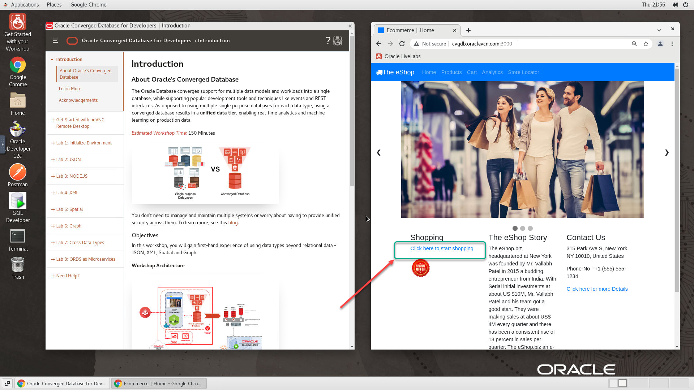

# Initialize Environment

## Introduction

In this lab we will review and startup all components required to successfully run this workshop.

*Estimated Lab Time:* 10 Minutes.

### Objectives
- Initialize the workshop environment.

### Prerequisites
This lab assumes you have:
- A Free Tier, Paid or LiveLabs Oracle Cloud account
- You have completed:
    - Lab: Prepare Setup (*Free-tier* and *Paid Tenants* only)
    - Lab: Environment Setup

## Task 1: Validate That Required Processes are Up and Running.
1. Now with access to your remote desktop session, proceed as indicated below to validate your environment before you start executing the subsequent labs. The following Processes should be up and running:

    - Database Listener
        - LISTENER
    - Database Server Instance
        - convergedcdb
    - Oracle Rest Data Service (ORDS)
    - Application
        - Nodejs eShop Application on docker container

2. Validate that expected processes are up. Please note that it may take up to 5 minutes after instance provisioning for all processes to fully start.

    ```
    <copy>
    ps -ef|grep LISTENER|grep -v grep
    ps -ef|grep ora_|grep pmon|grep -v grep
    ps -ef|grep ords|grep -v grep
    docker ps -a
    systemctl status oracle-database
    systemctl status oracle-init-workshop
    </copy>
    ```

3. If you see questionable output(s), failure or down component(s), restart the service accordingly

    ```
    e.g. Restarting the DB and DB Listener
    <copy>
    sudo systemctl restart oracle-database
    </copy>
    ```

4. On the web browser window on the right preloaded with the *eShop application* login page, click on *click here to start shopping* to test

      

You may now [proceed to the next lab](#next).

## Appendix 1: Managing Startup Services

1. Database service (Database and Standard Listener).

    - Start

    ```
    <copy>
    sudo systemctl start oracle-database
    </copy>
    ```
    - Stop

    ```
    <copy>
    sudo systemctl stop oracle-database
    </copy>
    ```

    - Status

    ```
    <copy>
    systemctl status oracle-database
    </copy>
    ```

    - Restart

    ```
    <copy>
    sudo systemctl restart oracle-database
    </copy>
    ```

## Acknowledgements

- **Authors** - Balasubramanian Ramamoorthy, Sudip Bandyopadhyay, Vishwanath Venkatachalaiah
- **Contributors** - Jyotsana Rawat, Satya Pranavi Manthena, Kowshik Nittala, Rene Fontcha
- **Last Updated By/Date** - Rene Fontcha, LiveLabs Platform Lead, NA Technology, October 2021
