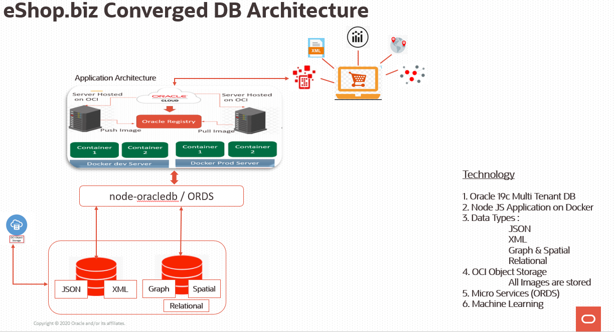

# The eShop Story #

## eShop Story for Converged Database ##

The eShop.biz headquartered at New York was founded by Mr. Vallabh Patel in 2015 a budding entrepreneur from India. With Serial initial investments at about US $10M, Mr. Vallabh  Patel and his team got a good start. They were making sales at about US$ 4M every quarter and there has been a consistent rise of 13 percent in sales per quarter. The eShop.biz an e-commerce and Brick and Mortar company was expanding beyond New York to various other locations across US (East Coast, West Coast, Central).

Gary Fairfield, CTO office was responsible to expand the necessary IT infrastructure. Gary's team had to assess, validate and align to organizations goal for expansion. During this exercise, they also wanted to revisit the go-to market strategy and increase the ROI.

The Current infra had multiple single purpose Database environments, dedicated to only do a specific job and this had created a longer development cycle and complex administration activity. Each of these databases had their own set of standard and  individual Proprietary API's . This ended up doing a lot of custom work, writing more code independently using individual Proprietary API's and transaction models. Propagating and transforming all these changes with fragmented data all over the place creates lot more complexity and there is definitely a need to integrate it with a lot of customizations. This Integration job of the IT never ended practically. The necessary features like security, availability, scalability are complex and are SILO in nature. eShop.biz had a consistent challenge in addressing security, availability, scalability due to different technologies . Managing these different technology layers was one of the biggest challenge for eShop.biz. These systems were not scaling up and were consuming a lot of company’s revenue.

Development requirements at eShop.biz changed mid-project due to dynamic business needs, which rendered the original sound choice of single-purpose database, sadly lacking. This left developers with a tough decision. Start from scratch with another single-purpose database to accommodate the new requirements and hoping that no others will surface, or work around the limitations of the original single-purpose database, adding unnecessary complexity to the application code and the maintenance of that code.

Gary wanted to address all of these challenges and did a POC with Oracle.  POC results were amazing as Oracle had proposed the **CONVERGED DATABASE** architecture.

This Converged DB approach creates the Data synergy and simplicity . Synergy across features makes the whole better than sum of parts. Oracle Converged Database Supports all Workloads(Traditional, Next Generation), Datatypes(Structured & Un-Structured). Converged DB makes it much simpler to develop apps. Just call the SQL to run ML,GRAPH, Spatial, JSON, Blockchain etc. Oracle converged DB on On-premise or on Oracle Cloud Delivered Union of Best Capabilities for each of data type and Workload. All those bottlenecks (Data Consistency ,Data Security, Availability, Scalability, Cross Site Consistency) of single purpose database were solved in Oracle Converged Database and these capabilities create better and informed decisions by increasing the value of information and reducing the time to business insight.

Since November-2019, The eShop.biz is on oracle platform  and they could not only see the expansion seamless ,but also the user experience, Sales Turnover now (26% per quarter) and ROI show a lot better numbers.

Mr. Vallabh Patel & Mr. Gary Fairfield had themselves proposed to be a reference customer by sharing their architecture and their POC use cases.

These use cases are now accessible and  will be part of our Converged DB Workshop.

 

 

## Acknowledgements
- **Authors** - Balasubramanian Ramamoorthy, Arvind Bhope
- **Contributors** - Laxmi Amarappanavar, Kanika Sharma, Venkata Bandaru, Ashish Kumar, Priya Dhuriya, Maniselvan K.
- **Team** - North America Database Specialists
- **Last Updated By** - Kay Malcolm, Database Product Management, June 2020
- **Expiration Date** - June 2021

