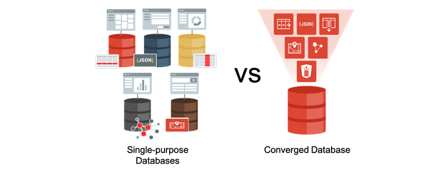
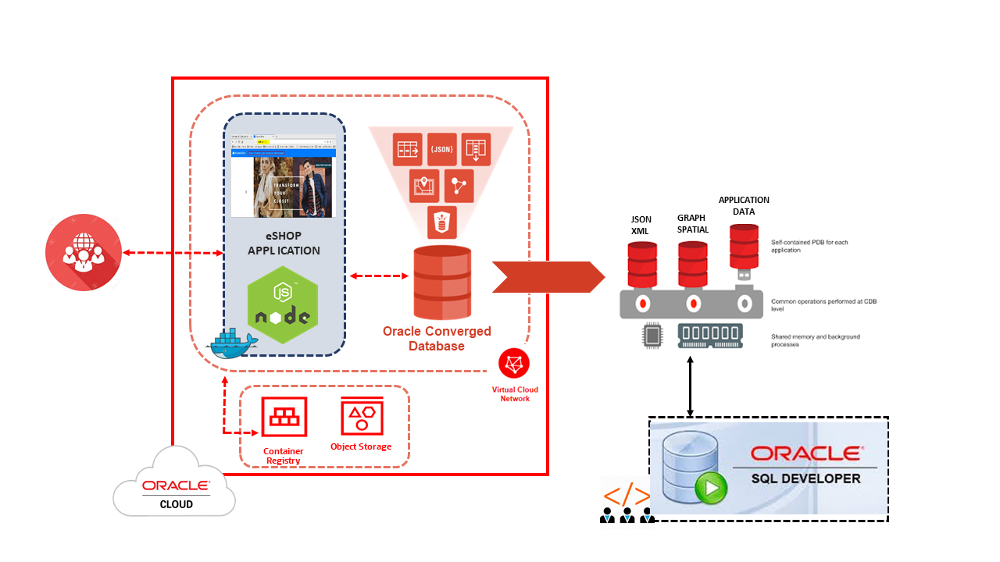

# Introduction

## About Oracle's Converged Database
The Oracle Database converges support for multiple data models and workloads into a single database, while supporting popular development tools and techniques like events and REST interfaces. As opposed to using multiple single purpose databases for each data type, using a converged database results in a **unified data tier**, enabling real-time analytics and machine learning on production data.

*Estimated Workshop Time:*  150 Minutes

You don't need to manage and maintain multiple systems or worry about having to provide unified security across them. To learn more, see this [blog](https://blogs.oracle.com/database/many-single-purpose-databases-versus-a-converged-database).

### Objectives
In this workshop, you will gain first-hand experience of using data types beyond relational data - JSON, XML, Spatial and Graph.

**Workshop Architecture**

Once you complete your setup, the next four labs in this workshop cover these individual data types, and the final lab consists of multi-model examples:

- Lab : NODE.JS
- Lab : JSON
- Lab : XML
- Lab : Spatial
- Lab : Graph
- Lab : Cross Data Types
- Lab : ORDS as Microservices

You will also use Oracle SQL Developer to help execute the programs associated with the lab. We will use Docker containers and demonstrate multiple use cases with a Node.js application.

### Prerequisites
- Oracle SQL Developer client
- An Oracle Cloud Account - Please view this workshop's LiveLabs landing page to see which environments are supported

*Note: If you have a **Free Trial** account, when your Free Trial expires your account will be converted to an **Always Free** account. You will not be able to conduct Free Tier workshops unless the Always Free environment is available. **[Click here for the Free Tier FAQ page.](https://www.oracle.com/cloud/free/faq.html)***

You may now [proceed to the next lab](#next).

## Learn More
- [What is a converged database?](https://blogs.oracle.com/database/what-is-a-converged-database)
- [Many single purpose database vs a converged database](https://blogs.oracle.com/database/many-single-purpose-databases-versus-a-converged-database)

## Acknowledgements
- **Owners** - Balasubramanian Ramamoorthy, Arvind Bhope
- **Contributors** - Laxmi Amarappanavar, Kanika Sharma, Venkata Bandaru, Ashish Kumar, Priya Dhuriya, Maniselvan K., Robbie Ruppel, David Start
- **Team** - North America Database Specialists
- **Last Updated By** - Abhinav Srivastava, Principal Product Marketing Director, Oracle Database, July 2020
