# Oracle JSON

## Introduction   
JSON is a syntax for storing and exchanging data. In this lab you will be covering three main areas. The Connect to SQL Developer will setup the environment for JSON lab. The Insert and Update JSON Data which will use standard database APIs to insert or update JSON data. Lastly, Query JSON Documents using SQL where you will see improvements in the simplicity of querying JSON documents using SQL.

*Estimated Lab Time*: 20 Minutes

### About Oracle JSON
JSON (JavaScript Object Notation) is a syntax for storing and exchanging data. When exchanging data between a browser and a server, the data can only be text.
JSON is text, and we can convert any JavaScript object into JSON, and send JSON to the server. We can also convert any JSON received from the server into JavaScript objects.
This way we can work with the data as JavaScript objects, with no complicated parsing and translations.

[](youtube:oiOCp23T1ZU)

For More Details About Oracle JSON [Click here](#Appendix2:MoreaboutOracleJSON)

### Objectives
In this lab, you will:
* Setup the environment for JSON lab.
* Connect the Oracle SQL developer to Insert and Update the JSON Data into Oracle Database by using JSON Function.
* Learn about the JSON functions.

### Prerequisites
This lab assumes you have:
- A Free Tier, Paid or LiveLabs Oracle Cloud account
- You have completed:
    - Lab: Prepare Setup (*Free-tier* and *Paid Tenants* only)
    - Lab: Environment Setup
    - Lab: Initialize Environment

***Note:***  All the scripts for this lab are stored in the **`/u01/workshop/json`** folder and run as the **oracle** user.

## Task 1: Connect to the Pluggable Database (PDB)

<!-- 1. Open a terminal window and sudo to the user **oracle**

    ```
    <copy>
    sudo su - oracle
    </copy>
    ``` -->

1. Open a terminal window and Navigate to the JSON directory.

    ```
    <copy>
    cd /u01/workshop/json
    </copy>
    ```

2. Set your environment.

    ```
    <copy>
    . oraenv
    </copy>
    ```

3. When prompted paste the following:

    ```
    <copy>
    convergedcdb
    </copy>
    ```

4. Open sqlplus as the user appjson

    ```
    <copy>
    sqlplus appjson/Oracle_4U@JXLPDB
    </copy>
    ```
5. Now exit from SQLPlus, we will use the SQL developer to execute the Json Use case.

    ```
    <copy>
    exit
    </copy>
    ```
## Task 2: Connect to SQL Developer

1. Make a connection to SQL Developer. Use the details as below and click on connect.
  - **Name**: JSON
  - **Username**: appjson
  - **Password**: `Oracle_4U`
  - **Hostname**: localhost
  - **Port**: 1521
  - **Service name**: JXLPDB

    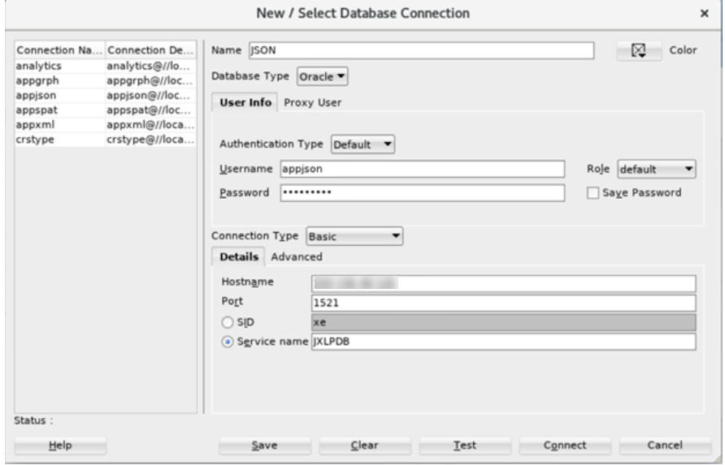

## Task 3: Insert a record.

1. Take a count of the rows in the JSON table

    ```
    <copy>
    select count(*) from purchase_order;
    </copy>
    ```

    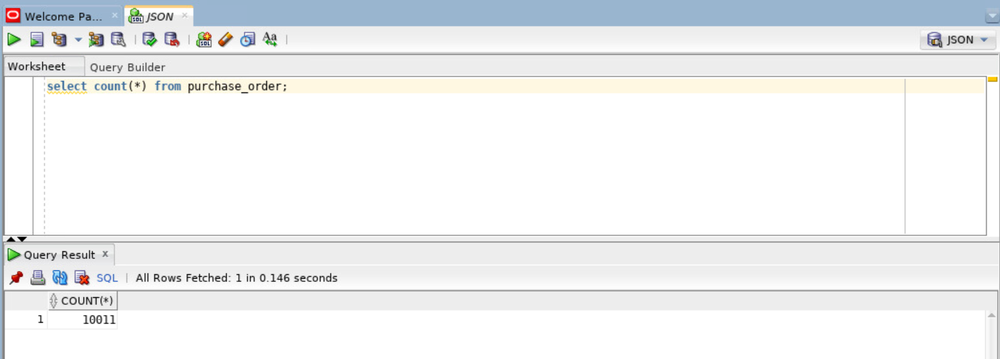  

2. Insert a record.

    ```
    <copy>
    INSERT INTO purchase_order
    VALUES (
      SYS_GUID(),
      to_date('05-MAY-2020'),
      '{"PONumber"             : 10001,
        "Reference"            : "SBELL-20141017",
        "Requestor"            : "Sarah Bell",
        "User"                 : "SBELL",
        "CostCenter"           : "A50",
        "ShippingInstructions" : {"name"    : "Sarah Bell",
        "Address" : {"street"  : "200 Sporting Green",
        "city"    : "South San Francisco",
        "state"   : "CA",
        "zipCode" : 99236,
        "country" : "United States of America"},
        "Phone"   : "983-555-6509"},
        "Special Instructions" : "Courier",
        "LineItems"            : [{"ItemNumber" : 1,
        "Part"       : {"Description" : "Making the Grade",
        "UnitPrice"   : 20,
        "UPCCode"     : 27616867759},
        "Quantity"   : 8.0},
        {"ItemNumber" : 2,
        "Part"       : {"Description" : "Nixon",
                                    "UnitPrice"   : 19.95,
                                    "UPCCode"     : 717951002396},
                                     "Quantity"   : 5},
                                    {"ItemNumber" : 3,
              "Part"       : {"Description" : "Eric Clapton: Best Of 1981-1999",
                                   "UnitPrice"   : 19.95,
                                   "UPCCode"     : 75993851120},
                                     "Quantity"   : 5.0}
                                    ]}');
    </copy>
    ```

3. Verify the count after insert. Please copy the red highlighted ID and save it. We will use that ID the update section of the lab.

    ```
    <copy>
      Select * from purchase_order j where j.po_document.PONumber=10001;
    </copy>
    ```

    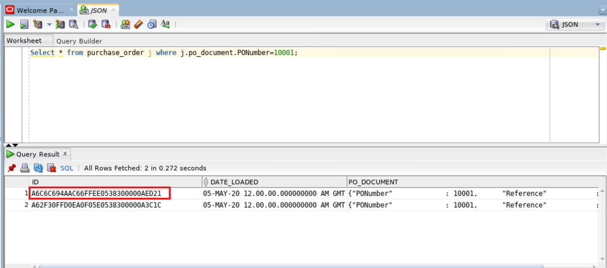

## Task 4: Update a Table.
1. We can use Oracle SQL function json-mergepatch or PL/SQL object-type method json-mergepatch() to update specific portions of a JSON document. In both cases we provide a JSON Merge Patch document, which declaratively specifies the changes to make a specified JSON document. JSON Merge Patch is an IETF standard.    

2. Copy the following update statement and substitute the ID you saved from the previous step in where it says `ID_copied_from_previous_step`. Run the statement.

    ```
    <copy>
        update purchase_order
         set    PO_DOCUMENT = json_mergepatch (
             PO_DOCUMENT,
             '{
               "Requestor" : "MSDhoni"
             }'
           )
        where id ='ID_copied_from_previous_step';
    </copy>
    ```

    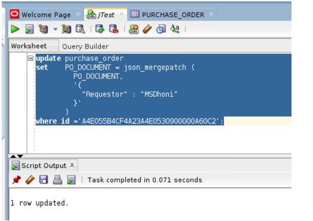

## Task 5: Example Queries
1. Let's look at customers who ordered products from a specific location. The Oracle database allows a simple ‘dotted’ notation to be used to perform a limited set of operations on columns containing JSON. In order to use the dotted notation, a table alias must be assigned to the table in the FROM clause, and any reference to the JSON column must be prefixed with the assigned alias. All data is returned as VARCHAR2(4000).

    ```
    <copy>
         select j.PO_DOCUMENT.Reference,
         j.PO_DOCUMENT.Requestor,
         j.PO_DOCUMENT.CostCenter,
         j.PO_DOCUMENT.ShippingInstructions.Address.city
         from PURCHASE_ORDER j
         where j.PO_DOCUMENT.ShippingInstructions.Address.city = 'South San Francisco'
         /
    </copy>
    ```

    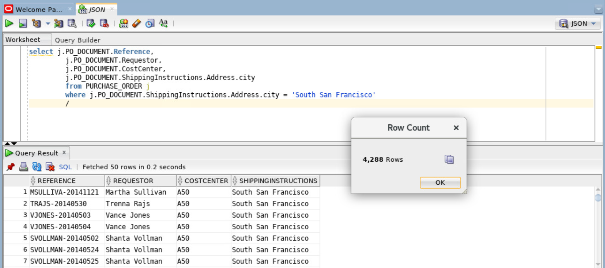

2. Find all customers who purchased items tagged with a specific UPC. The `JSON_EXISTS` operator is used in the WHERE clause of a SQL statement. It is used to test whether or not a JSON document contains content that matches the provided JSON path expression. The `JSON_EXISTS` operator takes two arguments, a JSON column and a JSON path expression. It returns TRUE if the document contains a key that matches the JSON path expression, FALSE otherwise. `JSON_EXISTS` provides a set of modifiers that provide control over how to handle any errors encountered while evaluating the JSON path expression. The UPC, Universal Product Code, is a type of code printed on retail product packaging to aid in identifying a particular item. It consists of two parts – the machine-readable barcode, which is a series of unique black bars, and the unique 12-digit number beneath it.

    ```
    <copy>
         SELECT po.po_document.PONumber,po.po_document.Requestor
         FROM purchase_order po
         WHERE json_exists(po.po_document,'$?(@.LineItems.Part.UPCCode == 85391628927)');
    </copy>
    ```

    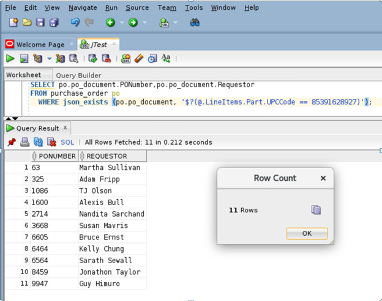

3. Find the customers who purchased a specific products based on PONumber.

    ```
    <copy>
         select D.* from PURCHASE_ORDER p,
         JSON_TABLE(
         p.PO_DOCUMENT,
         '$'
         columns(
                PO_NUMBER            NUMBER(10)                  path  '$.PONumber',
                REFERENCE            VARCHAR2(30 CHAR)           path  '$.Reference',
                REQUESTOR            VARCHAR2(32 CHAR)           path  '$.Requestor',
                USERID               VARCHAR2(10 CHAR)           path  '$.User',
                COSTCENTER           VARCHAR2(16)                path  '$.CostCenter',
                NESTED PATH '$.LineItems[*]'
         columns(
                  ITEMNO         NUMBER(16)             path '$.ItemNumber',
                  DESCRIPTION    VARCHAR2(32 CHAR)      path '$.Part.Description',
                  UPCCODE        VARCHAR2(14 CHAR)      path '$.Part.UPCCode',
                  QUANTITY       NUMBER(5,4)            path '$.Quantity',
                  UNITPRICE      NUMBER(5,2)            path '$.Part.UnitPrice'
                )
              )
            ) D
         where PO_NUMBER = 1600  
         /

    </copy>
    ```

    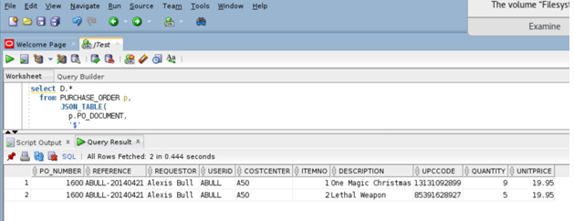


4. Find the customers who purchased a specific products based on the description of the product. The JSON_TABLE operator uses a set of JSON path expressions to map content from a JSON document into columns in the view. Once the contents of the JSON document have been exposed as columns, all of the power of SQL can be brought to bear on the content of JSON document.

    ```
    <copy>
         select D.* from PURCHASE_ORDER p,
         JSON_TABLE(
         p.PO_DOCUMENT,
         '$'
         columns(
                PO_NUMBER            NUMBER(10)                  path  '$.PONumber',
                REFERENCE            VARCHAR2(30 CHAR)           path  '$.Reference',
                REQUESTOR            VARCHAR2(32 CHAR)           path  '$.Requestor',
                USERID               VARCHAR2(10 CHAR)           path  '$.User',
                COSTCENTER           VARCHAR2(16)                path  '$.CostCenter',
                NESTED PATH '$.LineItems[*]'
         columns(
                  ITEMNO         NUMBER(16)             path '$.ItemNumber',
                  DESCRIPTION    VARCHAR2(32 CHAR)      path '$.Part.Description',
                  UPCCODE        VARCHAR2(14 CHAR)      path '$.Part.UPCCode',
                  QUANTITY       NUMBER(5,4)            path '$.Quantity',
                  UNITPRICE      NUMBER(5,2)            path '$.Part.UnitPrice'
                )
              )
            ) D
         where description='A Walk on the Moon'
         /
    </copy>
    ```

    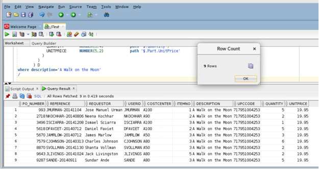

5. How Many orders were done by a customer with minimum 7 quantity and unit price minimum $25 in each order. To accomplish this we will create two relational views. The statements show how, once the relational views have been created, the full power of SQL can now be applied to JSON content, without requiring any knowledge of the structure of the JSON or how to manipulate JSON using SQL.

For this , we will create two views next

6. Create view `PURCHASE_ORDER_MASTER_VIEW`

    ```
    <copy>
         create or replace view PURCHASE_ORDER_MASTER_VIEW
         AS SELECT M.* FROM PURCHASE_ORDER p,
         JSON_TABLE(p.PO_DOCUMENT,
          '$'
         columns
         PO_NUMBER NUMBER(10) PATH '$.PONumber',
         REFERENCE VARCHAR2(30 CHAR) PATH '$.Reference',
         REQUESTOR VARCHAR(128) PATH '$.Requestor',
          USERID VARCHAR2(10 CHAR) PATH '$.User',
         COSTCENTER VARCHAR2(16) PATH '$.CostCenter',
         SHIP_TO_NAME VARCHAR2(20 CHAR) PATH '$.ShippingInstructions.name',
         SHIP_TO_STREET VARCHAR2(32 CHAR) PATH '$.ShippingInstructions.Address.street',
          SHIP_TO_CITY VARCHAR2(32 CHAR) PATH '$.ShippingInstructions.Address.city',
          SHIP_TO_COUNTY VARCHAR2(32 CHAR) PATH '$.ShippingInstructions.Address.county',
        SHIP_TO_POSTCODE VARCHAR2(32 CHAR) PATH '$.ShippingInstructions.Address.postcode',
         SHIP_TO_STATE VARCHAR2(2 CHAR) PATH '$.ShippingInstructions.Address.state',
          SHIP_TO_PROVINCE VARCHAR2(2 CHAR) PATH '$.ShippingInstructions.Address.province',
         SHIP_TO_ZIP VARCHAR2(8 CHAR) PATH '$.ShippingInstructions.Address.zipCode',
         SHIP_TO_COUNTRY VARCHAR2(32 CHAR) PATH '$.ShippingInstructions.Address.country',
         SHIP_TO_PHONE VARCHAR2(24 CHAR) PATH '$.ShippingInstructions.Phone[0].number',
         INSTRUCTIONS VARCHAR2(2048 CHAR) PATH '$.SpecialInstructions') m
         /
    </copy>
    ```

7. Create view `PURCHASE_ORDER_DETAIL_VIEW`

    ```
    <copy>
    create or replace view PURCHASE_ORDER_DETAIL_VIEW
         AS
         SELECT D.* FROM PURCHASE_ORDER p,
        JSON_TABLE(
         p.PO_DOCUMENT,
        '$'
         columns (
         PO_NUMBER NUMBER(10) PATH '$.PONumber',
         REFERENCE VARCHAR2(30 CHAR) PATH '$.Reference',
         REQUESTOR VARCHAR(128) PATH '$.Requestor',
         USERID VARCHAR2(10 CHAR) PATH '$.User',
         COSTCENTER VARCHAR2(16) PATH '$.CostCenter',
         SHIP_TO_NAME VARCHAR2(20 CHAR) PATH '$.ShippingInstructions.name',
         SHIP_TO_STREET VARCHAR2(32 CHAR) PATH '$.ShippingInstructions.Address.street',
         SHIP_TO_CITY VARCHAR2(32 CHAR) PATH '$.ShippingInstructions.Address.city',
         SHIP_TO_COUNTY VARCHAR2(32 CHAR) PATH '$.ShippingInstructions.Address.county',
         SHIP_TO_POSTCODE VARCHAR2(32 CHAR) PATH '$.ShippingInstructions.Address.postcode',
         SHIP_TO_STATE VARCHAR2(2 CHAR) PATH '$.ShippingInstructions.Address.state',
         SHIP_TO_PROVINCE VARCHAR2(2 CHAR) PATH '$.ShippingInstructions.Address.province',
         SHIP_TO_ZIP VARCHAR2(8 CHAR) PATH '$.ShippingInstructions.Address.zipCode',
          SHIP_TO_COUNTRY VARCHAR2(32 CHAR) PATH '$.ShippingInstructions.Address.country',
         SHIP_TO_PHONE VARCHAR2(24 CHAR) PATH '$.ShippingInstructions.Phone[0].number',
         INSTRUCTIONS VARCHAR2(2048 CHAR) PATH '$.SpecialInstructions',
         NESTED PATH '$.LineItems[*]'
         columns (
           ITEMNO        NUMBER(38) PATH '$.ItemNumber',
          DESCRIPTION   VARCHAR2(256 CHAR) PATH '$.Part.Description',
         UPCCODE       VARCHAR2(14 CHAR) PATH '$.Part.UPCCode',
        QUANTITY      NUMBER(12,4) PATH '$.Quantity',
        UNITPRICE     NUMBER(14,2) PATH '$.Part.UnitPrice'
         )
         )
         ) d
          /
    </copy>
    ```

7. Query `PURCHASE_ORDER_DETAIL_VIEW`

    ```
    <copy>
       select PO_NUMBER, REFERENCE, INSTRUCTIONS, ITEMNO, UPCCODE, DESCRIPTION, QUANTITY, UNITPRICE
         from PURCHASE_ORDER_DETAIL_VIEW d
        where REQUESTOR = 'Steven King'
        and QUANTITY  > 7
        and UNITPRICE > 25.00
         /
    </copy>
    ```

  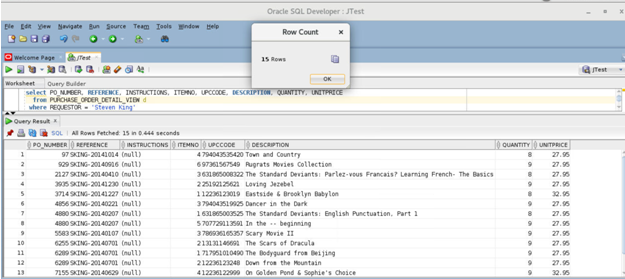    

6. Customer Purchase History Details with PRETTY. JSON_QUERY finds one or more specified JSON values in JSON data and returns the values in a character string. expr. Use this clause to specify the JSON data to be evaluated. For expr , specify an expression that evaluates to a text literal.

    ```
    <copy>
    select JSON_QUERY(PO_DOCUMENT,'$.LineItems[0]' PRETTY) LINEITEMS
    from PURCHASE_ORDER p
    where JSON_VALUE (PO_DOCUMENT,'$.Requestor') = 'Alexis Bull'
    /
    </copy>
    ```

    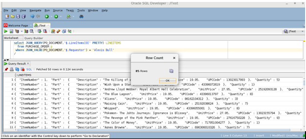  

7. Customer Purchase History Details without PRETTY. `JSON_VALUE` selects a scalar value from JSON data and returns it as a SQL value. You can also use `json_value` to create function-based B-tree indexes for use with JSON data — see Indexes for JSON Data. Function `json_value` has two required arguments and accepts optional returning and error clauses.

    ```
    <copy>
    select JSON_QUERY(PO_DOCUMENT,'$.LineItems[0]') LINEITEMS
    from PURCHASE_ORDER p
    where JSON_VALUE(PO_DOCUMENT,'$.Requestor') = 'Alexis Bull'
    /
    </copy>
    ```

    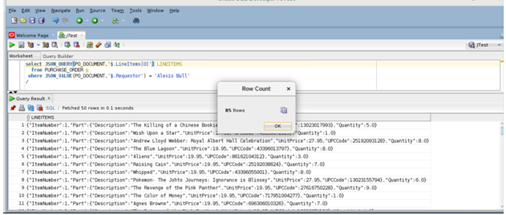  


You may now [proceed to the next lab](#next).

## **Appendix 1**: Loading JSON Documents into the database  

**The SQL statements have already been run. The SQL has been provided as reference.**

1. We will create a directory which will point to the location where JSON dump file is stored.

    ```
    create or replace directory ORDER_ENTRY as '/u01/workshop/dump';
    ```

2. This statement creates a very simple table, `PURCHASE_ORDER`. The table has a column `PO_DOCUMENT` of type CLOB. The IS JSON constraint is applied to the column `PO_DOCUMENT`, ensuring that the column can store only well formed JSON documents. In Oracle there is no dedicated JSON data type. JSON documents are stored in the database using standard Oracle data types such as VARCHAR2, CLOB and BLOB. In order to ensure that the content of the column is valid JSON data, a new constraint IS JSON, is provided that can be applied to a column. This constraint returns TRUE if the content of the column is well-formed, valid JSON and FALSE otherwise. This first statement in this module creates a table which will be used to contain JSON documents.

    ```
    create table PURCHASE_ORDER
    (
    ID RAW(16) NOT NULL,
    DATE_LOADED  TIMESTAMP(6) WITH TIME ZONE,
    PO_DOCUMENT CLOB CHECK (PO_DOCUMENT IS JSON)
    )
    /
    ```

3. This statement creates a simple external table that can read JSON documents from a dump file generated by a typical No-SQL style database. In this case, the documents are contained in the file PurchaseOrders.dmp. The SQL directory object ORDER_ENTRY points to the folder containing the dump file, and also points to the database’s trace folder which will contain any ‘log’ or ‘bad’ files generated when the table is processed.

    ```
    CREATE TABLE PURCHASE_EXT(
    JSON_DOCUMENT CLOB
    )
    ORGANIZATION EXTERNAL(
    TYPE ORACLE_LOADER
    DEFAULT DIRECTORY ORDER_ENTRY
    ACCESS PARAMETERS (
    RECORDS DELIMITED BY 0x'0A'
    DISABLE_DIRECTORY_LINK_CHECK  
    BADFILE ORDER_ENTRY: 'PURCHASE_EXT.bad'
    LOGFILE ORDER_ENTRY: 'PURCHASE_EXT.log'
    FIELDS(
    JSON_DOCUMENT CHAR(5000)
    )
    )
    LOCATION (
     ORDER_ENTRY:'PurchaseOrders.dmp'
    )
    )
    PARALLEL
    REJECT LIMIT UNLIMITED
    ```

4. The following statement copies the JSON documents from the dump file into the PURCHASE_ORDER table.

    ```
    insert into PURCHASE_ORDER
    select SYS_GUID(), SYSTIMESTAMP, JSON_DOCUMENT
    from PURCHASE_EXT
    where JSON_DOCUMENT IS JSON
    /
    commit
    /
    ```

## **Appendix 2**: More about Oracle JSON

**JSON with Oracle Database**

JSON data can be used in Oracle Databases in similar ways. Unlike relational data, it can be stored, indexed, and queried without any need for a schema that defines the data. Oracle Database supports JSON natively with relational database features, including transactions, indexing, declarative querying, and views.

It's likely we want to send and receive JSON documents to and from and our database, and store them in tables. Oracle Database has a huge amount of functionality that makes this easy.

Oracle database provides a comprehensive implementation of SQL, for both analytics and batch processing. JSON held in the Oracle Database can be directly accessed via SQL, without the need to convert it into an intermediary form. JSON collections can be joined to other JSON collections or to relational tables using standard SQL queries.

**Storing and Managing JSON Documents**

JSON documents can be stored using a VARCHAR2, CLOB, or BLOB column. An IS JSON SQL constraint ensures that the column contains only valid JSON documents, allowing the database to understand that the column is being used as a container for JSON documents.

Oracle’s JSON capabilities are focused on providing full support for schemaless development and document-based storage. Developers are free to change the structure of their JSON documents as necessary. With the addition of JSON support, Oracle Database delivers the same degree of flexibility as a NoSQL JSON document store.

The first thing to realize about JSON is that it remains a simple text format, which is relatively easy to read and inspect with the naked eye. At a syntax level, what starts to set JSON apart from other formats is the characters used to separate data, which are mainly constrained to apostrophes ', brackets ( ), [ ], { }, colons :, and commas ,.

This listing illustrates what a JSON payload looks like:
  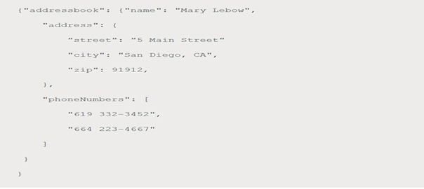


## Learn More

- Oracle JSON Documentation ([JSON](https://docs.oracle.com/en/database/oracle/oracle-database/19/adjsn/index.html))

## Rate this Workshop
When you are finished don't forget to rate this workshop!  We rely on this feedback to help us improve and refine our LiveLabs catalog.  Follow the steps to submit your rating.

1.  Go back to your **workshop homepage** in LiveLabs by searching for your workshop and clicking the Launch button.
2.  Click on the **Brown Button** to re-access the workshop  

    

3.  Click **Rate this workshop**

    

If you selected the **Green Button** for this workshop and still have an active reservation, you can also rate by going to My Reservations -> Launch Workshop.

## Acknowledgements
* **Authors** - Balasubramanian Ramamoorthy, Arvind Bhope
* **Contributors** - Laxmi Amarappanavar, Kanika Sharma, Venkata Bandaru, Ashish Kumar, Priya Dhuriya, Maniselvan K, Robert Ruppel, David Start, Rene Fontcha
* **Last Updated By/Date** - Rene Fontcha, LiveLabs Platform Lead, NA Technology, December 2020
