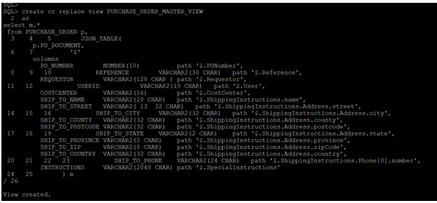
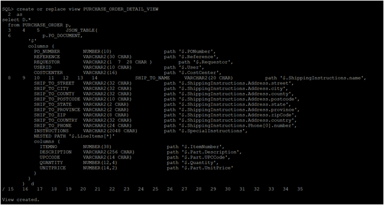

# Oracle JSON  

## Introduction

This lab walks you through modules where we will see improvements in the simplicity of querying JSON documents using SQL. We will also see materialized views query rewriting has been enhanced so that queries with JSON\_EXISTS, JSON\_VALUE and other functions can utilize a materialized view created over a query that contains a JSON\_TABLE function.

### Before You Begin

**What Do You Need?**

This lab assumes you have completed the following labs:
- Lab 1:  Login to Oracle Cloud
- Lab 2:  Generate SSH Key
- Lab 3:  Create Compute instance 
- Lab 4:  Environment setup
- Note :  All scripts for this lab are stored in the /u01/workshop/json folder and are run as the oracle user.

## Task 1: Customers who ordered products from specific Geo location   

   ````
    <copy>
    select j.PO_DOCUMENT.Reference,
    j.PO_DOCUMENT.Requestor,
    j.PO_DOCUMENT.CostCenter,
    j.PO_DOCUMENT.ShippingInstructions.Address.city
    from PURCHASE_ORDER j 
    where j.PO_DOCUMENT.ShippingInstructions.Address.city = 'South San Francisco'
    /
      </copy>
   ````
  
  
    
   **Note:** Oracle database allows a simple ‘dotted’ notation to be used to perform a limited set of operations on columns containing JSON. In order to use the dotted notation, a table alias must be assigned to the table in the FROM clause, and any reference to the JSON column must be prefixed with the assigned alias. All data is returned as VARCHAR2(4000).


## Task 2: Find all customers who purchased an items tagged with a specific UPC

  ````
    <copy>
    SELECT po.po_document.PONumber,po.po_document.Requestor
    FROM purchase_order po
    WHERE json_exists(po.po_document,'$?(@.LineItems.Part.UPCCode == 85391628927)');
    </copy>
   ````
  
   
    
   **Note:** The JSON\_EXISTS operator is used in the WHERE clause of a SQL statement. It is used to test whether or not a JSON document contains content that matches the provided JSON path expression.

   The JSON\_EXISTS operator takes two arguments, a JSON column and a JSON path expression. It returns TRUE if the document contains a key that matches the JSON path expression, FALSE otherwise. JSON\_EXISTS provides a set of modifiers that provide control over how to handle any errors encountered while evaluating the JSON path expression.

   [UPC, short form for  Universal Product Code, is a type of code printed on retail product packaging to aid in identifying a particular item. It consists of two parts – the machine-readable barcode, which is a series of unique black bars, and the unique 12-digit number beneath it.]


## Task 3: Find the customers who all are purchased a specific products

  **3a) Based on PONumber**
  ````
    <copy>
    select D.* from PURCHASE_ORDER p,
    JSON_TABLE(
    p.PO_DOCUMENT,
    '$' 
    columns(
           PO_NUMBER            NUMBER(10)                  path  '$.PONumber',
           REFERENCE            VARCHAR2(30 CHAR)           path  '$.Reference',
           REQUESTOR            VARCHAR2(32 CHAR)           path  '$.Requestor',
           USERID               VARCHAR2(10 CHAR)           path  '$.User',
           COSTCENTER           VARCHAR2(16)                path  '$.CostCenter',
           NESTED PATH '$.LineItems[*]'
    columns(
             ITEMNO         NUMBER(16)             path '$.ItemNumber', 
             DESCRIPTION    VARCHAR2(32 CHAR)      path '$.Part.Description', 
             UPCCODE        VARCHAR2(14 CHAR)      path '$.Part.UPCCode', 
             QUANTITY       NUMBER(5,4)            path '$.Quantity', 
             UNITPRICE      NUMBER(5,2)            path '$.Part.UnitPrice'
           )
         )
       ) D
    where PO_NUMBER = 1600  
    /

    </copy>
   ````
  
   


  **3b) Based on the description of the product**
    
  ````
    <copy>
    select D.* from PURCHASE_ORDER p,
    JSON_TABLE(
    p.PO_DOCUMENT,
    '$' 
    columns(
           PO_NUMBER            NUMBER(10)                  path  '$.PONumber',
           REFERENCE            VARCHAR2(30 CHAR)           path  '$.Reference',
           REQUESTOR            VARCHAR2(32 CHAR)           path  '$.Requestor',
           USERID               VARCHAR2(10 CHAR)           path  '$.User',
           COSTCENTER           VARCHAR2(16)                path  '$.CostCenter',
           NESTED PATH '$.LineItems[*]'
    columns(
             ITEMNO         NUMBER(16)             path '$.ItemNumber', 
             DESCRIPTION    VARCHAR2(32 CHAR)      path '$.Part.Description', 
             UPCCODE        VARCHAR2(14 CHAR)      path '$.Part.UPCCode', 
             QUANTITY       NUMBER(5,4)            path '$.Quantity', 
             UNITPRICE      NUMBER(5,2)            path '$.Part.UnitPrice'
           )
         )
       ) D
    where description='A Walk on the Moon'
    /
     </copy>
  ````
    
 
    
  **Notes:** The JSON\_TABLE operator uses a set of JSON path expressions to map content from a JSON document into columns in the view. Once the contents of the JSON document have been exposed as columns, all of the power of SQL can be brought to bear on the content of JSON document.

## Task 4: How Many orders were done by a customer with minimum 7 quantity and unit price minimum 25$ in each order
   For this , we will create two views as below:
    
  ````
    <copy>
    create or replace view PURCHASE_ORDER_MASTER_VIEW
    AS SELECT M.* FROM PURCHASE_ORDER p,
    JSON_TABLE(p.PO_DOCUMENT,
     '$' 
    columns
    PO_NUMBER NUMBER(10) PATH '$.PONumber',
    REFERENCE VARCHAR2(30 CHAR) PATH '$.Reference',
    REQUESTOR VARCHAR(128) PATH '$.Requestor',
     USERID VARCHAR2(10 CHAR) PATH '$.User',
    COSTCENTER VARCHAR2(16) PATH '$.CostCenter',
    SHIP_TO_NAME VARCHAR2(20 CHAR) PATH '$.ShippingInstructions.name',
    SHIP_TO_STREET VARCHAR2(32 CHAR) PATH '$.ShippingInstructions.Address.street',
     SHIP_TO_CITY VARCHAR2(32 CHAR) PATH '$.ShippingInstructions.Address.city',
     SHIP_TO_COUNTY VARCHAR2(32 CHAR) PATH '$.ShippingInstructions.Address.county',
   SHIP_TO_POSTCODE VARCHAR2(32 CHAR) PATH '$.ShippingInstructions.Address.postcode',
    SHIP_TO_STATE VARCHAR2(2 CHAR) PATH '$.ShippingInstructions.Address.state',
     SHIP_TO_PROVINCE VARCHAR2(2 CHAR) PATH '$.ShippingInstructions.Address.province',
    SHIP_TO_ZIP VARCHAR2(8 CHAR) PATH '$.ShippingInstructions.Address.zipCode',
    SHIP_TO_COUNTRY VARCHAR2(32 CHAR) PATH '$.ShippingInstructions.Address.country',
    SHIP_TO_PHONE VARCHAR2(24 CHAR) PATH '$.ShippingInstructions.Phone[0].number',
    INSTRUCTIONS VARCHAR2(2048 CHAR) PATH '$.SpecialInstructions') m
    /
    </copy>
  ````
 
  ````
    <copy>
    create or replace view PURCHASE_ORDER_DETAIL_VIEW
    AS
    SELECT D.* FROM PURCHASE_ORDER p,
   JSON_TABLE(
    p.PO_DOCUMENT,
   '$' 
    columns (
    PO_NUMBER NUMBER(10) PATH '$.PONumber',
    REFERENCE VARCHAR2(30 CHAR) PATH '$.Reference',
    REQUESTOR VARCHAR(128) PATH '$.Requestor',
    USERID VARCHAR2(10 CHAR) PATH '$.User',
    COSTCENTER VARCHAR2(16) PATH '$.CostCenter',
    SHIP_TO_NAME VARCHAR2(20 CHAR) PATH '$.ShippingInstructions.name',
    SHIP_TO_STREET VARCHAR2(32 CHAR) PATH '$.ShippingInstructions.Address.street',
    SHIP_TO_CITY VARCHAR2(32 CHAR) PATH '$.ShippingInstructions.Address.city',
    SHIP_TO_COUNTY VARCHAR2(32 CHAR) PATH '$.ShippingInstructions.Address.county',
    SHIP_TO_POSTCODE VARCHAR2(32 CHAR) PATH '$.ShippingInstructions.Address.postcode',
    SHIP_TO_STATE VARCHAR2(2 CHAR) PATH '$.ShippingInstructions.Address.state',
    SHIP_TO_PROVINCE VARCHAR2(2 CHAR) PATH '$.ShippingInstructions.Address.province',
    SHIP_TO_ZIP VARCHAR2(8 CHAR) PATH '$.ShippingInstructions.Address.zipCode',
     SHIP_TO_COUNTRY VARCHAR2(32 CHAR) PATH '$.ShippingInstructions.Address.country',
    SHIP_TO_PHONE VARCHAR2(24 CHAR) PATH '$.ShippingInstructions.Phone[0].number',
    INSTRUCTIONS VARCHAR2(2048 CHAR) PATH '$.SpecialInstructions',
    NESTED PATH '$.LineItems[*]'
    columns (
      ITEMNO        NUMBER(38) PATH '$.ItemNumber',
     DESCRIPTION   VARCHAR2(256 CHAR) PATH '$.Part.Description',
    UPCCODE       VARCHAR2(14 CHAR) PATH '$.Part.UPCCode',
   QUANTITY      NUMBER(12,4) PATH '$.Quantity',
   UNITPRICE     NUMBER(14,2) PATH '$.Part.UnitPrice'
    )
    )
    ) d
     /
    
    </copy>
  ````

  ````
    <copy>
  select PO_NUMBER, REFERENCE, INSTRUCTIONS, ITEMNO, UPCCODE, DESCRIPTION, QUANTITY, UNITPRICE
    from PURCHASE_ORDER_DETAIL_VIEW d
   where REQUESTOR = 'Steven King'
   and QUANTITY  > 7
   and UNITPRICE > 25.00
    /

    </copy>
  ````
  
  
    
      
    
 

   **Notes** The above statements show how, once the relational views have been created, the full power of SQL can now be applied to JSON content, without requiring any knowledge of the structure of the JSON or how to manipulate JSON using SQL.

## Task 5: Customer Purchase History Details 
**5a) With PRETTY**
    

  ````
    <copy>
    select JSON_QUERY(PO_DOCUMENT,'$.LineItems[0]' PRETTY) LINEITEMS
     from PURCHASE_ORDER p
    where JSON_VALUE (PO_DOCUMENT,'$.Requestor') = 'Alexis Bull'
     /
       
    </copy>
  ````
  
    

**5b) Without PRETTY**
   
  ````
    <copy>
    select JSON_QUERY(PO_DOCUMENT,'$.LineItems[0]') LINEITEMS
     from PURCHASE_ORDER p
     where JSON_VALUE(PO_DOCUMENT,'$.Requestor') = 'Alexis Bull'
      /


       
    </copy>
  ````
  
    

    
   **Notes:** JSON\_QUERY finds one or more specified JSON values in JSON data and returns the values in a character string. expr. Use this clause to specify the JSON data to be evaluated. For expr , specify an expression that evaluates to a text literal.

   JSON\_VALUE selects a scalar value from JSON data and returns it as a SQL value. You can also use json\_value to create function-based B-tree indexes for use with JSON data — see Indexes for JSON Data. Function json\_value has two required arguments and accepts optional returning and error clauses.

## Acknowledgements

- **Authors** - Balasubramanian Ramamoorthy, Arvind Bhope
- **Contributors** - Laxmi Amarappanavar, Kanika Sharma, Venkata Bandaru, Ashish Kumar, Priya Dhuriya, Maniselvan K, Robert Ruppel. 
- **Team** - North America Database Specialists.
- **Last Updated By** - Kay Malcolm, Database Product Management, June 2020
- **Expiration Date** - June 2021   


      

      


