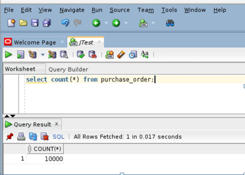
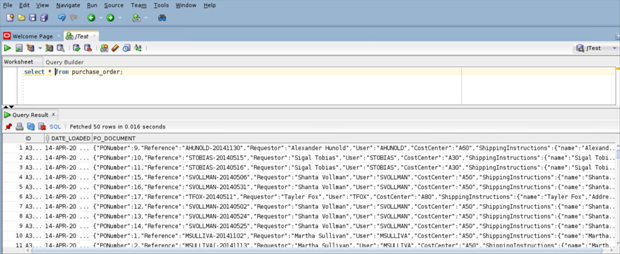

# Oracle JSON


## Introduction

 This lab will show you how to create a simple external table that can read JSON documents from a dump file generated by a typical No-SQL style database. In this use case, the documents are contained in the file PurchaseOrders.dmp. The SQL directory object "ORDER_ENTRY" points to the folder containing the dump file and also points to the database’s trace folder. This trace folder also contains  ‘log’ or ‘bad’ files generated when the table is processed.  


**This is a Read-Only lab so the lab is already completed and json data was pre-loaded into the tables.**

### Before You Begin

**What Do You Need?**

This lab assumes you have completed the following labs:
- Lab 1:  Login to Oracle Cloud
- Lab 2:  Generate SSH Key
- Lab 3:  Create Compute instance
- Lab 4:  Environment setup
- Note :  All scripts for this lab are stored in the /u01/workshop/json folder and are run as the oracle user.


## Task 1: Create a directory

We will create a directory which will point to the location where json dump file is stored-

````

create or replace directory ORDER_ENTRY
as '/home/oracle/Spatial/script/db-sample-schemas-19.2/order_entry/';

  ````

## Task 2: Create a simple table to store JSON documents


   In Oracle there is no dedicated JSON data type. JSON documents are stored in the database using standard Oracle data types such as VARCHAR2, CLOB and BLOB.

   In order to ensure that the content of the column is valid JSON data, a new constraint **IS JSON**, is provided that can be applied to a column. This constraint returns TRUE if the content of the column is well-formed, valid JSON and FALSE otherwise.

   This first statement in this module creates a table which will be used to contain JSON documents. These statements can be entered using SQLdeveloper or the connection to SQLdeveloper from your local terminal.


````

    create table PURCHASE_ORDER (
    ID            RAW(16) NOT NULL,
    DATE_LOADED   TIMESTAMP(6) WITH TIME ZONE,
    PO_DOCUMENT CLOB CHECK (PO_DOCUMENT IS JSON)
    )
    /


````

This statement creates a very simple table, PURCHASE\_ORDER. The table has a column PO\_DOCUMENT of type CLOB. The IS JSON constraint is applied to the column PO\_DOCUMENT, ensuring that the column can store only well formed JSON documents.

## Task 3: Loading JSON Documents into the database  

This statement creates a simple external table that can read JSON documents from a dump file generated by a typical No-SQL style database. In this case, the documents are contained in the file PurchaseOrders.dmp. The SQL directory object ORDER\_ENTRY points to the folder containing the dump file, and also points to the database’s trace folder which will contain any ‘log’ or ‘bad’ files generated when the table is processed.

````

    CREATE TABLE PURCHASE_EXT(
    JSON_DOCUMENT CLOB
    )
    ORGANIZATION EXTERNAL(
    TYPE ORACLE_LOADER
    DEFAULT DIRECTORY ORDER_ENTRY
    ACCESS PARAMETERS (
    RECORDS DELIMITED BY 0x'0A'
    DISABLE_DIRECTORY_LINK_CHECK  
    BADFILE ORDER_ENTRY: 'PURCHASE_EXT.bad'
    LOGFILE ORDER_ENTRY: 'PURCHASE_EXT.log'
    FIELDS(
    JSON_DOCUMENT CHAR(5000)
    )
    )
    LOCATION (
     ORDER_ENTRY:'PurchaseOrders.dmp'
    )
    )
    PARALLEL
    REJECT LIMIT UNLIMITED
    /


   ````

## Task 4: Loading  data from the external table into JSON table

The following statement copies the JSON documents from the dump file into the PURCHASE\_ORDER table.

````

    insert into PURCHASE_ORDER
    select SYS_GUID(), SYSTIMESTAMP, JSON_DOCUMENT
    from PURCHASE_EXT
    where JSON_DOCUMENT IS JSON
    /
    commit
    /


````

  
  


## Acknowledgements

- **Authors** - Balasubramanian Ramamoorthy, Arvind Bhope
- **Contributors** - Laxmi Amarappanavar, Kanika Sharma, Venkata Bandaru, Ashish Kumar, Priya Dhuriya, Maniselvan K, Robert Ruppel.
- **Team** - North America Database Specialists.
- **Last Updated By** - Kay Malcolm, Database Product Management, June 2020
- **Expiration Date** - June 2021   
