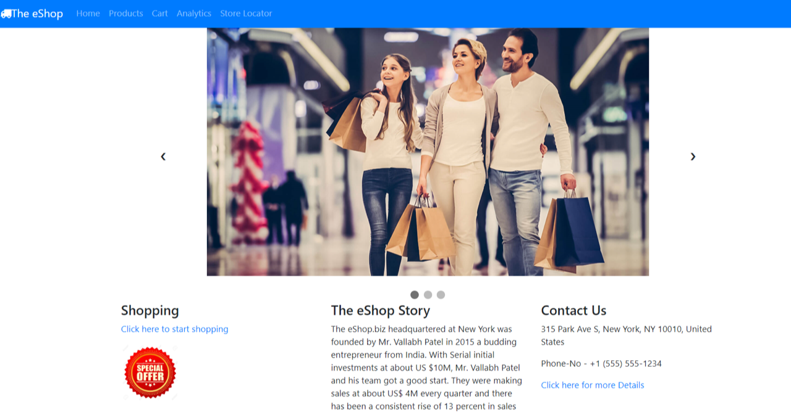
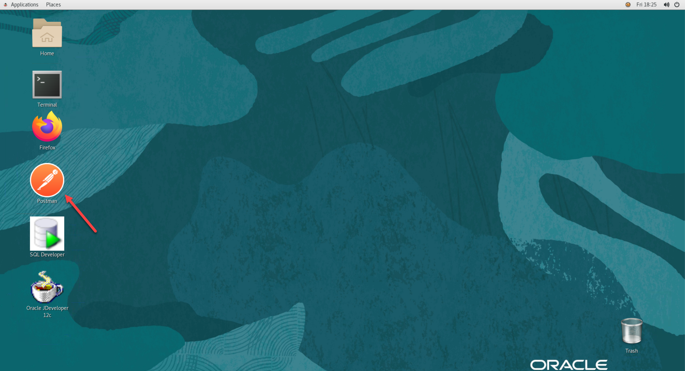
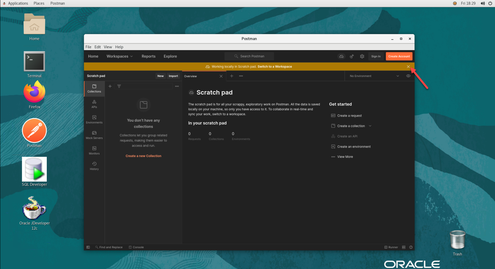
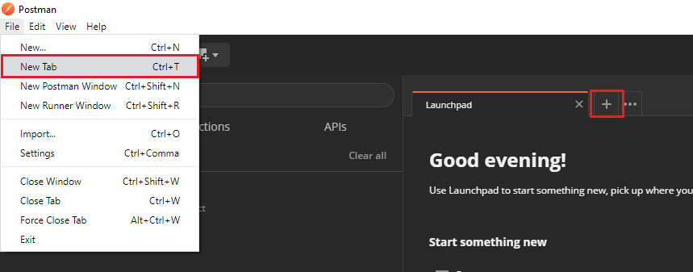
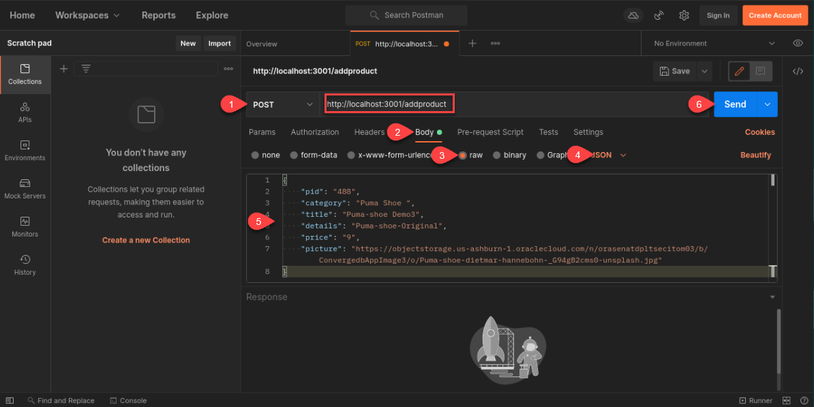
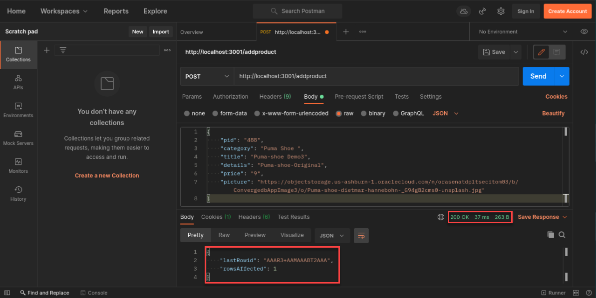
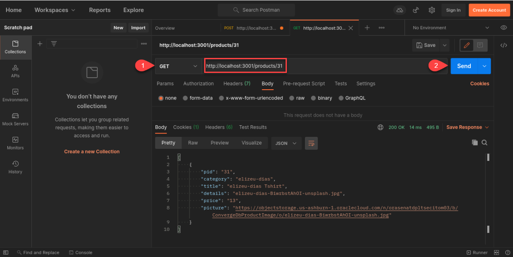
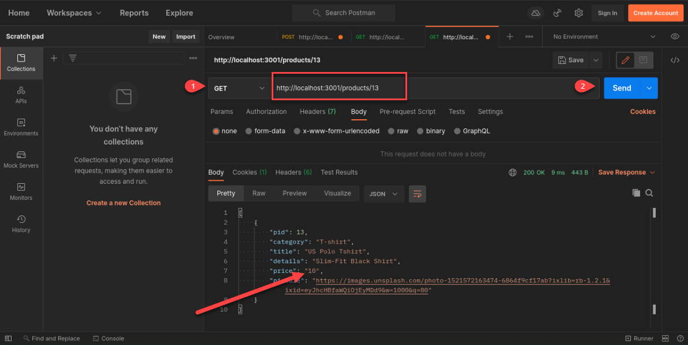
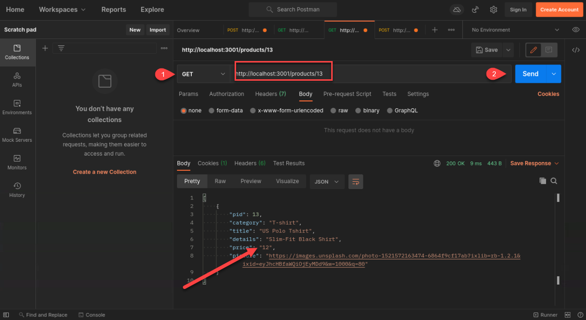

# Oracle Node.js

## Introduction
This lab walks you through the steps to start the Docker and Node.js Retail application. You will connect to a Node.js running in a Docker container on an Oracle Cloud Compute instance. While you can connect the Oracle Database instance using any client of your choice, in this lab you will connect using Oracle SQL Developer.

*Estimated Lab Time*: 20 Minutes

### About Oracle Node.js
Node.js is an open-source and cross-platform JavaScript runtime environment. It runs the V8 JavaScript engine, outside of the browser. This allows Node.js to be very performant. Node.js app is run in a single process, without creating a new thread for every request. Node.js provides a set of asynchronous I/O primitives in its standard library that prevent JavaScript code from blocking and generally, libraries in Node.js are written using non-blocking paradigms, making blocking behavior the exception rather than the norm.

[](youtube:zQtRwTOwisI)

For More Details about Node.js with Oracle Database [Click here](#LearnMore)

### Objectives
In this lab, you will:
* Verify the Node.js Application on any Browser.
* POST and GET the data from Oracle Database by using postman through Node.js Module.
* Understand the concept of Node.js with oracle Database.


### Prerequisites
This lab assumes you have:
- A Free Tier, Paid or LiveLabs Oracle Cloud account
- You have completed:
    - Lab: Prepare Setup (*Free-tier* and *Paid Tenants* only)
    - Lab: Environment Setup
    - Lab: Initialize Environment

## Task 1:  Verify Application

1. On the web browser window on the right preloaded with two application tabs navigate to verify.    

    ```
    URL: <copy>http://localhost:3000/</copy>
    ```
    

2. Open up a web browser and visit the Application API indicated in your terminal.   

    ```
    URL: <copy>http://localhost:3001/products</copy>
    ```

## Task 2: Launch Postman

1. Double Click on *Postman* icon on the desktop to launch it.

  

2.  Click on ***X*** to close the warning message displayed

  

3. Open a new tab by clicking File then New Tab or by clicking the plus button in the center of the screen next to launch pad.
  

4. In the center of the screen from the drop down select **POST** Method and enter the information below. See the screenshot for additional details.

    - For the URL Enter:

        ```
        <copy>
        http://localhost:3001/addproduct
        </copy>
        ```
    - Click on Body and select raw and then in the drop down choose JSON
    - In the data portion of the Body insert the JSON data below

        ```
        <copy>
        {
        "pid": "490",
        "category": "Puma Shoe ",
        "title": "Puma-shoe Demo3",
        "details": "Puma-shoe-Original",
        "price": "9",
        "picture": "https://objectstorage.us-ashburn-1.oraclecloud.com/n/orasenatdpltsecitom03/b/ConvergedbAppImage3/o/Puma-shoe-dietmar-hannebohn-_G94gB2cms0-unsplash.jpg"
        }
        </copy>
        ```
        


5. Click on the **Send** button, Postman should return the HTTP 200 after successfully adding the product in oracle database.

    

## Task 3: Using HTTP GET method.

1. Open a new tab

2. To get product details you can use the get method. Fill out the form using the following information.  
    - From the Method drop down in the center select - GET  
    - To get list of all the product details enter the URL:
        ```
        <copy>http://localhost:3001/products</copy>
        ```

    - To get the specific product details by using PID enter URL:

        ```
        <copy>http://localhost:3001/products/490</copy>
        ```
    - Click on the **Send** button, Postman return the HTTP 200 Ok which is a successful GET.

        

3. Open the browser and verify the above using link- http://localhost:3001/products/31

    

## Task 4: Using HTTP POST Method
1. Open a new tab. Before applying the POST method, please check the product table format by using GET Method and the URL

    ```
    <copy>http://localhost:3001/products/13</copy>
    ```

    

2. We are going to update the price from $10 to $12 for the product PID=13. We do this by issuing a POST and giving it the new {"Key": "Value"} pair in our case our Key is price and the new Value is 12.

3. In the center of the screen from the drop down select **POST** Method and enter the information below.

    - Method: - POST  
    - URL:

        ```
        <copy>http://localhost:3001/updateProduct/13</copy>
        ```
    - Click on Body and select raw and then in the drop down choose JSON
    - In the data portion of the Body insert the JSON data below
    - Click on the Send button, Postman return the HTTP 200 OK after successfully updating the product price.

        ```
        <copy>{"price": "12"}</copy>
        ```

        

4. Verify product details by using HTTP GET method.
    - Select the GET method
    - Enter the URL

        ```
        <copy>
        http://localhost:3001/products/13
        </copy>
        ```
    - Click on **Send**.
    Notice the data in the body section and price is updated.  

    

You may now [proceed to the next lab](#next).

## Learn More
 - [Node-js](https://nodejs.org/en/)
 - [Node-js for Oracle Linux](https://yum.oracle.com/oracle-linux-nodejs.html)  
 - [Node-js Driver](https://oracle.github.io/node-oracledb/)
 - [Oracle Instant Client](https://www.oracle.com/in/database/technologies/instant-client/downloads.html)
 - [Docker](https://www.docker.com/)
 - [Postman](https://www.postman.com/)


## Rate this Workshop
When you are finished don't forget to rate this workshop!  We rely on this feedback to help us improve and refine our LiveLabs catalog.  Follow the steps to submit your rating.

1.  Go back to your **workshop homepage** in LiveLabs by searching for your workshop and clicking the Launch button.
2.  Click on the **Brown Button** to re-access the workshop  

   

3.  Click **Rate this workshop**

   

If you selected the **Green Button** for this workshop and still have an active reservation, you can also rate by going to My Reservations -> Launch Workshop.

## Acknowledgements
* **Authors** - Balasubramanian Ramamoorthy, Arvind Bhope
* **Contributors** - Laxmi Amarappanavar, Kanika Sharma, Venkata Bandaru, Ashish Kumar, Priya Dhuriya, Maniselvan K, Robert Ruppel, David Start, Rene Fontcha
* **Last Updated By/Date** - Rene Fontcha, LiveLabs Platform Lead, NA Technology, December 2020
