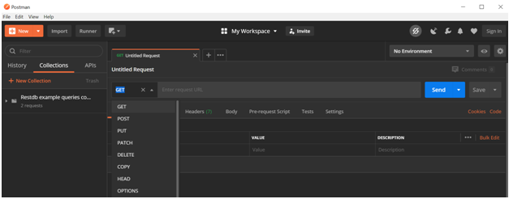
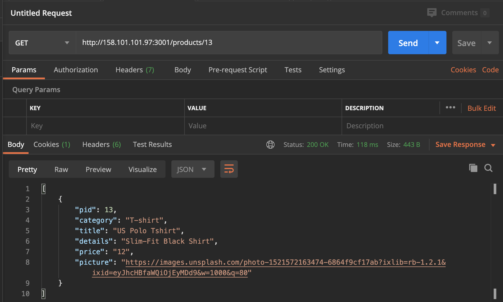
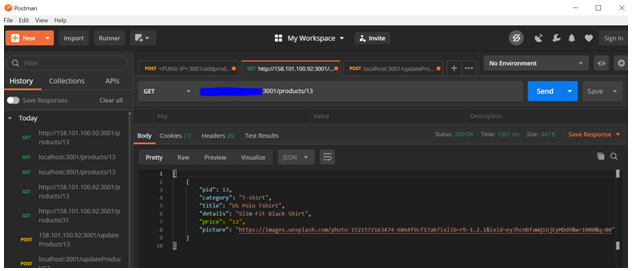

# Oracle Node.js  
  
   
## Introduction

This lab walks you through the steps to use Application API to add, view and update the product details in database.

### Prerequisites
This lab assumes you have completed the following labs:
- Lab 1:  Login to Oracle Cloud
- Lab 2:  Generate SSH Key
- Lab 3:  Create Compute instance 
- NODE.JS Lab 1: Intro and Setup

### About REST architecture

REST stands for Representational State Transfer. REST is web standards based architecture and uses HTTP Protocol. It revolves around resource where every component is a resource and a resource is accessed by a common interface using HTTP standard methods. REST was first introduced by Roy Fielding in 2000.

A REST Server simply provides access to resources and REST client accesses and modifies the resources using HTTP protocol. Here each resource is identified by URIs/ global IDs. REST uses various representation to represent a resource like text, JSON, XML but JSON is the most popular one.

### HTTP methods

Following four HTTP methods are commonly used in REST based architecture.
-	**GET** − This is used to provide a read only access to a resource.
-	**PUT** − This is used to create a new resource.
-	**DELETE** − This is used to remove a resource.
-	**POST** − This is used to update an existing resource or create a new resource.


### RESTful Web Services

A web service is a collection of open protocols and standards used for exchanging data between applications or systems. Software applications written in various programming languages and running on various platforms can use web services to exchange data over computer networks like the Internet in a manner similar to inter-process communication on a single computer. This interoperability (e.g., communication between Java and Python, or Windows and Linux applications) is due to the use of open standards.

Web services based on REST Architecture are known as RESTful web services. These web services uses HTTP methods to implement the concept of REST architecture. A RESTful web service usually defines a URI, Uniform Resource Identifier a service, which provides resource representation such as JSON and set of HTTP Methods.

## Task 1: Download Postman
   
 1. Download the Postman.
    -  [Click here to download Postman](https://www.postman.com/downloads/)

    

    

 2. Launch the Postman.
    

 3. Open a new tab. 
    

 4. Select POST Method and enter the request URL
    - Method: - POST
    - URL: - <\PUBLIC-IP>:3001/addproduct
    - Data Format: - Insert the data in the Body in the form of JSON (check the image below attached)
    - Product details: - Example
     
      ````
      <copy>  
      {
      "pid": "488",
      "category": "Puma Shoe ",
      "title": "Puma-shoe Demo3",
      "details": "Puma-shoe-Original",
      "price": "9",
      "picture": "https://objectstorage.us-ashburn-1.oraclecloud.com/n/orasenatdpltsecitom03/b/ConvergedbAppImage3/o/Puma-shoe-dietmar-hannebohn-_G94gB2cms0-unsplash.jpg"
      }  
      </copy>
      ````
    
  

5. Click on the **Submit** button, Postman return the HTTP 200 after successfully adding the product in oracle database.


## Task 2: Using HTTP GET method.
    
1. Open a new tab

2. Select GET Method and enter the request URL http://&lt;PUBLIC-IP&gt;:3001/products/31

  -  Method: - GET
    To get list of all the product details
  -  URL: - <\PUBLIC-IP>:3001/products
    To get the specific product details by using PID.
  -  URL: - <\PUBLIC-IP>:3001/products/31


 3. Open the browser and verify the above using link- "PUBLIC-IP:3001/products/31"

  

## Task 3: Using HTTP POST Method
    

1. Open a new tab. Before applying the POST method, please check the product table format by using GET Method and the URL http://&lt;localhost&gt;:3001/products/13.
 
  

  We are going to update the price from 9$ to 12$ for the product PID=13.

  Check the key value format for the price field.

		{"Key": "value"}
		
    	{"price": "9"}
   
3. Select POST Method and enter the request URL to update the price value for the PID=13

  -	Method: - POST
  - URL: - <\PUBLIC-IP>:3001/updateProduct/13
  - Data Format: - Insert the data in the Body in the form of JSON (check the image below attached)
	- Product details: - Example
		
    
       {"Key": "value"}
       
    ````
  <copy>
	{"price": "12"}
  </copy>
    ```` 

     
    

   
        
## Task 4: Verify product details by using HTTP GET method.  
    


You may now proceed to the next lab. 

## Converged Database Workshop Collection

- [Node.Js](?lab=node.js-lab-1-intro-setup) - Use Rest API to add products to the eShop Application
- [Json](?lab=json-lab-1-intro-setup) - Store and read JSON documents from the Oracle Database
- [XML](?lab=xml-lab-1-setup)- Manage XML content in the Oracle Database
- [Spatial](?lab=spatial-lab-1-setup) - Work with Spatial Data in the Oracle Database
- [Graph](?lab=graph-lab-1-intro-setup) - Work with Graph Data in the Oracle Database
- [Cross Datatype](?lab=cross-lab-1-intro-usage) - Work with Cross Data Types


## Acknowledgements

- **Authors** - Balasubramanian Ramamoorthy, Arvind Bhope
- **Contributors** - Laxmi Amarappanavar, Kanika Sharma, Venkata Bandaru, Ashish Kumar, Priya Dhuriya, Maniselvan K.
- **Team** - North America Database Specialists.
- **Last Updated By** - Kay Malcolm, Database Product Management, June 2020
- **Expiration Date** - June 2021   


      
