# Setup Compute and Autonomous DB

## Introduction
This lab will show you how to setup a Resource Manager stack that will generate the Oracle Cloud objects needed to run this workshop.  This workshop requires a compute instance running the Converged Database marketplace image, Autonomous Database and a Virtual Cloud Network (VCN).

The compute image has two docker images running the eShop application.  The docker images will connect to an autonomous database.  You will connect to the compute instance and import all the data needed for eShop into ADB.  For this workshop we will use the Autonomous Transaction Processing Database (ATP).

*Estimated Lab Time:* 15 minutes

Watch the video below for an overview of the Setup Compute and Autonomous DB lab
[](youtube:mAUXpP-ekWY)

### About Terraform and Oracle Cloud Resource Manager
For more information about Terraform and Resource Manager, please see the appendix below.

### Objectives
-   Create Compute + ADB + Networking Resource Manager Stack
-   Connect to Compute instance

### Prerequisites
This lab assumes you have:
- An Oracle Free Tier or Paid Cloud account
- SSH Keys
- Note: Based on the current design of the workshop and resource availability, it is recommended not to use the London region for this workshop at this time.

## Task 1: Create Stack:  Compute + ADB + Networking

If you already have a VCN setup, please visit the appendix to see how to optionally create a stack with just Compute + ADB.

1.  Click on the link below to download the Resource Manager zip file you need to build your environment.  
      - [converged-db-adb.zip](https://objectstorage.us-ashburn-1.oraclecloud.com/p/LNAcA6wNFvhkvHGPcWIbKlyGkicSOVCIgWLIu6t7W2BQfwq2NSLCsXpTL9wVzjuP/n/c4u04/b/livelabsfiles/o/developer-library/converged-db-adb.zip)

2.  Save in your downloads folder.
3.  Login to Oracle Cloud
4.  Open up the hamburger menu in the left hand corner.  Choose the compartment in which you would like to install.  Under the **Solutions and Platform** submenu, choose **Resource Manager > Stacks**.  Click the **Create Stack** button.

  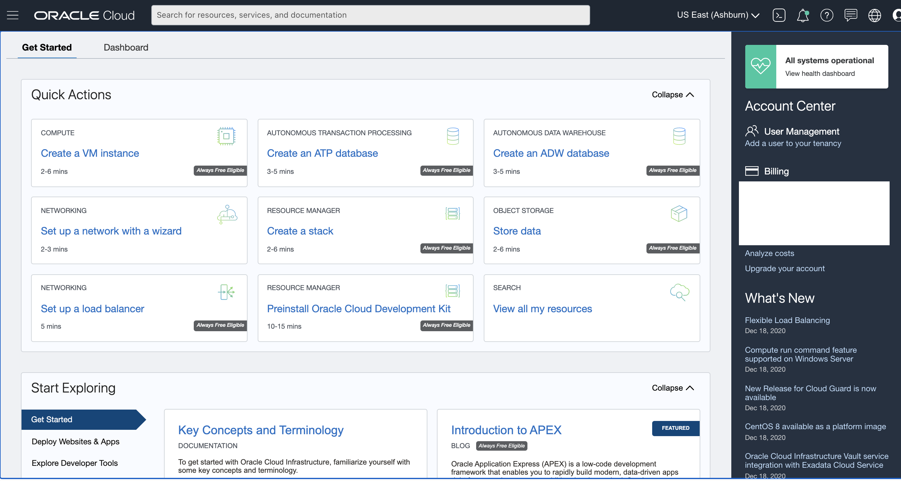

  

  

5.  Select **My Configuration**, choose the **.ZIP FILE** radio button, click the **Browse** link and select the zip file that you downloaded. Click **Select**.

6. Enter the following information:

      - **Name**:  Enter a name  or keep the prefilled default (*DO NOT ENTER ANY SPECIAL CHARACTERS HERE*, including periods, underscores, exclamation etc, it will mess up the configuration and you will get an error during the apply process)
      - **Description**:  Same as above
      - **Create in compartment**:  Select the correct compartment if not already selected

     ***Note:*** *If this is a newly provisioned tenant such as freetier with no user created compartment, stop here and first create it before proceeding.*
7.  Click **Next**.

  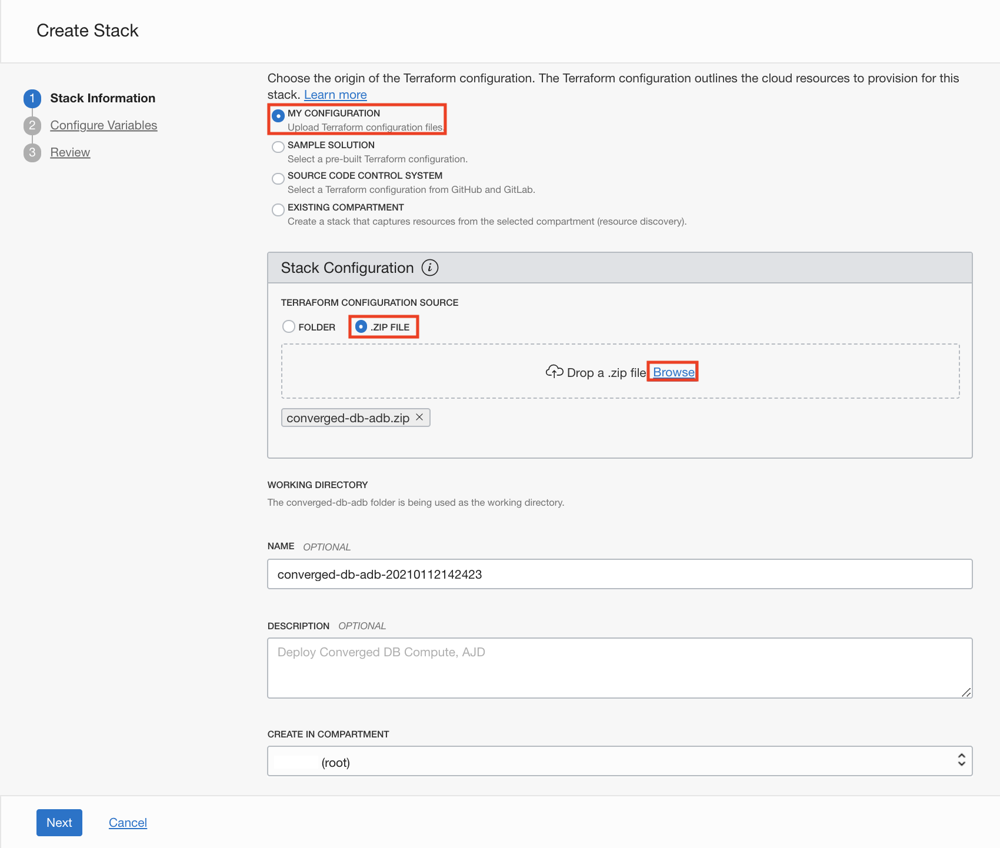

8. Enter or select the following:
    - **Instance Count:** Accept the default, **1**, unless you intend to create more for a team for instance
    - **Select Availability Domain:** Select an availability domain from the dropdown list.
    - **SSH Public Key**:  Paste the public key you created in the earlier lab

    ***Note:*** *If you used the Oracle Cloud Shell to create your key, make sure you paste the pub file in a notepad, remove any hard returns.  The file should be one line or you will not be able to login to your compute instance*

    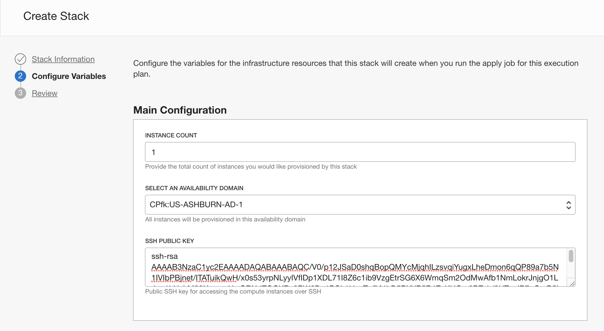

9. Depending on the quota you have in your tenancy you can choose from standard Compute shapes or Flex shapes.  We recommend standard shapes unless you have run out of quota (Please visit the Appendix: Troubleshooting Tips for instructions on checking your quota)
    - **Use Flexible Instance Shape with Adjustable OCPU Count?:** Keep the default as checked (unless you plan on using a fixed shape)
    - **Instance Shape:** Keep the default ***VM.Standard.E3.Flex*** as selected, the only option for Flex shapes.
    - **Instance OCPUS:** Accept the default (**4**) This will provision 4 OCPUs and 64GB of memory. You may also elect to reduce or increase the count in the range [2-24]. Please ensure you have the capacity available before increasing.
  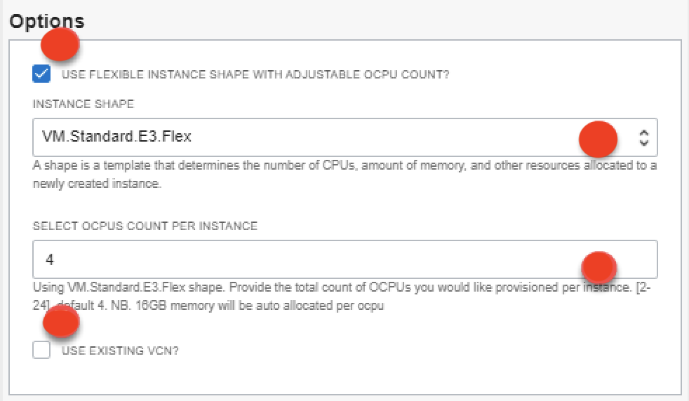


10. If you prefer to use fixed shapes, follow the instructions below.  Otherwise skip to the next step.
    - **Use Flexible Instance Shape with Adjustable OCPU Count?:** Unchecked
    - **Instance Shape:** Select **VM.Standard.E2.2** or larger.  

11. For this section we will provision a new VCN with all the appropriate ingress and egress rules needed to run this workshop.  If you already have a VCN, make sure it has all of the correct ingress and egress rules and skip to the next section.
    - **Use Existing VCN?:** Accept the default by leaving this unchecked. This will create a **new VCN**.

  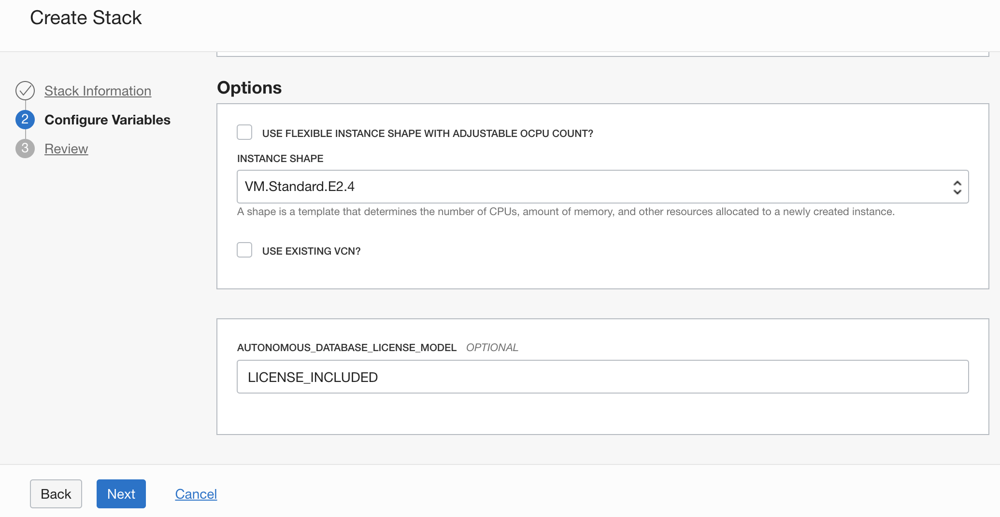


12. Click **Next**.
13. Review and click **Create**.

  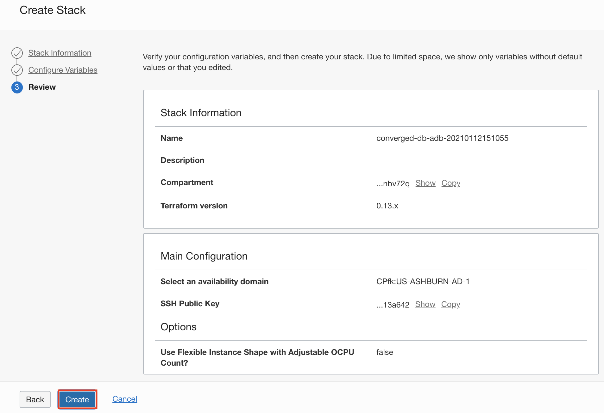

14. Your stack has now been created!  

  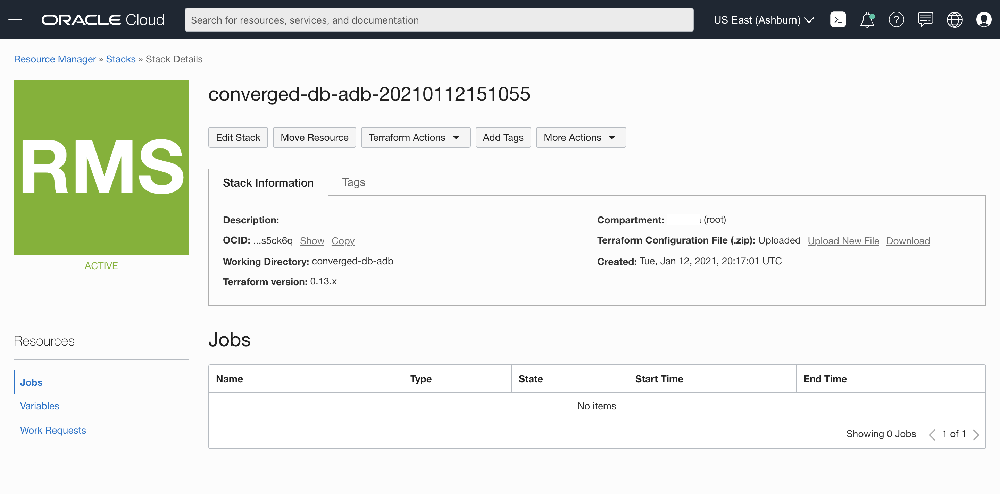


## Task 2: Terraform Apply
When using Resource Manager to deploy an environment, execute a terraform **apply** to actually create the configuration.  Typically you would execute a Terraform Plan first.  This is an optional step that we've included in the Appendix.  Please see the Appendix to run the plan step to validate the configuration.  Otherwise let's proceed and create your stack.  

1.  At the top of your page, click on **Stack Details**.  click the button, **Terraform Actions** -> **Apply**.  This will create your network (unless you opted to use an existing VCN) and the compute instance.

  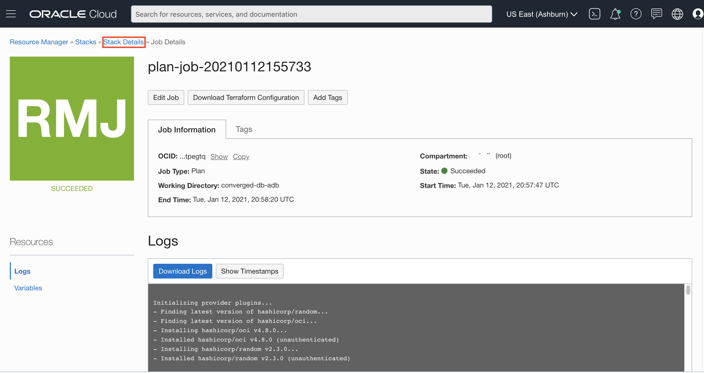

  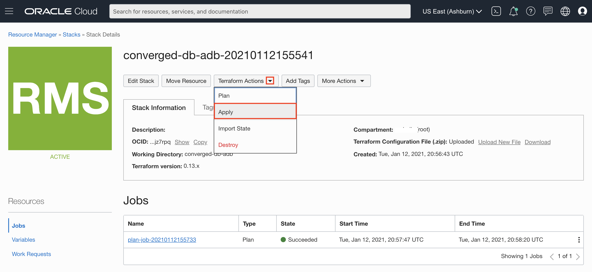

  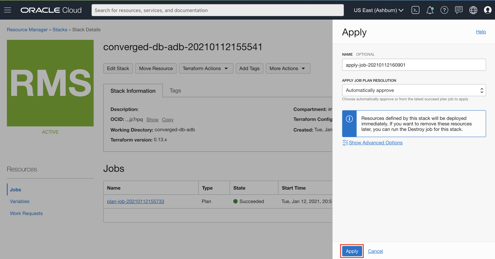

2.  Once this job succeeds, you will get an apply complete notification from Terraform.  Examine the log output closely.  

***Note:*** *If you encounter any issues running the terraform stack, like invalid SSH Key, Limit exceeded, etc visit the Appendix: Troubleshooting Tips section below.*

  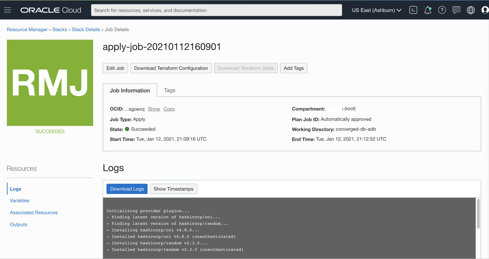

  

  

3.  Congratulations, your environment is created!  Now we need to collect information that you will need to complete the rest of the labs.  On the left hand Resources menu (under the big green box), click **Outputs**. Your public IP address and instance name will be displayed.  Note the public IP address, you will need it for the next step.


  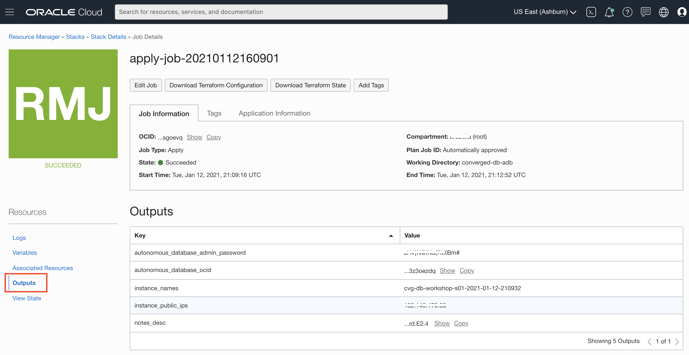

3.  Note your admin password, your autonomous database ocid (Oracle Cloud ID) and Instance IP.  You will need that for the subsequent sections.  Copy this information into a text pad or note or you can reference it directly.

## Task 3: Verify connection to your instance

Choose the environment where you created your ssh-key in the previous lab (Generate SSH Keys)
***Note:*** *If you are not using Cloud Shell and are using your laptop to connect your corporate VPN may prevent you from logging in.*

### Oracle Cloud Shell

1. To re-start the Oracle Cloud shell, go to your Cloud console and click the Cloud Shell icon to the right of the region.  ***Note:*** *Make sure you are in the region you were assigned*

  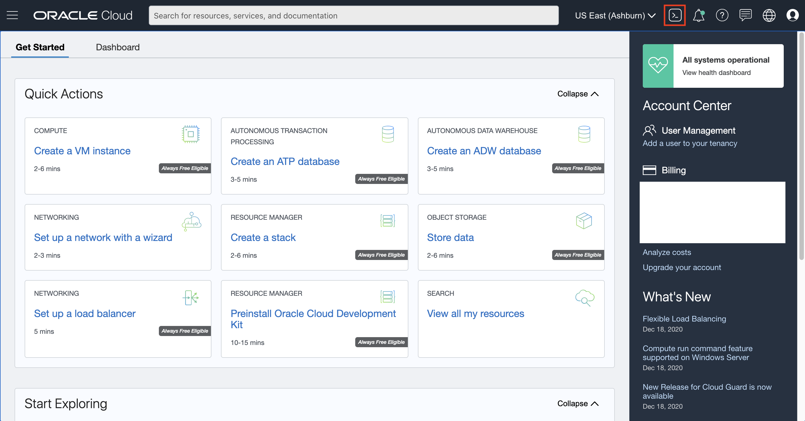

2.  If you didn't jot down your compute instance public IP address, click the **Navigation Menu** in the upper left, navigate to **Compute**, select **Instances** and select the instance you created (make sure you choose the correct compartment)

  
  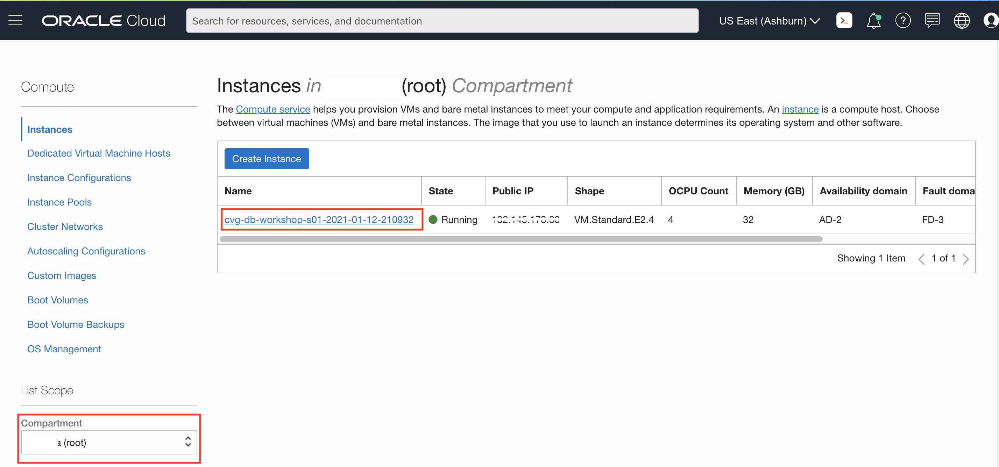

3.  On the instance homepage, find the Public IP address for your instance.
4.  Enter the command below to login to your instance.    

    ````
    ssh -i ~/.ssh/<sshkeyname> opc@<Your Compute Instance Public IP Address>
    ````

6.  When prompted, answer **yes** to continue connecting.
    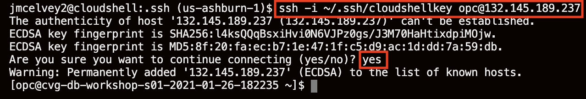

7.  Exit the instance

    ````
    exit
    ````
  

You may now [proceed to the next lab](#next).


## Appendix: Troubleshooting Tips

If you encountered any issues during the lab, follow the steps below to resolve them.  If you are unable to resolve, please skip to the **Need Help** section to submit your issue via our  support forum.
- Limits Exceeded
- Invalid public key
- Flex Shape Not Found
- Permission Denied during Login

### Issue 1: Invalid public key


#### Issue #1 Description
When creating your SSH Key, if the key is invalid the compute instance stack creation will throw an error.

#### Tips for fixing for Issue #1
- Go back to the instructions and ensure you create and **copy/paste** your key into the stack correctly.
- Copying keys from Cloud Shell may put the key string on two lines.  Make sure you remove the hard return and ensure the key is all one line.
- Make sure you copied and pasted the entire string
- Ensure you pasted the *.pub file into the window.
1.  Click on **Stack**-> **Edit Stack** -> **Configure Variables**.
2.  Repaste the correctly formatted key
3.  Click **Next**
4.  Click **Save Changes**
5.  Click **Terraform Actions** -> **Apply**

### Issue 2: Flex Shape Not Found or Capacity Exceeded


#### Issue #2 Description
When creating a stack your ability to create an instance is based on the capacity you have available for your tenancy.

#### Fix for Issue #2
If you have other compute instances you are not using, you can go to those instances and delete them.  If you are using them, follow the instructions to check your available usage and adjust your variables.
1. Click on the Hamburger menu, go to **Governance** -> **Limits, Quotas and Usage**
2. Select **Compute**
3. These labs use the following compute types.  Check your limit, your usage and the amount you have available in each availability domain (click Scope to change Availablity Domain)
4. Look for Standard.E2, Standard.E3.Flex and Standard2
4.  Click on the hamburger menu -> **Resource Manager** -> **Stacks**
5.  Click on the stack you created previously
6.  Click **Edit Stack** -> **Configure Variables**.
7.  Scroll down to Options
8.  Change the shape based on the availability you have in your system
9.  Click **Next**
10. Click **Save Changes**
11. Click **Terraform Actions** -> **Apply**

### Issue 3: Limits Exceeded


#### Issue #3 Description
When creating a stack your ability to create an instance is based on the capacity you have available for your tenancy.

*Please ensure that you are NOT running this in the **Always Free** Tier. This workshop does not run on the Always Free tier, you must have available cloud credits.  Go to **Governance** -> **Limits, Quotas and Usage,** select **compute**, ensure that you have **more than** the micro tier available.  If you have only 2 micro computes, your account has transitioned to an Always Free.  This means that the promotional period of 30 days has expired or you have run out of credits, this workshop will NOT run.*

#### Fix for Issue #3
If you have other compute instances you are not using, you can go to those instances and delete them.  If you are using them, follow the instructions to check your available usage and adjust your variables.

1. Click on the Hamburger menu, go to **Governance** -> **Limits, Quotas and Usage**
2. Select **Compute**
3. These labs use the following compute types.  Check your limit, your usage and the amount you have available in each availability domain (click Scope to change Availability Domain)
4. Look for Standard.E2, Standard.E3.Flex and Standard2
5. This workshop requires at least 4 OCPU and a minimum of 30GB of memory.  If you do not have that available you may request a service limit increase at the top of this screen.  If you have located capacity, please continue to the next step.
6.  Click on the Hamburger menu -> **Resource Manager** -> **Stacks**
7.  Click on the stack you created previously
8.  Click **Edit Stack** -> **Configure Variables**.
9.  Scroll down to Options
10. Change the shape based on the availability you have in your system
11. Click **Next**
12. Click **Save Changes**
13. Click **Terraform Actions** -> **Apply**

### Issue 4: Permission Denied during Login
Permission denied (publickey,gssapi-keyex,gssapi-with-mic)

#### Issue #4 Description
When logging in to your compute instance for the first time, you receive an error during login.

#### Fix for Issue #4
- Ensure you are using the same ssh key you used to create your stack.  
- Make sure you are logging into the OPC user
- Make sure you are using the correct instance IP by viewing the **Outputs** values
- Go back to the instructions and ensure you create and **copy/paste** your key into the stack correctly.
- Copying keys from Cloud Shell may put the key string on two lines.  Make sure you remove the hard return and ensure the key is all one line.
- Make sure you copied and pasted the entire string
- Ensure you pasted the *.pub file into the window.
1.  Click on **Stack**-> **Edit Stack** -> **Configure Variables**.
2.  Repaste the correctly formatted key
3.  Click **Next**
4.  Click **Save Changes**
5.  Click **Terraform Actions** -> **Apply**

## Appendix: Terraform Plan
When using Resource Manager to deploy an environment, execute a terraform **plan** to verify the configuration. This is optional, *you may skip directly to Step 2*.

1.  **[OPTIONAL]** Click **Terraform Actions** -> **Plan** to validate your configuration.  This takes about a minute, please be patient.

  

  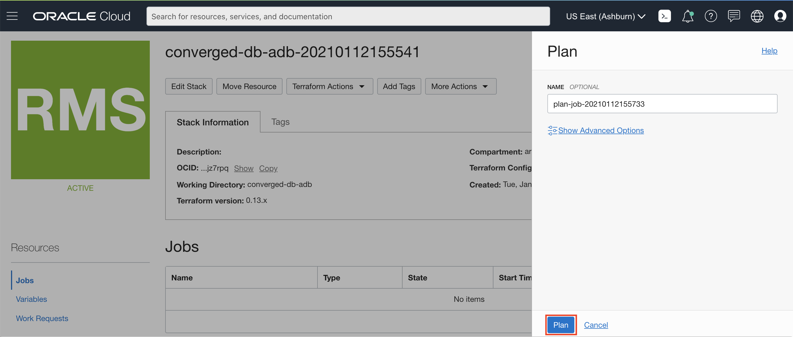

  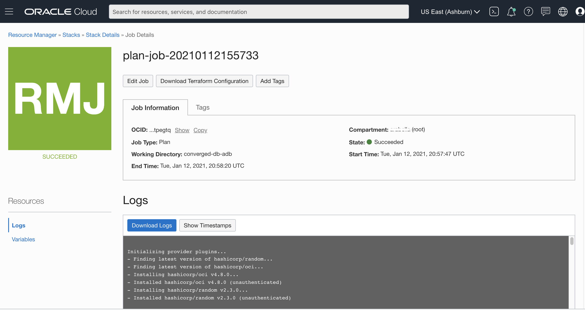

  

  

  

Return to the Terraform Apply step to continue.

## Learn More
Terraform is a tool for building, changing, and versioning infrastructure safely and efficiently.  Configuration files describe to Terraform the components needed to run a single application or your entire datacenter.  In this lab a configuration file has been created for you to build network and compute components.  The compute component you will build creates an image out of Oracle's Cloud Marketplace.  This image is running Oracle Linux 7.

Resource Manager is an Oracle Cloud Infrastructure service that allows you to automate the process of provisioning your Oracle Cloud Infrastructure resources. Using Terraform, Resource Manager helps you install, configure, and manage resources through the "infrastructure-as-code" model. To learn more about OCI Resource Manager, take a watch the video below.

[](youtube:udJdVCz5HYs)

### Oracle Cloud Marketplace
The Oracle Cloud Marketplace is a catalog of solutions that extends Oracle Cloud services.  It offers multiple consumption modes and deployment modes.  In this lab we will be deploying the free Oracle Enterprise Manager 13c Workshop marketplace image.

[Link to OCI Marketplace](https://www.oracle.com/cloud/marketplace/)

## Acknowledgements

* **Author** - Rene Fontcha, Master Principal Solutions Architect, NA Technology
* **Contributors** - Kay Malcolm, Kamryn Vinson
* **Last Updated By/Date** - Troy Anthony, December 2021
