# Oracle SODA

## Introduction

In this lab you will be introduced to using the Oracle SODA APIs for Python. But you should be aware that SODA is also available for Java, REST, C and Node.js.  


*Estimated Lab Time:* 30 Minutes

### **About Oracle SODA**


So what is exactly is SODA? it’s best described as follows (taken from the Oracle documentation):

“Simple Oracle Document Access (SODA) is a set of NoSQL-style APIs that let you create and store collections of documents (in particular JSON) in Oracle Database, retrieve them, and query them, without needing to know Structured Query Language (SQL) or how the documents are stored in the database.”

Oracle SODA documentation [link](https://docs.oracle.com/en/database/oracle/simple-oracle-document-access/python/index.html)

For more information see the [overview](https://docs.oracle.com/en/database/oracle/simple-oracle-document-access/adsdi/overview-soda.html#GUID-BE42F8D3-B86B-43B4-B2A3-5760A4DF79FB) in the Oracle Documentation


**SODA Terminology**

Common terms that are used in this lab:

- **Document**: A Document is the equivalent to a relational row.

- **Collection**: A Collection is the equivalent to a relational table. A Collection contains multiple Documents.

- **Database**: A Database contains multiple collections and is the equivalent of a Schema in an Oracle Database.

The Document model is completely schema-less.  In the Schema-less approach to creating a collection, your code can create a collection without requiring any metadata definition or DDL (Data Definition Language). Furthermore, it is possible to insert a document in a pre-created collection that does not match any previously inserted documents (or Schema Evolution).

One last thing about SODA. It is important to understand that SODA is NOT mandatory when working with JSON and the Oracle Database. However SODA provides a simple solution to bridging the programing gap between the NOSQL model and the relational model.


### Prerequisites
This lab assumes you have:
- A Free Tier, Paid or LiveLabs Oracle Cloud account
- You have completed:
     - Lab :  Generate SSH Keys
     - Lab :  Setup Compute and Autonomous DB
     - Lab :  Load Data and Start Application
     - Lab :  JSON


## Task 1: Connect to your Database from Python

We will be using the Oracle Cloud Shell for this lab.  The Oracle Cloud Shell is preconfigured with Python3 and cx\_Oracle for us to connect to our database using python.  You can find more information about cx\_Oracle as well as how to install it at the following [blog](https://oracle.github.io/python-cx_Oracle/) site.

We will also use the wallet-file we called *converged-wallet.zip* that we already created in our Oracle Cloud Shell in a previous lab.

1. As a first step let's verify that Python3 is installed.  If you aren't already logged into Oracle Cloud please do so and restart Oracle Cloud Shell.  At the Cloud Shell prompt enter the following to see the version:

    ````
    <copy>
    python3 --version
    </copy>
    ````

    *Note*: You should still have the cloud wallet file (*converged-wallet.zip*) that you generated in the lab: Load Data and Start Application  

    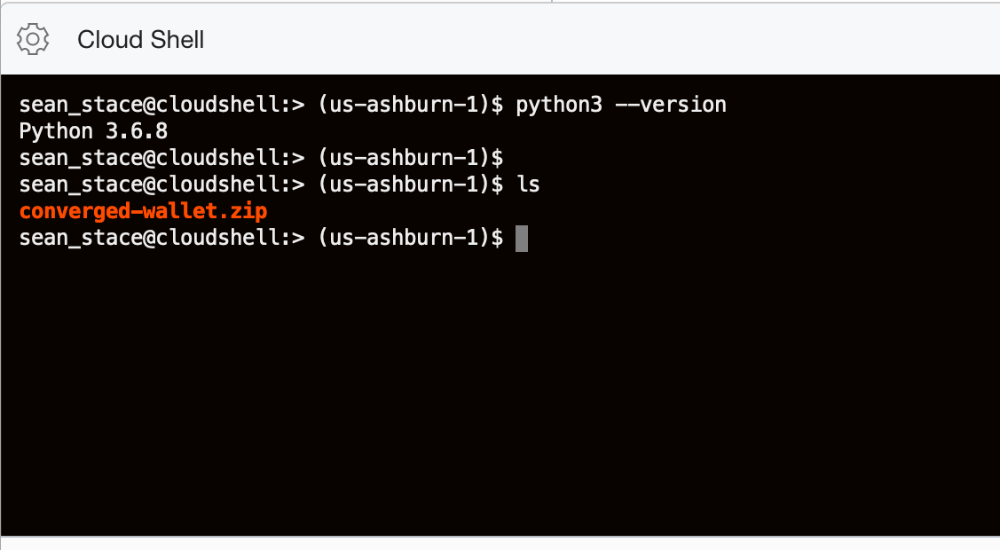


2. Unzip the contents of the wallet file into a directory that we will call *wallet*. The directory can be created using the unzip command.

    ````
    <copy>
    unzip -d wallet converged-wallet.zip
    </copy>
    ````

    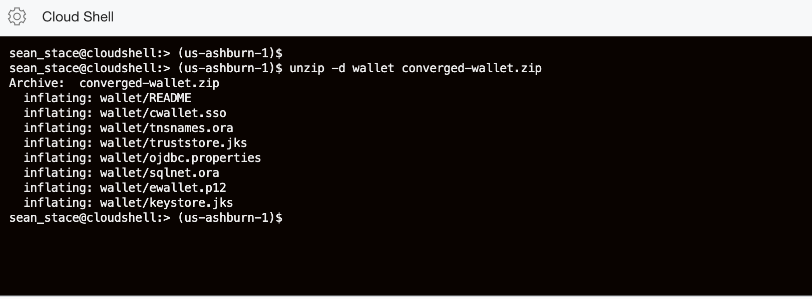


3. Next we need to modify the *sqlnet.ora* file located in the wallet directory to include the location of the wallet contents.

    ````
    <copy>
    cd wallet

    pwd
    </copy>
    ````

    If you are unsure of the full directory name and path,  you can cut-and-paste this from the output of the *pwd* operation.

    Edit the contents of the *sqlnet.ora* file

    ````
    <copy>
    vi sqlnet.ora
    </copy>
    ````

    Change the first line in the sqlnet.ora file to use your directory name as it appears in your Oracle Cloud Shell prompt:

    *OLD:* WALLET\_LOCATION = (SOURCE = (METHOD = file) (METHOD\_DATA = (DIRECTORY="?/network/admin")))

    *NEW:* WALLET\_LOCATION = (SOURCE = (METHOD = file) (METHOD\_DATA = (DIRECTORY="/home/user\_name/wallet")))


4. Change directory back to your base Directory

    ````
    <copy>
    cd ..
    </copy>
    ````

5. For our next step we will create a file to store our connection information.  We will then use this file with any additional python programs moving forward,  placing our connection settings in a separate file makes our database connections much more seamless to use.  

    Create a file called *myConnection.py* and enter the following lines:

    ````
    <copy>
    import os
    os.environ['TNS_ADMIN'] = '/home/<your-directory-name-here>/wallet'

    # Username
    usrnm="admin"
    # Password
    psswd="<your admin password>"
    # Data Source Name
    dsn= "cvgadbnn_tp"
    </copy>
    ````

    The contents of the file we have created-

    - The first two lines permit us to set a *TNS_ADMIN* environment variable.  Make sure to enter your own directory location for the wallet.
    - `usrnm=` - You can leave this as is to use the admin user for this lab.
    - `passwd=` - Supply the password for your admin user here.
    - `dsn=` - Provide the name for your database connection.  This is the name of the Autonomous Database that you provisioned in a previous lab.  We are appending the *_tp* suffix for a transaction processing service.  You can also locate this from the *tnsnames.ora* file located in your wallet directory.  


6. You are now ready to create your first python program to connect to the Autonomous Database using cx\_Oracle 8. cx\_Oracle is a Python extension that enables connectivity to an Oracle Database.  

    Create a file called *soda1.py* and enter the following lines:

    ````
    <copy>
    import cx_Oracle
    import myConnection

    connection = cx_Oracle.connect(myConnection.usrnm, myConnection.psswd, myConnection.dsn)

    print("Database version:", connection.version)
    print("\n")

    </copy>
    ````

    *Note*: You do not need to modify any lines of code in this file.

    About this program
    - The first two lines load the cx\_Oracle extension along with the connection information from the file we created in our previous step.
    - We use the third line of code to pass the connection information to the program.
    - The final line prints the database version.


7. Enter the following to run the program:

    ````
    <copy>
    python3 soda1.py
    </copy>
    ````

    If everything is configured correctly, you should see this output:

    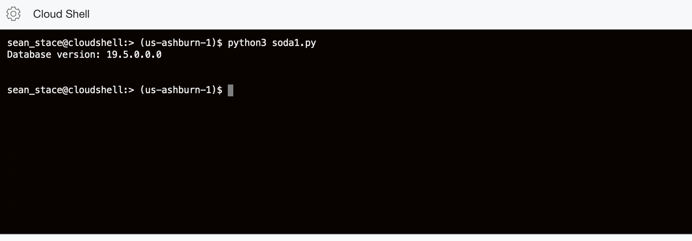


## Task 2: Insert a SODA Collection into the Database

Now that your environment is configured and you can connect to database from Python, you are ready to get started with SODA.  


1.  Create a new file called *soda2.py* and enter the following lines and save the file:

    ````
    <copy>
    import cx_Oracle
    import myConnection
    connection = cx_Oracle.connect(myConnection.usrnm, myConnection.psswd, myConnection.dsn)

    print("\nDatabase version:", connection.version)

    # Enable Auto-commit
    connection.autocommit = True

    # Create the parent object for SODA
    soda = connection.getSodaDatabase()

    # Create a new SODA collection called "sodacollection"
    # This will open an existing collection, if the name is already in use.
    collection = soda.createCollection("sodacollection")

    # Clean up the collection if it already exists and contains documents
    collection.find().remove()

    # Insert a document into the collection
    content = {'name': 'Blue', 'diet': 'krill', 'status': 'endangered'}

    doc = collection.insertOneAndGet(content)

    # Display the Key for the latest entry
    key = doc.key
    print('\nThe key of the new SODA document is: ', key)

    # Return the most recent entry (using the key)
    content = collection.find().key(key).getOne().getContent()
    print(content)

    # Close the database connection
    connection.close()
    print("\n")

    </copy>
    ````


2. Save the changes and run the program as follows:

    ````
    <copy>
    python3 soda2.py
    </copy>
    ````

    If everything is configured correctly, you should see this output:

    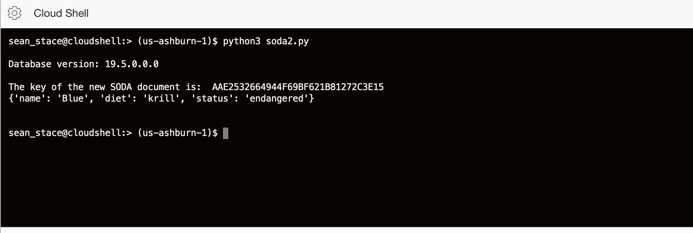


    You may have noticed that the program created a collection in the database, on the fly and without specifying any DDL (Data Definition Language) or metadata beforehand. Also, take note, you do not need to install any specific code or packages to use SODA.  SODA is built into the base Oracle Database (all editions).

    The collection is stored in the database as a table and a document key is generated for the document.  You will be exploring the documents and collections from inside the database in Step-3.  But before you do, let's see some more SODA functionality from python.


3. In the next example you will see how to perform a bulk insert into a collection with SODA.  

    Create a new file called *soda3.py* and enter the following lines and save the file:

    ````
    <copy>
    import cx_Oracle
    import myConnection
    connection = cx_Oracle.connect(myConnection.usrnm, myConnection.psswd, myConnection.dsn)

    # Enable Auto-commit
    connection.autocommit = True

    # Create the parent object for SODA
    soda = connection.getSodaDatabase()

    # Create a new SODA collection
    # This will open an existing collection, if the name is already in use.
    collection = soda.createCollection("sodacollection")

    # Insert multiple documents into the collection
    inDocs = [
        dict(name='Humpback', diet=['squid', 'krill', 'herring'], status= 'least concern'),
        dict(name='Sperm', diet=['squid', 'octopus'], status= 'vunerable'),
        dict(name='Antarctic Minke', diet= ['krill','plankton','small fish'], status= 'near threatened'),
        dict(name='North Pacific Right', diet=['plankton', 'krill'], status= 'endangered', population='500')
    ]

    # Perform BULK insert
    bulkDocs = collection.insertManyAndGet(inDocs)
    for doc in bulkDocs:
       print("Inserted SODA document with key", doc.key)
    print()

    # Return the most recent entry (using the key)
    content = collection.find().key(doc.key).getOne().getContent()
    print("Last Inserted SODA document", content)

    # Close the database connection
    connection.close()
    print("\n")
    </copy>
    ````

    *Some observations about this program before you run it*

    In this program you have inserted four additional documents into your existing collection called *sodacollection*.  Some additional things to consider:

    - The documents were inserted using a bulk insert operation.
    - The *diet* field is an array of values.
    - The fourth document being inserted includes an additional field that is not in any prior documents.  This would be problematic in the relational model as a column would need to pre-exist for this insert to succeed.  In SODA this change can happen on the fly as it supports *schema-evolution* natively.


4. Save the changes and run the program as follows:

    ````
    <copy>
    python3 soda3.py
    </copy>
    ````

    If everything is configured correctly, you should see this output:

    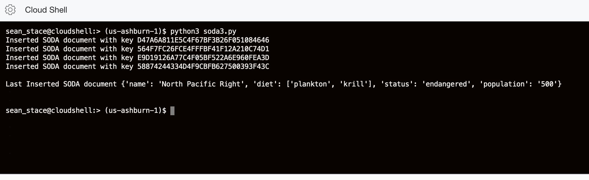


5. The next example will explore running a QBE (Query By Example) operation against the Collection.

    Create a new file called *soda4.py* and enter the following lines and save the file:

    ````
    <copy>
    import cx_Oracle
    import myConnection
    connection = cx_Oracle.connect(myConnection.usrnm, myConnection.psswd, myConnection.dsn)

    # Enable Auto-commit
    connection.autocommit = True

    # Create the parent object for SODA
    soda = connection.getSodaDatabase()

    # This will open an existing collection, if the name is already in use.
    collection = soda.createCollection("sodacollection")

    # Find all documents with array diet containing an element 'plankton%'
    print("\nWhales with a diet that includes 'plankton%'")
    qbe = {'diet': {'$like': 'plankton%'}}
    for doc in collection.find().filter(qbe).getDocuments():
        content = doc.getContent()
        print(" - " + content["name"] + ",", "key:", doc.key)

    # Close the database connection
    connection.close()
    print("\n")
    </copy>
    ````

    *Some observations about this program before you run it*

    In this program you are performing a QBE against the collection to find all the whales with a diet that includes plankton.  To perform this the program is using a soda operation to filtering based on the string/element including the search term ("plankton" in this case).


6. Save the changes and run the program as follows:


    ````
    <copy>
    python3 soda4.py
    </copy>
    ````

    If everything is configured correctly, you should see this output:

    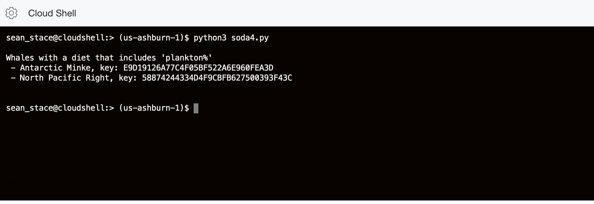


    At this stage you should have a basic understanding of how SODA can provide a seamless document interface for developers to interact with the Oracle database.  All without the need to know anything about the underlying database layout.

    You are now ready to switch gears and view the SODA collection from the viewpoint of the Oracle database.


## Task 3: Viewing your SODA Collection from the Database

In this section you will connect to the Oracle database you provisioned in your previous lab. This is the database environment that you configured your Python programs to connect to.

1. Go back to your ATP screen by clicking on the Hamburger Menu -> **Autonomous JSON Database**

2. Click on the **Display Name,** *cvgadbnn*

3. Click on the **Tools** tab, select **SQL Developer Web**, a new browser will open up

    To keep things simple we will be using the *admin* user and the password that you wrote down in the previous lab.


4. In the first part of this lab you created a collection in python called "sodacollection".  This object did not previously exist in the database, but the first SODA insert operation created this automatically for you.

    The collection appears in the database as a table.  You can see the table's columns described in the pane on the left hand side of the screen:

    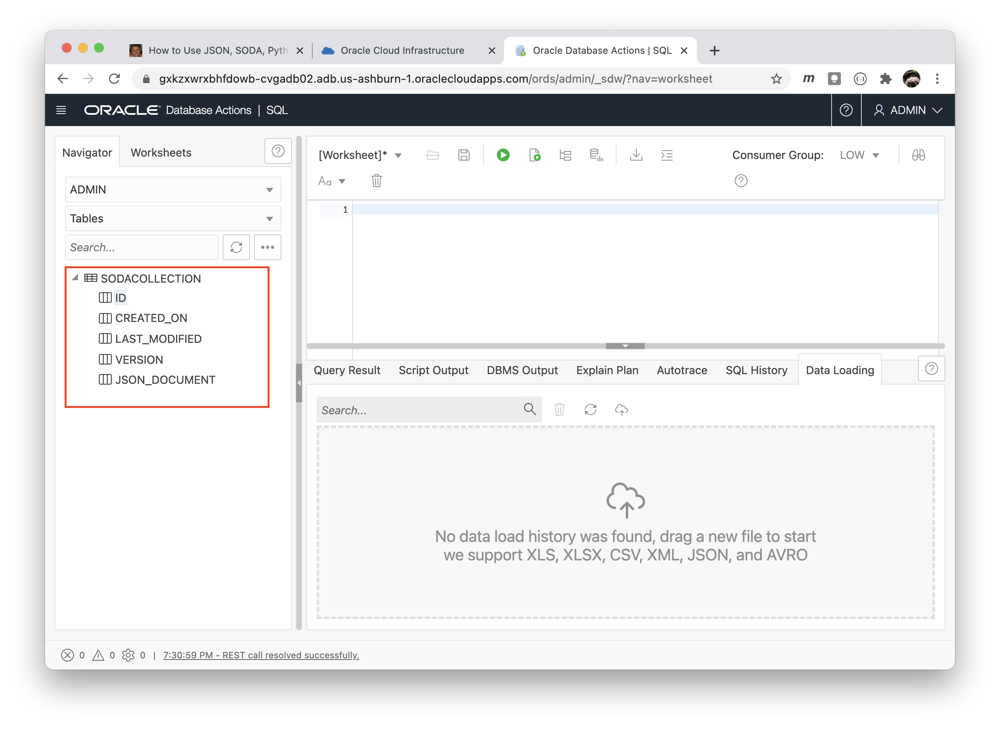


5. The table can be queried just as any other table in an Oracle database.  You can query the contents displayed in the following example:

    ````
    <copy>
    desc sodacollection

    select * from sodacollection ;
    </copy>
    ````

    You should see the following output:

    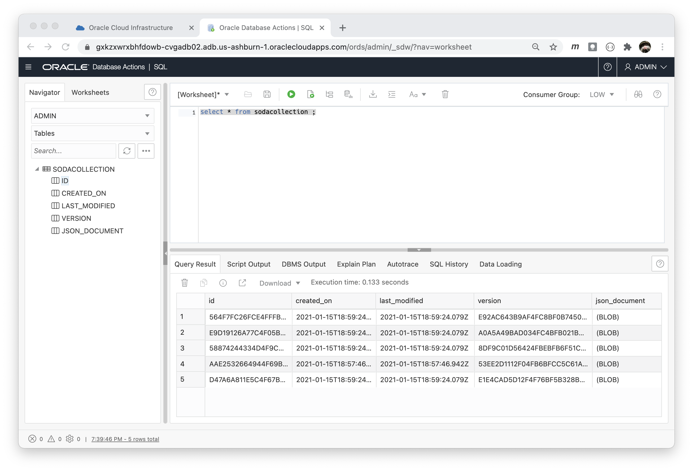


6. The first thing you would have noticed is that other than the ID to map the key for each document entered into the collection, there is no way of knowing what data is stored in the collection, as the information is stored in a column called json_document which is a BLOB.

    In the JSON lab you have seen how to query the document contents of a BLOB holding a JSON document using the json_serialize function.  You can see how this operation works with this data sample by entering the following SQL code:

    ````
    <copy>
    select id,
           created_on,
           version,
           json_serialize(json_document returning varchar2 pretty) pretty_js
    from   sodacollection
    /
    </copy>
    ````
    You should see the following output:

    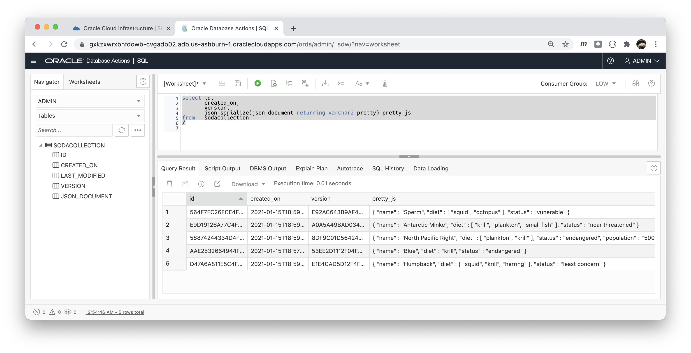

    *NOTE: In case you are wondering.  The json_serialize operation is returned using pretty format.  In SQLDeveloperWeb the Document contents are returned as a single formatted column on a single row.  If you were to have run the same SQL statement from a SQL command-line, the document would be displayed in a "pretty format" as illustrated below.  This is just for reference, you do not need to perform this operation.*   

    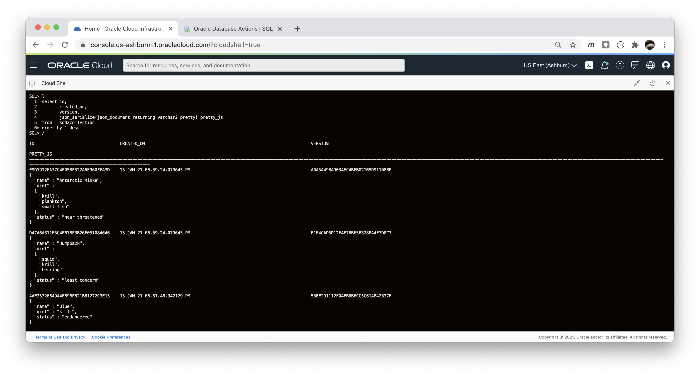


7. A better method for understanding the document contents for the collection that you can use is the JSON\_DATAGUIDE function. The JSON\_DATAGUIDE function is not dependent upon SODA, and provides a powerful way to map the contents of the JSON document into columns that can be easily read and used in relational operations.  JSON\_DATAGUIDE simplifies working with the NOSQL schema-less and schema evolution paradigms.

    Run the following SQL statements:

    ````
    <copy>
    declare dguide clob ;

    begin
       select json_dataguide(json_document, DBMS_JSON.FORMAT_HIERARCHICAL)
       into   dguide
       from   sodacollection ;

       dbms_json.create_view('auto_view', 'sodacollection', 'json_document', dguide ) ;

    end ;
    /
    </copy>
    ````

    You should see the following when you run the SQL:

    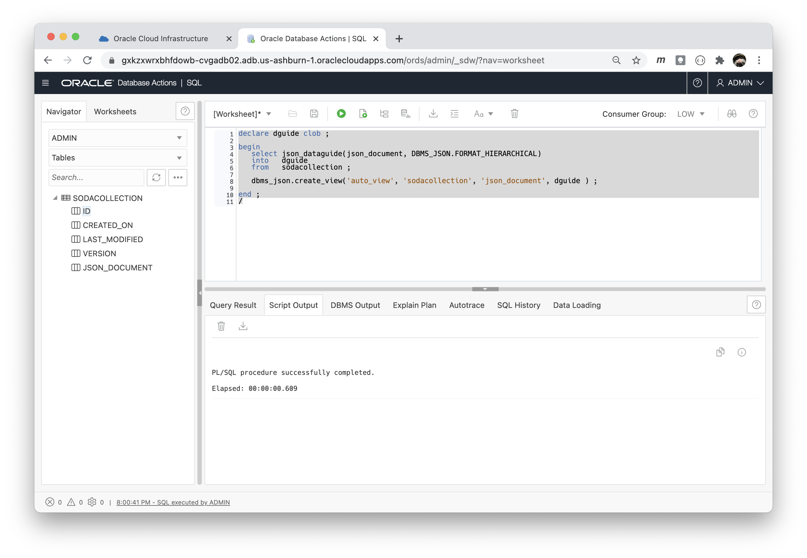


    Go here to find out more about [JSON_DATAGUIDE](https://docs.oracle.com/en/database/oracle/oracle-database/19/sqlrf/JSON_DATAGUIDE.html#GUID-4CF32887-0F46-4925-8381-AE2B74343933)


7. In addition to using JSON\_DATAGUIDE to map the JSON document contents to columns, the operation also created a view called *auto_view* so you can access the data more seamlessly moving forward.

    The view can be described just like any other Oracle view:

    ````
    <copy>
    desc auto_view ;
    </copy>
    ````

    You should see the following when you run the SQL:

    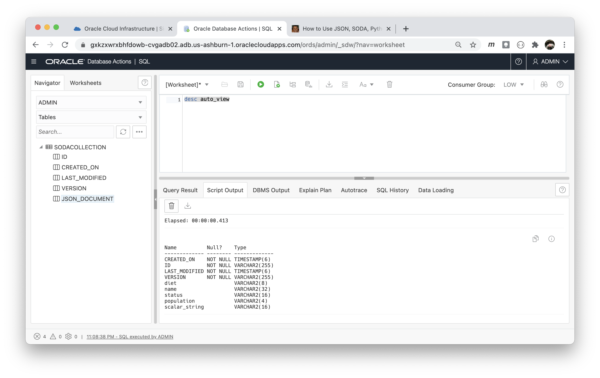


8. We can now query the contents of the

    ````
    <copy>
    select  "name", "diet", "scalar_string", "status"
    from     auto_view
    order by 1
    /
    </copy>
    ````

    You should see the following output:

    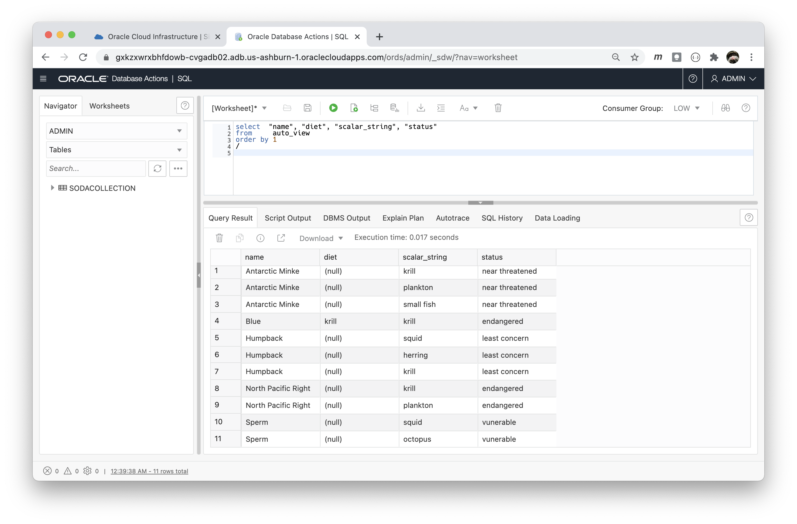


9. The output from the query is a little confusing as you are seeing a row entry for each array element of the diet.  So in this case you can use the SQL *LISTAGG* function to format the output in a more meaningful way:

    ````
    <copy>
    select "name",
           listagg("scalar_string", ',' ) within group (order by "scalar_string") diet
    from   auto_view
    group by "name"
    order by 1;
    </copy>
    ````

    You should see the following output:

    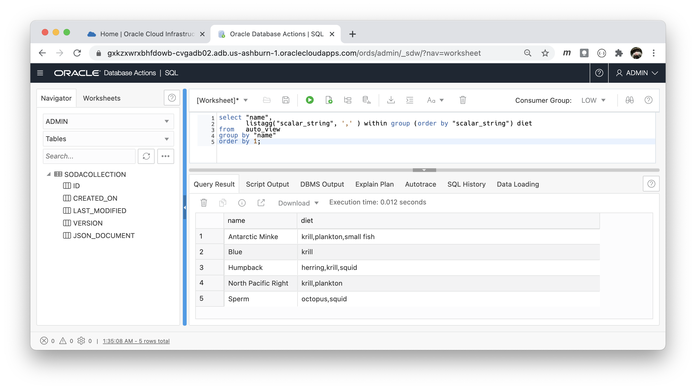


10. The final operation you will perform on the SODA collection is to drop the collection from your database.

    It is important to note that you should not simply issue a "drop table" operation on the underlying table holding the collection as there is hidden metadata associated with the collection and this should be removed in a clean manner.  The safest method to drop a Collection from inside the database is to use the SQL function- dbms\_soda.drop\_collection as follows:

    ````
    <copy>
    select dbms_soda.drop_collection('sodacollection') "Status" from dual ;
    </copy>
    ````

    You should see the following output:

    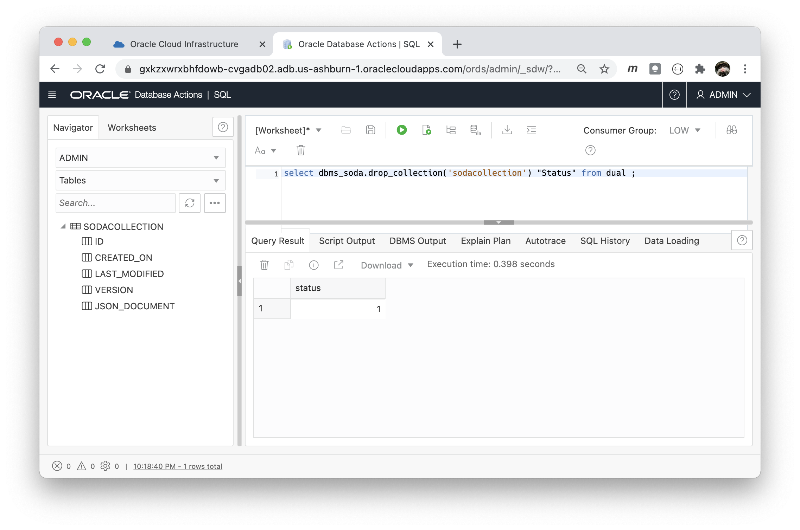

    *A Status of '1' means success. If you run the select statement more than once, it will return a '0' as there is no longer anything to drop as is expected.*

<!-- *At the conclusion of the lab add this statement:* -->
You may now [proceed to the next lab](#next).

## Learn More
- [Oracle Online documentation for SODA ](https://docs.oracle.com/en/database/oracle/simple-oracle-document-access/adsdi/overview-soda.html)
- [Blog: How to Use JSON, SODA, Python and Oracle Autonomous JSON DB](https://seanstacey.org/part-1-using-json-soda-and-python-with-oracle-database-and-autonomous-json-database/2020/10/)

## Acknowledgements

* **Author** - Sean Stacey
* **Contributors** -
* **Last Updated By/Date** -
