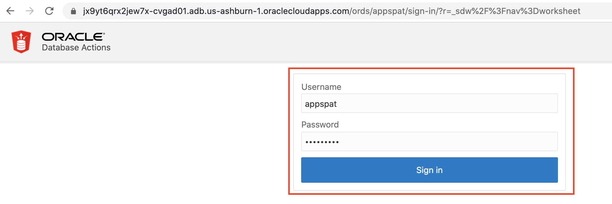

# Oracle Spatial

## Introduction
This lab walks you through the steps of setting up the environment for Spatial lab. You can connect to the Oracle Database instance using any client of your choice. In this lab, you will connect using Oracle SQL Developer.

*Estimated Lab Time:* 15 Minutes

Watch the video below for an overview of Lab 5: Spatial
[](youtube:bYQUs6m954I)

### Prerequisites
This lab assumes you have:
- A LiveLabs Oracle Cloud account
- You have completed:
    - Lab: Generate SSH Keys
    - Lab: Verify Setup of Compute Instance
    - Lab: Load Data and Start Application

### About Oracle Spatial

Oracle Spatial is an integrated set of functions, procedures, data types, and data models that support spatial analytics. The spatial features enable spatial data to be stored, accessed, and analyzed quickly and efficiently in an Oracle database.

Oracle Spatial is designed to make spatial data management easier and more natural to users of location-enabled applications and geographic information system (GIS) applications. Once spatial data is stored in an Oracle database, it can be easily manipulated, retrieved, and related to all other data stored in the database.

A common example of spatial data can be seen in a road map. A road map is a two-dimensional object that contains points, lines, and polygons that can represent cities, roads, and political boundaries such as states or provinces. A road map is a visualization of geographic information.

The data that indicates the Earth location (such as longitude and latitude) of these rendered objects is the spatial data. When the map is rendered, this spatial data is used to project the locations of the objects on a two-dimensional piece of paper.

 [](youtube:Q2jm93Rm95g)

Oracle Spatial consists of the following:
-	Schema (MDSYS)
-	A spatial indexing mechanism  	
-	Operators, functions, and procedures
-	Native data type for vector data called SDO\_GEOMETRY(An Oracle table can contain one or more SDO\_GEOMETRY columns.)


### Scenario
MyCompany has several major warehouses. It needs to locate its customers who are near a given warehouse, to inform them of new advertising promotions. To locate its customers and perform location-based analysis, MyCompany must store location data for both its customers and warehouses.

We will be using three tables – CUSTOMERS, WAREHOUSES and WAREHOUSES\_DTP.

Each table stores location using Oracle's native spatial data type, SDO\_GEOMETRY. A location can be stored as a point in an SDO\_GEOMETRY column of a table. The customer's location is associated with longitude and latitude values on the Earth's surface—for example, -63.13631, 52.485426.

## Task 1: Connect to SQL Developer Web
In the Load Data lab, the load script ran commands to grant the appjson user privileges and setup SQL Developer Web using Rest Services (ORDS).  See the appendix for more details on how to set up a user to connect with SQL Developer Web.

The password to all the schemas is *Oracle_4U*.

1. Enter the URL for SQL Developer or start it again from the Tools tab on your ADB window.  Do not login.
2. Replace the admin portion of the URL with *appspat*

      

3.  At the login screen, enter *appspat* and *Oracle_4U*.
   

## Task 2: Environment Setup for Spatial

* Tables are already created for CUSTOMERS, WAREHOUSES and WAREHOUSES\_DTP
Notice that each has a column of type SDO\_GEOMETRY to store location.

    ```
  
      CREATE TABLE CUSTOMERS                                             
      (
        CUSTOMER_ID NUMBER(6, 0),
        CUST_FIRST_NAME VARCHAR2(20 CHAR),
        CUST_LAST_NAME VARCHAR2(20 CHAR),
        GENDER VARCHAR2(1 CHAR),
        CUST_GEO_LOCATION SDO_GEOMETRY,
        ACCOUNT_MGR_ID NUMBER(6, 0)
        );  

      CREATE  TABLE WAREHOUSES                                           
      (
        WAREHOUSE_ID NUMBER(3,0),
        WAREHOUSE_NAME VARCHAR2(35 CHAR),
        LOCATION_ID NUMBER(4,0),
        WH_GEO_LOCATION SDO_GEOMETRY);

      CREATE TABLE "WAREHOUSES_DTP"
      (       "WAREHOUSE_ID" NUMBER,
       "WAREHOUSE_NAME" VARCHAR2(30),
        "LOCATION_ID" NUMBER,
         "DRIVE_TIME_MIN" NUMBER,
          "GEOMETRY" "SDO_GEOMETRY"
          );
  
    ```

* Next we added Spatial metadata for the CUSTOMERS, WAREHOUSES and WAREHOUSES\_DTP tables to the USER\_SDO\_GEOM\_METADATA view. Each SDO\_GEOMETRY column is registered with a row in USER\_SDO\_GEOM\_METADATA.

    ```
    <copy>
     EXECUTE SDO_UTIL.INSERT_SDO_GEOM_METADATA (sys_context('userenv','current_user'), -
'CUSTOMERS', 'CUST_GEO_LOCATION', -
 SDO_DIM_ARRAY(SDO_DIM_ELEMENT('X',-180, 180, 0.05), -
               SDO_DIM_ELEMENT('Y', -90, 90, 0.05)),-
 4326);

     EXECUTE SDO_UTIL.INSERT_SDO_GEOM_METADATA (sys_context('userenv','current_user'), -
'WAREHOUSES', 'WH_GEO_LOCATION', -
 SDO_DIM_ARRAY(SDO_DIM_ELEMENT('X',-180, 180, 0.05), -
               SDO_DIM_ELEMENT('Y', -90, 90, 0.05)),-
 4326);

     Insert into user_sdo_geom_metadata values (
'WAREHOUSES_DTP','GEOMETRY',
MDSYS.SDO_DIM_ARRAY(MDSYS.SDO_DIM_ELEMENT('X', -180, 180, 0.05),
                   MDSYS.SDO_DIM_ELEMENT('Y', -90, 90, 0.05)),
4326);
    </copy>
    ```

**Here is a description of the items that were entered:**

  -	TABLE-NAME: Name of the table which contains the spatial data.
  -	COLUMN-NAME: Name of the SDO-GEOMETRY column which stores the spatial data.
  -	 MDSYS.SDO-DIM-ARRAY: Constructor which holds the MDSYS.SDO-DIM-ELEMENT object,which in turn stores the extents of the spatial data  in each dimension (-180.0, 180.0), and a tolerance value (0.05). The tolerance is a round-off error value used by Oracle Spatial, and is in meters for longitude and latitude data. In this example, the tolerance is 5 mm.
  -	4326: Spatial reference system id (SRID): a foreign key to an Oracle dictionary table  (MDSYS.CS-SRS) that contains all the   supported coordinate systems. It is important to associate your customer's location to a coordinate system. In this example, 4326 corresponds to "Longitude / Latitude (WGS 84).".

We have inserted spatial data and we have used two spatial functions for this.

We use sdo\_cs.transform() to convert to our desired coordinate system SRID of 4326, and we use sdo\_geom.validate\_geometry() to insert only valid geometries.


The elements of the constructor are:
  2001: SDO\_GTYPE attribute and it is set to 2001 when storing a two-dimensional single point such as a customer's location.
  4326: This is the spatial reference system ID (SRID): a foreign key to an Oracle dictionary table (MDSYS.CS\_SRS) that contains all the supported coordinate systems. It is important to associate your customer's location to a coordinate system. In this example, 4326 corresponds to "Longitude / Latitude (WGS 84)."
  MDSYS.SDO-POINT-TYPE: This is where you store your longitude and latitude values within the SDO\_GEOMETRY constructor. Note that you can store a third value also, but for these tutorials, all the customer data is two-dimensional.
  NULL, NULL: The last two null values are for storing linestrings, polygons, and geometry collections. For more information on all the fields of the SDO\_GEOMETRY object, please refer to the Oracle Spatial Developer's Guide. For this tutorial with point data, these last two fields should be set to NULL.

* We have to create indexes for each table- CUSTOMERS, WAREHOUSES and WAREHOUSES_DTP

    ```
    <copy>
    CREATE INDEX customers_sidx ON customers(CUST_GEO_LOCATION)
    indextype is mdsys.spatial_index;

    CREATE INDEX warehouses_sidx ON warehouses(WH_GEO_LOCATION)
    indextype is mdsys.spatial_index;

    CREATE INDEX "WAREHOUSES_DTP_SIDX" ON "WAREHOUSES_DTP" ("GEOMETRY")
    INDEXTYPE IS "MDSYS"."SPATIAL_INDEX" ;
    </copy>
    ```

## Task 3: Run Spatial Queries

1. Find the five customers closest to the warehouse whose warehouse name  is 'Ferndale Facility'

    -	The SDO\_NN operator returns the SDO_NUM\_RES value of the customers from the CUSTOMERS table who are closest to warehouse 3. The first argument to SDO\_NN (c.cust-geo-location in the example above) is the column to search. The second argument to SDO\_NN (w.wh\_geo\_location in the example above) is the location you want to find the neighbors nearest to. No assumptions should be made about the order of the returned results. For example, the first row returned is not guaranteed to be the customer closest to warehouse 3. If two or more customers are an equal distance from the warehouse, then either of the customers may be returned on subsequent calls to SDO\_NN.

    - When using the SDO\_NUM\_RES parameter, no other constraints are used in the WHERE clause. SDO\_NUM\_RES takes only proximity into account. For example, if you added a criterion to the WHERE clause because you wanted the five closest female customers, and four of the five closest customers are male, the query above would return one row. This behavior is specific to the SDO-NUM-RES parameter, and its results may not be what you are looking for. You will learn how to find the five closest female customers in the discussion of query 3.


        ```
        <copy>SELECT
        c.customer_id,
        c.cust_last_name,
        c.GENDER
        FROM warehouses w,
        customers c
        WHERE w.WAREHOUSE_NAME = 'Ferndale Facility'
        AND sdo_nn (c.cust_geo_location, w.wh_geo_location, 'sdo_num_res=5') = 'TRUE';
        </copy>
        ```
        

2. Find the five customers closest to warehouse named 'Livonia Facility' and put the results in order of distance

    - The SDO\_NN\_DISTANCE operator is an ancillary operator to the SDO\_NN operator; it can only be used within the SDO\_NN operator. The argument for this operator is a number that matches the number specified as the last argument of SDO_NN; in this example it is 1. There is no hidden meaning to this argument, it is simply a tag. If SDO\_NN\_DISTANCE() is specified, you can order the results by distance and guarantee that the first row returned is the closest. If the data you are querying is stored as longitude and latitude, the default unit for SDO\_NN\_DISTANCE is meters.
    - The SDO_NN operator also has a UNIT parameter that determines the unit of measure returned by SDO\_NN\_DISTANCE.
    - The ORDER BY DISTANCE clause ensures that the distances are returned in order, with the shortest distance first.

        ```
        <copy>
        SELECT c.customer_id,c.cust_last_name,
        c.GENDER,   round( sdo_nn_distance (1), 2) distance_in_miles FROM warehouses w,
        customers c WHERE w.WAREHOUSE_NAME = 'Livonia Facility' AND sdo_nn (c.cust_geo_location, w.wh_geo_location, 'sdo_num_res=5  unit=mile', 1) = 'TRUE'ORDER BY distance_in_miles;
        </copy>
        ```

        

3. Find the five female customers closest to warehouse named 'Livonia Facility', put the results in order of distance, and give the distance in miles

    - SDO\_BATCH\_SIZE is a tunable parameter that may affect your query's performance. SDO\_NN internally calculates that number of distances at a time. The initial batch of rows returned may not satisfy the constraints in the WHERE clause, so the number of rows specified by SDO\_BATCH\_SIZE is continuously returned until all the constraints in the WHERE clause are satisfied. You should choose a SDO\_BATCH\_SIZE that initially returns the number of rows likely to satisfy the constraints in your WHERE clause.
    - The UNIT parameter used within the SDO_NN operator specifies the unit of measure of the SDO\_NN\_DISTANCE parameter. The default unit is the unit of measure associated with the data. For longitude and latitude data, the default is meters.
    - c.gender = 'F' and rownum < 6 are the additional constraints in the WHERE clause. The rownum < 6 clause is necessary to limit the number of results returned to fewer than 6.
    - The ORDER BY DISTANCE\_IN\_MILES clause ensures that the distances are returned in order, with the shortest distance first and the distances measured in miles.

        ```
          <copy>
          SELECT c.customer_id,c.cust_last_name,c.GENDER, round( sdo_nn_distance(1), 2) distance_in_miles
          FROM warehouses w,   customers c
          WHERE w.WAREHOUSE_NAME = 'Livonia Facility'
          AND sdo_nn (c.cust_geo_location, w.wh_geo_location,
            'sdo_batch_size =5 unit=mile', 1) = 'TRUE'
            AND c.GENDER = 'F'
            AND rownum < 6
            ORDER BY distance_in_miles;
            </copy>
        ```

        

4. Find all the customers within 100 miles of warehouse named 'Livonia Facility'

    - The SDO\_WITHIN\_DISTANCE operator returns the customers from the customers table that are within 100 miles of warehouse 3. The first argument to SDO\_WITHIN\_DISTANCE (c.cust\_geo\_location I n the example above) is the column to search. The second argument to SDO\_WITHIN\_DISTANCE (w.wh\_geo\_location in the example above) is the location you want to determine the distances from. No assumptions should be made about the order of the returned results. For example, the first row returned is not guaranteed to be the customer closest to warehouse 3.
    - The DISTANCE parameter used within the SDO\_WITHIN\_DISTANCE operator specifies the distance value; in this example it is 100.
    - The UNIT parameter used within the SDO\_WITHIN\_DISTANCE operator specifies the unit of measure of the DISTANCE parameter. The default unit is the unit of measure associated with the data. For longitude and latitude data, the default is meters; in this example, it is miles.

        ```
          <copy>
          SELECT c.customer_id, c.cust_last_name,
          c.GENDER FROM warehouses w,              customers c WHERE   w.WAREHOUSE_NAME = 'Livonia Facility' AND sdo_within_distance (c.cust_geo_location,w.wh_geo_location,
            'distance = 100 unit=MILE') = 'TRUE';
            </copy>
        ```

        

5. Find all the customers within 100 miles of warehouse named 'Livonia Facility', put the results in order of distance, and give the distance in miles.

    - The SDO\_GEOM.SDO\_DISTANCE function computes the exact distance between the customer's location and warehouse 3. The first argument to SDO\_GEOM.SDO\_DISTANCE (c.cust\_geo\_location in the example above) contains the customer's location whose distance from warehouse 3 is to be computed. The second argument to SDO\_WITHIN\_DISTANCE (w.wh\_geo\_location in the example above) is the location of warehouse 3, whose distance from the customer's location is to be computed.
    - The third argument to SDO\_GEOM.SDO\_DISTANCE (0.005) is the tolerance value. The tolerance is a round-off error value used by Oracle Spatial. The tolerance is in meters for longitude and latitude data. In this example, the tolerance is 5 mm.
    - The UNIT parameter used within the SDO\_GEOM.SDO\_DISTANCE parameter specifies the unit of measure of the distance computed by the SDO\_GEOM.SDO\_DISTANCE function. The default unit is the unit of measure associated with the data. For longitude and latitude data, the default is meters. In this example it is miles.
    - The ORDER BY DISTANCE\_IN\_MILES clause ensures that the distances are returned in order, with the shortest distance first and the distances measured in miles.

        ```
          <copy>
          SELECT    c.customer_id,   c.cust_last_name,
          c.GENDER, round(sdo_geom.sdo_distance (c.cust_geo_location, w.wh_geo_location,.005, 'unit=MILE'), 2) distance_in_miles
          FROM warehouses w, customers c
          WHERE sdo_within_distance (c.cust_geo_location,
            w.wh_geo_location,
            'distance = 100 unit=MILE') = 'TRUE'
            ORDER BY distance_in_miles;

            </copy>
        ```

        

6. Find all the customers inside a 30 min drive time polygons  

      - Drive Time polygons are simply the areas reachable from a location within an amount of time. They are used for things like placing new stores or office locations; i.e. locate a new office so that all our employees can reach our office within a given drive time. Or locate a new store with a drive time polygon containing new target customers and not cannibalizing another store location.

        ```
        <copy>
        select customer_id, warehouse_name
        from customers a, warehouses_dtp b
        where b.drive_time_min = 30
        and sdo_inside(a.cust_geo_location, b.geometry) = 'TRUE';
        </copy>
        ```

        

## **Appendix**:  Connecting to SQL Developer Web with Users

1.  To connect to SQL Developer Web with a user other than the admin user grant the following privileges to the user.
   
    ````
    grant dwrole to appspat;
    alter user appspat quota unlimited on data;
    ````
2.  Execute the ords enable schema command to build a URL for the user to use to log into.

    ````
    BEGIN
      ORDS_ADMIN.ENABLE_SCHEMA(
        p_enabled => TRUE,
        p_schema => 'appspat',
        p_url_mapping_type => 'BASE_PATH',
        p_url_mapping_pattern => 'appspat',
        p_auto_rest_auth => TRUE
      );
      COMMIT;
    END;
    /
    ````
3.  Replace the admin url with the schema url defined in p_url_mapping_pattern.

      

## Acknowledgements
* **Authors** - Balasubramanian Ramamoorthy, Arvind Bhope
* **Contributors** - Laxmi Amarappanavar, Kanika Sharma, Venkata Bandaru, Ashish Kumar, Priya Dhuriya, Maniselvan K, Robert Ruppel, David Start, Rene Fontcha
* **Last Updated By/Date** - Kamryn Vinson, January 2021


