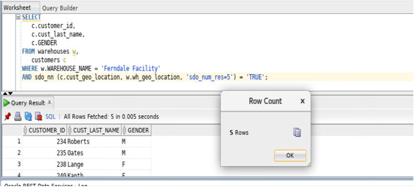
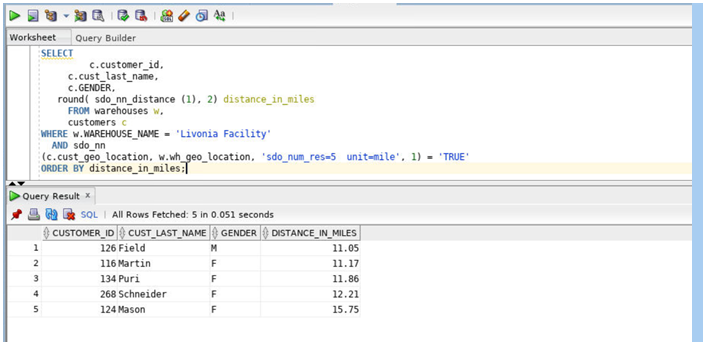
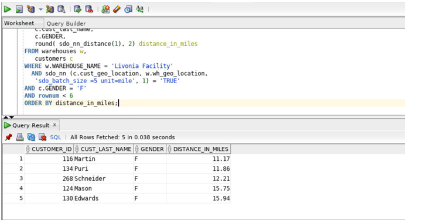
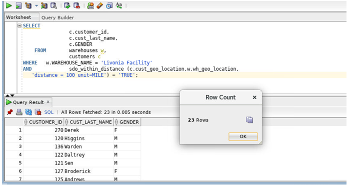
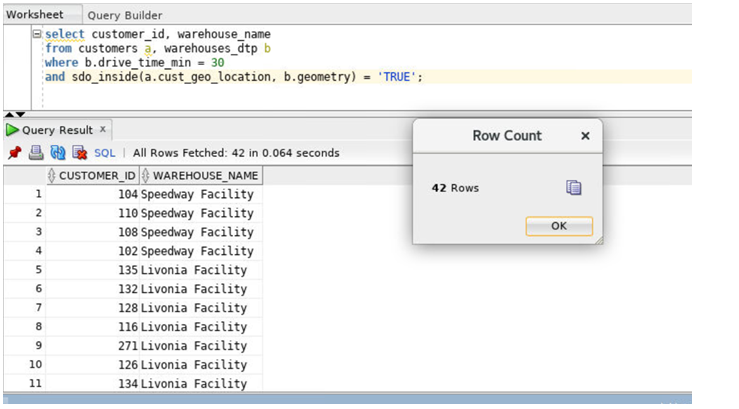

# Oracle Spatial  

## Introduction

This lab walks you through the modules performing location-based queries using Oracle Spatial.

### Before You Begin

This lab assumes you have completed the following labs:
- Lab 1:  Login to Oracle Cloud
- Lab 2:  Generate SSH Key
- Lab 3:  Create Compute instance 
- Lab 4:  Environment setup

## Task 1: Find the five customers closest to the warehouse whose warehouse name  is 'Ferndale Facility'

````
    <copy>
   SELECT
   c.customer_id,
   c.cust_last_name,
   c.GENDER
   FROM warehouses w,
   customers c
   WHERE w.WAREHOUSE_NAME = 'Ferndale Facility'
   AND sdo_nn (c.cust_geo_location, w.wh_geo_location, 'sdo_num_res=5') = 'TRUE';

</copy>
    
````


Notes:

-	The SDO\_NN operator returns the SDO_NUM\_RES value of the customers from the CUSTOMERS table who are closest to warehouse 3. The first argument to SDO\_NN (c.cust-geo-location in the example above) is the column to search. The second argument to SDO\_NN (w.wh\_geo\_location in the example above) is the location you want to find the neighbors nearest to. No assumptions should be made about the order of the returned results. For example, the first row returned is not guaranteed to be the customer closest to warehouse 3. If two or more customers are an equal distance from the warehouse, then either of the customers may be returned on subsequent calls to SDO\_NN.
- When using the SDO\_NUM\_RES parameter, no other constraints are used in the WHERE clause. SDO\_NUM\_RES takes only proximity into account. For example, if you added a criterion to the WHERE clause because you wanted the five closest female customers, and four of the five closest customers are male, the query above would return one row. This behavior is specific to the SDO-NUM-RES parameter, and its results may not be what you are looking for. You will learn how to find the five closest female customers in the discussion of query 3.

## Task 2: Find the five customers closest to warehouse named 'Livonia Facility'and put the results in order of distance

````
    <copy>
SELECT c.customer_id,c.cust_last_name,
c.GENDER,   round( sdo_nn_distance (1), 2) distance_in_miles FROM warehouses w,
customers c WHERE w.WAREHOUSE_NAME = 'Livonia Facility' AND sdo_nn (c.cust_geo_location, w.wh_geo_location, 'sdo_num_res=5  unit=mile', 1) = 'TRUE'ORDER BY distance_in_miles;
 </copy>
    
````


**Notes**:

- The SDO\_NN\_DISTANCE operator is an ancillary operator to the SDO\_NN operator; it can only be used within the SDO\_NN operator. The argument for this operator is a number that matches the number specified as the last argument of SDO_NN; in this example it is 1. There is no hidden meaning to this argument, it is simply a tag. If SDO\_NN\_DISTANCE() is specified, you can order the results by distance and guarantee that the first row returned is the closest. If the data you are querying is stored as longitude and latitude, the default unit for SDO\_NN\_DISTANCE is meters.
- The SDO_NN operator also has a UNIT parameter that determines the unit of measure returned by SDO\_NN\_DISTANCE.
- The ORDER BY DISTANCE clause ensures that the distances are returned in order, with the shortest distance first.


## Task 3: Find the five female customers closest to warehouse named 'Livonia Facility', put the results in order of distance, and give the distance in miles

````
    <copy>
SELECT c.customer_id,c.cust_last_name,c.GENDER, round( sdo_nn_distance(1), 2) distance_in_miles
FROM warehouses w,   customers c
WHERE w.WAREHOUSE_NAME = 'Livonia Facility'
AND sdo_nn (c.cust_geo_location, w.wh_geo_location,
'sdo_batch_size =5 unit=mile', 1) = 'TRUE'
AND c.GENDER = 'F'
AND rownum < 6
ORDER BY distance_in_miles;

 </copy>
    
````



**Notes:**
- SDO\_BATCH\_SIZE is a tunable parameter that may affect your query's performance. SDO\_NN internally calculates that number of distances at a time. The initial batch of rows returned may not satisfy the constraints in the WHERE clause, so the number of rows specified by SDO\_BATCH\_SIZE is continuously returned until all the constraints in the WHERE clause are satisfied. You should choose a SDO\_BATCH\_SIZE that initially returns the number of rows likely to satisfy the constraints in your WHERE clause.
-The UNIT parameter used within the SDO_NN operator specifies the unit of measure of the SDO\_NN\_DISTANCE parameter. The default unit is the unit of measure associated with the data. For longitude and latitude data, the default is meters.
- c.gender = 'F' and rownum < 6 are the additional constraints in the WHERE clause. The rownum < 6 clause is necessary to limit the number of results returned to fewer than 6.
- The ORDER BY DISTANCE\_IN\_MILES clause ensures that the distances are returned in order, with the shortest distance first and the distances measured in miles.


## Task 4: Find all the customers within 100 miles of warehouse named 'Livonia Facility'

````
    <copy>
SELECT c.customer_id, c.cust_last_name,
c.GENDER FROM warehouses w,              customers c WHERE   w.WAREHOUSE_NAME = 'Livonia Facility' AND sdo_within_distance (c.cust_geo_location,w.wh_geo_location,
'distance = 100 unit=MILE') = 'TRUE';
 </copy>
    
````




**Notes**:
- The SDO\_WITHIN\_DISTANCE operator returns the customers from the customers table that are within 100 miles of warehouse 3. The first argument to SDO\_WITHIN\_DISTANCE (c.cust\_geo\_location I n the example above) is the column to search. The second argument to SDO\_WITHIN\_DISTANCE (w.wh\_geo\_location in the example above) is the location you want to determine the distances from. No assumptions should be made about the order of the returned results. For example, the first row returned is not guaranteed to be the customer closest to warehouse 3.
- The DISTANCE parameter used within the SDO\_WITHIN\_DISTANCE operator specifies the distance value; in this example it is 100.
- The UNIT parameter used within the SDO\_WITHIN\_DISTANCE operator specifies the unit of measure of the DISTANCE parameter. The default unit is the unit of measure associated with the data. For longitude and latitude data, the default is meters; in this example, it is miles.

## Task 5: Find all the customers within 100 miles of warehouse named 'Livonia Facility', put the results in order of distance, and give the distance in miles.

````
    <copy>
SELECT    c.customer_id,   c.cust_last_name,
c.GENDER, round(sdo_geom.sdo_distance (c.cust_geo_location, w.wh_geo_location,.005, 'unit=MILE'), 2) distance_in_miles
FROM warehouses w, customers c
WHERE sdo_within_distance (c.cust_geo_location,
w.wh_geo_location,
'distance = 100 unit=MILE') = 'TRUE'
ORDER BY distance_in_miles;

 </copy>
    
````


**Notes**:
- The SDO\_GEOM.SDO\_DISTANCE function computes the exact distance between the customer's location and warehouse 3. The first argument to SDO\_GEOM.SDO\_DISTANCE (c.cust\_geo\_location in the example above) contains the customer's location whose distance from warehouse 3 is to be computed. The second argument to SDO\_WITHIN\_DISTANCE (w.wh\_geo\_location in the example above) is the location of warehouse 3, whose distance from the customer's location is to be computed.
- The third argument to SDO\_GEOM.SDO\_DISTANCE (0.005) is the tolerance value. The tolerance is a round-off error value used by Oracle Spatial. The tolerance is in meters for longitude and latitude data. In this example, the tolerance is 5 mm.
- The UNIT parameter used within the SDO\_GEOM.SDO\_DISTANCE parameter specifies the unit of measure of the distance computed by the SDO\_GEOM.SDO\_DISTANCE function. The default unit is the unit of measure associated with the data. For longitude and latitude data, the default is meters. In this example it is miles.
- The ORDER BY DISTANCE\_IN\_MILES clause ensures that the distances are returned in order, with the shortest distance first and the distances measured in miles.

## Task 6: Find all the customers customers inside 30min drive time polygons  
````
    <copy>
select customer_id, warehouse_name
from customers a, warehouses_dtp b
where b.drive_time_min = 30
and sdo_inside(a.cust_geo_location, b.geometry) = 'TRUE';

 </copy>
    
````




**Notes**: 
- Drive Time polygons are simply the areas reachable from a location within an amount of time. They are used for things like placing new stores or office locations; i.e. locate a new office so that all our employees can reach our office within a given drive time. Or locate a new store with a drive time polygon containing new target customers and not cannibalizing another store location.

## Acknowledgements

- **Authors** - Balasubramanian Ramamoorthy, Arvind Bhope
- **Contributors** - Laxmi Amarappanavar, Kanika Sharma, Venkata Bandaru, Ashish Kumar, Priya Dhuriya, Maniselvan K.
- **Team** - North America Database Specialists.
- **Last Updated By** - Kay Malcolm, Database Product Management, June 2020
- **Expiration Date** - June 2021   


      
