# Oracle XML

## Introduction
There are two main parts to this lab.
- **Connect to SQL Developer Web** - You will use SQL Developer Web, one of the tools that comes preinstalled with Autonomous Database
- **Query XML Data** - Query XML data using XQuery. XQuery is a very general and expressive language, and SQL/XML functions XMLQuery, XMLTable, XMLExists, and XMLCast combine that power of expression and computation with the strengths of SQL. You can query XMLType data, possibly decomposing the resulting XML into relational data using function XMLTable.
- **Insert and Update XML Data** - You can update XML content or replace either the entire contents of a document or only particular parts of a document. The ability to perform partial updates on XML documents is very powerful, particularly when we make small changes to large documents, as it can significantly reduce the amount of network traffic and disk input-output required to perform the update. The Oracle UPDATEXML function allows us to update XML content stored in Oracle Database.

*Estimated Lab Time:* 15 Minutes

Watch the video below for an overview of the XML lab
[](youtube:rczR5ezf1jw)

### Prerequisites
This lab assumes you have:
- A Free Tier, Paid or LiveLabs Oracle Cloud account
- You have completed:
    - Lab: Generate SSH Keys
    - Lab: Setup Compute and ADB
    - Lab: Load Data and Start Application

### About Oracle XML

XML(Extensible Markup Language) is used to store and transport data. XML data is known as self-describing or self-defining, meaning that the structure of the data is embedded with the data, thus when the data arrives there is no need to pre-build the structure to store the data; it is dynamically understood within the XML.

The basic building block of an XML document is an element, defined by tags. An element has a beginning and an ending tag. All elements in an XML document are contained in an outermost element known as the root element. XML can also support nested elements, or elements within elements. This ability allows XML to support hierarchical structures. Element names describe the content of the element, and the structure describes the relationship between the elements.

For example, XML documents can be very simple, such as the following:

 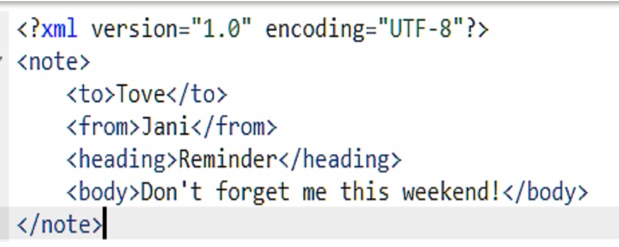

### XML with Oracle Database

Oracle XML DB is a high-performance, native XML storage and retrieval technology that is delivered as a part of all versions of Oracle Database.

Oracle XML DB also supports the SQL/XML standard, which allows SQL-centric development techniques to be used to publish XML directly from relational data stored in Oracle Database.XML is an extremely popular way to persist and exchange business critical information.

 [](youtube:lGQvxPCYR2c)

Oracle XML DB allows an organization to manage XML content in the same way that ii manages traditional relational data. This allows organizations to save costs and improve return on investment by using a single platform to manage and secure all of their mission critical data. Oracle XML DB was first released with Oracle 9iR2, and it has been enhanced in each subsequent major release of the database.

## Task 1: Connect to SQL Developer Web

In the previous section, the load script ran commands to grant the appjson user privileges and setup SQL Developer Web using Rest Services (ORDS).  See the appendix for more details on how to set up a user to connect with SQL Developer Web.

The password to all the schemas is *Oracle_4U*.

1. Enter the URL for SQL Developer or start it again from the Tools tab on your ADB window.  Do not login.
2. Replace the admin portion of the URL with *appxml*

      

3.  At the login screen, enter *appxml* and *Oracle_4U*.
    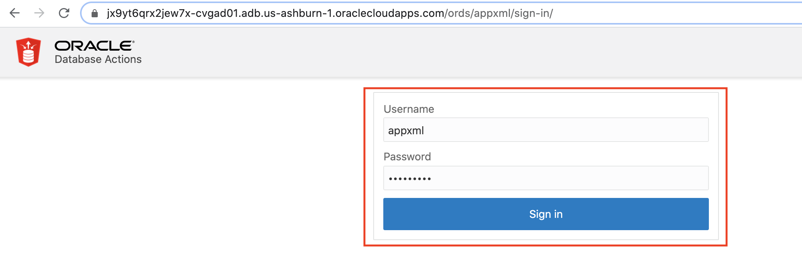 

## Task 2: XML Query

1. Execute a query to select the XML documents

    ```
    <copy>
    SELECT Count(*) FROM   purchaseorder p,  XMLTABLE('for $r in /PurchaseOrder return $r' passing object_value) t;
    </copy>
    ```

    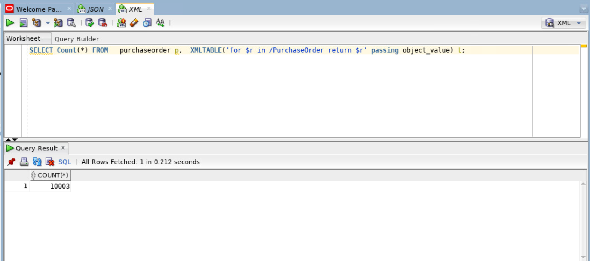

2. Retrieve the content of an XML document using the pseudocolumn OBJECT_VALUE

    ```
    <copy>
      SELECT t.object_value.getclobval()FROM   purchaseorder t
      WHERE  rownum = 1;  
    </copy>
    ```

    

3. Access the text node value

    ```
    <copy>
    SELECT xmlcast(xmlquery('$p/PurchaseOrder/Reference/text()' passing object_value AS "p" returning content) AS varchar2(30))
    FROM   purchaseorder
    WHERe ROWNUM<= 5
    /
    </copy>
    ```

    


4. Search the XML document

    ```
    <copy>
     SELECT t.object_value.getclobval() FROM   purchaseorder t   WHERE  xmlexists('/PurchaseOrder[Reference/text()=$REFERENCE]' passing    object_value, 'AHUNOLD-20141130' AS "REFERENCE" )
         /
    </copy>
    ```

    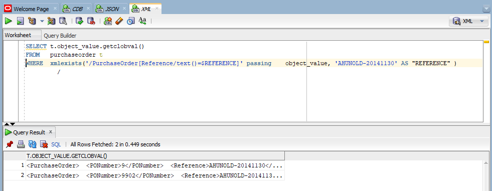

## Task 3: Insert XML records

1. Issue the query below to count the number rows we have currently and then do a insert

    ```
    <copy>
    select t.object_value.getclobval() from purchaseorder t;
     </copy>
     ```

     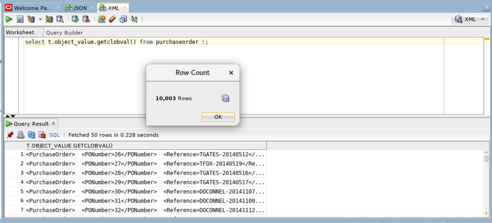


<!-- 2. Click the link to download the insert.sql script from the object store. [Objectstore](https://objectstorage.us-ashburn-1.oraclecloud.com/p/LNAcA6wNFvhkvHGPcWIbKlyGkicSOVCIgWLIu6t7W2BQfwq2NSLCsXpTL9wVzjuP/n/c4u04/b/livelabsfiles/o/developer-library/Workshop_xml_script_atp.zip) -->
2. Click the link to download the insert.sql script from the object store. [Objectstore](https://objectstorage.us-ashburn-1.oraclecloud.com/p/LNAcA6wNFvhkvHGPcWIbKlyGkicSOVCIgWLIu6t7W2BQfwq2NSLCsXpTL9wVzjuP/n/c4u04/b/livelabsfiles/o/developer-library/Workshop_xml_script_atp.zip)
    
3. Unzip the downloaded folder and paste the contents of **insert.sql** and press play to run the script. 
   
    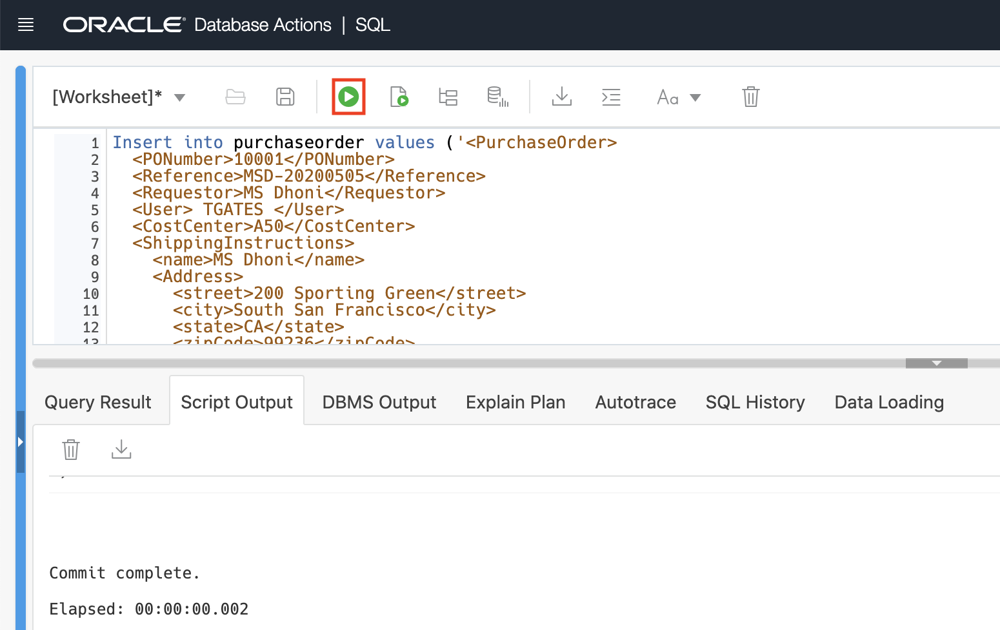

4. Verify XML record post insert

    ```
    <copy>select t.object_value.getclobval() from purchaseorder t;</copy>
    ```

    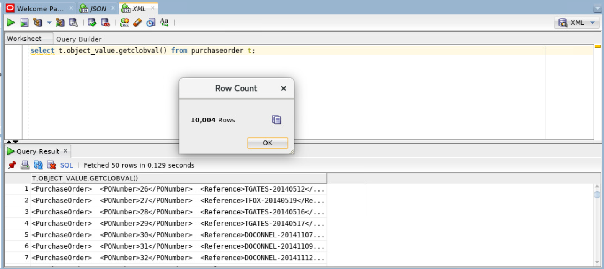

## Task 4: Update XML table

1. Click the link to download the update.sql script from the object store. [Objectstore](https://objectstorage.us-ashburn-1.oraclecloud.com/p/LNAcA6wNFvhkvHGPcWIbKlyGkicSOVCIgWLIu6t7W2BQfwq2NSLCsXpTL9wVzjuP/n/c4u04/b/livelabsfiles/o/developer-library/Workshop_xml_script_atp.zip)

2. Unzip the downloaded folder and paste the contents of **update.sql** and press play to run the script. 

    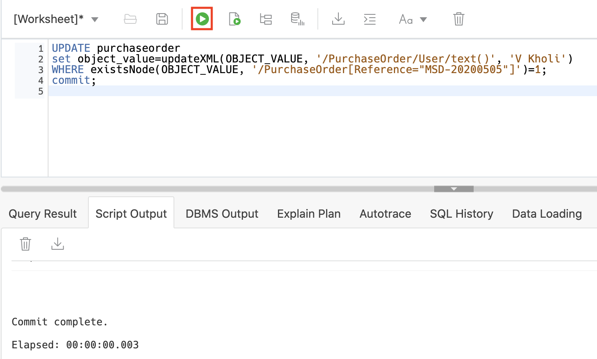

3. Below is the select query to check if user is updated.

    ```
    <copy>
    SELECT extractValue(OBJECT_VALUE, '/PurchaseOrder/User') FROM purchaseorder WHERE existsNode(OBJECT_VALUE, '/PurchaseOrder[Reference="MSD-20200505"]') =1;
    </copy>
    ```

    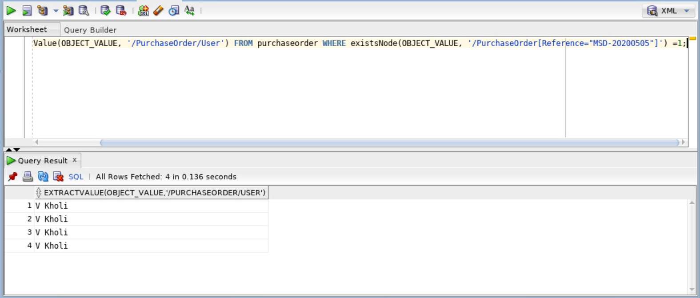

## Task 5: Sample XML Queries

1. Get the list of customers and their purchased information from a geo graphical location.  
    **XMLEXISTS** is an SQL/XML operator that you can use to query XML values in SQL, in a regular query I can use the xmlexists function to look if a specific value is present in an xmltype column.

    ```
    <copy>
      SELECT t.object_value.getclobval() FROM   purchaseorder t
      WHERE xmlexists('/PurchaseOrder/ShippingInstructions/Address[city/text()=$CITY]' passing object_value, 'South San Francisco' AS "CITY" );
    </copy>
    ```

    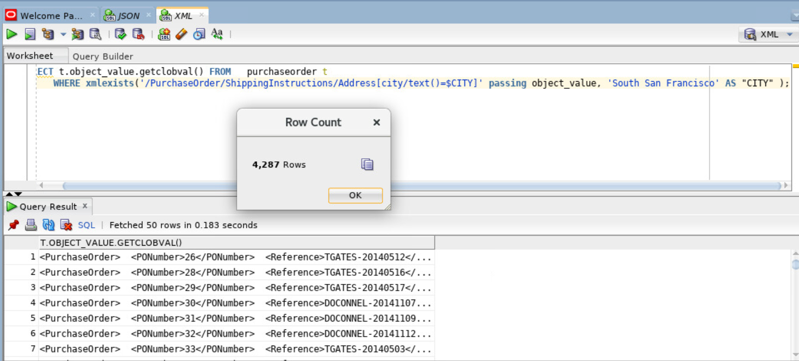

2. Customer purchase history  
    **XMLTABLE** converts XML Data into Rows and Columns using SQL. The XMLTABLE operator, which allows you to project columns on to XML data in an XMLTYPE , making it possible to query the data directly from SQL as if it were relational data.

    ```
    <copy>
      SELECT t.object_value.getclobval()
      FROM   purchaseorder p,
      XMLTABLE('for $r in /PurchaseOrder[Reference/text()=$REFERENCE] return $r' passing object_value, 'AHUNOLD-20141130' AS  "REFERENCE") t;  
    </copy>
    ```

    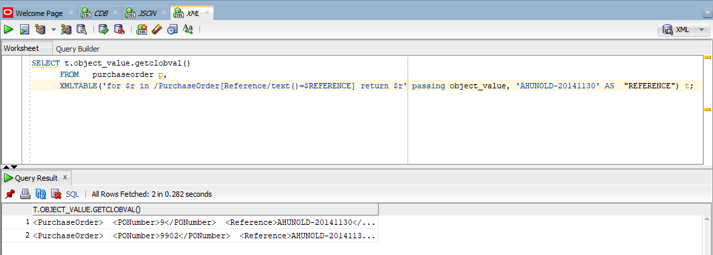

3. List the product description those unit prices matches to ‘$xx’.  
    **XMLSERIALIZE** is a SQL/XML operator that you can use to convert an XML type to a character type.

    ```
    <copy>
      SELECT XMLSERIALIZE(CONTENT COLUMN_VALUE AS CLOB INDENT SIZE=2)
      FROM  Purchaseorder p,
        XMLTable(
          '&lt;Summary&gt;
           {
            for $r in /PurchaseOrder/LineItems/Part
            return $r/Description
           }
           &lt;/Summary&gt;'
           passing object_value
        )
        WHERE xmlexists('/PurchaseOrder/LineItems/Part[UnitPrice/text()=$UnitPrice]' passing object_value, '27.95' AS "UnitPrice" );
    </copy>
    ```

    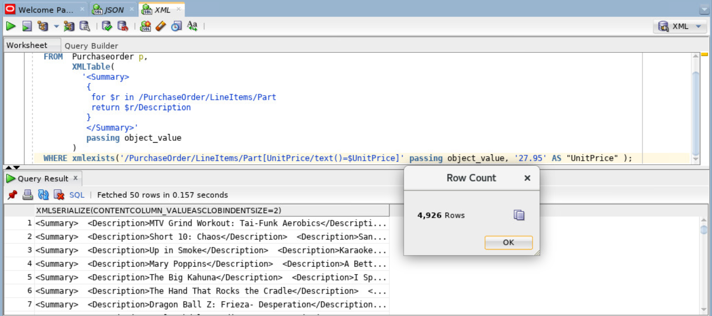

4. Customer order summary – Cost center wise.  
    **XMLQUERY** lets you query XML data in SQL statements. It takes an XQuery expression as a string literal, an optional context item, and other bind variables and returns the result of evaluating the XQuery expression using these input values. XQuery string is a complete XQuery expression, including prolog.

    ```
    <copy>
      SELECT xmlquery(
          '&lt;POSummary lineItemCount="{count($XML/PurchaseOrder/LineItems/ItemNumber)}"&gt;{
             $XML/PurchaseOrder/User,
             $XML/PurchaseOrder/Requestor,
             $XML/PurchaseOrder/LineItems/LineItem[2]
           }
           &lt;/POSummary&gt;'
          passing object_value AS "XML"
          returning content
        ).getclobval() initial_state
        FROM  PURCHASEORDER
        WHERE xmlExists(
          '$XML/PurchaseOrder[CostCenter=$CS]'
           passing object_value AS "XML",
                   'A90' AS "CS"      )
                   /
    </copy>
    ```

    

5. Next Day Air - Customer Delivery Priority Instruction for e.g Ex - Courier, Expidite, Surface Mail, Air Mail etc..  
    **ExistsNodechecks** if xpath-expression returns at least one XML element or text node. If so, `existsNode` returns 1, otherwise, it returns 0. `existsNode` should only be used in the where clause of the select statement.

    ```
    <copy>
      SELECT extractValue(OBJECT_VALUE, '/PurchaseOrder/Reference') "REFERENCE"
      FROM purchaseorder WHERE existsNode(OBJECT_VALUE, '/PurchaseOrder[Special_Instructions="Next Day Air"]')=1;
    </copy>
    ```

    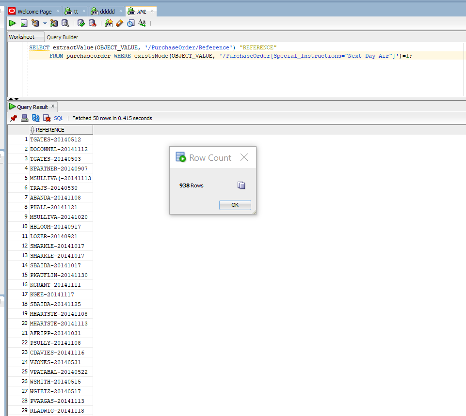

6. Priority Overnight - Customer Delivery Priority Instruction for e.g Ex - Courier, Expidite, Surface Mail, Air Mail etc..  
    **ExistsNodechecks** if xpath-expression returns at least one XML element or text node. If so, `existsNode` returns 1, otherwise, it returns 0. `existsNode` should only be used in the where clause of the select statement.

    ```
    <copy>
      SELECT extractValue(OBJECT_VALUE, '/PurchaseOrder/Reference') "REFERENCE"
    FROM purchaseorder
    WHERE existsNode(OBJECT_VALUE, '/PurchaseOrder[Special_Instructions="Priority Overnight"]')=1;
    </copy>
    ```

    

## Learn More
- [XML](https://docs.oracle.com/en/database/oracle/oracle-database/19/adxdb/index.html)

## Acknowledgements
* **Authors** - Balasubramanian Ramamoorthy, Arvind Bhope
* **Contributors** - Laxmi Amarappanavar, Kanika Sharma, Venkata Bandaru, Ashish Kumar, Priya Dhuriya, Maniselvan K, Robert Ruppel, David Start, Rene Fontcha
* **Last Updated By/Date** - Kay Malcolm, January 2021
