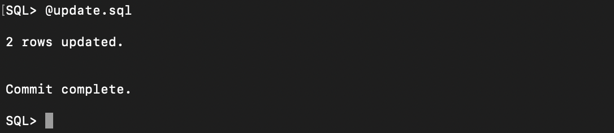
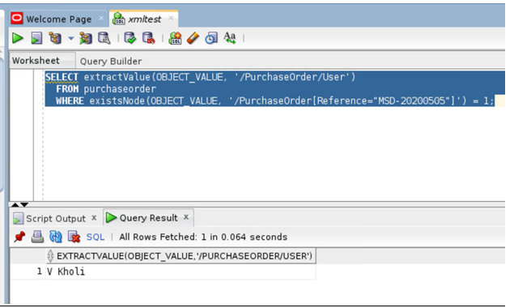

## Introduction

This lab will show you how to perform insert and update XML contents.
We can update XML content or replace either the entire contents of a document or only particular parts of a document.
The ability to perform partial updates on XML documents is very powerful, particularly when we make small changes to large documents, as it can significantly reduce the amount of network traffic and disk input-output required to perform the update.
The Oracle UPDATEXML function allows us to update XML content stored in Oracle Database.

### Before You Begin

This lab assumes you have completed the following labs:
- Lab 1:  Login to Oracle Cloud
- Lab 2:  Generate SSH Key
- Lab 3:  Create Compute instance 
- Lab 4:  Environment setup
- Note :  All scripts for this lab are stored in the /u01/workshop/xml folder and are run as the oracle user. 
  
 
## Task 1: Insert XML record.

 1. Lets take a count of the rows we have currently and then will do a insert.
   
  ````
    <copy>
    select t.object_value.getclobval() from purchaseorder t;

     </copy>
  ````

 


2. Insert XML record
    
  The insert query is available as a sql file in the directory “**/u01/workshop/xml**”.
  The script is called as **insert.sql.** You can run this connecting to the SQL prompt.

  Set your oracle environment and connect to PDB as **oracle** user.
  ````
    <copy>
    . oraenv
    </copy>
  ````
  ````
    <copy>
    ConvergedCDB
    </copy>
  ````
  ````
    <copy>
    cd /u01/workshop/xml
    </copy>
  ````
  ````
    <copy>
    sqlplus appxml/Oracle_4U@JXLPDB
    </copy>
  ````

    
  ````
    <copy>
    @insert.sql
    </copy>
  ````
  
  
3.  Verify XML record post insert
    
  ````
    <copy>
    select t.object_value.getclobval() from purchaseorder t;    
         
         </copy>
  ````
  

  
## Task 2: Update XML table
  
1. The update query is available as a sql file in the directory “**/u01/workshop/xml**”.
  The script is called as **update.sql**. You can run this connecting to the SQL prompt.

  Set your oracle environment and connect to PDB as **oracle** user.
  ````
    <copy>
    . oraenv
    </copy>
  ````

  ````
    <copy>
    ConvergedCDB
    </copy>
  ````
  ````
    <copy>
    cd /u01/workshop/xml
    </copy>
  ````
  ````
    <copy>
    sqlplus appxml/Oracle_4U@JXLPDB
    </copy>
  ````

  
  ````
    <copy>
    @update.sql
    </copy>
  ````

  

 2. Below is the select query to check if user is updated. 
     
   ````
    <copy>
    SELECT extractValue(OBJECT_VALUE, '/PurchaseOrder/User') FROM purchaseorder WHERE existsNode(OBJECT_VALUE, '/PurchaseOrder[Reference="MSD-20200505"]') =1;
    </copy>
  ````
  


## Acknowledgements

- **Authors** - Balasubramanian Ramamoorthy, Arvind Bhope
- **Contributors** - Laxmi Amarappanavar, Kanika Sharma, Venkata Bandaru, Ashish Kumar, Priya Dhuriya, Maniselvan K, Robert Ruppel.
- **Team** - North America Database Specialists.
- **Last Updated By** - Kay Malcolm, Database Product Management, June 2020
- **Expiration Date** - June 2021   


  
