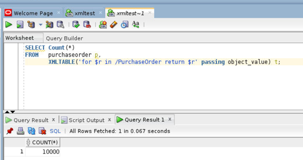
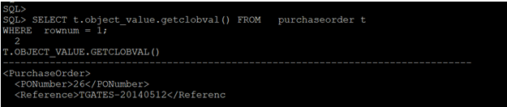
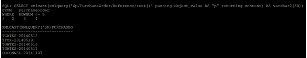

# Oracle XML 

## Introduction

 This lab walks you through different ways to query XML data. XQuery is a very general and expressive language, and SQL/XML functions XMLQuery, XMLTable, XMLExists, and XMLCast combine that power of expression and computation with the strengths of SQL.
 We can query XMLType data, possibly decomposing the resulting XML into relational data using function XMLTable.

### Before You Begin

This lab assumes you have completed the following labs:
- Lab 1:  Login to Oracle Cloud
- Lab 2:  Generate SSH Key
- Lab 3:  Create Compute instance 
- Lab 4:  Environment setup
- Note :  All scripts for this lab are stored in the /u01/workshop/xml folder and are run as the oracle user.

 
## Task 1: Getting the number of XML documents. 
   
````
  <copy>
  SELECT Count(*) FROM   purchaseorder p,  XMLTABLE('for $r in /PurchaseOrder return $r' passing object_value) t;
  </copy>
````
     
   

## Task 2: Retrieving the content of an XML document-using pseudocolumn OBJECT_VALUE
    
  ````
    <copy>
    SELECT t.object_value.getclobval()FROM   purchaseorder t
    WHERE  rownum = 1;  

 
       </copy>
 ````
  
  

## Task 3:  Accessing text node value

  ````
    <copy>
    SELECT xmlcast(xmlquery('$p/PurchaseOrder/Reference/text()' passing object_value AS "p" returning content) AS varchar2(30))
    FROM   purchaseorder
    WHERe ROWNUM<= 5
    /

    </copy>
   ````

   
   


## Task 4: Searching XML document
     
 ````
    <copy>
   SELECT t.object_value.getclobval() FROM   purchaseorder t   WHERE  xmlexists('/PurchaseOrder[Reference/text()=$REFERENCE]' passing    object_value, 'AHUNOLD-20141130' AS "REFERENCE" )
       /
       
       </copy>
  ````
  
     
    
  
  
        

## Acknowledgements

- **Authors** - Balasubramanian Ramamoorthy, Arvind Bhope
- **Contributors** - Laxmi Amarappanavar, Kanika Sharma, Venkata Bandaru, Ashish Kumar, Priya Dhuriya, Maniselvan K, Robert Ruppel.
- **Team** - North America Database Specialists.
- **Last Updated By** - Kay Malcolm, Database Product Management, June 2020
- **Expiration Date** - June 2021   


  


