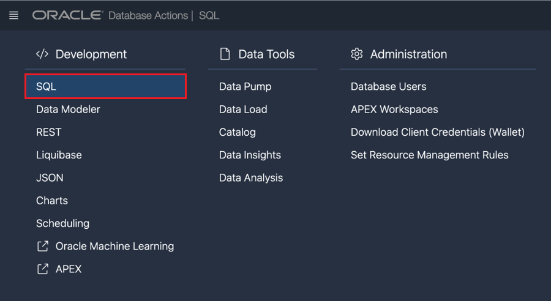
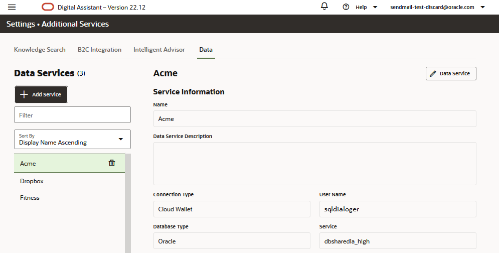

## Introduction

## Task 1: Create the Employee Database

To create the database tables, you need to execute a SQL script from your Oracle Database Cloud Service Enterprise Edition instance (workload type Oracle Autonomous Transaction Processing).

1.  Go to your Autonomous Database instance and then click **Database Actions**.

2.  Select **SQL**.

3.  Select **New File** and then select **Worksheet**.

4.  Paste [this script](https://docs.oracle.com/en/cloud/paas/digital-assistant/tutorial-sql-dialogs/files/create_employee_db.txt) into the worksheet.
5.  Click **Run Script** and then select **Run as SQL**.
6.  Click **Download Client Connections (Wallet)**.

7.  Download the cloud wallet file.
    
    **Note:**
    
    For Oracle Digital Assistant integration, a wallet password must be at least 15 characters, but no more than 64 characters. It must contain at least one uppercase character, one lowercase character, one special character, and one number. It also can't start with a digit. Remember the user name and the user password. You will need them to connect the database to Oracle Digital Assistant.
    

## Task 2: Connect Digital Assistant to the Data Service

Before you can access a data service from any SQL Skill, you need to add a data service integration that enables Oracle Digital Assistant to access the data service. You only need one integration per data service.

**Note:**

After you create the service, you can't change it. Should the password change, you'll need to delete and recreate the data service integration.

1.  Log into Oracle Digital Assistant.
2.  Click  in the top left corner to open the side menu.

4.  Expand **Settings** and then choose **Additional Services**.

5.  Open the Data tab then click **\+ Add Service** to open the New Data Service dialog.
6.  Enter the following into the Basic Info page:    
    
    **Name**
    
    Enter a unique name for the service.
    
    **Data Service Description**
    
    An optional description of the data service integration such as a description of the database or the purpose.
    
    **User Name**
    
    Ask your database administrator for the user name and password.
    
    **Password**
    
    The user password. For Oracle Digital Assistant integration, a password must be at least 14 characters but no more than 64 characters. It must contain at least one upper case character, one lowercase character and one number. It also can't start with a digit.
    

7.  Click **Continue** to skip past the End User Authentication page and navigate to the Connection Details page.
8.  Select **Basic** or **Cloud Wallet Connection** for the authentication service.

* For the Basic connections:
        
 **Host Name**
 Enter the host for the data service. Do not include the scheme (`https://`). For example, just enter `example.com`.
        
 **Port**
 The port that allows client connections to the database.
        
 **Service Name**
 Do one of the following:
        
    * Select **SID** and enter the Oracle system identifier of the database instance.
    * Select **Service Name** and enter the service name for the database.
        
    

        
* For Cloud Wallet connections:

 **Wallet File**
 Navigate to, and select, the cloud wallet file that contains the client credentials, or drag and drop it into the field.
        
 **Wallet Password**
 Enter the password that was provided when the wallet file was downloaded. For Oracle Digital Assistant integration, a wallet password must be at least 15 characters, but no more than 64 characters. It must contain at least one uppercase character, one lowercase character, one special character, and one number. It also can't start with a digit.
        
 **Service** 
 Select the name of the database service.
        
    

    

    
9.  Click **Add Service**. With the connection complete, you can import the database schema into SQL skills to create query entities, which enable users to query the database using natural language.

