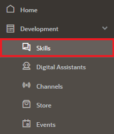
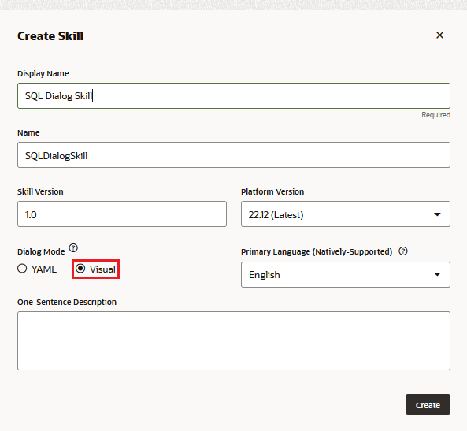
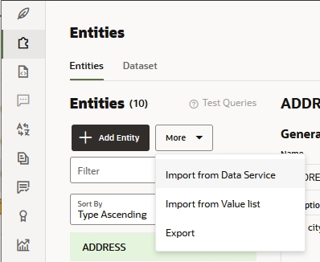
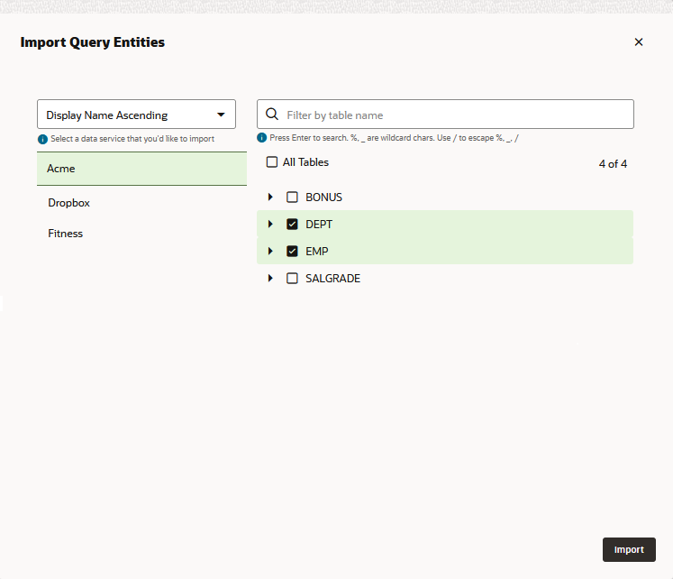
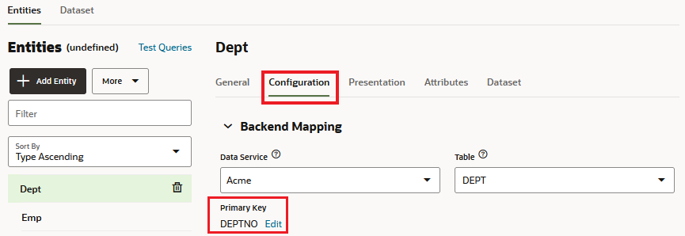
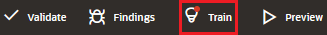
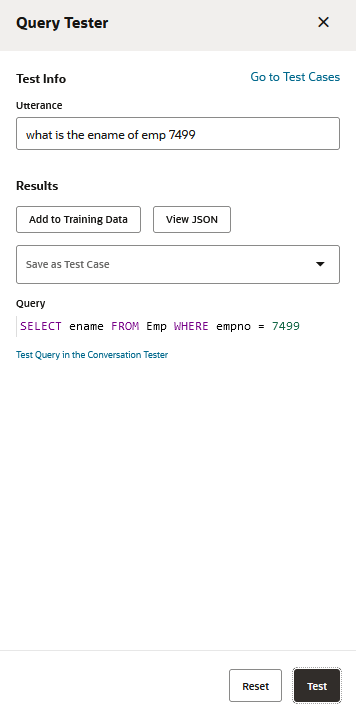
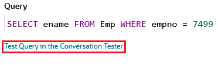
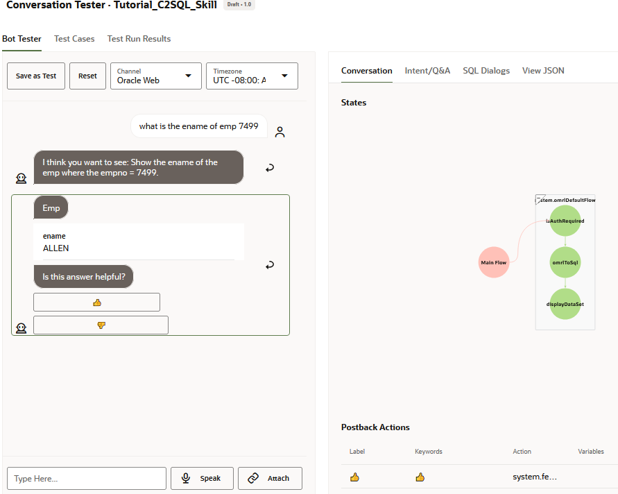

## Introduction

Create a skill with the dialog mode set to Visual (the default setting).

## Task 1: Create the SQL Dialog Skill
1.  In the left menu, click **Development**, then choose **Skills**.

2.  Click **\+ New Skill**.
4.  Hide the side menu by clicking  again.
5.  Name the skill.
6.  Ensure that **Visual** (the default setting) is selected as the Dialog Mode. You can only create SQL dialogs for skills written in visual mode.
7.  Click **Create**. You are now ready to import the database schema, which, in turn, creates query entities that model the data service.

## Task 2: Import the Database Schema

You enable data service queries in an SQL skill by creating a logical model that's based on the data service's physical model (the tables and columns). You create the base logical model by importing information about the tables from the data service. During the import, the skill adds query entities, which represent the tables, to the logical model.

When you train your skill, it uses the information from the query entities to build a model for the natural language parser, which enables the skill to translate user utterances into OMRQL (Oracle Meaning Representation Query Language). OMRQL is a query language that's like SQL but is based on object models, which, in this case, are the query entities.

To create query entities for the desired tables in your data service:

1.  Click **Entities**  in the left navbar.
2.  Click **More**, then select **Import from Data Service**.

3.  Select the data service that you created, and then select the `EMP` and `DEPT` tables.

4.   Click **Import**. The skill adds EMP and DEPT query entities for the selected tables.
5.   Open the Configuration tab and then select both entities to verify that primary keys were set.

6.  (Optional) For each query entity, set the default order on the General tab, and set the default and minimum attributes on the Configuration tab.
7.   Test the queries:
     Click **Train** and then select **Trainer Tm**.
    *   After training completes, click **Test Queries** to open the Query Tester.
    *   Try out utterances, such as "show all emp", "how many emp are there", "show all dept", and "what is the ename of emp 7499" to review the OMRQL query generated by the skill.
    
    
    

    
9.   Click **Test Query in the Conversation Tester**.
  
Review the data returned by the query.  

