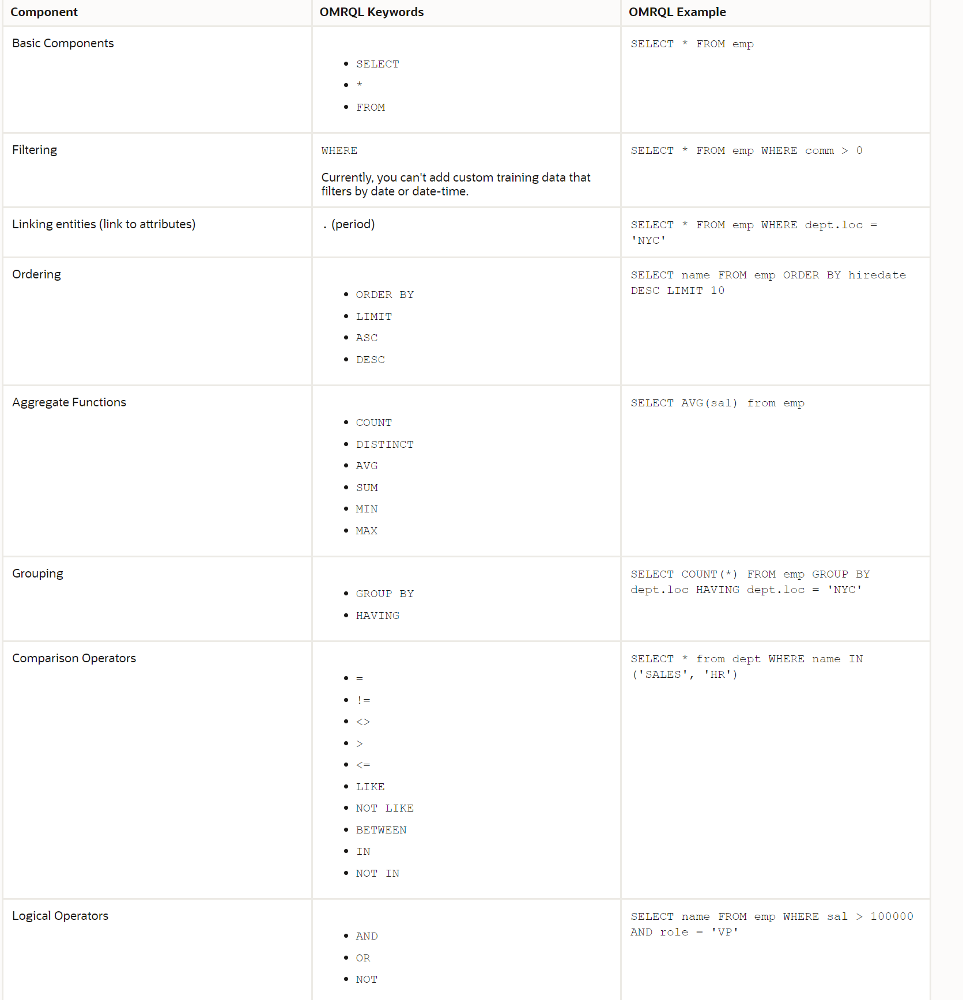

## Introduction
There may be natural language utterances that the skill can't translate to OMRQL. It might be a misinterpretation, or perhaps the model can't handle the domain-specific synonyms that don't seem to be closely related to the primary name. Another example is when the model is not able to distinguish between two similar entities. When this happens, you can use the query entity dataset to teach the skill how to correctly parse the utterance.

For any of these scenarios, we recommend that you start with 20 utterances and add more as needed. Because too many examples might cause the model to over predict attributes and operators, you should focus on a smaller set of diverse utterances rather than a large set of similar, lesser quality ones.

## Optional Step: Train with Custom Data

To add custom data from the Dataset tab:

1.  On the Entities page, click the Dataset tab, and click the Query Entities tab.

3.  Open the Training Data tab.
5.  Click **Add Utterance** to open the Create Utterance dialog.
4.  Enter the utterance and then click **Continue**.

5.  Review the generated OMRQL query. For example, try the following utterances:
    *   show the average commission that a salesperson earns
    *   For employees who have the salesperson job, what is the average commission
    *   tell me what the average commission is for a person in the salesperson role
    *   what is the average commission of people with the role of salesman
    *   what's the avg salesperson's commission
    *   Which employee has the highest salary?
    *   Show employee name and department name ordered by the salary in ascending orderIf the query isn't correct, of if a query couldn't be determined, provide the correct query. Refer to the OMRQL Keyword Reference.

6.  Click **Done** to add the utterance to the dataset.
7.  When you're done, retrain the skill and then try these queries -- along with similar ones -- in the Query Tester or the Conversation Tester.

### OMRQL Keyword Reference

Here are the OMRQL keywords that you can use when you define OMRQL queries for the utterances for the data query entities dataset.

**Note:**

You can use the canonical names from the database schema. You cannot use primary names and synonyms.

With the exception of linking entities, the OMRQL components are similar to SQL. Instead of an SQL JOIN, you use a pair of link attributes to link one entity to another. Attribute links have primary names and synonyms that define the relationship between the entities. For example an employee/department attribute link with a one-to-one relationship can have a primary name, `department`, and synonyms `works in`, `belongs to`, and `team`. A department/employees attribute link with a one-to-many relationship can have a primary name `employees` and synonyms `members`, and `workers`.

Besides the typical primary key/foreign key link attributes, you also can have these types of link attributes:

*   Multiple link attributes from one entity to another that define multiple semantic relationships.
*   A link attribute from an entity to itself that implies a self join.

Here are some examples of how to write OMRQL for your utterances:

Learn More
----------

*   [Using Oracle Digital Assistant](https://docs.oracle.com/en/cloud/paas/digital-assistant/use-chatbot/sql-dialog-skills.html#GUID-F55056E1-A618-451D-B7C3-79012EDF61DC)
*   [Using Oracle Database Actions for Oracle Cloud](https://docs.oracle.com/en/database/oracle/sql-developer-web/sdwad/index.html)

* * *