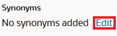
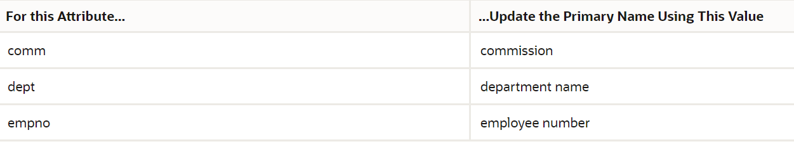
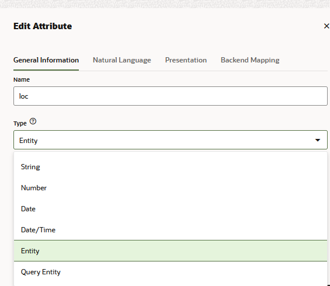

## Introduction

## Task 1: Add Natural Language Names and Synonyms for the Query Entities

In this step, you're going to help the skill associate natural language names with the underlying data structure (the physical model) by identifying common names for each query entity and by identifying other ways (synonyms) that people may refer to the query entities.

1.  Select the Emp entity.
2.  Open the Configuration tab. If needed, expand **Natural Language**.
3.  In the Primary Name field, change the value to employee.

4.  Select the Dept entity.
5.  Enter department in the Primary Name field.
6.  Click **Edit** (located beneath Synonyms).  
    
7.  For the Dept Query entity, enter the following synonyms:
    
    *   division
    *   organization
    *   org
    
   **Note:**
    
    Click Enter after each entry.
    
8.  To save your changes and close the editor, click .

## Task 2: Add Natural Language Names and Synonyms for the Attributes

In this step, you're going to identify the commonly used names for each attribute.

To add natural language names and synonyms:

1.  Select the Dept query entity.
2.  Open the Attributes tab.

3.  Select the deptno attribute.
4.  Click **Edit**  to open the Edit Attribute dialog.
5.  Open the Natural Language tab.

6.  Enter department in the Primary Name field.
7.  Click **Apply**.
8.  Repeat these steps to complete the primary name values for the remaining Dept query entity attributes and to add new primary names Emp query entity attributes.
    *   For the Dept query entity, update the primary values as follows:
        
        
    *   For the Emp query entity attributes, update the primary values as follows:
        
        
        

## Task 3: Associate Attributes with Value Lists

To improve accuracy, you can create value lists that contain sample values from the data service. The skill automatically associates these lists with their respective attributes, which helps the natural language parser understand the kinds of values those attributes can hold.

To create a value list entity from an attribute:

1.  Select the DEPT query entity.
2.  Open the Attributes tab.
3.  Select the loc attribute and then click **Edit**  to open the Edit Attribute dialog.

4.  Open the General Information tab.
5.  Select **Entity** from the Type menu to change the attribute's type.

6.  Click the **If the desired entity doesn't exist, you can generate a value-list entity based on the backend mapping by clicking here** link to create a value list entity based on the values found in the data service's schema.  
      
    After a few seconds, a new value list is created named `<query entity_name>_<attribute_name>` and is automatically selected in the Referenced Entity field. For the loc attribute, the value is dept\_loc.

7.  Click **Apply**.
8.  Repeat these steps to create value list entities for the dname attribute. The value list entities generated for the attributes display in the entities list.

## Task 4: Add Synonyms to the Value Lists

In this step, you'll add synonyms to the value list entities so that users can refer to the values in different ways.

1.  Select the dept\_loc value list entity from the entities list.

2.  In the Value (Primary Language) section, select BOSTON, then click **Edit**  to open the Edit Value dialog.

3.  Enter mass in the Synonyms field and then click Enter. Then enter massachusetts and click Enter.

4.  Click **Update**.
5.  Repeat these steps to add synonyms to the CHICAGO, DALLAS, and NEW YORK values.
        
    
  
    