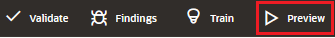
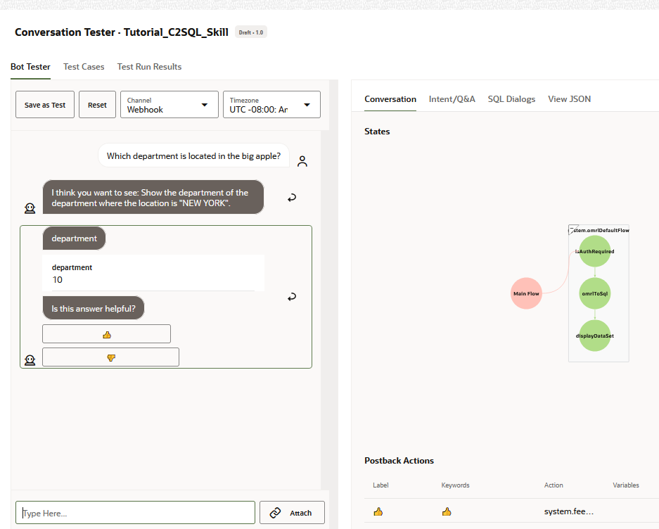
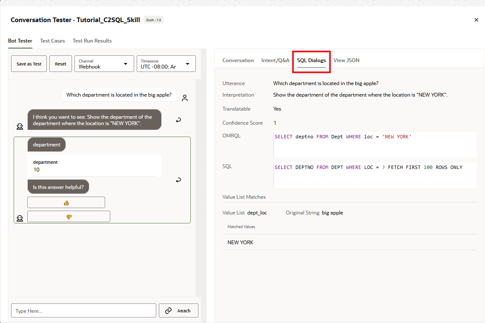

## Introduction

## Task 1: Test Queries Using the Primary Names, Synonyms, and Value List Values

After you add the primary names, synonyms, and value lists, re-train the skill, and then click Preview and test how these help users make queries using a more natural language. Here are some example queries you can try in the tester:

1.  Click **Train** and then select **Trainer Tm**.
3.  After training completes, click **Preview** to open conversation tester.

2.  Enter the following queries into the tester. Click **Reset** after each conversation.

*   List the organizations
*   How many orgs are there?
*   How many divisions are there?
*   Show me department 10
*   Which department is located in the big apple?
*   How many orgs are there in Texas?
*   How many employees work in the big apple?

Notice that on the SQL Dialogs tab, you can see the generated OMRQL and SQL for the utterance.

3.  Close the Conversation Tester.