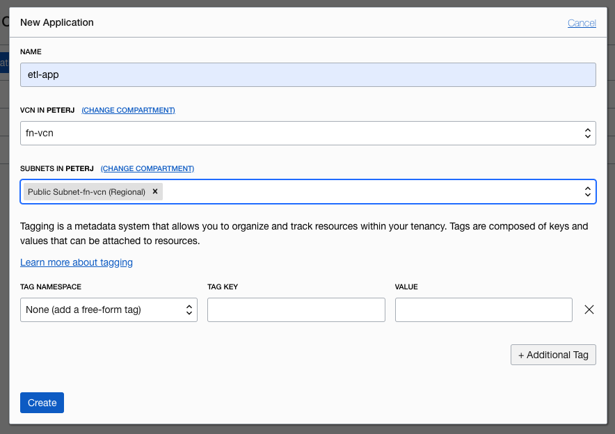
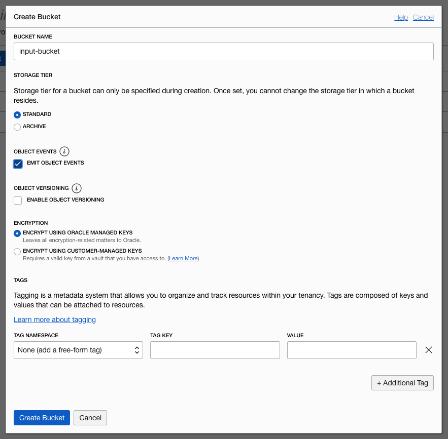
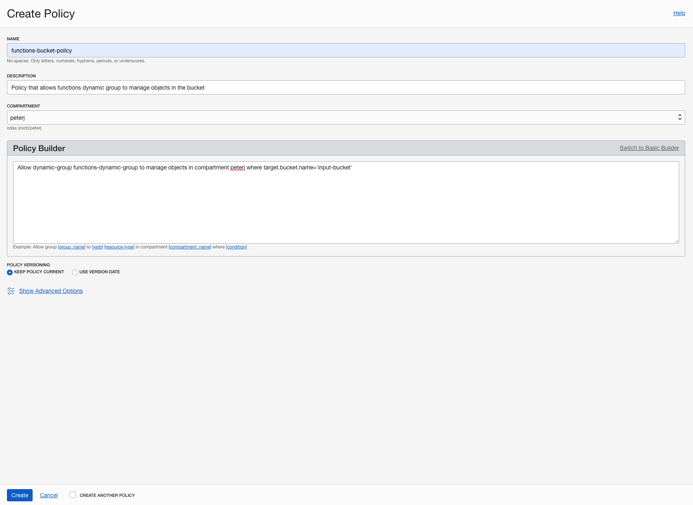
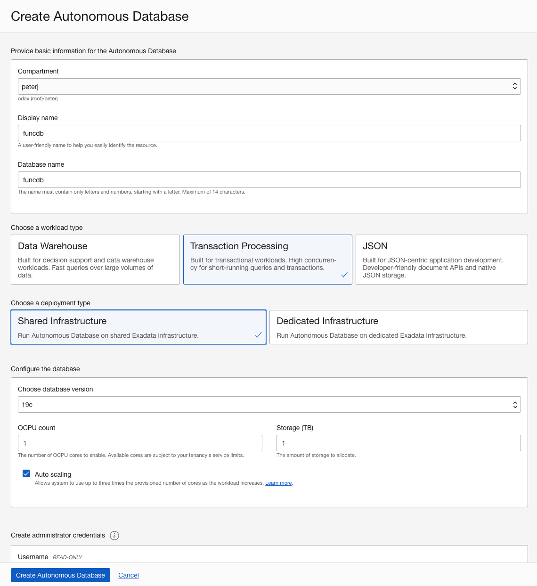
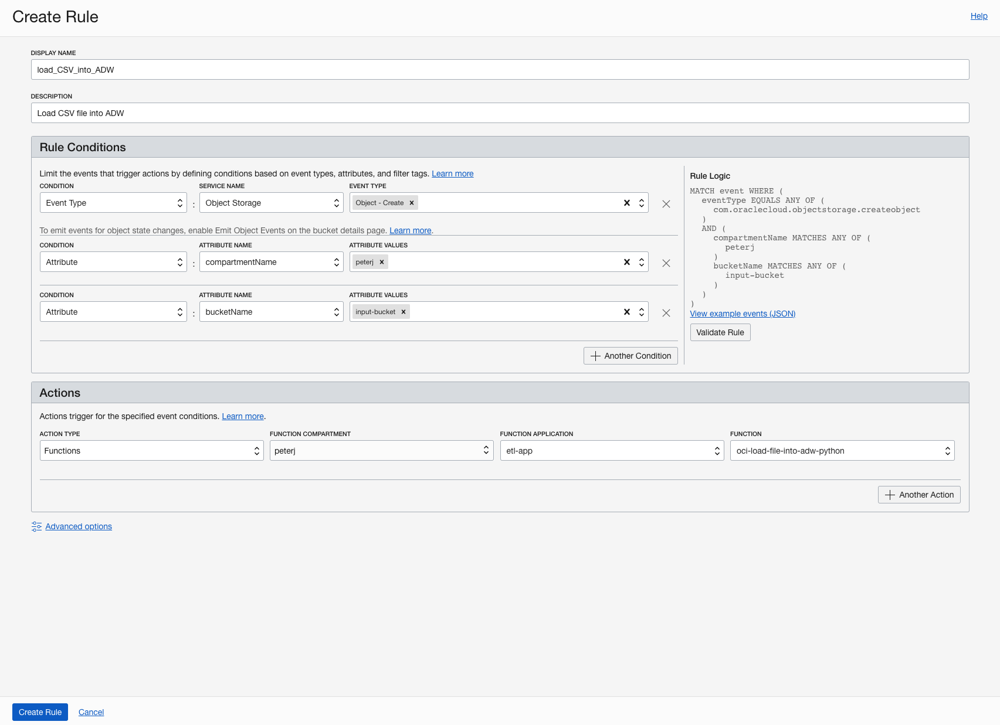

# Functions

## Introduction

In this lab you will create an Object Storage Buckets, Oracle Function, Autonomous Database and trigger the function whenever a file is uploaded to the Object Storage. The function will take the file and write it to the database.

Estimated time: 30 minutes

### Objectives

- Create an application.
- Create a Dynamic Group.
- Create Object Storage Bucket.
- Create an Autonomous Data Warehouse Database.
- Deploy a Function.
- Create an Event rule.
- Test the created Function

### Prerequisites

- Your Oracle Cloud Trial Account
- Completed the **Prerequisites for Functions**

## Task 1: Create an application

In this step, you will create an application and set up Fn CLI on Cloud Shell.

1. Under Solutions and Platform, select **Developer Services** and click **Functions**.
2. Select your development compartment from the **Compartment** list.
3. Click **Create Application**.
4. For name, enter `etl-app`.
5. Select the VNC you created earlier (e.g. `fn-vcn`).
6. Select the public subnet.
7. Click **Create**.
8. Click on the created application to open the application details. 
9. Click the **Getting Started** link and follow the **Begin your Cloud Shell session** and **Setup fn CLI on Cloud Shell** sections in the **Cloud Shell Setup**.



This involves launching Cloud Shell, updating the Fn context, generating an auth token for the registry, and logging into the Oracle Cloud Infrastructure Registry.

## Task 2: Create a Dynamic Group

To use other OCI Services, your function must be part of a **dynamic group**. For information on creating dynamic groups, refer to the [documentation](https://docs.cloud.oracle.com/iaas/Content/Identity/Tasks/managingdynamicgroups.htm#To).

Before you create a dynamic group, you need to get your development compartment OCID. You will use the compartment OCID in the dynamic group matching rule.

1. Open the navigation menu, select **Identity**, and then **Compartments**.
2. Find your development compartment from the list, hover over the cell in the OCID column and click **Copy**, to copy the compartment OCID to your clipboard.
3. Store the compartment OCID as you will use it soon.

Now you're ready to create a dynamic group.

1. To create a dynamic group, open the navigation menu, select **Identity**, and then **Dynamic Groups**.
2. Click **Create Dynamic Group**.
3. For name, enter `functions-dynamic-group`.
4. For description, enter `Group with all functions in a compartment`.
3. To select the functions that belong to the dynamic group, [write matching rules](https://docs.cloud.oracle.com/en-us/iaas/Content/Identity/Tasks/managingdynamicgroups.htm#Writing). Write the following matching rule that includes all functions within a compartment you created your application in:

    ```
    <copy>
    All {resource.type = 'fnfunc', resource.compartment.id = 'ocid1.compartment.oc1..example'}
    </copy>
    ```

  *Note:* Make sure you replace the above value with the compartment OCID you stored earlier.

## Task 3: Create Object Storage Bucket

You need a `input-bucket` bucket in Object Storage. You will use the `input-bucket` to drop-in the CSV files. The function will process the file and import them into Autonomous Datawarehouse.

Let's create the `input-bucket` first:

1. Open the navigation menu, select **Object Storage**, and then select **Object Storage**.
2. Select your development compartment from the **Compartment** list.
3. Click the **Create Bucket**.
4. Name the bucket **input-bucket**.
5. Select the **Standard** storage tier.
6. Check the **Emit Object Events** check box.
7. Click **Create Bucket**.



## Task 4: Create IAM policies

Create a new policy that allows the dynamic group (`functions-dynamic-group`) to manage objects in the bucket.

1. Open the navigation menu, select **Identity**, and then select **Policies**.
2. Click **Create Policy**.
3. For name, enter `functions-buckets-policy`.
4. For description, enter `Policy that allows functions dynamic group to manage objects in the bucket`.
5. Click the **Customize (Advanced)** link and paste the policy statements into the Policy Builder field: 

    ```
    <copy>
    Allow dynamic-group functions-dynamic-group to manage objects in compartment [compartment-name] where target.bucket.name='input-bucket'
    </copy>
    ```

    Note: replace the `compartment-name` with the name of your development compartment (the one where you created the VCN and Function Application).

6. Click **Create**.



## Task 5: Create an Autonomous Data Warehouse

The function accesses the Autonomous Database using SODA (Simple Oracle Document Access) for simplicity. You can use the other type of access by modifying the function.

1. Open the navigation menu, select **Autonomous Data Warehouse**.
2. Click **Create Autonomous Database**.
3. From the list, select your development compartment.
4. For display name and database name, enter `funcdb`.
5. For the workload type, select **Transaction Processing**.
6. For deployment type, select **Shared Infrastructure**.
7. Enter the admin password.
8. Click **Create Autonomous Database**.



Wait for OCI to provision the Autonomous Database, and then click the **Service Console** button.

1. Click **Development** from the sidebar.
2. Under RESTful Services and SODA, click **Copy URL**.
3. From your terminal (or Cloud Shell), create the collection called `regionsnumbers` by running the command below. Make sure you replace the `<ORDS_BASE_URL>` with the value you copied in the previous step, and `<DB-PASSWORD>` with the admin password you set when you created the Autonomous Database.

    ```
    <copy>
    export ORDS_BASE_URL=<ORDS_BASE_URL>
    curl -X PUT -u 'ADMIN:<DB-PASSWORD>' -H "Content-Type: application/json" $ORDS_BASE_URL/admin/soda/latest/regionsnumbers
    </copy>
    ```

4. To double check collection was created, you can list all collections. The output should look similar as below:

    ```bash
    $ curl -u 'ADMIN:<DB-password>' -H "Content-Type: application/json" $ORDS_BASE_URL/admin/soda/latest/

    {"items":[{"name":"regionsnumbers","properties":{"schemaName":"ADMIN","tableName":"REGIONSNUMBERS","keyColumn":{"name":"ID","sqlType":"VARCHAR2","maxLength":255,"assignmentMethod":"UUID"},"contentColumn":{"name":"JSON_DOCUMENT","sqlType":"BLOB","jsonFormat":"OSON"},"versionColumn":{"name":"VERSION","type":"String","method":"UUID"},"lastModifiedColumn":{"name":"LAST_MODIFIED"},"creationTimeColumn":{"name":"CREATED_ON"},"readOnly":false},"links":[{"rel":"canonical","href":"https://.../ords/admin/soda/latest/regionsnumbers"}]}],"hasMore":false}
    ```

## Task 6: Deploy the function

In this step, you will clone the functions source code repository and use the `fn deploy` command to build the Docker image, push the image to OCIR, and deploy the function to Oracle Functions in your application.

1. From the Console UI, open the Cloud Shell.
2. Clone the Functions source code repository:

    ```
    <copy>
    git clone https://github.com/oracle/oracle-functions-samples.git
    </copy>
    ```

3. Go to the `samples/oci-load-file-into-adw-python` folder:

    ```
    <copy>
    cd oracle-functions-samples/samples/oci-load-file-into-adw-python
    </copy>
    ```

4. Deploy the function to the `etl-app`:

    ```
    <copy>
    fn -v deploy --app etl-app
    </copy>
    ```

After you deploy the function, you need to set function configuration values so the function knows how to connect to the Autonomous Database.

5. Using the Fn CLI, set the following configuration values. Make sure you replace the `[ORDS_BASE_URL]` and `[DB_PASSWORD]` with your values:

    ```
    <copy>
    fn config function etl-app oci-load-file-into-adw-python ords-base-url [ORDS_BASE_URL]
    fn config function etl-app oci-load-file-into-adw-python db-schema admin
    fn config function etl-app oci-load-file-into-adw-python db-user admin
    fn config function etl-app oci-load-file-into-adw-python dbpwd-cipher [DB-PASSWORD]
    fn config function etl-app oci-load-file-into-adw-python input-bucket input-bucket
    fn config function etl-app oci-load-file-into-adw-python processed-bucket processed-bucket
    </copy>
    ```

## Task 7: Create an Event rule

In this step, you will configure a Cloud Event to trigger the function when you drop the files into the `input-bucket`.

1. From Console UI, open navigation and select **Application Integration** and click **Events Service**.
2. Select your development compartment from the **Compartment** list.
3. Click **Create Rule**.
4. For display name, enter `load_CSV_into_ADW`.
5. For description, enter `Load CSV file into ADW`.
6. Create three rules. You can click **Another Condition** to add more conditions:

    | Condition | Service/Attribute Name | Event Type/Attribute Values |
    | --- | --- | --- |
    | Event Type | Object Storage | Object - Create | 
    | Attribute | compartmentName | <YOUR_DEVELOPMENT_COMPARTMENT> |
    | Attribute | bucketName | input-bucket |

7. Under Actions, select **Functions**:
    - For function compartment, select your development compartment.
    - For function application, select `etl-app`.
    - For function, select `oci-load-file-into-adw-python`.

8. Click **Create Rule**.



## Task 8: Test the function

To test the function, you can upload a `.csv` file to the `input-bucket`. You can do that from the Console UI or the Cloud Shell using the OCI CLI.

1. Open the Cloud Shell.
2. Go to the functions folder:

    ```
    <copy>
    cd ~/oracle-functions-samples/samples/oci-load-file-into-adw-python
    </copy>
    ```

3. Use the OCI CLI to upload `file1.csv` to the `input-bucket`:

    ```bash
    $ oci os object put  --bucket-name input-bucket --file file1.csv
    Uploading object  [####################################]  100%
    {
      "etag": "607fd72d-a041-484c-9ee0-93b9f5488084",
      "last-modified": "Tue, 20 Oct 2020 18:03:50 GMT",
      "opc-content-md5": "O8mZv0X2gLagQGT5CutWsQ=="
    }
    ```


To see the data in the database, follow these steps:

1. From the OCI console, navigate to **Autonomous Data Warehouse**.
2. Select your development compartment from the **Compartment** list.
3. Select **Transaction Processing** from the **Workload Type** list.
4. Click on the database name (`funcdb`).
5. Click the **Service Console**.
6. Click **Development** link from the side bar.
7. Click **SQL Developer Web**.
8. Use **ADMIN** and the admin password to authenticate.
9. In the worksheet, enter the following query:

    ```
    <copy>
    select UTL_RAW.CAST_TO_VARCHAR2( DBMS_LOB.SUBSTR( JSON_DOCUMENT, 4000, 1 )) AS json from regionsnumbers
    </copy>
    ```

10. Click the green play button to execute the query.

11. The data from the CSV file is in the **Query Result** tab.

This concludes this lab.

## Acknowledgements

- **Author** - Greg Verstraeten
- **Contributors** -  Peter Jausovec, Prasenjit Sarkar, Adao Junior
- **Last Updated By/Date** - Adao Junior, October 2020

