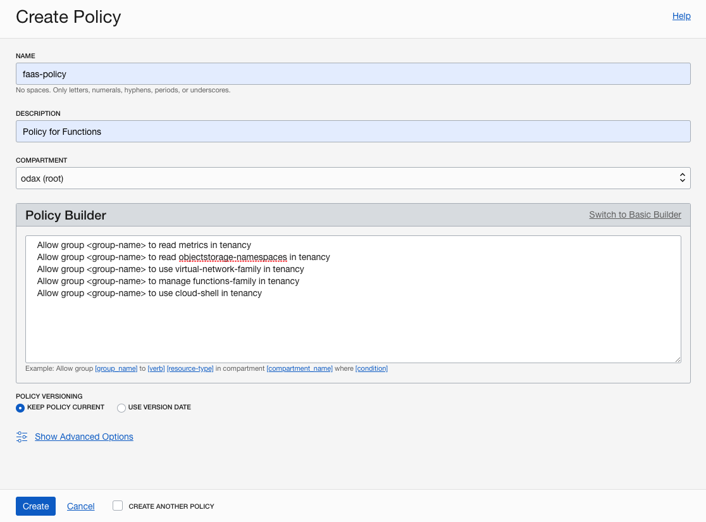

# Prerequisites for Functions

## Introduction

The following steps represents the prerequisites for the Functions Lab.

Estimated time: 10 minutes

### Objectives

- Log into OCI Tenancy.
- Create a compartment if not done yet.
- Create a VCN if not done yet.
- Create the policies to use Oracle Functions and to allow Functions to use OCI resources.

### Prerequisites

- Your Oracle Cloud Trial Account

## Task 1: Create compartment

If you want to use an existing compartment, skip to the next step. Otherwise, click **Compartments** and then **Create Compartment**, to create a new compartment.

## Task 2: Create VCN and subnets

If a suitable VCN in which to create network resources doesn't exist already, log in to the Console as a tenancy administrator and under Core Infrastructure, go to **Networking** and then:

1. Click **Virtual Cloud Networks** and choose a compartment from the previous step.
1. Click **Start VCN Wizard**, then **VCN with Internet Connectivity**, then **Start VCN Wizard**.
1. Enter a name for the new VCN (for example: `fn-vcn`), click **Next**, and then click **Create** to create the VCN along with the related network resources.

## Task 3: Create policy for Oracle Functions

Log in to the Console as a **tenancy administrator** and under Governance and Administration, go to **Identity** and click **Policies** and then do the following:

1. Select the tenancy's **root compartment**
1. Click **Create Policy**.
1. For name, enter `faas-policy`.
1. For description, enter `Policy for Functions`.
1. Click on **Customize (Advanced)** link and paste the policy statements into the Policy Builder field:

  ```
  <copy>
  Allow group <group-name> to read metrics in tenancy
  Allow group <group-name> to read objectstorage-namespaces in tenancy
  Allow group <group-name> to use virtual-network-family in tenancy
  Allow group <group-name> to manage functions-family in tenancy
  Allow group <group-name> to use cloud-shell in tenancy
  </copy>
  ```

1. Click **Create**.



Make sure the user is part of the group referenced in the policy statements above. To create groups and add users to groups, refer to [Create a group](https://docs.cloud.oracle.com/en-us/iaas/Content/Identity/Tasks/managinggroups.htm#To).

You may now [proceed to the next lab](#next).

## Acknowledgements

- **Author** - Greg Verstraeten
- **Contributors** -  Peter Jausovec, Prasenjit Sarkar, Adao Junior
- **Last Updated By/Date** - Adao Junior, October 2020

