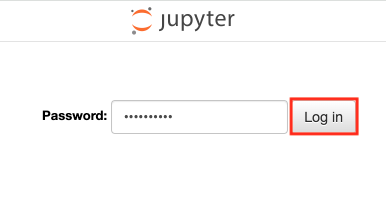
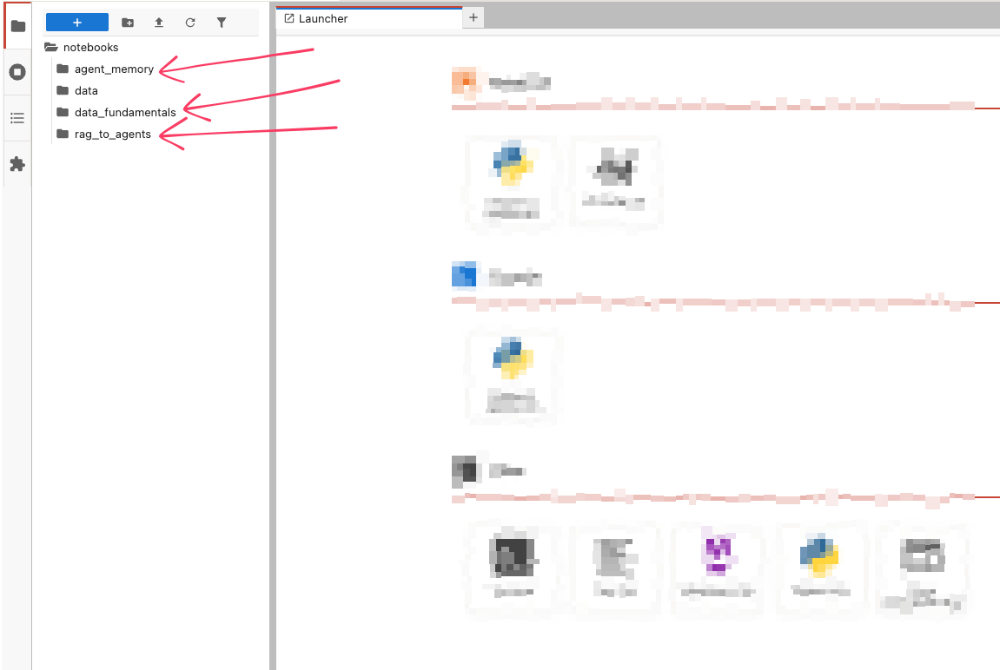
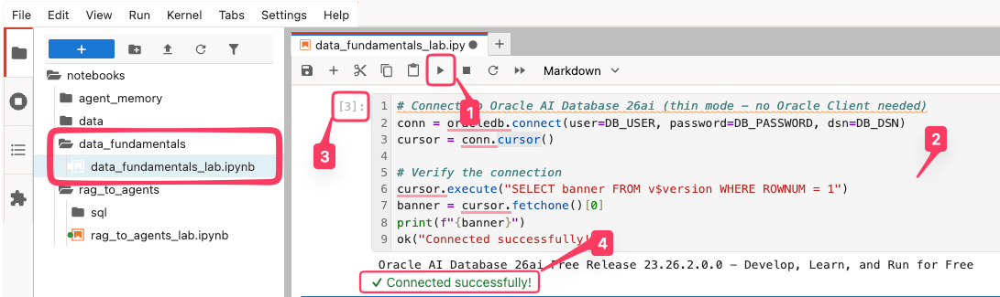

# Connect to the Development Environment

## Introduction

In this lab, you'll learn how to access the web-based JupyterLab development environment, where you can write and run Python code directly in your browser. You'll log in, and get ready to start coding in a hands-on environment.

Estimated Time: 5 minutes

### Objectives

* Login to JupyterLab server
* Run Jupyter Notebook

## Task 1: Login to JupyterLab Server

1. To navigate to the development environment, click **View Login Info**. Copy the Development IDE Login Password. Click the Start Development IDE link.

    

2. Paste in the Development IDE Login Password that you copied in the previous step. Click **Login**.

    

1. Select **`notebooks/data_fundamentals`** directory to open it.  Double click on file **`data_fundamentals_lab.ipynb`** and it will open in the the panel on the right.

    

## Task 2: Learn to use the components of Unified Model Theory (UMT)

You will use a Jupyter Notebook in a JupyterLab server to build and test database queries. If you are new to notebooks, the following tips will help you get started and work smoothly.

1. **Executing Code Blocks**: You can run code in two simple ways: press **Shift+Enter** to execute and move to the next cell, or click the **Play/Execute** button in the menu bar at the top of this tab. Both methods work interchangeably.

2. **Block Types**: Instructions and code are separated into **their own blocks**. Instructions are in markdown (like this cell), while code is in executable Python blocks. If you accidentally run an instruction block, it’ll just skip to the next cell—no harm done!

3. **Running Indicators**: When you run a code block, its label changes from `[ ]` (empty) or `[1]` (a number) to `[*]`. The asterisk (`*`) means it’s processing. Wait until it switches back to a number (e.g., `[2]`) before moving on, ensuring the operation is complete.

4. **Output & Warnings**: Below each code cell, output appears during and after execution. This can include results, visualizations, or messages. Warnings may show up—these are usually informational, such as notices about deprecated features. Unless an error halts execution, users can continue without making changes. If you see a error, review the code for any issues and make changes accordingly and try executing the cell again. 

    **NOTE:** Look for **green text** as in the image below where it says "Connected successfully!". Many cells will have different message, but the final successful one should always be green. When you see the green text, the cell completed. For some longer running cells, this is important to watch for.

    

## Task 3: Hybrid Vector Search lab section. **(Optional)** 

In the lab, there is a section that is hidden by default. If there is extra time, you are welcome to unhide it and complete this section about Hybrid AI search (vector search) where you see how Oracle's Hybrid Vector Search combines traditional lexical search with vector search.

In this task, you can weight each search type differently depending on the application needs and see the output depending on the settings.

## Conclusion

In this lab you logged into the **IDE Development Environment** for Jupyter Labs. You launched the **`data_fundamentals_lab.ipynb`** notebook and worked through the notebook to learn about the fundamental data building blocks for AI application development.

Make sure you take the quiz by clicking on **Take the quiz!** link on the left nav bar.

## Acknowledgements
* **Authors** - Kirk Kirkconnell
* **Last Updated By/Date** - Kirk Kirkconnell, June 2026
