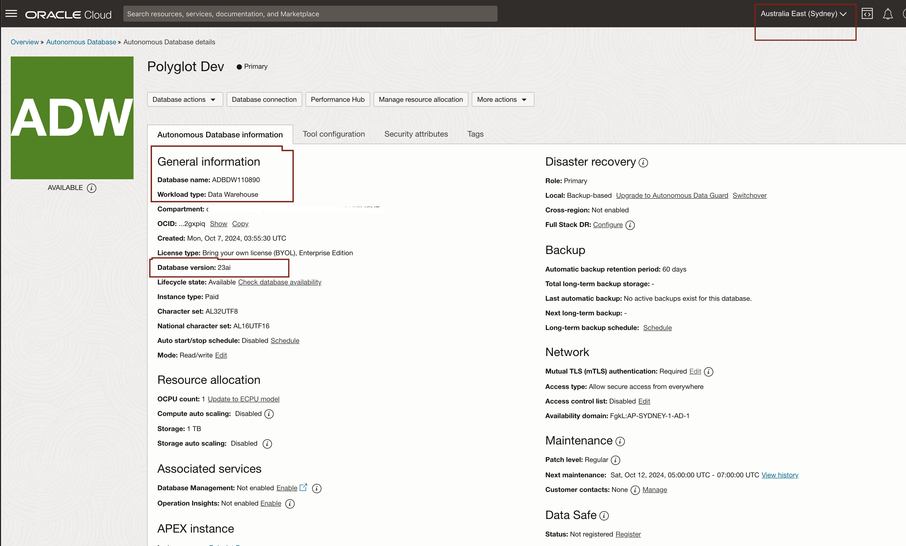

# Provision an Oracle Autonomous Database  

## Introduction

Oracle Autonomous Database is the world’s first autonomous data management in the cloud to deliver automated patching, upgrades, and tuning—including performing all routine database maintenance tasks while the system is running - without human intervention. This new Autonomous Database cloud is self-managing, self-securing, and self-repairing, which helps to eliminate manual database management and human errors.

The Oracle Autonomous Database is fully elastic: You simply specify the number of OCPUs and the storage capacity in TBs for the database. At any time, you may scale up or down the OCPUs or the storage capacity.

Autonomous Database supports four main types of workload:

* Transaction processing and mixed workloads
* Analytics and data warehousing
* Transactions and analytics on JSON data
* Oracle APEX Application Development

This lab walks you through the steps to get started using the Oracle Autonomous Database on Oracle Cloud. You will download the wallet where Autonomous Database has already been created. You will then set up the Access control list.

Estimated Time: 10 minutes

### Objectives

In this lab, you will:

-   Learn how to provision a new Autonomous Database

### Prerequisites

- This lab requires completing the **Get Started** section in the contents menu on the left navigation.
- Log in to the Oracle cloud and have access to create an Autonomous Database.

## Task 1: Choose Autonomous Database from the services menu

1. Log in to the Oracle Cloud.
2. Once you log in, the cloud services dashboard shows all the services available to you. Click the **navigation menu** in the upper left to show top-level navigation choices.

3. Select the allocated compartment and the region. The compartment name and the region will be available under LiveLabs My Reservations.

    

    You will then be able to view the pre-provisioned Autonomous Database instance.

    


4. Make sure your Workload Type is __Data Warehouse__ or __All__ to see your Autonomous Data Warehouse instances. Use the __List Scope__ drop-down menu to select a compartment. 
5. Click on Display Name Polyglot_Dev to view detailed information about the Autonomous Database provisioned.
6. Make note of Database version (Oracle Database 23ai), Database Name, Region

    
 
## Task 2: Create a database user and tables

1. Let us create a new database user and a couple of tables using the sample SH schema. SH schema is pre-installed with default instance creation.  

    Click the **Database Actions** button.

    

    Select the **SQL** tab to open the **SQL worksheet**.

    

    
 

2. Create an Autonomous Database user <db\_user\> and grant required privileges to create tables. Copy-paste the code below into the SQL worksheet.

    ```
    <copy>    
    define USERNAME = <db_user>;   
    create user &USERNAME identified by "<password>";
    alter user &USERNAME
        default tablespace users
        temporary tablespace temp
        quota unlimited on users;
    grant create session,
        create view,
        create sequence,
        create procedure,
        create table,
        create trigger,
        create type,
        create materialized view
        to &USERNAME;
    create table &USERNAME.sales360 as (select * from sh.sales);
    create table &USERNAME.customers360 as (select * from sh.customers);
    </copy>
    ```

    Substitute <db\_user\> and <password\> with the username and password of your choice. Press the second green button to run the script.

    

    The above example creates database user **appuser** with password **Welcome1234#**, you can use different username and password. 

## Task 3: Download the wallet for this database

1. Click on the **DB Connection** button. This will open up the Database Connection dialog box.

    

    **Download** the Autonomous Database wallet.

    

    Choose a new wallet password.

    

    Click on the **Download** button.

    Extract the wallet zip file to the folder of your choice. We will be using this **wallet folder** in future labs of this workshop.

## Task 4: Make note of TNS Name or DNS Name

1. Click on **Database Connection** tab, make note of TNS Names (at some places referred as DNS Name), for example DNS Name here **adbdw110890\_high** or adbdw110890\_low or adbdw110890\_medium

    

    

2. Alternatively you can download the ADB wallet and after extracting the zip file, you can check the tnsnames.ora file

    

3. The connection string while using connections with Database wallet would look like this example shown below

    ```
    <copy>
        adbdw1212121_high = (description= (retry_count=20)(retry_delay=3)(address=(protocol=tcps)(port=1522)(host=adb.ap-sydney-1.oraclecloud.com))(connect_data=(service_name=gc454cxxxx31_adbdw1212121_high.adb.oraclecloud.com))(security=(ssl_server_dn_match=yes)))
    </copy>
    ```  

## Task 5: [Optional] One-way TLS connection to Oracle Autonomous Database for wallet-less connections  

> **Please Note:**  This Task is required if you plan to use a wallet-less connection with Autonomous Database using Python or . NET. Otherwise, you can still connect to Autonomous Database using the wallet downloaded in the previous Task.

1. One-way TLS connection to Oracle Autonomous Database

    Complete the following steps in an Oracle Cloud console in the Autonomous Database Information section of the ADB instance details:

    Click the **Edit** link next to **Access Control List** to update the Access Control List (ACL).  
    

    The **Edit Access Control List** dialog box is displayed. select the type of address list entries and the corresponding values. You can include the required IP addresses, hostnames, or Virtual Cloud Networks (VCNs). The ACL limits access to only the IP addresses or VCNs that have been defined and blocks all other incoming traffic.  

       

    You should be able to establish a connection with the database by just clicking on **Add My IP Address** button. If you have issues establishing a connection, please follow the instructions below to get the IP address.

      > **Windows:**
      To get your public IP address:  
      1. Open the command prompt and run *ipconfig /all*.
      2. Search for 'IPv4 address:' under 'Wifi' or 'EthernetX' section based on your current network adapter to get the IP address.

      > **macOS:**
      To get your public IP address:  
      1. From the Apple menu, select System Preferences. In *System Preferences*, select *Network* from the View menu.
      2. In the Network window, select a network port (e.g., AirPort, Ethernet, Wi-Fi). The IP address will be visible under "Status:" section if it is connected.

      > **Linux/UNIX:**
      To get your public IP address:
      1. Run *ifconfig*.
      2. This command displays a list of all the network interfaces available on the machine. Look for the appropriate network interface (e.g., ens3 in Oracle Linux), and you will see an "inet" section under this containing your IP address.

    In the **Autonomous Database Information** tab and click the **Edit** link next to **Mutual TLS (mTLS) Authentication**. The Edit Mutual TLS Authentication dialog is displayed.   

    In the **Edit Mutual TLS Authentication** dialog box, **un-check** the **Require mutual TLS (mTLS) authentication** checkbox  and click **Save Changes**.

    

    In the **Autonomous Database Information** page and click **DB Connection** on the top of the page. A **Database Connection** dialog box is displayed.
    In the **Database Connection** dialog box, select **TLS** under **TLS Authentication** drop-down list.

    

    The connection string will look like this.

    ```
    <copy>
        adbdw110890_high = (description= (retry_count=20)(retry_delay=3)(address=(protocol=tcps)(port=1522)(host=adb.ap-sydney-1.oraclecloud.com))(connect_data=(service_name=gc454cxxxx31_adbdw110890_high.adb.oraclecloud.com))(security=(ssl_server_dn_match=yes)))
    </copy>
    ```  

    Copy the appropriate Connection String of the database instance in a text file which can be used by your applications. The  <region\_identifier\> and <service\_prefix\> will change depending on your ADB environment and the cloud region that you have selected.

    > **Note:** Please select **TLS** in the **TLS Authentication** dropdown while copying the connection string.  


You may now **proceed to the next lab**.

## Learn more

* [FAQs For Autonomous Database](https://www.oracle.com/database/technologies/datawarehouse-bigdata/adb-faqs.html)
* [What Is an Autonomous Database?](https://www.oracle.com/autonomous-database/what-is-autonomous-database/)
* Go to [the documentation](https://docs.oracle.com/en/cloud/paas/autonomous-data-warehouse-cloud/user/autonomous-workflow.html#GUID-5780368D-6D40-475C-8DEB-DBA14BA675C3) on the typical workflow for using Autonomous Data Warehouse.
* [About Connecting to an Autonomous Database Instance](https://docs.oracle.com/en/cloud/paas/autonomous-database/adbsa/connect-introduction.html)
* [Update Network Options to Allow TLS or Require Only Mutual TLS (mTLS) Authentication on Autonomous Database](https://docs.oracle.com/en/cloud/paas/autonomous-database/adbsa/support-tls-mtls-authentication.html#GUID-3F3F1FA4-DD7D-4211-A1D3-A74ED35C0AF5)
* [Securely Connecting to Autonomous DB Without a Wallet (Using TLS)](https://blogs.oracle.com/developers/post/securely-connecting-to-autonomous-db-without-a-wallet-using-tls)

## Acknowledgements

- **Author** - Madhusudhan Rao, Principal Product Manager, Database
- **Contributors** - Kevin Lazarz, Senior Principal Product Manager and Christopher Jones, Senior Principal Product Manager
- **Last Updated By/Date** - Madhusudhan Rao, Aug 2022
