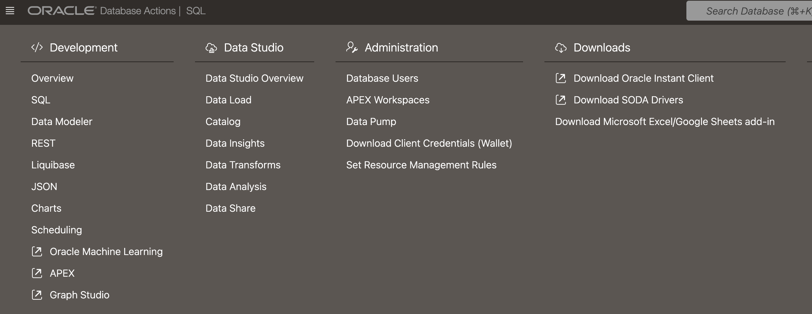
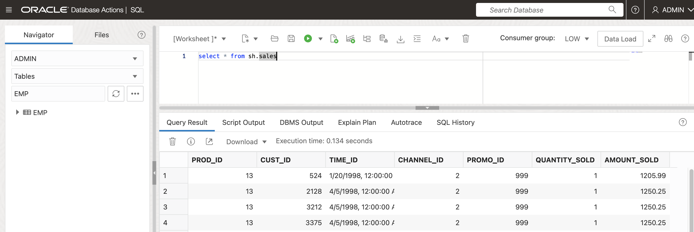
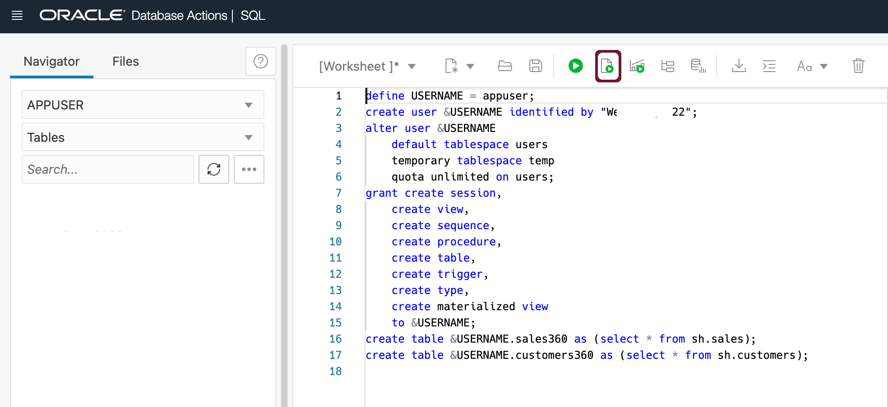

# Provision an Oracle Autonomous Database  

## Introduction

Oracle Autonomous Database is the world’s first autonomous data management in the cloud to deliver automated patching, upgrades, and tuning—including performing all routine database maintenance tasks while the system is running - without human intervention. This new Autonomous Database cloud is self-managing, self-securing, and self-repairing, which helps to eliminate manual database management and human errors.
  
Autonomous Database supports four main types of workload:

* Transaction processing and mixed workloads
* Analytics and data warehousing
* Transactions and analytics on JSON data
* Oracle APEX Application Development

This lab walks you through the steps to get started using the Oracle Autonomous Database on Oracle Cloud. You will provision a new Autonomous Data Warehouse instance.  

Estimated Time: 20 minutes

### Objectives

In this lab, you will:

-   Learn how to provision a new Autonomous Database

### Prerequisites

- This lab requires completing the **Get Started** section in the contents menu on the left navigation.
- Log in to the Oracle cloud and have access to create an Autonomous Database.

## Task 1: Choose Autonomous Database from the services menu

1. Log in to the Oracle Cloud.
2. Once you log in, the cloud services dashboard shows all the services available to you. Click the **navigation menu** in the upper left to show top-level navigation choices.

3. This lab shows the provisioning of an Autonomous Data Warehouse database. Click on **Oracle Database**, then select **Autonomous Data Warehouse**.

    


4. Make sure your Workload Type is __Data Warehouse__ or __All__ to see your Autonomous Data Warehouse instances. Use the __List Scope__ drop-down menu to select a compartment. <if type="livelabs">Enter the first part of your user name, for example `LL185` in the Search Compartments field to quickly locate your compartment.
 
    <if type="freetier">
    

    > **Note:** Avoid using the `ManagedCompartmentforPaaS` compartment, as this is an Oracle default used for Oracle Platform Services.
   </if>

5. This console shows that no databases yet exist. If there were a long list of databases, you could filter the list by the **State** of the databases (Available, Stopped, Terminated). You can also sort by __Workload Type__. In this example, __Data Warehouse__ is the workload type.

    

<if type="freetier">
1. You can see your current default **region** in the top right-hand corner of the page.
    
</if>

## Task 2: Create the Oracle Autonomous Database instance

1. Click **Create Autonomous Database** to start the instance creation process.

    

2.  This brings up the __Create Autonomous Database__ screen, where you will specify the instance's configuration.

3. Specify basic information for the Autonomous Database:

    - __Compartment__ - Leave the default compartment.
    - __Display Name__ - Enter a memorable name for the database for display purposes. For example, use __DEMO\_ADW__.
    - __Database Name__ - Use letters and numbers only, starting with a letter. The maximum length is 30 characters.  
    <if type="freetier">
         
    </if>
    - __Workload Type__ - For this lab, choose __Data Warehouse__ as the workload type.
    - __Deployment Type__ - For this lab, choose __Serverless__ as the deployment type.
      
    - __Always Free__ - For this lab, we will leave Always Free **unchecked**.
    - __Choose database version__ - Select a database version **19c** from the available versions. You can also select **23ai** if it is available in your tenancy and region.
    - **Choose network access**: For this lab, accept the default, **Secure access from everywhere**.
    

    <if type="freetier">
    Choose a license type. For this lab, choose __License Included__. The two license types are:
    </if> 

    - __Bring Your Own License (BYOL)__ - Select this type when your organization has existing database licenses. [learn more](https://www.oracle.com/cloud/pricing/)
    - __License Included__ - Select this type when you want to subscribe to new database software licenses and the database cloud service.
    - __Oracle Database Edition__ - Select __Oracle Database Enterprise Edition__. This option is available only if you have selected __Bring Your Own License (BYOL)__

4. Configure the database:
 
    - __ECPU count__ - Number of ECPU for your service. For this lab, specify __2 ECPU__.  
    - __Storage (TB)__ - Select your storage capacity in terabytes. For this lab, specify __1 TB__ of storage.  
    - __Auto Scaling__ - Auto Scaling - For this lab, keep auto-scaling **unchecked**. If autoscaling is enabled, the system will automatically use up to three times more CPU and IO resources to meet workload demand. learn more about [auto scaling](https://docs.oracle.com/en/cloud/paas/autonomous-database/adbsa/autonomous-auto-scale.html)
    - You can also select **23ai** if it is available in your tenancy and region.
 
        
  
        Backup retention period, default to 60 days.

        Create administrator credentials:

        

    - __Password and Confirm Password__ - Specify the password for the **ADMIN** user of the service instance.  
    - Autonomous Database requires strong passwords.
    
  
1. The **Contact Email** field allows you to list contacts to receive operational notices and announcements as well as unplanned maintenance notifications. This is optional.

    
 
    Click on __Create Autonomous Database__. button

    

2.   Your instance will begin provisioning. In a few minutes, the State will turn from Provisioning to Available. At this point, your Autonomous Data Warehouse database is ready to use! Have a look at your instance's details here, including its name, database version, OCPU count, and storage size.

    

    

    > **Note:** This Lab can also run on an **Always Free** configuration. If you select Always Free, the Autonomous Database can utilize up to 1 core and 20 GB of storage. The CPU core count and storage cannot be adjusted.

## Task 3: Create a database user and tables

1. Let us create a new database user and a couple of tables using the sample SH schema. SH schema is pre-installed with default instance creation.  

    Click the **Database Actions** button.

    

    

    Select the **SQL** tab to open the **SQL worksheet**.

    
 

2. Create an Autonomous Database user <db\_user\> and grant required privileges to create tables. Copy-paste the code below into the SQL worksheet.

    ```
    <copy>    
    define USERNAME = <db_user>;   
    create user &USERNAME identified by "<password>";
    alter user &USERNAME
        default tablespace users
        temporary tablespace temp
        quota unlimited on users;
    grant create session,
        create view,
        create sequence,
        create procedure,
        create table,
        create trigger,
        create type,
        create materialized view
        to &USERNAME;
    create table &USERNAME.sales360 as (select * from sh.sales);
    create table &USERNAME.customers360 as (select * from sh.customers);
    </copy>
    ```

    Substitute <db\_user\> and <password\> with the username and password of your choice. Press the green button to run the script.

    

## Task 4: Download the wallet for this database

1. Click on the **DB Connection** button. This will open up the Database Connection dialog box.

    

    **Download** the Autonomous Database wallet.

    

    Choose a new wallet password. Click on the **Download** button.

    Extract the wallet zip file to the folder of your choice. We will be using this **wallet folder** in future labs of this workshop.

## Task 5: One-way TLS connection to Oracle Autonomous Database for wallet-less connections  

> **Note:**  This Task is required if you plan to use a wallet-less connection with Autonomous Database using Python or . NET. Otherwise, you can still connect to Autonomous Database using the wallet downloaded in the previous Task.

1. One-way TLS connection to Oracle Autonomous Database

    Complete the following steps in an Oracle Cloud console in the Autonomous Database Information section of the ADB instance details:

    Click the **Edit** link next to **Access Control List** to update the Access Control List (ACL).  
    

    The **Edit Access Control List** dialog box is displayed. select the type of address list entries and the corresponding values. You can include the required IP addresses, hostnames, or Virtual Cloud Networks (VCNs). The ACL limits access to only the IP addresses or VCNs that have been defined and blocks all other incoming traffic.  

       

    You should be able to establish a connection with the database by just clicking on **Add My IP Address** button. If you have issues establishing a connection, please follow the instructions below to get the IP address.

      > **Windows:**
      To get your public IP address:  
      1. Open the command prompt and run *ipconfig /all*.
      2. Search for 'IPv4 address:' under 'Wifi' or 'EthernetX' section based on your current network adapter to get the IP address.

      > **macOS:**
      To get your public IP address:  
      1. From the Apple menu, select System Preferences. In *System Preferences*, select *Network* from the View menu.
      2. In the Network window, select a network port (e.g., AirPort, Ethernet, Wi-Fi). The IP address will be visible under "Status:" section if it is connected.

      > **Linux/UNIX:**
      To get your public IP address:
      1. Run *ifconfig*.
      2. This command displays a list of all the network interfaces available on the machine. Look for the appropriate network interface (e.g., ens3 in Oracle Linux), and you will see an "inet" section under this containing your IP address.

    In the **Autonomous Database Information** tab and click the **Edit** link next to **Mutual TLS (mTLS) Authentication**. The Edit Mutual TLS Authentication dialog is displayed.   

    In the **Edit Mutual TLS Authentication** dialog box, **un-check** the **Require mutual TLS (mTLS) authentication** checkbox  and click **Save Changes**.

    

    In the **Autonomous Database Information** page and click **DB Connection** on the top of the page. A **Database Connection** dialog box is displayed.
    In the **Database Connection** dialog box, select **TLS** under **TLS Authentication** drop-down list.

    

    The connection string will look like this.

    ```
    <copy>
        (description= (retry_count=20)(retry_delay=3)(address=(protocol=tcps)(port=1521)
        (host=adb.<region_identifier>.oraclecloud.com))
        (connect_data=(service_name=<service_prefix>.adb.oraclecloud.com))
        (security=(ssl_server_dn_match=yes)
        (ssl_server_cert_dn="CN=<cn name>, OU=Oracle BMCS US, O=Oracle Corporation, L=Redwood City, ST=California, C=US")))
    </copy>
    ```  

    Copy the appropriate Connection String of the database instance in a text file which can be used by your applications. The  <region\_identifier\> and <service\_prefix\> will change depending on your ADB environment and the cloud region that you have selected.

    > **Note:** Please select **TLS** in the **TLS Authentication** dropdown while copying the connection string.  


You may now **proceed to the next lab**.

## Learn more

* [FAQs For Autonomous Database](https://www.oracle.com/database/technologies/datawarehouse-bigdata/adb-faqs.html)
* [What Is an Autonomous Database?](https://www.oracle.com/autonomous-database/what-is-autonomous-database/)
* Go to [the documentation](https://docs.oracle.com/en/cloud/paas/autonomous-data-warehouse-cloud/user/autonomous-workflow.html#GUID-5780368D-6D40-475C-8DEB-DBA14BA675C3) on the typical workflow for using Autonomous Data Warehouse.
* [About Connecting to an Autonomous Database Instance](https://docs.oracle.com/en/cloud/paas/autonomous-database/adbsa/connect-introduction.html)
* [Update Network Options to Allow TLS or Require Only Mutual TLS (mTLS) Authentication on Autonomous Database](https://docs.oracle.com/en/cloud/paas/autonomous-database/adbsa/support-tls-mtls-authentication.html#GUID-3F3F1FA4-DD7D-4211-A1D3-A74ED35C0AF5)
* [Securely Connecting to Autonomous DB Without a Wallet (Using TLS)](https://blogs.oracle.com/developers/post/securely-connecting-to-autonomous-db-without-a-wallet-using-tls)
* [Default password complexity rules](https://docs.oracle.com/en/cloud/paas/autonomous-database/dedicated/adbcu/#ADBCU-GUID-0E019845-31AE-44D7-B55C-9BCBA7E1377F)

## Acknowledgements

- **Author** - Madhusudhan Rao, Principal Product Manager, Database
- **Contributors** - Kevin Lazarz, Senior Principal Product Manager and Christopher Jones, Senior Principal Product Manager
- **Updates** - Database Actions and Oracle Autonomous Database creation screens updated 
- **Last Updated By/Date** - Madhusudhan Rao, 4th Oct 2024
