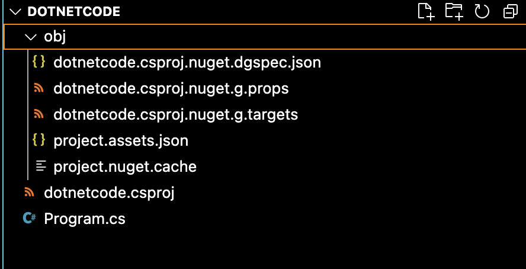
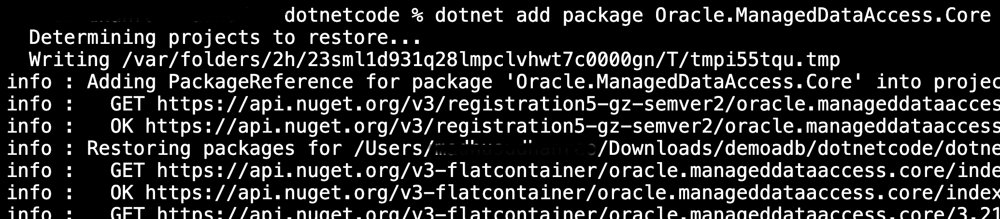
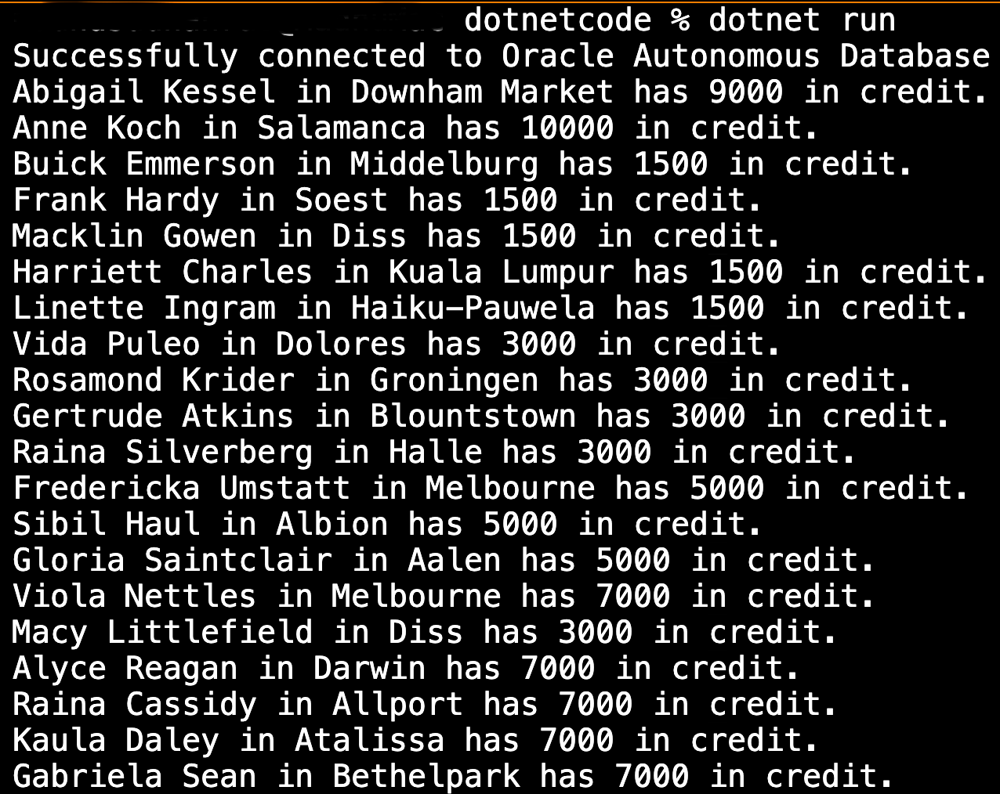
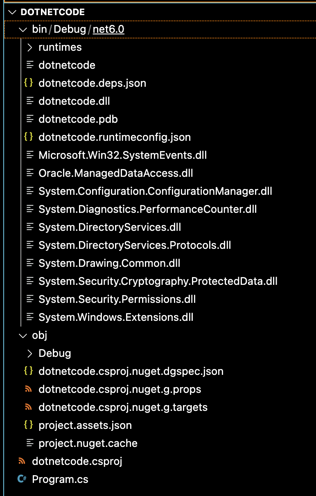
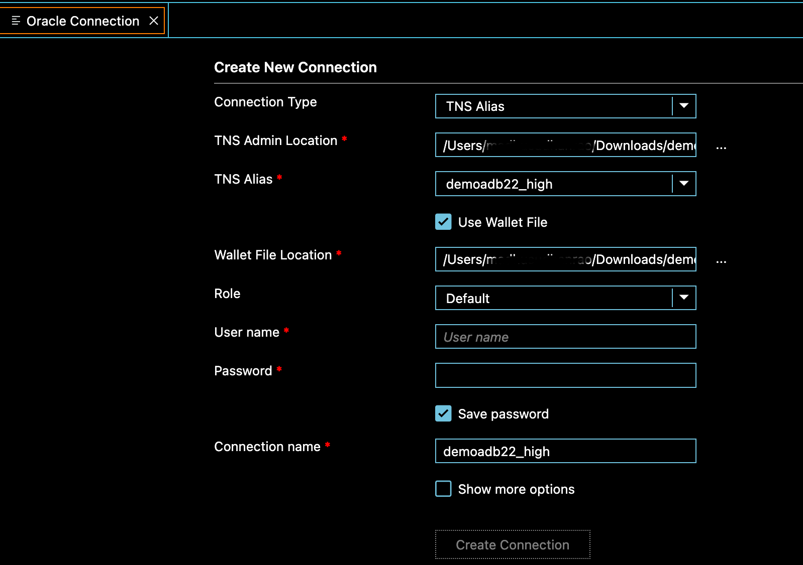
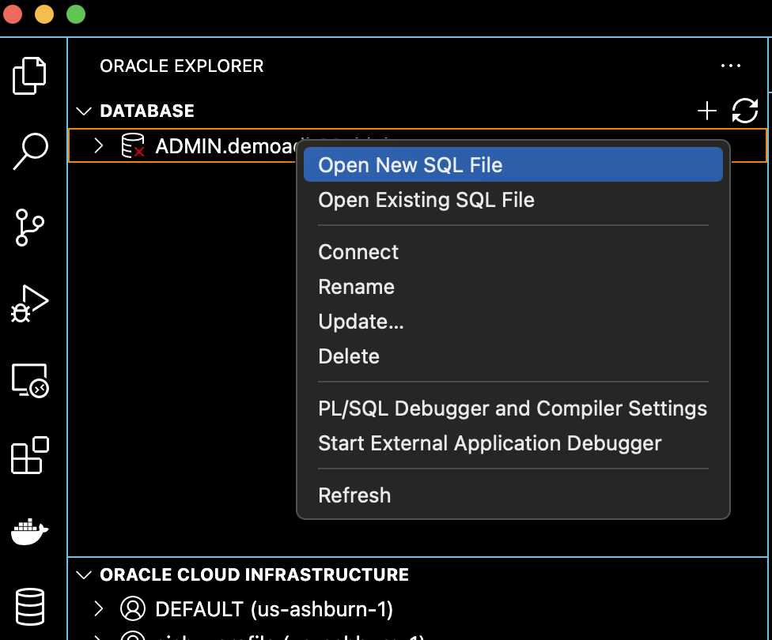
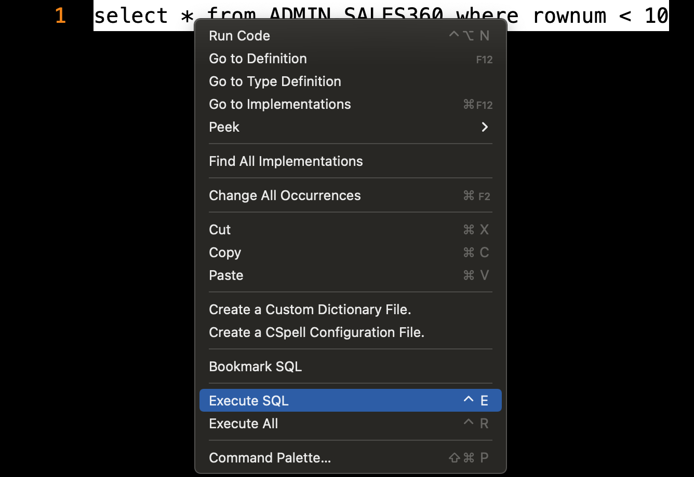
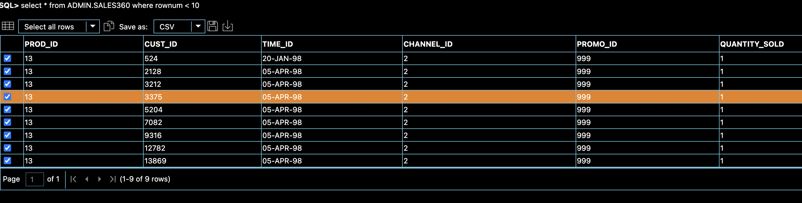
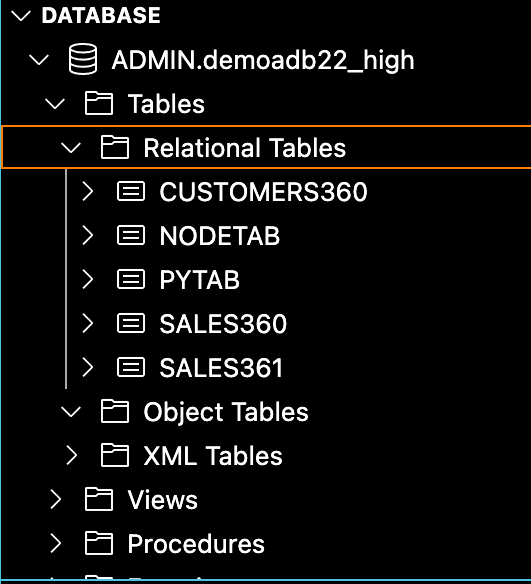

# Developing .NET Applications for Oracle Autonomous Database

## Introduction
 
This lab shows you how to connect .NET Core applications to Oracle Autonomous Database with Oracle Data Provider for .NET (ODP.NET) Core, Visual Studio Code, and the Oracle Developer Tools for VS Code extension.  

Estimated Time: 20 minutes
 
### Objectives
 
In this lab, you will: 

* Develop .NET Applications for Oracle Autonomous Database with ODP.NET code
* Develop .NET Applications for Oracle Autonomous Database with Oracle Developer Tools For VS Code

### Prerequisites 
This lab assumes you have:

* Autonomous Database has been created
* Oracle Autonomous Database wallet has been downloaded 

## Task 1: Download and Install Visual Studio Code

1. Download and install [VS Code](https://code.visualstudio.com/download).

## Task 2: Install the required Visual Studio Code extensions

1. Click on the Extensions icon in the Activity Bar on the side of VS Code or use the View: Show Extensions command (Ctrl+Shift+X).
2. Type Oracle in the extension search bar.  
3. Locate **Oracle Developer Tools** for VS Code and click Install.

       
  
4. Install the [VS Code C# extension](https://marketplace.visualstudio.com/items?itemName=ms-vscode.csharp).

         

5.  Install the .NET Core SDK.

      [Download and install .NET Core SDK](https://dotnet.microsoft.com/download) 3.1 or higher. Click the Install button to install the extension

        

      When the installation is complete, restart Visual Studio Code.

## Task 2: Develop .NET Applications for Oracle Autonomous Database with ODP.NET code

Follow the below instructions to run the sample code in VS Code.

1. In the VS Code Terminal window, change to a directory to place your project files, such as "cd <directory\_location\>" command. where <directory\_location\> is the directory where the source code and dependency files will be created
2. Run **dotnet new console** from the command line to create a new project. 

      ```
      <copy>
            dotnet new console
      </copy>
      ```   

       

      You can see **Program.cs** along with other files created in the source directory.

      

3. Open the **Program.cs** and copy the sample code contents below and save the file.
   
      ```
      <copy>
      // See https://aka.ms/new-console-template for more information
      // https://github.com/oracle/dotnet-db-samples/blob/master/samples/autonomous-db/odp-core/console-app/wallet/autonomous-odp-core.cs
      using System;
      using Oracle.ManagedDataAccess.Client;

      namespace ODP.NET_Core_Autonomous
      {
            class Program
            {
                  static void Main(string[] args)
                  {  

                        string conString = "User Id=<db_user>;Password=<password>;Data Source=<service name>_high;Connection Timeout=30;"; 
                        using (OracleConnection con = new OracleConnection(conString))
                        {
                              using (OracleCommand cmd = con.CreateCommand())
                              {
                              try
                              {
                                    //Enter directory where the tnsnames.ora and sqlnet.ora files are located
                                    OracleConfiguration.TnsAdmin = @"/<path to wallet directory>";  
                                    //Enter directory where wallet is stored locally
                                    OracleConfiguration.WalletLocation = @"/<path to wallet directory>"; 
                                    con.Open(); 
                                    Console.WriteLine("Successfully connected to Oracle Autonomous Database"); 
                                    cmd.CommandText = "select CUST_FIRST_NAME, CUST_LAST_NAME, CUST_CITY, CUST_CREDIT_LIMIT " +
                                    "from customers360 order by CUST_ID fetch first 20 rows only";
                                    OracleDataReader reader = cmd.ExecuteReader();
                                    while (reader.Read())
                                    Console.WriteLine(reader.GetString(0) + " " + reader.GetString(1) + " in " + 
                                    reader.GetString(2) + " has " + reader.GetInt16(3) + " in credit." );
                              }
                              catch (Exception ex)
                              {
                                    Console.WriteLine(ex.Message);
                              }

                              Console.ReadLine();
                              }
                        }
                  }
            }
      }      
      </copy>
      ``` 

      - Substitute <db\_user\> <password\> and <service\_name\> depending upon the configurations in Lab 1  
      - OracleConfiguration.TnsAdmin (i.e. directory Autonomous Database credentials were unzipped to)
      - OracleConfiguration.WalletLocation (i.e. directory Autonomous Database credentials were unzipped to) 
   
4. Run  **dotnet add package Oracle.ManagedDataAccess.Core**  from the command line to add ODP.NET Core to the project.
       

5. Execute the app by running **dotnet run** from the command line. You should see the customers sample data

      ```
      <copy>
      dotnet run        
      </copy>
      ``` 

       

6. The entire project folder should now look as below  
       

## Task 3: Develop .NET Applications for Oracle Autonomous Database with Oracle Developer Tools For VS Code

This Lab shows you how to connect .NET applications to Oracle Autonomous Database using Oracle Data Provider for .NET Core via the command line, with Visual Studio Code, and with Visual Studio. Also learn how to connect .NET Framework apps to Autonomous Database with Visual Studio and Oracle Data Provider for .NET
  
1. Connect to Oracle Autonomous Database, Click on the Database icon in the Activity Bar on the left side of Visual Studio Code to open Oracle Database Explorer.

      

      * Click the plus sign (+) to open the connection dialog, Fill in the connection dialog
        - Connection Type: **TNS Alias**   
        - TNS Admin Location: Enter the path to the **wallet location** where you unzipped the credentials files.
        - TNS Alias: Enter the net service name such as DBName_high. DBName is **Database Name** entered during the Create Autonomous Database step while - provisioning Autonomous Database.
        - **Use Wallet File**: Check this box
        - Wallet File Location: Set to the same path you used in the TNS Admin Location field above
        - Role: **Default**
        - User name: Enter ADMIN which is the user created by default during the creation of Autonomous Database. (If you created another Autonomous Database user, you can use that user instead.)
        - Password: Enter user's password. If ADMIN user is used, enter the password that was provided during the Create Autonomous Database step while provisioning Autonomous Database.
        - Save password: Check this box if desired.

2. View Oracle Database Explorer and Open a new SQL File. Click on the database icon in the Activity Bar on the left side of Visual Studio Code if Oracle Database Explorer is not open

      

3. Execute a SQL Statement

      ```
      <copy>
      select * from sales360 where rownum < 10  
      </copy>
      ``` 

      

4. View result of SQL query and expand Tables under Autonomous Database connection to view the list of tables.

      

      

## Learn More

* [Developing .NET Core Applications for Oracle Autonomous Database](https://www.oracle.com/database/technologies/appdev/dotnet/adbdotnetcore.html)   
* [Oracle Data Provider for .NET](https://www.oracle.com/database/technologies/appdev/dotnet/odp.html)  
* [.NET Core with Visual Studio](https://www.oracle.com/database/technologies/appdev/dotnet/adbdotnetquickstarts.html#third-option-tab)
* [Code Examples: dotnet-db-samples](https://github.com/oracle/dotnet-db-samples/tree/master/samples/autonomous-db)
 
## Acknowledgements

- **Author** - Madhusudhan Rao, Principal Product Manager, Database
* **Contributors** - Kevin Lazarz, Senior Principal Product Manager, Database. Alex Keh, Senior Principal Product Manager and Christian Shay, Senior Principal Product Manager
* **Last Updated By/Date** -  Madhusudhan Rao, May 2022 
