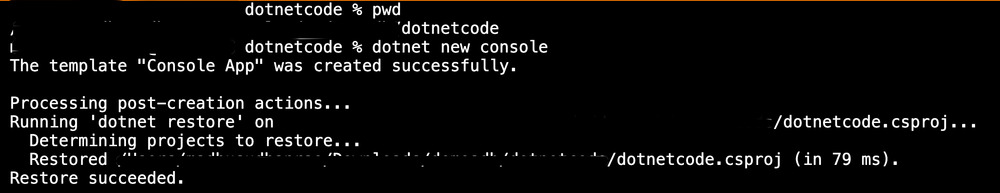
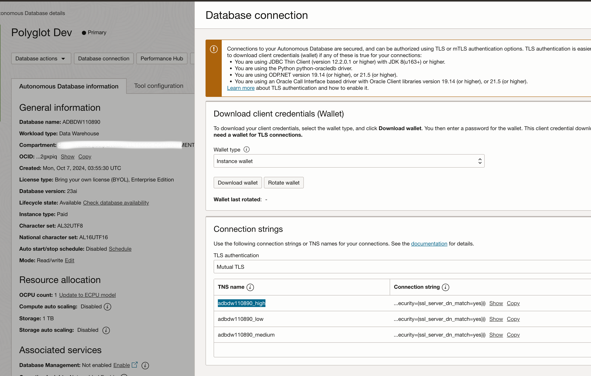
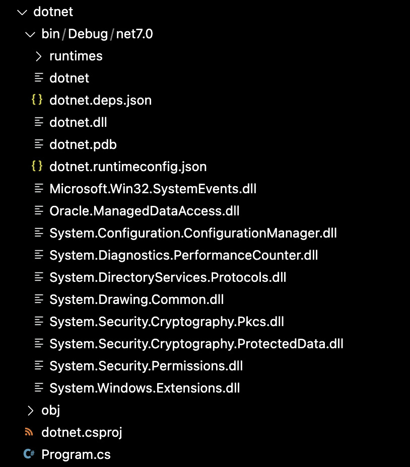
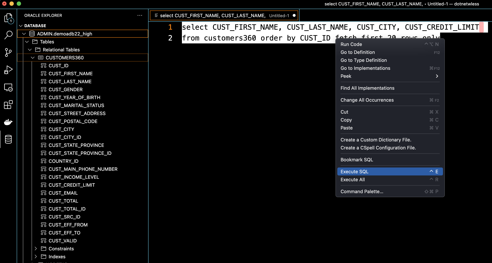

# Developing .NET Applications for Oracle Autonomous Database

## Introduction

This lab shows you how to connect .NET Core applications to Oracle Autonomous Database with Oracle Data Provider for .NET (ODP.NET) Core using Visual Studio Code and the Oracle Developer Tools for VS Code extension.  

Estimated Time: 30 minutes

### Objectives

In this lab, you will:
* Develop .NET Applications for Oracle Autonomous Database with ODP.NET Core and Visual Studio Code
* Utilize the Oracle Developer Tools For VS Code extension

### Prerequisites
This lab assumes you have:

* Autonomous Database has been created
* Oracle Autonomous Database wallet has been downloaded

## Task 1: Download and Install Visual Studio Code

1. Download and install [VS Code](https://code.visualstudio.com/download).
2. Important: Please check the latest version of updated [Developing .NET Applications for Oracle Autonomous Database](https://www.oracle.com/database/technologies/appdev/dotnet/adbdotnetquickstarts.html#second-option-tab)

## Task 2: Install the .NET SDK and Visual Studio Code extensions

1. Click on the Extensions icon in the Activity Bar on the side of VS Code or use the View: **Show Extensions** command (Ctrl+Shift+X).
2. Type **Oracle** in the extension search bar.  
3. Locate **Oracle Developer Tools for VS Code** and click it to open the extension's page.

      

4. Click the Install button to install the extension. During the installation, you may be prompted to install a specific version of .NET Core Runtime, depending on what is already installed on your machine.  

      Close Visual Studio Code and reopen it.

5. Install the [VS Code C# extension](https://marketplace.visualstudio.com/items?itemName=ms-vscode.csharp).

         

6.  Install the .NET Core SDK

      [Download and install .NET Core SDK](https://dotnet.microsoft.com/download) 3.1 or higher. Click the Install button to install the extension.

        

      When the installation is complete, restart Visual Studio Code.

      VSCode might prompt you to install C# SDK, 

      

      Click on Install

      


## Task 3: Develop .NET Applications for Oracle Autonomous Database with ODP.NET Core and Visual Studio Code

In this Task we will be using an Autonomous Database wallet to establish a connection. Follow the below instructions to run the sample code in VS Code.

1. From the Visual Studio Code menu, choose **View->Terminal** to open the Terminal window. At the command prompt in the terminal, create a new directory for your application and change it into that directory.  
      ```
      <copy>
            cd <your_dotnet_project_folder>
      </copy>
      ```   

      Substitute <your\_dotnet\_project\_folder\> with the folder of your choice.
2. Run **dotnet new console** from the command line to create a new project.

      ```
      <copy>
            dotnet new console
      </copy>
      ```   

      From the Visual Studio Code menu, choose **File->Open Folder** and select the directory you created above.

      

      You can see **Program.cs** along with other files created in the source directory.

      

3. Download and extract Oracle Autonomous Database wallet in any folder 

    

    Get the wallet folder path

    

4. Make note of TNS name (Referred as DNS name in the below code) from Oracle Autonomous Database console

    

5. Open the **Program.cs** and copy the sample code contents below and save the file.

      ```
      <copy>
      // See https://aka.ms/new-console-template for more information
      // https://github.com/oracle/dotnet-db-samples/blob/master/samples/autonomous-db/odp-core/console-app/wallet/autonomous-odp-core.cs
      using System;
      using Oracle.ManagedDataAccess.Client;

      namespace ODP.NET_Core_Autonomous
      {
            class Program
            {
                  static void Main(string[] args)
                  {  

                        string conString = "User Id=<db_user>;Password=<password>;Data Source=<service name>_high;Connection Timeout=30;";
                        using (OracleConnection con = new OracleConnection(conString))
                        {
                              using (OracleCommand cmd = con.CreateCommand())
                              {
                              try
                              {
                                    //Enter directory where the tnsnames.ora and sqlnet.ora files are located
                                    OracleConfiguration.TnsAdmin = @"/<path to wallet directory>";  
                                    //Enter directory where wallet is stored locally
                                    OracleConfiguration.WalletLocation = @"/<path to wallet directory>";
                                    con.Open();
                                    Console.WriteLine("Successfully connected to Oracle Autonomous Database");
                                    cmd.CommandText = "select CUST_FIRST_NAME, CUST_LAST_NAME, CUST_CITY, CUST_CREDIT_LIMIT " +
                                    "from customers360 order by CUST_ID fetch first 20 rows only";
                                    OracleDataReader reader = cmd.ExecuteReader();
                                    while (reader.Read())
                                    Console.WriteLine(reader.GetString(0) + " " + reader.GetString(1) + " in " +
                                    reader.GetString(2) + " has " + reader.GetInt16(3) + " in credit." );
                              }
                              catch (Exception ex)
                              {
                                    Console.WriteLine(ex.Message);
                              }

                              Console.ReadLine();
                              }
                        }
                  }
            }
      }      
      </copy>
      ```

      Sample code for reference.

      

      - Substitute <db\_user\> <password\> and <service\_name\> depending upon the configurations in Lab 1  
      - OracleConfiguration.TnsAdmin (i.e. directory Autonomous Database credentials were unzipped to)
      - OracleConfiguration.WalletLocation (i.e. directory Autonomous Database credentials were unzipped to)

6. Run  **dotnet add package Oracle.ManagedDataAccess.Core**  from the command line to add ODP.NET Core to the project.

      ```
      <copy>
      dotnet add package Oracle.ManagedDataAccess.Core
      </copy>
      ```

      

7. Execute the app by running **dotnet run** from the command line. You should see the customers sample data

      ```
      <copy>
      dotnet run        
      </copy>
      ```

      

8. The entire project folder should now look as below  
   
         

## Task 4: [Optional] Develop .NET Applications for Oracle Autonomous Database with ODP.NET Core and Visual Studio Code (Wallet-less Connection)

In this task, we will establish a wallet-less connection with Autonomous Database. Please follow the below instructions to run the sample code in VS Code.

  > **Note:** It is essential to have completed Lab 1 Task 5 **One-way TLS connection to Oracle Autonomous Database** for wallet-less connections to run the example below in this task.

1. From the Visual Studio Code menu, choose **View->Terminal** to open the Terminal window. At the command prompt in the terminal, create a new directory for your application and change into that directory.  
2. Run **dotnet new console** from the command line to create a new project.

      ```
      <copy>
            dotnet new console
      </copy>
      ```   

      From the Visual Studio Code menu, choose **File->Open Folder** and select the directory you created above.

      

      You can see **Program.cs** along with other files created in the source directory.

      

3. Access the Autonomous Database Information page, click on **DB Connection**, under Connection String, select **TLS** Option, and copy the connection string into a text file or clipboard, which we will be using in the next step.   

   

4. Open the **Program.cs** and copy the code contents below and save the file.

      ```
      <copy>
      using System;
      using Oracle.ManagedDataAccess.Client;

      namespace ODP.NET_Core_Autonomous
      {
      class Program
      {
            static void Main(string[] args)
            {  
                  string conString = "User Id=<db_user>;Password=<password>;" +

                  "Data Source = <copied_connection_string>  ";

                  using (OracleConnection con = new OracleConnection(conString))
                  {
                  using (OracleCommand cmd = con.CreateCommand())
                  {
                        try
                        {

                              con.Open();

                              Console.WriteLine("Successfully connected to Oracle Autonomous Database");  

                              cmd.CommandText = "select CUST_FIRST_NAME, CUST_LAST_NAME, CUST_CITY, CUST_CREDIT_LIMIT " +
                              "from customers360 order by CUST_ID fetch first 20 rows only";

                              OracleDataReader reader = cmd.ExecuteReader();
                              while (reader.Read())
                              Console.WriteLine(reader.GetString(0) + " " + reader.GetString(1) + " in " +
                                    reader.GetString(2) + " has " + reader.GetInt16(3) + " in credit." );
                        }
                        catch (Exception ex)
                        {
                              Console.WriteLine(ex.Message);
                        }

                        Console.ReadLine();
                  }
                  }
            }
      }
      }   
      </copy>
      ```

      Sample code for reference 

      

      Substitute <db\_user\> , <password\> and <copied\_connection\_string\> depending upon the string that we copied in previous step.

      > **Note:** Your Data Source connection string in the above code might look like this below. Add the \ escape sequence in front of the quotes.  

      ```
      <copy>
      "(description= (retry_count=20)(retry_delay=3)(address=(protocol=tcps)(port=1521)(host=adb.ap-sydney-1.oraclecloud.com))(connect_data=(service_name=gc454c29a9ca831_adbdw110890_high.adb.oraclecloud.com))(security=(ssl_server_dn_match=yes)))";
      </copy>
      ```


5. Run  **dotnet add package Oracle.ManagedDataAccess.Core**  from the command line to add ODP.NET Core to the project.

      ```
      <copy>
      dotnet add package Oracle.ManagedDataAccess.Core
      </copy>
      ```

      

6. Execute the app by running **dotnet run** from the command line. You should see the customers data

      ```
      <copy>
      dotnet run        
      </copy>
      ```

      

      The output will be the same as Task 3 but with only difference being this time we are establishing wallet-less connection.

<!-- ## Task 5: [Optional] Utilize the Oracle Developer Tools For VS Code extension to explore database schema and run SQL scripts  

This Lab task shows how to use Oracle Developer Tools for VS Code, Connect to Autonomous Database Instance, and Run SQL Queries.

1. Click on the **Database** icon in the Activity Bar on the left side of Visual Studio Code to open Oracle Database Explorer. Click the **plus sign** (+) to open the connection dialog

      

2. Fill in the connection dialog details

      

     - Connection Type: **TNS Alias**   
     - **TNS Admin Location**: Enter the path to the **wallet location** where you unzipped the credentials files.
     - **TNS Alias**: Enter the net service name such as DBName_high. DBName is **Database Name** entered during the Create Autonomous Database step while - provisioning Autonomous Database.
     - **Use Wallet File**: Check this box
     - Wallet File Location: Set to the same path you used in the TNS Admin Location field above
     - **Role**: Default
     - **User name**: Enter ADMIN, which is the user created by default during the creation of Autonomous Database. (If you created another Autonomous Database user, you can use that user instead.)
     - **Password**: Enter user's password. If ADMIN user is used, enter the password that was provided during the Create Autonomous Database step while provisioning Autonomous Database.
     - **Save password**: Check this box if desired.

3. Right-click on the connection node, and from the menu, choose **Open New SQL File**.

      

4. Copy and paste the following SQL statement into the SQL file. **Execute a SQL** Statement

      ```
      <copy>
      select CUST_FIRST_NAME, CUST_LAST_NAME, CUST_CITY, CUST_CREDIT_LIMIT
      from customers360 order by CUST_ID fetch first 20 rows only  
      </copy>
      ```

      

5. View the result of the SQL query and expand Tables under Autonomous Database connection to view the list of tables.

       -->


## Learn More

* [Oracle Data Provider for .NET](https://www.oracle.com/database/technologies/appdev/dotnet/odp.html)  
* [.NET Core with Visual Studio](https://www.oracle.com/database/technologies/appdev/dotnet/adbdotnetquickstarts.html#third-option-tab)
* [Code Examples: dotnet-db-samples](https://github.com/oracle/dotnet-db-samples/tree/master/samples/autonomous-db)
* [Code Example: no-wallet/autonomous-odp-core.cs](https://github.com/oracle/dotnet-db-samples/blob/master/samples/autonomous-db/odp-core/console-app/no-wallet/autonomous-odp-core.cs)
* [Developing .NET Applications for Oracle Autonomous Database](https://www.oracle.com/database/technologies/appdev/dotnet/adbdotnetquickstarts.html#second-option-tab)

## Acknowledgements

- **Author** - Madhusudhan Rao, Principal Product Manager, Database
* **Contributors** - Alex Keh, Senior Principal Product Manager and Christian Shay, Senior Principal Product Manager
* **Last Updated By/Date** -  Madhusudhan Rao, Oct 6th, 2024
