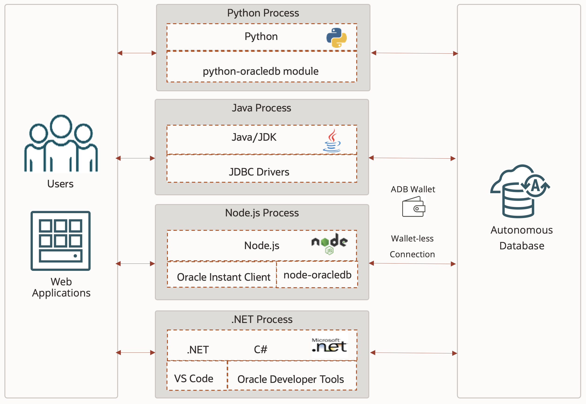

# Introduction 

## About this Workshop

Polyglot programming is a computer program or script written in multiple programming languages. Today's enterprise architecture world is a complex set of discrete applications written in different programming languages by multiple developers running under various environments. Many of these applications might be interacting with the same database or accessing the same storage layer for commonly used files.

Enterprise applications are often developed by various development teams using different technologies. Some might be legacy apps as well. So it is essential to understand how various technologies and polyglot programming can be used to access the same underlying database. We are taking examples of different programming languages like Python, Java, .NET and Node.js to connect with an Autonomous Database and run SQL queries.

In a real-life example, a front-end customer-facing web application is most likely written in Node.js or Python or PHP scripts, reading data from a database. At the same time, a Java-based backend application might be doing real-time data management. or backend teams might use Apex-based Web or Mobile Applications to interact with the same database. Many Apps might be using PL/SQL cron jobs to sync data between different applications. Data Scientists might use Machine Learning Notebooks to run many complex ML algorithms or use python-based clients to interact with data.

One could extend the Architecture to use microservices to connect and communicate between different systems using Oracle container for Kubernetes or OKE cluster.

This workshop will demonstrate running SQL queries from Python, Node.js, Java, and .NET to connect with an Oracle Autonomous Database using a wallet or through a wallet-less connection.

Estimated Time:  1 hour 30 mins

### Objectives

The objective of this workshop is:

* Create and configure an Autonomous Database to allow application access.
* Develop Polyglot database applications using Node.js, Python, Java and .NET
* Run SQL queries on an Autonomous Database.

### Prerequisites

* Access to create Oracle Autonomous Database

## Acknowledgements

* **Author** - Madhusudhan Rao, Principal Product Manager, Database
* **Special Thanks to all the contributors**
    - Kevin Lazarz, Senior Principal Product Manager, Database.
    - Christopher Jones, Senior Principal Product Manager.
    - Kuassi MENSAH, Director of Product Management.  
    - Alex Keh, Senior Principal Product Manager.
    - Christian Shay, Senior Principal Product Manager.
    - Sharad Chandran R, Principal Product Manager
* **Last Updated By/Date** -  Madhusudhan Rao, Oct 7th 2024
