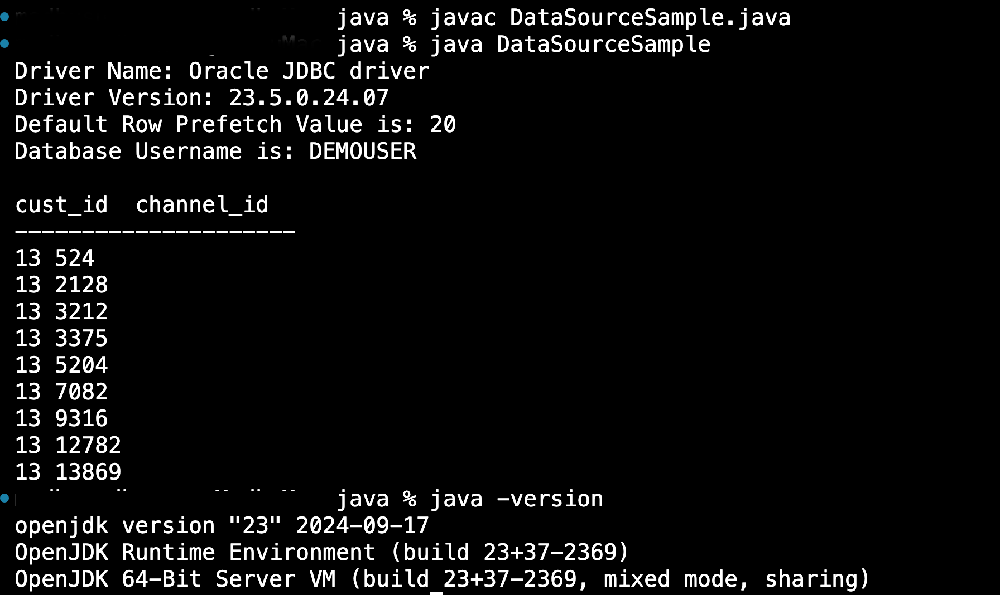

# Develop Java Applications for Oracle Autonomous Database

## Introduction

Oracle provides enterprise application developers with an end-to-end Java solution for creating, deploying, and managing Java applications. The total solution consists of client-side and server-side programmatic interfaces, tools to support Java development, and a JVM integrated with Oracle Database. All these products are fully compatible with Java standards. JDBC is a database access protocol that enables you to connect to a database and run SQL statements and queries to the database. The core Java class libraries provide the JDBC APIs: java.sql and javax.sql. However, JDBC  enables vendors to supply drivers that offer the necessary specialization for a particular database. 

Estimated Time: 20 minutes
 
### Objectives
 
In this lab, you will: 

* Write Java code to access Oracle Database 
* Run the code

### Prerequisites  

This lab assumes:

* An Autonomous Database has been created.
* A wallet has been downloaded. 
* One-way TLS connection has been configured.

## Task 1: Install JDK8 or higher

Download [JDK8](https://www.oracle.com/java/technologies/javase/javase-jdk8-downloads.html) or [higher JDK versions](https://www.oracle.com/java/technologies/java-se-glance.html)
  
## Task 2: Download the JDBC driver and other jar files
   
> **Note:** ojdbc8-full.tar.gz and ojdbc10-full.tar.gz contain oraclepki.jar, osdt\_core.jar, and osdt\_cert.jar required for connecting with an Autonomous Database.  

* For Oracle Autonomous Database 23ai JDBC drivers please check this [download link](https://www.oracle.com/database/technologies/appdev/jdbc-downloads.html)
* Download either 19c or 18c JDBC driver from the following download page. [ojdbc10-full.tar.gz or ojdbc8-full.tar.gz and ucp.jar](https://www.oracle.com/database/technologies/appdev/jdbc-downloads.html)
* 21c is an Innovation Release. 21c has premier support until April 2024. Refer to [Lifetime Support Policy](https://www.oracle.com/us/support/library/lifetime-support-technology-069183.pdf) for more details.
* 19c is a Long Term Release. 19c has premier support until April 2024 and extended support until April 2027.
 
## Task 3: Set environment variables to access database

1. Set environment variables and verify the java version and CLASSPATH,  it is important that our classpath should include jar files in ojdbc8-full folder, in our case we would need **ojdbc8.jar**, **oraclepki.jar**, **osdt\_core.jar** and **osdt\_cert.jar** to be in classpath

      ```
      <copy>
            export CLASSPATH=".:/<path to ojdbc8-full jar files>" 
      </copy>
      ``` 

      For example

      ```
      <copy>
            export CLASSPATH=".:/<path to ojdbc8-full jar files>/ojdbc8.jar:/<path to ojdbc8-full jar files>/oraclepki.jar:/<path to ojdbc8-full jar files>/osdt_core.jar:/<path to ojdbc8-full jar files>/osdt_cert.jar" 
      </copy>
      ``` 

      Review the classpath

      ```
      <copy>
            echo $CLASSPATH 
      </copy>
      ``` 

      please see [setting the path and classpath](https://docs.oracle.com/javase/tutorial/essential/environment/paths.html) for more information

2. Verify Java version 
 
      ```
      <copy>
            java -version 
      </copy>
      ``` 

      The output can be as shown below.

      ```
      <copy> 
            java version "1.8.0_212"
            Java(TM) SE Runtime Environment (build 1.8.0_212-b10)
            Java HotSpot(TM) 64-Bit Server VM (build 25.212-b10, mixed mode)
      </copy>
      ```   

## Task 4: Extract the downloaded wallet

Please note since we had created an Autonomous Database instance by the name DEMOADW, our wallet zip file name will be Wallet\_DEMOADW
 
```
<copy>
unzip Wallet_DEMOADW.zip -d $HOME/< path to wallet folder>
</copy>
```

## Task 5: Java Application development with wallet

1. In the vi editor or Visual studio code write sales360.java replace hostname ,service name, database username and password as per your installation and configuration
2. Write the Java code
   
      Database URL **DB_URL** will be a string consisting of an Autonomous Database instance name and path the the extracted Autonomous Database wallet folder

      ```
      <copy>
            final static String DB_URL="jdbc:oracle:thin:@<adb_instance_name>_high?TNS_ADMIN=/<path to wallet folder>";
      </copy>
      ```  

      The complete code will be as shown below.

      [Download latest Source code from Oracle samples](https://github.com/oracle-samples/oracle-db-examples/blob/main/java/jdbc/ConnectionSamples/DataSourceSample.java)

      ```
      <copy>
            /* Copyright (c) 2015, Oracle and/or its affiliates. All rights reserved.*/
            /*
            DESCRIPTION    
            The code sample shows how to use the DataSource API to establish a connection
            to the Database. You can specify properties with "setConnectionProperties".
            This is the recommended way to create connections to the Database.

            Note that an instance of oracle.jdbc.pool.OracleDataSource doesn't provide
            any connection pooling. It's just a connection factory. A connection pool,
            such as Universal Connection Pool (UCP), can be configured to use an
            instance of oracle.jdbc.pool.OracleDataSource to create connections and 
            then cache them.
            
            Step 1: Enter the Database details in this file. 
                        DB_USER, DB_PASSWORD and DB_URL are required
            Step 2: Run the sample with "ant DataSourceSample"
            
            NOTES
            Use JDK 1.7 and above

            MODIFIED    (MM/DD/YY)
            nbsundar    02/17/15 - Creation 
            */

            import java.io.IOException;
            import java.io.InputStream;
            import java.sql.Connection;
            import java.sql.ResultSet;
            import java.sql.SQLException;
            import java.sql.Statement;
            import java.util.Properties;

            import oracle.jdbc.pool.OracleDataSource;
            import oracle.jdbc.OracleConnection;
            import java.sql.DatabaseMetaData;

            public class DataSourceSample {  
            // The recommended format of a connection URL is the long format with the
            // connection descriptor.
            //final static String DB_URL= "jdbc:oracle:thin:@myhost:1521/myorcldbservicename";
            // For ATP and ADW - use the TNS Alias name along with the TNS_ADMIN when using 18.3 JDBC driver
            final static String DB_URL="jdbc:oracle:thin:@a<db-name>_high?TNS_ADMIN=/<wallet-folder>";
            // final static String DB_URL="jdbc:oracle:thin:@adbdw110612_high?TNS_ADMIN=/Users/username/Workarea/Polyglot/wallet/Wallet_ADBDW110612";
            // In case of windows, use the following URL 
            // final static String DB_URL="jdbc:oracle:thin:@wallet_dbname?TNS_ADMIN=C:/Users/test/wallet_dbname";
            final static String DB_USER = "<db-username>";
            final static String DB_PASSWORD = "<db-password>";

            /*
            * The method gets a database connection using 
            * oracle.jdbc.pool.OracleDataSource. It also sets some connection 
            * level properties, such as,
            * OracleConnection.CONNECTION_PROPERTY_DEFAULT_ROW_PREFETCH,
            * OracleConnection.CONNECTION_PROPERTY_THIN_NET_CHECKSUM_TYPES, etc.,
            * There are many other connection related properties. Refer to 
            * the OracleConnection interface to find more. 
            */
            public static void main(String args[]) throws SQLException {
            Properties info = new Properties();     
            info.put(OracleConnection.CONNECTION_PROPERTY_USER_NAME, DB_USER);
            info.put(OracleConnection.CONNECTION_PROPERTY_PASSWORD, DB_PASSWORD);          
            info.put(OracleConnection.CONNECTION_PROPERTY_DEFAULT_ROW_PREFETCH, "20");    
            

            OracleDataSource ods = new OracleDataSource();
            ods.setURL(DB_URL);    
            ods.setConnectionProperties(info);

            // With AutoCloseable, the connection is closed automatically.
            try (OracleConnection connection = (OracleConnection) ods.getConnection()) {
                  // Get the JDBC driver name and version 
                  DatabaseMetaData dbmd = connection.getMetaData();       
                  System.out.println("Driver Name: " + dbmd.getDriverName());
                  System.out.println("Driver Version: " + dbmd.getDriverVersion());
                  // Print some connection properties
                  System.out.println("Default Row Prefetch Value is: " + 
                  connection.getDefaultRowPrefetch());
                  System.out.println("Database Username is: " + connection.getUserName());
                  System.out.println();
                  // Perform a database operation 
                  printEmployees(connection);
            }   
            }
            /*
            * Displays first_name and last_name from the employees table.
            */
            public static void printEmployees(Connection connection) throws SQLException {
            // Statement and ResultSet are AutoCloseable and closed automatically. 
            try (Statement statement = connection.createStatement()) {      
                  try (ResultSet resultSet = statement
                  .executeQuery("select * from sales360 where rownum < 10")) {
                  System.out.println("cust_id" + "  " + "channel_id");
                  System.out.println("---------------------");
                  while (resultSet.next())
                  System.out.println(resultSet.getString(1) + " "
                        + resultSet.getString(2) + " ");       
                  }
            }   
            } 
            }  
      </copy>
      ``` 

      Substitute <db\_user\> <password\> and <DBName\_high\> depending upon the configurations in Lab 1

      Compile the Java code

      ```
      <copy>
            javac sales360.java
      </copy>
      ```  

      Run the Java code

       ```
      <copy>
            java sales360 
      </copy>
      ```  

      View output

      
  
   You successfully made it to the end this lab. You may now  **proceed to the next lab** .  

## Learn More

* [Java Connectivity with Autonomous Database (ATP or ADW) using 19c and 18c JDBC](https://www.oracle.com/database/technologies/java-connectivity-to-atp.html#pre-requisites-tab)  
* [Oracle Database JDBC driver and Companion Jars Downloads](https://www.oracle.com/database/technologies/appdev/jdbc-downloads.html)
* [JDBC Trouble Shooting Tips for Oracle Autonomous Database](https://www.oracle.com/database/technologies/application-development/jdbc-eecloud-troubleshooting-tips.html)
* [Code Examples: oracle-db-examples](https://github.com/oracle-samples/oracle-db-examples/tree/main/java)
* [Oracle Samples](https://github.com/oracle-samples/)
 
## Acknowledgements

* **Author** - Madhusudhan Rao, Principal Product Manager, Database 
* **Contributors** - Kevin Lazarz, Senior Principal Product Manager and Kuassi MENSAH, Director of Product Management 
* **Last Updated By/Date** -  Madhusudhan Rao, 4th Oct 2024.