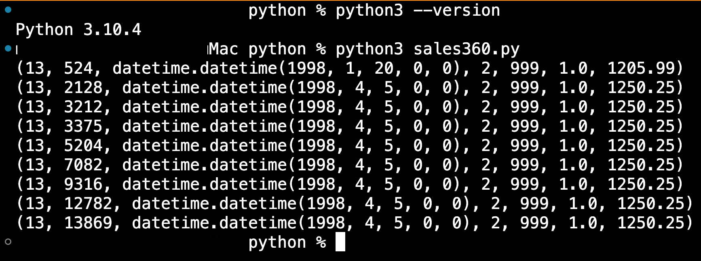

# Develop Python Applications for Oracle Autonomous Database

## Introduction

The python-oracledb driver allows Python 3 applications to connect to Oracle Database. Python-oracledb is the new name for the Python cx_Oracle driver.

### About this Lab

By default, python-oracledb runs in a Thin mode which connects directly to Oracle Database. This mode does not need Oracle Client libraries. However, some additional functionality is available when python-oracledb uses them. Python-oracledb is in Thick mode when Oracle Client libraries are used. Both modes have comprehensive functionality supporting the Python Database API v2.0 Specification.


       
### Features

* Python-oracledb is the new name for the popular Python cx_Oracle driver for Oracle Database.
* Python-oracledb 1.0 is a new major release - the successor to cx_Oracle 8.3
* Python-oracledb is simple and small to install  
* Python-oracledb is now a Thin driver by default - it connects directly to Oracle Database. 
* Python-oracledb has comprehensive functionality conforming to the Python Database API v2.0 Specification, with many additions and just a couple of exclusions.
* A Thick mode can be optionally enabled by an application call. This mode has similar functionality to cx_Oracle and supports Oracle Database features that extend the Python DB API. To use this mode, the widely used and tested Oracle Client libraries such as from Oracle Instant Client must be installed separately.
* Python-oracledb runs on many platforms, including favourites like Linux, macOS and Windows. It can also be used on platforms where Oracle Client libraries are not available (such as Apple M1, Alpine Linux, or IoT devices), or where the client libraries are not easily installed (such as some cloud environments).

Estimated Time: 20 minutes

### Objectives

In this lab, you will:

* Write Python code to access Oracle Database using python-oracledb with an Autonomous Database wallet.
<!-- * Run Python code without an Autonomous Database wallet (wallet-less) using a One-way TLS connection string copied from Lab 1 -->
  
### Prerequisites

This lab assumes:

* An Autonomous Database has been created.
* A wallet has been downloaded. 
<!-- * One-way TLS connection has been configured. -->

## Task 1: Install python

To use python-oracledb you need Python Python 3.8, 3.9, 3.10, 3.11, 3.12 or 3.13 depending on the operating system. 

### macOS

Use Python 3.7 to 3.10. Install [Python 3](https://www.python.org/downloads/macos/).   

### Microsoft Windows 

Use Python 3.7 to 3.10. Install [Python 3](https://www.python.org/downloads/windows/).  

### Oracle Linux 

Use Python 3.6 to 3.10. Install [Python 3](https://yum.oracle.com/oracle-linux-python.html).  
 
1. Check the python version 

      ```
      <copy>
            python3 --version
      </copy>
      ```   

      On Oracle Linux 8, you can use pre-installed Python 3.6, and On Oracle Linux 7, you might need to install [Python 3](https://yum.oracle.com/oracle-linux-python.html).
 
## Task 2: Install python-oracledb

1. Install python-oracledb use to the following command. The --user option may be useful if you do not have permission to write to system directories
2. Please follow the complete installation instructions from [Installing python-oracledb](https://python-oracledb.readthedocs.io/en/latest/user_guide/installation.html).

      ```
      <copy> 
      python3 -m pip install oracledb
      -- please check the installation guide if required
      -- python3 -m pip install oracledb cryptography --upgrade --user
      </copy>
      ```   
      The installation --user option is useful when you do not have permission to write to system directories:
      ```
      <copy> 
            python3 -m pip install oracledb --upgrade --user
      </copy>
      ```  
  
## Task 3: Develop a Python application using a wallet

1. In this Task, we will develop a Python application using an Autonomous Database wallet. For python-oracledb in Thin mode, only two files from the wallet zip file are required.

      

* **tnsnames.ora** - Maps net service names used for application connection strings to your database services

* **ewallet.pem** - Enables SSL/TLS connections in Thin mode. Keep this file secure

      Copy these two files into a folder named *mywalletfiles* in any directory of your choice, 
  
      Create a Python script file *sales360.py* 

      ```
      <copy> 
      import oracledb   

      # database username and password 
      username = "<db_user>"
      user_pwd = "<password>"

      # for example
      # username = "demouser"
      # user_pwd = "Welcome1234#"
      
      # directory containing the ewallet.pem and tnsnames.ora  
      wall_config_dir = "/<path_to_config_folder_mywalletfiles>"

      # for example here mywalletfiles folder contains extracted zip file
      # wall_config_dir = "/Users/username/Workarea/Polyglot/wallet/mywalletfiles"

      # wallet password 
      wall_pwd = "<wallet_password>"
  
      # connection string name for example demoadw_high
      # please check tnsnames.ora file in your database wallet to get tns_name 
      # or refer Lab 1 for more details

      tns_name = "<connectionname>"

      # for example
      # tns_name = "adbdw110612_high"

      connection = oracledb.connect(user=username, 
                                    password=user_pwd,
                                    dsn=tns_name,
                                    config_dir=wall_config_dir,
                                    wallet_location=wall_config_dir,
                                    wallet_password=wall_pwd)

      with connection.cursor() as cursor:
            sql = """select * from sales360 where rownum < 10"""
            for r in cursor.execute(sql):
                  print(r)
      </copy>
      ``` 

      Substitute <db\_user\>, <password\>, <path\_to\_config\_folder\_mywalletfiles\> and <connectionname\> based on your configurations in Lab 1 

      Run the Python code using

      ```
      <copy>
            python3 sales360.py 
      </copy>
      ``` 

      The output will be sales data.

      
   
<!-- ## Task 4: Python Application Development with One-way TLS wallet-less connection 
 
1. To make a wallet-less connection with Autonomous Database, Task 5 (One-way TLS connection to Oracle Autonomous Database for wallet-less connections) in Lab 1 of this workshop has to be completed.

2. Create *customers360.py* to view data in the customers360 table.  
 

      ```
      <copy> 
      import oracledb 

      # database username and password  
      username = "<db_user>"
      user_pwd = "<password>"

      # connection string copied from Lab 1, Task 5. 
      tlsconnstr = """(description= (retry_count=20)(retry_delay=3)
      (address=(protocol=tcps)(port=1521)
      (host=adb.<region identifier>.oraclecloud.com))
      (connect_data=(service_name=<service_prefix>_<instance_name>_high.adb.oraclecloud.com))
      (security=(ssl_server_dn_match=yes)
      (ssl_server_cert_dn="CN=adwc.uscom-east-1.oraclecloud.com, OU=Oracle BMCS US, O=Oracle Corporation,
      L=Redwood City, ST=California, C=US")))"""

      connection = oracledb.connect(user=username, password=user_pwd, dsn=tlsconnstr)

      with connection.cursor() as cursor:
            sql = """select * from customers360 where rownum < 10"""
            for r in cursor.execute(sql):
                  print(r) 

      </copy>
      ``` 

      Substitute <db\_user\>, <password\>, <service\_name\>, <service\_prefix\>, <instance\_name\> based on your configurations in Lab 1 

3. Run the python code using

      ```
      <copy>
      python3 customers360.py 
      </copy>
      ``` 

      You will now be able to view customer data from customers360 table. -->
 
   You successfully made it to the end this of this. You may now  **proceed to the next lab**.

## Learn More
    
* [Quick Start: Developing Python Applications for Oracle Autonomous Database](https://www.oracle.com/database/technologies/appdev/python/quickstartpython.html)
* [python-oracledb documentation](https://python-oracledb.readthedocs.io/en/latest/index.html)  
* [Easy wallet-less connections to Oracle Autonomous Databases in Python](https://blogs.oracle.com/opal/post/easy-way-to-connect-python-applications-to-oracle-autonomous-databases)
* [Code Examples: python-oracledb](https://github.com/oracle/python-oracledb) 
* [Installing python-oracledb](https://python-oracledb.readthedocs.io/en/latest/user_guide/installation.html)
* [Getting Started with Python and Oracle Database](https://apexapps.oracle.com/pls/apex/r/dbpm/livelabs/view-workshop?wid=3482)
  
## Acknowledgements

* **Author** - Madhusudhan Rao, Principal Product Manager, Database 
* **Contributors** - Kevin Lazarz, Senior Principal Product Manager and Christopher Jones, Senior Principal Product Manager
* **Last Updated By/Date** -  Madhusudhan Rao, 4th Oct 2024.
