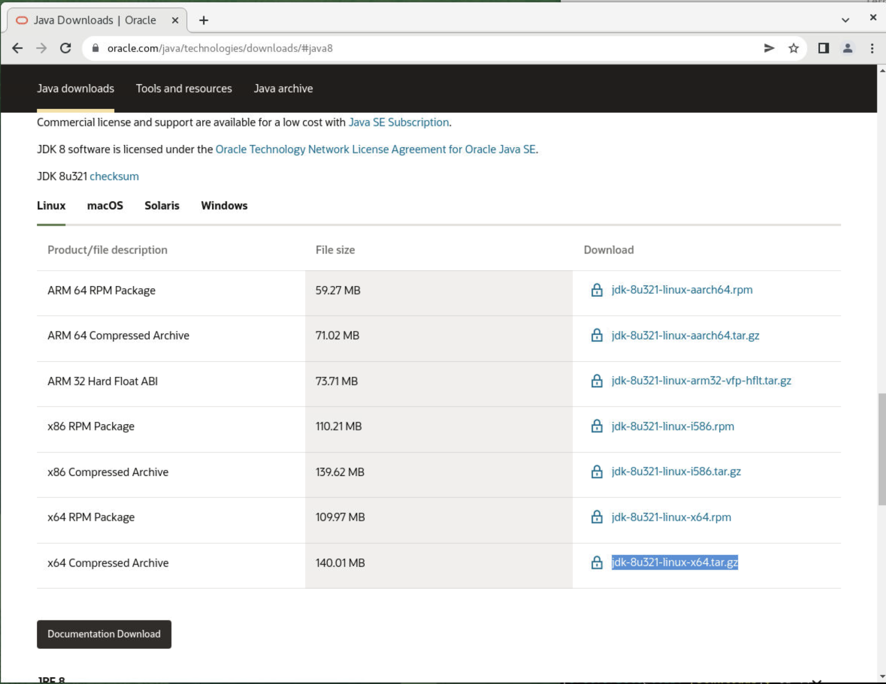
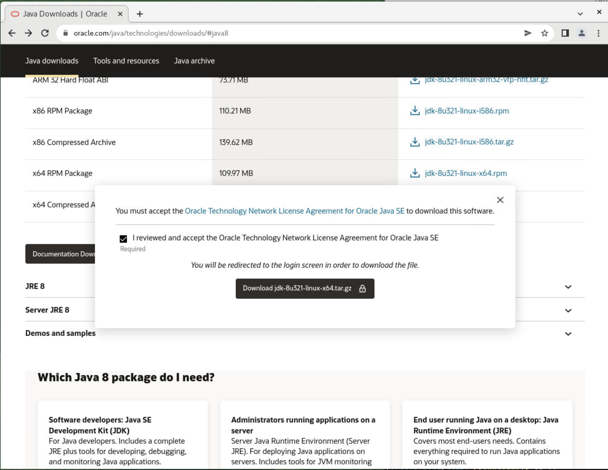
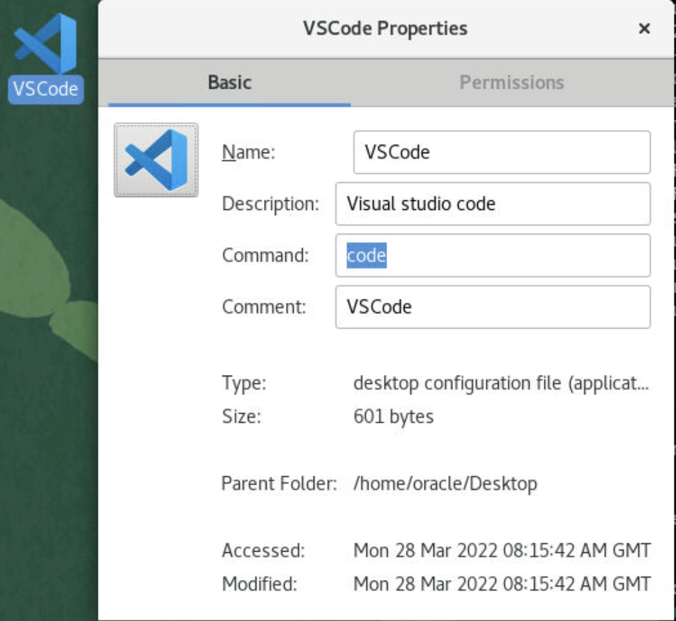

# Install Tools and Services

## Introduction

In this lab, we will configure Install and configure SQL Developer to access CDB and PDB, Install the software like JDK, Python, NodeJS, and NPM

Estimated Time: 40 minutes

### Objectives
 
In this lab, you will:
* Download and Install JDK. 
* Download, Install and Configure SQL Developer
* Review Net Manager configuration
* Install developer tools such as Visual Code
* Install and Verify Node JS and Python

### Prerequisites 
This lab assumes you have:
 
* Access to Oracle Database 19c instance
* A Valid SSH Key Pair
  
## Task 1: Install JDK 

1. Download JDK, since we are using Oracle Linux x64 Compressed Archive
 
       
 
2. Download JDK

       

3. UnCompress the JDK file in Downloads folder


## Task 2: Install Visual Studio Code

1. Configure connection parameters

      ```
      <copy>
      # cd /etc/yum.repos.d
      sudo vi vscode.repo 
      </copy>
      ``` 

      ```
      <copy> 
      [vscode]
      name=vscode
      baseurl=https://packages.microsoft.com/yumrepos/vscode/
      enabled=1
      gpgcheck=1
      gpgkey=https://packages.microsoft.com/keys/microsoft.asc
      </copy>
      ``` 

      ```
      <copy> 
      sudo su
      yum install code 
      </copy>
      ``` 

      create Visual code launcher from Desktop 

       

## Task 3: Install NodeJS

1. Configure connection parameters

      ```
      <copy>
      sudo yum install oracle-nodejs-release-el7
      sudo yum install nodejs
      sudo yum install npm
      </copy>
      ``` 

      Verify the installed node version

      ```
      <copy> 
      node -v
      v16.14.1
      npm -v
      8.5.0
      </copy>
      ``` 

## Task 4: Install Python3

1. Configure connection parameters

      ```
      <copy>
      sudo yum install -y python3
      </copy>
      ``` 

      Verify the output if Python 3 is already installed

      ```
      <copy> 
      Loaded plugins: langpacks, ulninfo
      Package python3-3.6.8-18.0.5.el7.x86_64 already installed and latest version
      Nothing to do
      </copy>
      ``` 

      install cx\_Oracle

      ```
      <copy> 
            [orcl:oracle@x:~/pythondb]$ python3 -m pip install cx_Oracle --upgrade --user
            Collecting cx_Oracle
            Downloading https://files.pythonhosted.org/packages/ec/28/84cc23a2d5ada575d459a8d260286d99dde4b00cafcc34ced7877b3c9bf0/cx_Oracle-8.3.0-cp36-cp36m-manylinux_2_5_x86_64.manylinux1_x86_64.manylinux_2_12_x86_64.manylinux2010_x86_64.whl (858kB)
            100% |████████████████████████████████| 860kB 1.7MB/s 
            Installing collected packages: cx-Oracle
            Successfully installed cx-Oracle-8.3.0
      </copy>
      ``` 

   You successfully made it to the end this lab. You may now  *proceed to the next lab* .  

## Learn More

* [Install Visual Code](https://blogs.oracle.com/wim/post/installing-visual-studio-code-on-oracle-linux-7) 
* [How do I start with Node.js](https://nodejs.org/en/docs/guides/getting-started-guide/) 
 
## Acknowledgements

* **Author** - Madhusudhan Rao, Principal Product Manager, Database 
* **Last Updated By/Date** -  Madhusudhan Rao, May 2022
