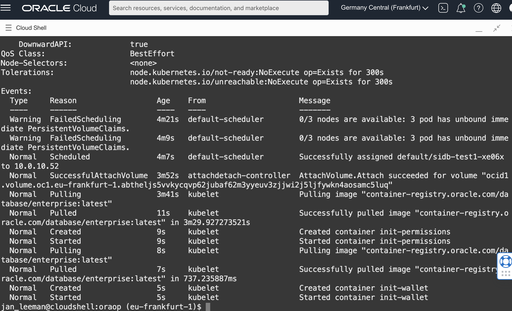
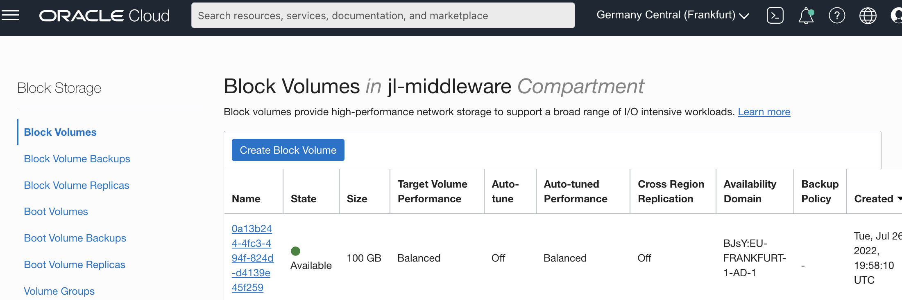
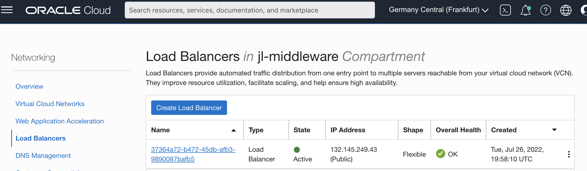
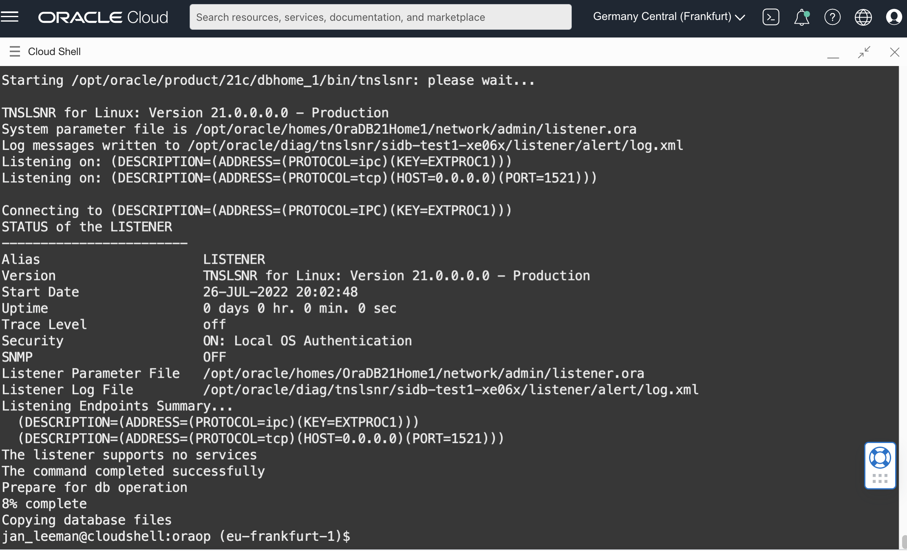
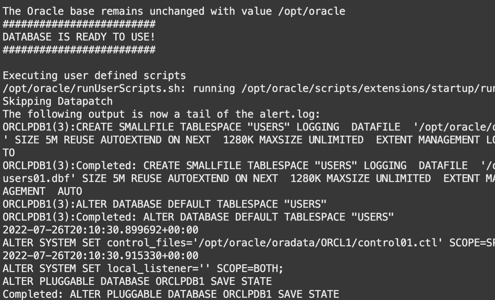
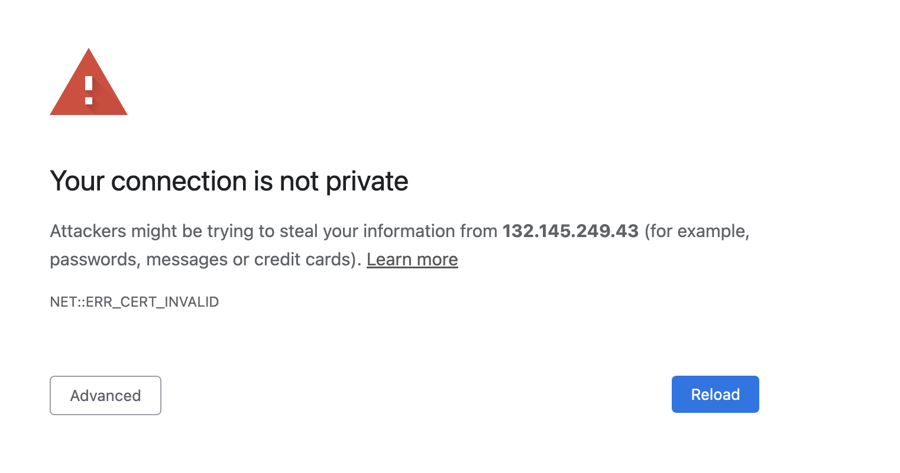
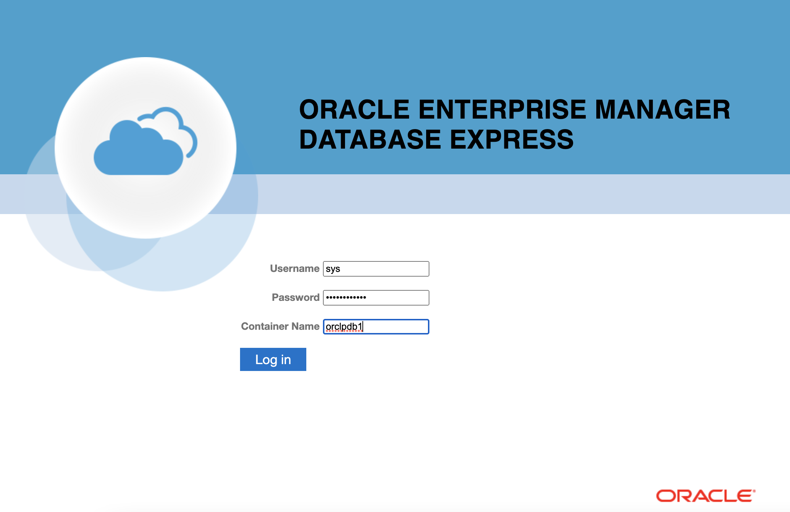
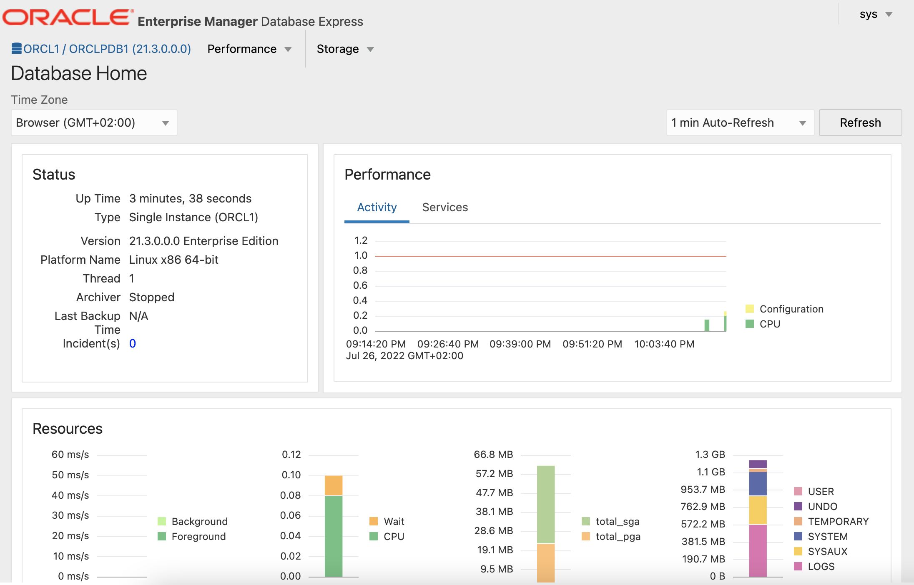

# Deploy a SingleInstance Database with a dynamically allocated Block Volume

## Introduction

#### Dynamic Persistence

In this lab we'll use **Dynamic Persistence Provisioning**, a persistent volume that is automatically provisioned by mentioning a storage class. As we are running on Oracle OCI, we'll use the **oci-bv** storage class. This storage class facilitates dynamic provisioning of the OCI block volumes. The supported access mode for this class is `ReadWriteOnce`. For other cloud providers, you can similarly use their dynamic provisioning storage classes.

We'll also specify the  `Reclaim Policy` of the dynamically provisioned volumes as `Delete`. In this case the volume is deleted when the corresponding database deployment is deleted.


Estimated Time: 20 minutes

### Objective
* Create a database running on Kubernetes, using a block volume as persistency store

### Prerequisites
* You have executed Lab 2: Install the Oracle Database Kubernetes Operator


## Task 1: Store passwords in Kubernetes Secrets
When creating a database we will need a few passwords:

- Your Oracle Account password to pull the DB docker container from the Oracle Container Repository 
- The Admin password of the database we'll be creating

In kubernetes we store these passwords in secrets.

1. In the Cloud Shell, log into the oracle repository with the below command :
    ```
    <copy>docker login container-registry.oracle.com</copy>
    ```

    You'll be prompted for your username and password, please enter your Oracle website username and password (**not** your OCI Cloud username !)
    If all goes well you'll get a `Login Succeeded` message.

2. Now use the local config file to create the secret we'll pass to the operator:
    ```
    <copy>kubectl create secret generic oracle-container-registry-secret --from-file=.dockerconfigjson=.docker/config.json --type=kubernetes.io/dockerconfigjson</copy>
    ```

    Please note we're assuming you are in the home directory of your cloud shell, if not please make sure to correct the path to the .docker directory accordingly.

3. Let's now create a secret containing the **admin password** we'll want to specify for the new database: 
    ```
    <copy>kubectl create secret generic admin-secret --from-literal=oracle_pwd=Your-DB-Password</copy>
    ```
    Replace `Your-DB-Password` with a password of your choosing, it should be 12 characters long, have letters, numbers and Capitals


## Task 2: Create the DB Config file for the Operator

To initiate the creation of the database by the Operator we'll have to create a config file describing the desired database setup.  For this lab we'll use the file [singleinstancedatabase-create.yaml](https://objectstorage.us-ashburn-1.oraclecloud.com/p/LNAcA6wNFvhkvHGPcWIbKlyGkicSOVCIgWLIu6t7W2BQfwq2NSLCsXpTL9wVzjuP/n/c4u04/b/livelabsfiles/o/developer-library/singleinstancedatabase-create.yaml) which contains a configuration ready to use for this part of the lab.

We'll be highlighting some of the sections of this file below, no need to do any edits in this Task :

1. In the top level section of the file, the parameter `kind`refers to the type of database to create, in this case we will be launching a DB in a container running on the Kubernetes cluster, known as a **Single Instance Database**.  Other possible choices are to use an Autonomous DB on OCI, to use a, external Container database, and more.
    The parameter `name` defines the oracle database name we'll be creating, as well as the name used to refer to the database via the various `kubectl` commands

    ```
    apiVersion: database.oracle.com/v1alpha1
    kind: SingleInstanceDatabase
    metadata:
      name: sidb-test1
      namespace: default
    ```

2. `secretName` defines the name of the secret containing the database password.  You can specify to remove this secret after creation for enhanced security using the parameter `keepSecret`.

    ```
    adminPassword:
      secretName: admin-secret
      keepSecret: true
    ```

3. The `image` section specifies where to pull the database container image from.  In this case we use the default image, you could build a custom image and refer to that image instead. The parameter `pullSecrets` refers to the name of the secret where we stored the credentials of the container repo, in this case the Oracle Container Repository.

    ```
    image:
     pullFrom: container-registry.oracle.com/database/enterprise:latest
     pullSecrets: oracle-container-registry-secret
    ```

4. The section `persistence` defines the type of persistent storage to use.  In this case we'll use the class `oci` to use an OCI Block Volume.  The parameter `accessMode` specifies this is a block volume that can only be mounted on a single node of the cluster.  In the next lab we'll be using an NFS volume which can be mounted on multiple nodes at the same time.

    ```
    persistence:
      size: 100Gi
      storageClass: "oci"
      accessMode: "ReadWriteOnce"
    ```

5. And finally the parameter `replicas`specifies how many pods we want to have up and running.  As this is a block-based volume that can only be mounted on a single node of the cluster we are using **1**.

    ```
    replicas: 1
    ```

  

## Task 3: Launch and track the DB creation

Launching the creation of the database is done through a single command applying the config file on the cluster.  Next the operator will initiate the necessary operations to spin up the database, and this will take approximately 15 minutes in a fresh environment - as for example the images have to be copied over from the container repository.

In this section we'll explain a number of commands that allow you to track what is happening during this creation process and how to debug issues you might encounter.

1. Apply the config file to initiate the DB creation : 

    ```
    <copy>kubectl apply -f https://objectstorage.us-ashburn-1.oraclecloud.com/p/LNAcA6wNFvhkvHGPcWIbKlyGkicSOVCIgWLIu6t7W2BQfwq2NSLCsXpTL9wVzjuP/n/c4u04/b/livelabsfiles/o/developer-library/singleinstancedatabase-create.yaml</copy>
    ```

2. Validate the instance definition was submitted to the operator:

    ```
    <copy>kubectl get singleinstancedatabase sidb-test1</copy>
    ```

    This will result in the following output:

    ```
    NAME         EDITION      STATUS    VERSION       CONNECT STR   OEM EXPRESS URL
    sidb-test1   Enterprise   Pending   Unavailable   Unavailable   Unavailable
    ```

    The object was created, but the db instance is not yet available.

3. We can use the below command to see more details:

    ```
    <copy>kubectl describe singleinstancedatabase sidb-test1</copy>
    ```

    Output of the command at this stage:

    ```
    Oem Express URL:     Unavailable
      Pdb Connect String:  Unavailable
      Pdb Name:            orclpdb1
      Persistence:
        Access Mode:    ReadWriteOnce
        Size:           100Gi
        Storage Class:  oci
      Release Update:   Unavailable
      Replicas:         1
      Role:             Unavailable
      Sid:              ORCL1
      Status:           Pending
    Events:
      Type    Reason            Age                From                    Message

    ----    ------            ----               ----                    -------

      Normal  Service creation  43s                SingleInstanceDatabase  successfully created service type LoadBalancer
      Normal  Database Pending  13s (x4 over 43s)  SingleInstanceDatabase  waiting for a pod to get to running state
    ```

    We see the operator is waiting for the pod to become available.

4. We can check the status of the pod where the db will be launched, and follow the different steps of the creation process:	

    ```
    <copy>kubectl get pod</copy>
    ```

    Initially this command will report the following:

    ```
    NAME               READY   STATUS     RESTARTS   AGE
    sidb-test1-xe06x   0/1     Init:0/2   0          82s
    ```

5. To get more details on the creation, you can issue the following command, replacing the exact name of the pod with the name in your environment:

    ```
    <copy>kubectl describe pod sidb-test1-xe06x</copy>
    ```

    This will allow you to see the events happening on the pod level - and any issues, like for example an incorrect password for the container registry

    
    
​    You can execute this command a few times to see the evolution.

6. While the pod is starting up, you can check the creation of the block volume and a load balancer that were specified in the config file:

    - Navigate to **Storage**, then under **Block Storage** select **Block Volumes**.  You will see a new block volume has appeared :

    

    - Navigate to **Networking**, then select **Load Balancers**.  You will see a new load balancer serving the EM and SQLplus ports of the DB:

    

7. By now the pod should be running, but not yet **ready** : re-issue the command below:

    ```
    <copy>kubectl get pod</copy>
    ```

    You'll see:

    ```
      NAME               READY   STATUS    RESTARTS   AGE
      sidb-test1-xe06x   0/1     Running   0          5m26s
    ```

8. We can now re-issue the describe command against the database entity to see more details on the database creation :

    ```
    <copy>kubectl describe singleinstancedatabase sidb-test1</copy>
    ```

    Output of the command at this stage:

    

    And re-issuing the same command a few more times will finally show following : 

    

9. It looks like the DB is now up and running !  Let's re-issue the get command : 

    ```
    <copy>kubectl get singleinstancedatabase sidb-test1</copy>
    ```

    Resulting output: 

    ```
    NAME         EDITION      STATUS     VERSION      CONNECT STR                 OEM EXPRESS URL
    sidb-test1   Enterprise   Patching   21.3.0.0.0   132.145.249.43:1521/ORCL1   https://132.145.249.43:5500/em
    ```

## Task 4: Connect to the Database

OK, it looks like our database is indeed up and running !  Let's try to connect to the Enterprise Manager ...

1. Click on the link in the above output, in my case this is  https://132.145.249.43:5500/em, use your IP address !

    

    You will now get a warning because we did not configure certificates.  In Chrome you can get around this message quite simply:

2. Type the following text in your browser when visualizing the above screen :
	  **thisisunsafe**

    After entering this string of characters, the connection is accepted and you end up on the login screen :

    


3. Enter the username `sys`, the password you specified for the database earlier, and the container db name `orclpdb1`.  You should now see the console :

    


    Alternatively, you can use the command line to connect via sqlplus:

4. Get the connect string with the below command : 

    ```
    <copy>kubectl get singleinstancedatabase sidb-test1 -o "jsonpath={.status.pdbConnectString}" && echo -e "\n"</copy>
    ```

    This should output something like : 

    ```
    132.145.249.43:1521/ORCLPDB1
    ```

5. Use your string to compose a command looking like the below, replacing **Your_passwd** with the one you specified:

    ```
    <copy>sqlplus sys/Your_Passwd@132.145.249.43:1521/ORCLPDB1 as sysdba</copy>
    ```

6. You can quit sqlplus with the `quit` command.

  

    Congratulations, your database is up and running, and you are able to connect to it through Enterprise Manager and Sqlplus !  

7. Optional deletion of the database
    We will not use the database instance `sidb-test1` in this lab anymore.  In case you want to free up the resources taken up by this database (a pod in your Kubernetes cluster, a Block Volume and a load balancer), you can issue the following command to delete the database and automatically delete the associated resources:

    ````
    <copy>kubectl delete singleinstancedatabase.database.oracle.com sidb-test1</copy>
    ````

You may now **proceed to the next lab**.

## Acknowledgements
* **Author** - Jan Leemans, July 2022
* **Last Updated By/Date** - Jan Leemans, March 2023
    