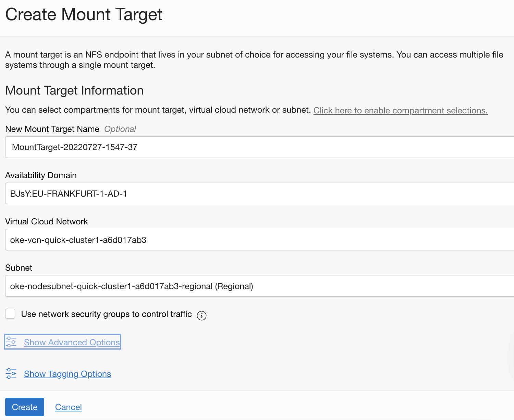
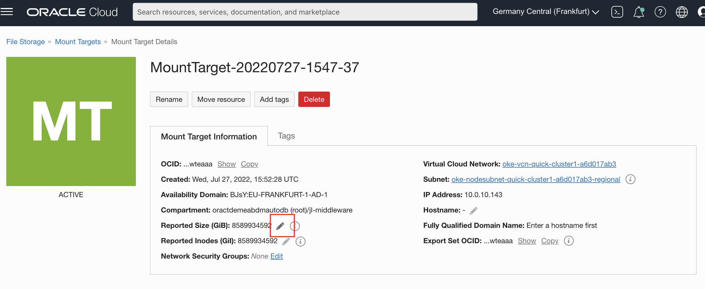
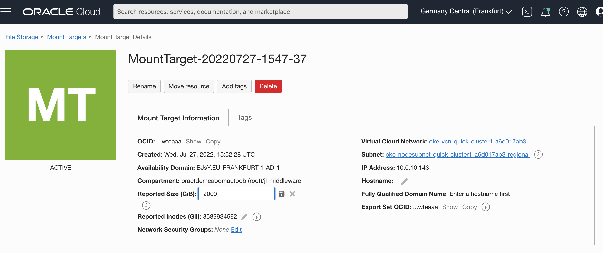
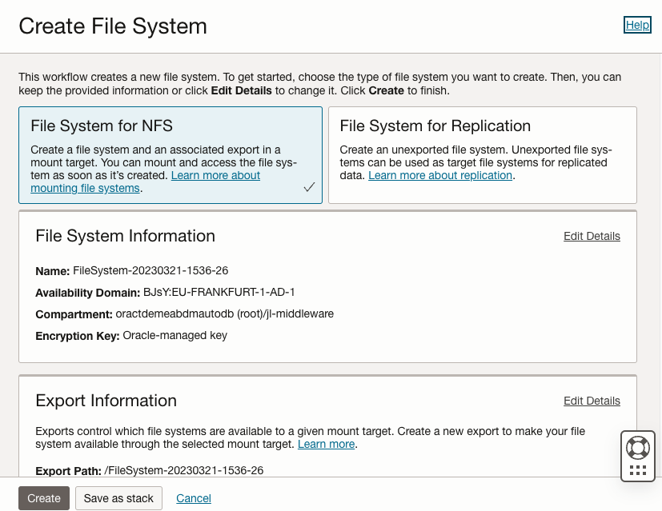
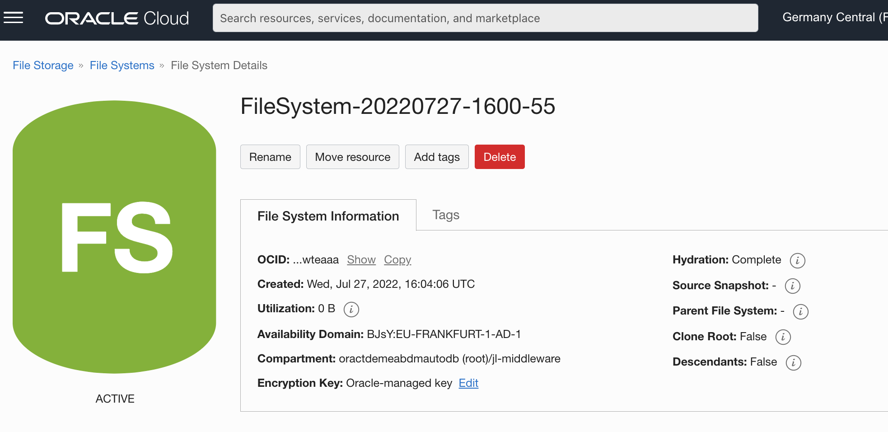
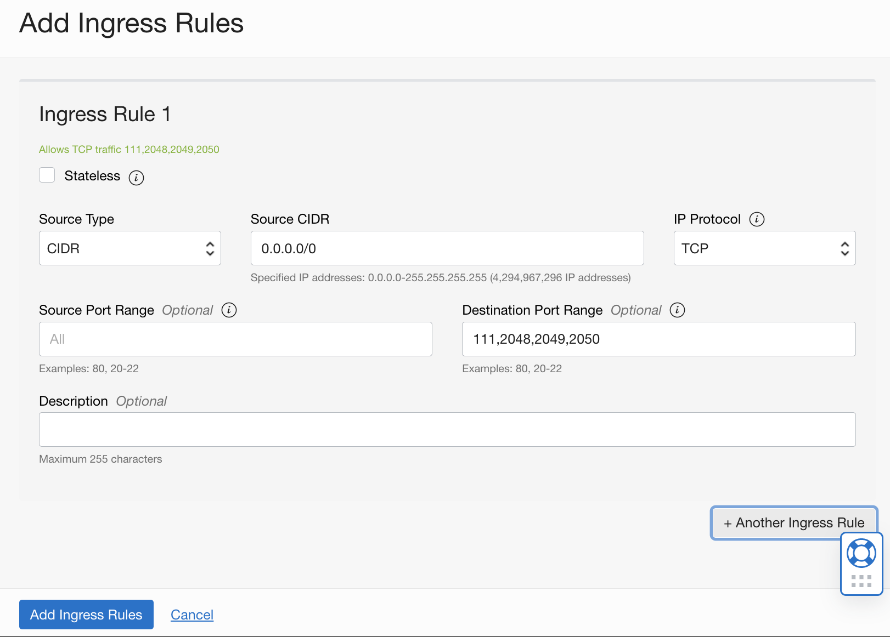

# Deploy a SingleInstance Database with a static NFS filesystem

## Introduction

#### Static Persistence

In this lab we'll be using one of the **Static Persistence** options for our database, so we'll create manually a persistent volume and refer to it in our database configuration file.

You could use a block volume for this, but the result would be like in the first lab: this volume can only be mounted on a single node, so no failover options. 

Therefore we'll be using an NFS volume, which can be mounted on all 3 nodes at once and allows us to demonstrate what happens when a node goes down.


**Assumption** : we assume you ran the first lab, so you have created the various secrets required to pull down and spin up a database container.


Estimated Time: 20 minutes

### Objective
* Create a database running on Kubernetes, using an NFS volume as persistency store

### Prerequisites
* You have executed Lab 2: Install the Oracle Database Kubernetes Operator


## Task 1: Prepare your NFS persistent volume
1. On the OCI console, navigate to **Storage**, section **File Storage**, and select **Mount Targets**
    Create a new mount target using the **Create Mount Target** button.

    - Make sure to select the **Virtual Cloud Network** that was created as part of the OKE Cluster creation - it will have a name  starting with `oke-vcn-quick-...`
    - Select the **Subnet** where the kubernetes nodes are located.  This subnet has a name starting with `oke-nodesubnet-quick-...`
    - Leave the other parameters on their default values

    

    You can now hit the **Create** button.

    - After the creation you are redirected to the Details screen of the mount point.  Before we move on, you need to change the **Reported Size** of the mount target.  To  do this, use the **pencil** icon on the side of the **Reported Size** parameter:
    

    - After clicking the pencil, enter a value of **2000** GiB in the edit box, and hit the **Save** icon

    

    - Before navigating away from this screen, take note of the **IP Address** of the mount point, you will need this information later in the setup.  In the example above, the address is 10.0.10.143

     

2. Now navigate to the **File Storage**, then **File Systems** menu, and click the **Create File System** button

    - Keep the default workflow: *File System for NFS*
    
    - All parameters are pre-filled, just validate the selected Mount Target is indeed the mount target you just created

    - Take note of the Export Path : you will need this information later in the database configuration file.  In the below example the path is `/FileSystem-20220727-1600-55`

    

    - Click the **Create** button to finish the operation

    - The **Utilization** of the volume is currently **0 B**: the volume has not yet been used.  We'll see how this parameter will increase once the DB is created.

    - Copy and store the **OCID** of the filesystem (you can use the **Copy** button), you will need this info later.

    

3. To finalize the configuration of the volume we need to **open the appropriate ports** on the subnet used to allow the Kubernetes nodes and the NFS volume to communicate with each other : 

    - Navigate to **Networking**, and select **Virtual Cloud Networks**

    - Select the VCN that was created for the Kubernetes cluster (name staring with `oke-vcn-quick-...`)

    - Select the Subnet used for the kubernetes nodes (name starting with `oke-nodesubnet-quick-...`)

    - Select the security list of the subnet, with a name starting with `oke-nodeseclist-...`

    - Click the **Add Ingress Rule** button and create a Stateful *ingress* from ALL ports in *source CIDR block* to **TCP** ports 111, 2048, 2049, and 2050 :

          - **Source CIDR** : 0.0.0.0/0
          - IP Protocol: TCP
          - Destination Port Range: 111,2048,2049,2050

    

    - Repeat the operation but this time specifying the **UDP protocol** to set a Stateful *ingress* from ALL ports in *source CIDR block* to **UDP** ports 111 and 2048:

          - **Source CIDR** : 0.0.0.0/0
          - IP Protocol: UDP
          - Destination Port Range: 111,2048

    - Now select the **Egress Rules** resources on the left of the screen

    - Here click the **Add Egress Rules** to create a Stateful *egress* from **TCP** ALL ports to ports 111, 2048, 2049, and 2050 in *destination CIDR block*.

          - **Destination CIDR** : 0.0.0.0/0
          - IP Protocol: TCP
          - Destination Port Range: 111,2048,2049,2050

    - Repeat the operation but this time specifying the **UDP protocol** to set a Stateful *egress* from **UDP** ALL ports to port 111 in *destination CIDR block*.

          - **Destination CIDR** : 0.0.0.0/0
          - IP Protocol: UDP
          - Destination Port Range: 111

       

4. Next we need to create a kubernetes **persistent volume** that points to the configuration we just created.  To do this, we'll use the OCI Cloud shell command interface

    - Edit a new file to contain the definition of the persistent volume, using the `vi` or `nano` editor

      - File name : pv.yaml

      - Paste the below content into the file

        ```
        apiVersion: v1
        kind: PersistentVolume
        metadata:
          name: nfs-vol-1
        spec:
          storageClassName: oci-fss
          capacity:
            storage: 224Gi
          volumeMode: Filesystem
          accessModes:
           - ReadWriteMany
          persistentVolumeReclaimPolicy: Retain
          csi:
            driver: fss.csi.oraclecloud.com
            volumeHandle: "<OCID of the file system>:<Mount Target IP Address>:/<Export Path>"
        ```

    - Replace the placeholders for the parameter `volumeHandle`: 

          - `<OCID of the file system>` : this is the OCID you noted down after the creation of the filesystem
          - `<Mount Target IP Address>` : the IP address of the mount point you noted earlier
          - `<Export Path>` : the export path you noted earlier

      - Example `volumeHandle`: 

        ```
        volumeHandle: "ocid1.filesystem.oc1.eu_frankfurt_1.aaaaaqe3bj...eaaa:10.0.10.156:/FileSystem-20220713-1036-02"
        ```

    - Now apply the config using `kubectl`: 

      ```
      <copy>kubectl apply -f pv.yaml</copy>
      ```

      This should show you :  `persistentvolume/nfs-vol-1 created`

     


## Task 2: Creating the DB Config file for the Operator

To initiate the creation of the database by the Operator we'll have to create a config file describing the desired database setup.  For this lab we'll use the file [singleinstancedatabase_fss.yaml](https://objectstorage.us-ashburn-1.oraclecloud.com/p/LNAcA6wNFvhkvHGPcWIbKlyGkicSOVCIgWLIu6t7W2BQfwq2NSLCsXpTL9wVzjuP/n/c4u04/b/livelabsfiles/o/developer-library/singleinstancedatabase-fss.yaml) which contains a configuration ready to use for this part of the lab.

We'll be highlighting some of the sections of this file that differ from the first lab we ran:

1. In the top level section of the file, the parameter `name` defining the name of the configuration is now **sidb-test2**
  
    ```
    apiVersion: database.oracle.com/v1alpha1
    kind: SingleInstanceDatabase
    metadata:
      name: sidb-test2
      namespace: default
    ```
  
2. The section `persistence` defines the type of persistent storage to use.  In this case we'll use the class `oci-fss`.  The parameter `accessMode` is now defined as `ReadWriteMany`, as we'll be running multiple pods that all have access to the volume.  Only one pod will hold the active database, the others are in stand-by.  The parameter `volumeName` is the link to the Persistent Volume `nfs-vol-1` we defined earlier.

    ```
    persistence:
      size: 224Gi
      storageClass: "oci-fss"
      accessMode: "ReadWriteMany"
      volumeName: "nfs-vol-1"
    ```

3. And finally the parameter `replicas`specifies how many pods we want to have up and running.  We'll be running a pod on each node of the cluster, so we'll set this parameter to **3**.

    ```
    replicas: 3
    ```

  

## Task 3: Launching and tracking the DB creation

Launching the creation of the database is done through the same single command as in the first lab, specifying the new configfile.

1. Apply the config file to initiate the DB creation : 

    ```
    <copy>kubectl apply -f https://objectstorage.us-ashburn-1.oraclecloud.com/p/LNAcA6wNFvhkvHGPcWIbKlyGkicSOVCIgWLIu6t7W2BQfwq2NSLCsXpTL9wVzjuP/n/c4u04/b/livelabsfiles/o/developer-library/singleinstancedatabase-fss.yaml</copy>
    ```

2. You can validate the process of creation of the database as in the previous lab, using the below set of commands :

    ```
    <copy>kubectl get singleinstancedatabase sidb-test2
    kubectl describe singleinstancedatabase sidb-test2
    kubectl get pod
    kubectl describe pod sidb-test2-<your_id></copy>
    ```

    Note you will see 3 pods, choose 1 to validate correct launch of the pods

    Some extra commands that might be useful to debug any issues: 	

    ```
    <copy>kubectl logs sidb-test2-<your_id>
    kubectl get pod -n oracle-database-operator-system
    kubectl logs -n oracle-database-operator-system oracle-database-operator-controller-manager-<your-id></copy>
    ```


3. Once the database is up and running, you can return to the OCI Console, navigate to the File System menu and verify that the the **Utilization** of the volume has increased, typically something like **4 GiB**


4. Validate you can login with sqlplus :

    - Get the connect string with the below command : 

    ```
    <copy>kubectl get singleinstancedatabase sidb-test2 -o "jsonpath={.status.pdbConnectString}" && echo -e "\n"</copy>
    ```

    - Use your string to compose a command looking like the below, replacing **Your_Passwd** with the one you specified:

    ```
    <copy>sqlplus sys/Your_Passwd@132.145.249.43:1521/ORCLPDB1 as sysdba</copy>
    ```

  

Congratulations, your database is up and running, and you are able to connect to it through Enterprise Manager and Sqlplus !  

You may now **proceed to the next lab**, where we'll look at what happens when the node running the DB goes down!


## Acknowledgements
* **Author** - Jan Leemans, July 2022
* **Last Updated By/Date** - Jan Leemans, March 2023
