# Step by step: Implement RAG with Oracle AI Database

## Introduction

In this lab, you build a construction procurement engine with Oracle AI Database and OCI Generative AI. Connect to the database, explore the sample procurement data, and invoke a large language model to generate supplier recommendations and risk explanations. Building on earlier exercises, you’ll apply Python to deliver a fully integrated, AI-powered construction procurement application.

Estimated Time: 30 minutes

### Objectives

* Build the complete construction procurement application as seen in lab 1
* Use OCI Generative AI to generate contextual procurement recommendations
* Use Python to connect to an Oracle AI Database instance and run queries
* Explore procurement data and extract relevant information

### Prerequisites

This lab assumes you have:

* An Oracle Cloud account
* Completed lab 1: Run the demo

## Task 1: Login to JupyterLab

1. To navigate to the development environment, click **View Login Info**. Copy the Development IDE Login Password. Click the Start Development IDE link.

    

2. Paste in the Development IDE Login Password that you copied in the previous step. Click **Login**.

    

3. Click the blue `+`. This will open the Launcher.

    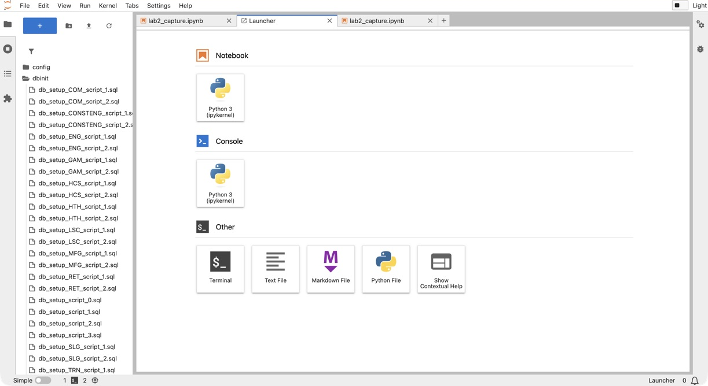

## Task 2: Get familiar with the development environment

1. Review the different elements in JupyterLab:

    **File browser (1):** The file browser organizes and manages files within the JupyterLab workspace. It supports drag-and-drop file uploads, file creation, renaming, and deletion. Users can open notebooks, terminals, and text editors directly from the browser.

    **Launcher (2 and 3):** The launcher offers a streamlined entry point for starting new activities. Users can create Jupyter Notebooks for interactive coding with live code execution, visualizations, and rich markdown. The terminal provides direct shell access for command-line work in the same environment.

    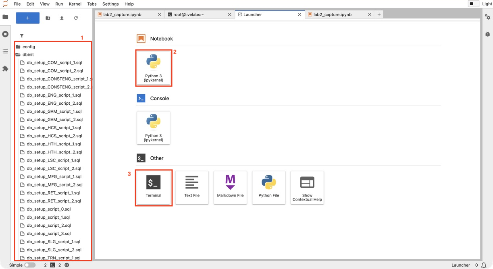

## Task 3: View created tables in Jupyter Lab

1. Navigate back to your terminal window.

    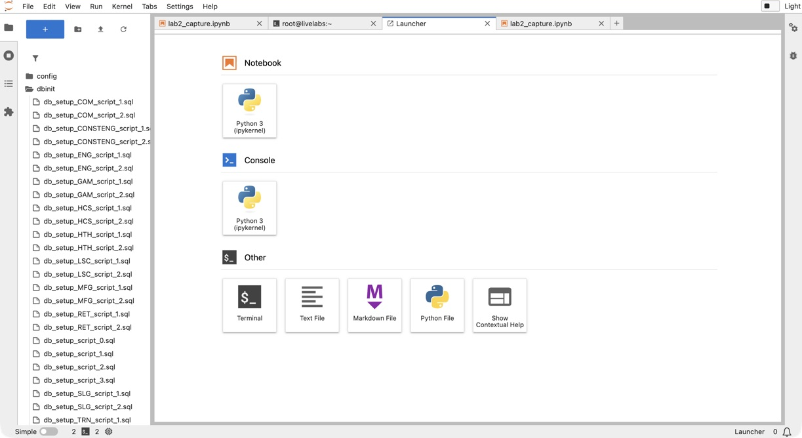

2. In the JupyterLab file browser, open the `dbinit` folder and
    select `db_setup_CONSTENG_script_2.sql`. This is the setup script
    that created the sample Construction Engineering schema for the
    lab. As you review it, notice that it creates the project and
    supplier tables, the `construction_projects_dv` JSON relational
    duality view used to read project data as JSON, and the
    `CE_PROJECT_CHUNKS` table, which later stores text chunks and
    vector embeddings for the RAG flow.

    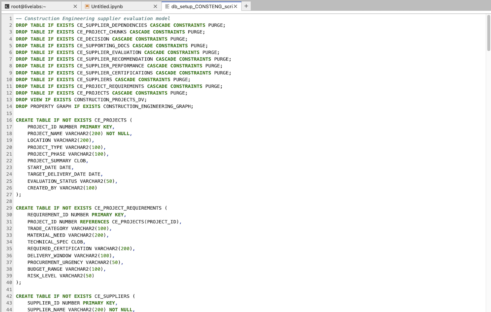

## Task 4: Connect to Database

1. Click the **+** sign on the top left to open the Launcher.

    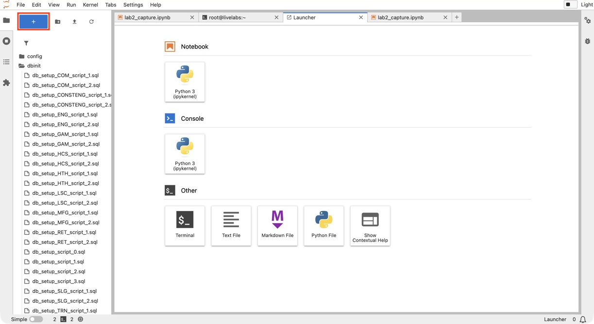

2. Open a new notebook.

    

3. Copy the following code block into an empty cell in your notebook.
    This code imports the required Python libraries, loads the
    database connection details from the environment, connects to
    Oracle AI Database, and creates a cursor that will be used to run
    SQL queries in later steps.

    ```python
    <copy>
    import os
    import json
    import oracledb
    import pandas as pd
    import oci
    import numpy as np
    import re
    from dotenv import load_dotenv
    from PyPDF2 import PdfReader

    load_dotenv()

    username = os.getenv("USERNAME")
    password = os.getenv("DBPASSWORD")
    dsn = os.getenv("DBCONNECTION")

    try:
        connection = oracledb.connect(user=username, password=password, dsn=dsn)
        print("Connection successful!")
    except Exception as e:
        print(f"Connection failed: {e}")

    cursor = connection.cursor()
    </copy>
    ```

4. Run the code cell to connect to Oracle AI Database. When the
    connection is successful, you should see `Connection successful!`
    in the notebook output. This confirms that your notebook can
    query the database in the next steps.

    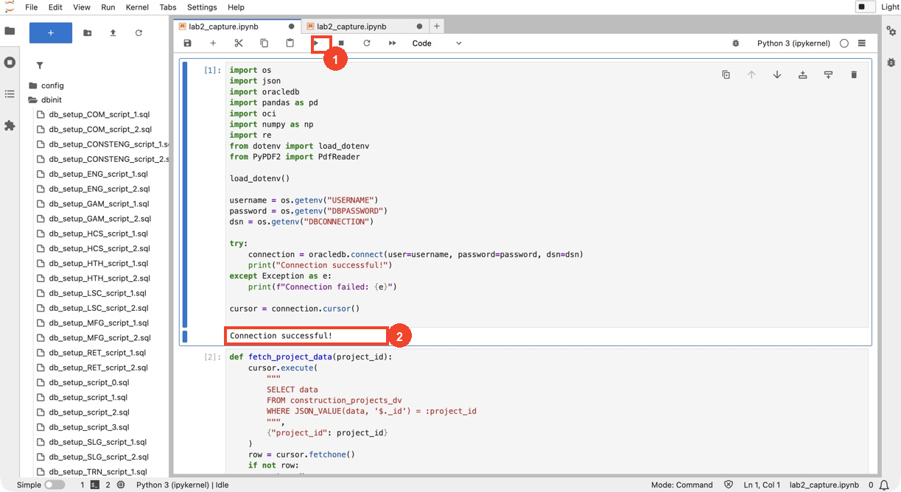

## Task 5: Create a function to retrieve project data from the database

You will query project data from the `construction_projects_dv` JSON
relational duality view. This view combines related relational tables,
including `CE_PROJECTS`, `CE_PROJECT_REQUIREMENTS`,
`CE_SUPPLIER_EVALUATION`, `CE_SUPPLIER_RECOMMENDATION`, and
`CE_SUPPLIERS`, into one JSON document per project. This is useful
because the application can retrieve a complete project profile with a
single query, while the data still remains organized in relational
tables. That project profile is then easier to review, display, and
pass into the GenAI workflow.

In this task, you will:

* **Define a Function**: Create a reusable `fetch_project_data`
  function that queries `construction_projects_dv` by project ID. The
  query uses the project `_id` field inside the JSON document to
  return the matching project.
* **Use an Example**: Fetch data for project `1001`,
  `Downtown Mixed-Use Tower`, to demonstrate how the function
  retrieves one project profile from the database.
* **Display the Results**: Extract selected fields from the JSON
  document and display them in a pandas DataFrame. The table shows
  project details, sourcing requirements, risk level, recommended
  supplier, supplier fit score, and evaluation status.

1. Copy and paste the code below into the new notebook.

    ```python
    <copy>
    def fetch_project_data(project_id):
        cursor.execute(
            """
            SELECT data
            FROM construction_projects_dv
            WHERE JSON_VALUE(data, '$._id') = :project_id
            """,
            {"project_id": project_id}
        )
        row = cursor.fetchone()
        if not row:
            return None
        return json.loads(row[0]) if isinstance(row[0], str) else row[0]


    selected_project_id = 1001
    project_json = fetch_project_data(selected_project_id)

    if project_json:
        requirement = (project_json.get("requirements") or [{}])[0]
        evaluation = (project_json.get("supplierEvaluations") or [{}])[0]
        recommendation = evaluation.get("recommendation") or {}
        supplier = recommendation.get("supplier") or {}

        print(f"Project: {project_json.get('projectName', '')}")
        print(
            "Status:",
            evaluation.get(
                "evaluationStatus",
                project_json.get("evaluationStatus", "Pending Review")
            )
        )

        desired_fields = [
            ("Project ID", selected_project_id),
            ("Project Name", project_json.get("projectName", "")),
            ("Location", project_json.get("location", "")),
            ("Project Type", project_json.get("projectType", "")),
            ("Project Phase", project_json.get("projectPhase", "")),
            ("Required Trade", requirement.get("tradeCategory", "")),
            ("Material Need", requirement.get("materialNeed", "")),
            (
                "Procurement Urgency",
                requirement.get("procurementUrgency", "")
            ),
            ("Budget Range", requirement.get("budgetRange", "")),
            ("Risk Level", requirement.get("riskLevel", "")),
            ("Evaluation ID", evaluation.get("evaluationId", "")),
            ("Recommended Supplier", supplier.get("supplierName", "")),
            ("Supplier Fit Score", recommendation.get("fitScore", "")),
            (
                "Evaluation Status",
                evaluation.get(
                    "evaluationStatus",
                    project_json.get("evaluationStatus", "Pending Review")
                )
            )
        ]

        df_project_details = pd.DataFrame(
            {field_name: [field_value] for field_name, field_value in desired_fields}
        )
        display(df_project_details)
    else:
        print("No data found for project ID:", selected_project_id)
    </copy>
    ```

2. Click the **Run** button to execute the cell. The notebook
    retrieves project `1001`, `Downtown Mixed-Use Tower`, from the
    `construction_projects_dv` view and displays selected project
    details. When the query succeeds, you should see a brief project
    summary followed by a table with fields such as project ID,
    project name, location, project phase, required trade, urgency,
    budget range, and risk level. If no data is found, confirm that
    the project ID is correct and that the database setup completed
    successfully.

    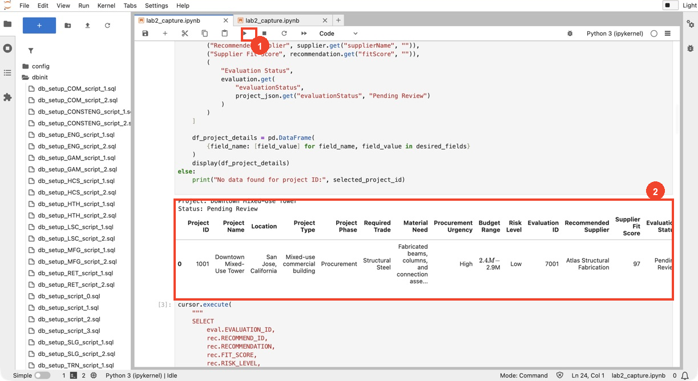

    If you completed Lab 1: Run the Demo, this output should look
    familiar. It shows the same project information that the
    construction procurement officer sees when opening project `1001`
    in the demo application.

## Task 6: Create a function to generate supplier recommendations

In a new cell, you will create and run a
`generate_supplier_recommendations` function. This function uses the
project profile from Task 5 and the staged supplier recommendation
records in the database to generate a construction-specific supplier
evaluation with OCI Generative AI.

Here’s what the code does:

* **Fetch Supplier Recommendation Records**: Query the supplier
  recommendation data for the selected project. The query joins
  `CE_SUPPLIER_EVALUATION`, `CE_SUPPLIER_RECOMMENDATION`, and
  `CE_SUPPLIERS` so the prompt includes each supplier’s
  recommendation, fit score, risk level, capacity status,
  explanation, strengths, and missing information.
* **Build a Prompt**: Combine the selected project profile, sourcing
  requirements, full project JSON, and supplier recommendation records
  into a structured prompt. The prompt gives the LLM decision rules
  for when to use `APPROVE`, `REQUEST INFO`, or `DENY`.
* **Use OCI Generative AI**: Send the prompt to the
  `meta.llama-3.2-90b-vision-instruct` model through OCI’s
  Generative AI inference client.
* **Display the Output**: Print the generated supplier evaluation
  using the same sections used in the Seer Construction app:
  `Project Summary`, `Key Sourcing Requirements`,
  `Top 3 Supplier Recommendations`, `Risks and Missing Information`,
  and `Actionable Steps`.

At this point, the recommendation is generated as notebook output
only. In the next task, you will chunk and store this generated text
so it can be used in the RAG flow.

1. Copy and paste the code in a new cell:

    ```python
    <copy>
    cursor.execute(
        """
        SELECT
            eval.EVALUATION_ID,
            rec.RECOMMEND_ID,
            rec.RECOMMENDATION,
            rec.FIT_SCORE,
            rec.RISK_LEVEL,
            rec.EXPLANATION,
            rec.STRENGTHS,
            rec.MISSING_INFORMATION,
            supplier.SUPPLIER_ID,
            supplier.SUPPLIER_NAME,
            supplier.CATEGORY,
            supplier.REGION,
            supplier.CAPACITY_STATUS,
            supplier.CAPABILITY_SUMMARY
        FROM CE_SUPPLIER_EVALUATION eval
        JOIN CE_SUPPLIER_RECOMMENDATION rec
            ON rec.RECOMMEND_ID = eval.RECOMMEND_ID
        JOIN CE_SUPPLIERS supplier
            ON supplier.SUPPLIER_ID = rec.SUPPLIER_ID
        WHERE eval.PROJECT_ID = :project_id
        ORDER BY rec.FIT_SCORE DESC, eval.EVALUATION_ID
        """,
        {"project_id": selected_project_id}
    )
    df_supplier_recommendations = pd.DataFrame(
        cursor.fetchall(),
        columns=[
            "EVALUATION_ID",
            "RECOMMEND_ID",
            "RECOMMENDATION",
            "FIT_SCORE",
            "RISK_LEVEL",
            "EXPLANATION",
            "STRENGTHS",
            "MISSING_INFORMATION",
            "SUPPLIER_ID",
            "SUPPLIER_NAME",
            "CATEGORY",
            "REGION",
            "CAPACITY_STATUS",
            "CAPABILITY_SUMMARY"
        ]
    )


    def generate_supplier_recommendations(project_id, project_json, df_supplier_recommendations):
        requirement = (project_json.get("requirements") or [{}])[0]
        evaluation = (project_json.get("supplierEvaluations") or [{}])[0]
        recommendation = evaluation.get("recommendation") or {}

        available_data_text = "\n".join([
            (
                f"Supplier Evaluation {row['EVALUATION_ID']}: "
                f"{row['SUPPLIER_NAME']} | Decision: {row['RECOMMENDATION']} | "
                f"Fit Score: {row['FIT_SCORE']} | Risk: {row['RISK_LEVEL']} | "
                f"Capacity: {row['CAPACITY_STATUS']} | "
                f"Explanation: {row['EXPLANATION']} | "
                f"Missing Information: {row['MISSING_INFORMATION']}"
            )
            for row in df_supplier_recommendations.to_dict(orient="records")
        ])

        project_profile_text = "\n".join([
            f"- Project Name: {project_json.get('projectName', '')}",
            f"- Location: {project_json.get('location', '')}",
            f"- Project Type: {project_json.get('projectType', '')}",
            f"- Project Phase: {project_json.get('projectPhase', '')}",
            f"- Project Summary: {project_json.get('projectSummary', '')}",
            f"- Required Trade: {requirement.get('tradeCategory', '')}",
            f"- Material Need: {requirement.get('materialNeed', '')}",
            f"- Required Certification: {requirement.get('requiredCertification', '')}",
            f"- Delivery Window: {requirement.get('deliveryWindow', '')}",
            f"- Procurement Urgency: {requirement.get('procurementUrgency', '')}",
            f"- Budget Range: {requirement.get('budgetRange', '')}",
            f"- Risk Level: {requirement.get('riskLevel', '')}",
            f"- Current Evaluation Status: {evaluation.get('evaluationStatus', '')}",
            f"- Current Recommended Supplier: {recommendation.get('supplier', {}).get('supplierName', '')}"
        ])

        question = "Generate a supplier evaluation for this project."
        prompt = f"""
You are an AI supplier evaluation assistant for construction engineering procurement.

Analyze the selected project and supplier data below. Do not ask for more
project details unless the supplied data is actually missing. Produce the
analysis now.

Industry:
Construction Engineering

User request:
{question}

Selected project profile:
{project_profile_text}

Project and supplier JSON:
{json.dumps(project_json, default=str)}

Available supplier recommendation records:
{available_data_text}

Decision rules:
- Use APPROVE when the supplier is a strong fit and material risks are controlled.
- Use REQUEST INFO when inspection logs, capacity confirmation, certificates,
  submittals, RFIs, safety records, or schedule evidence are missing.
- Use DENY when the supplier cannot satisfy core technical, compliance,
  delivery, or safety requirements.
- For evidence that says documentation is complete and risk is Low,
  recommend APPROVE.
- For Harbor Seismic Retrofit, deny the current suppliers and recommend
  submitting a new RFP because the supplier pool does not meet DBE, AISC,
  NCR, and logistics requirements.
- For North Campus Lab Expansion, treat an uploaded technical addendum PDF
  as new evidence and explicitly reflect it in the re-analysis.

Return a concise, decision-ready supplier evaluation with these exact sections:

Project Summary
Key Sourcing Requirements
Top 3 Supplier Recommendations
Risks and Missing Information
Actionable Steps
"""

        print("Generating AI response...")
        print(" ")

        genai_client = oci.generative_ai_inference.GenerativeAiInferenceClient(
            config=oci.config.from_file(os.getenv("OCI_CONFIG_PATH", "~/.oci/config")),
            service_endpoint=os.getenv("ENDPOINT")
        )

        chat_detail = oci.generative_ai_inference.models.ChatDetails(
            compartment_id=os.getenv("COMPARTMENT_OCID"),
            chat_request=oci.generative_ai_inference.models.GenericChatRequest(
                messages=[oci.generative_ai_inference.models.UserMessage(
                    content=[oci.generative_ai_inference.models.TextContent(text=prompt)]
                )],
                temperature=0.0,
                top_p=1.00
            ),
            serving_mode=oci.generative_ai_inference.models.OnDemandServingMode(
                model_id="meta.llama-3.2-90b-vision-instruct"
            )
        )
        chat_response = genai_client.chat(chat_detail)
        return chat_response.data.chat_response.choices[0].message.content[0].text


    recommendations = generate_supplier_recommendations(
        selected_project_id,
        project_json,
        df_supplier_recommendations
    )
    print(recommendations)
    </copy>
    ```

2. Click the **Run** button to execute the cell. This step sends the
    project profile and supplier recommendation records to OCI
    Generative AI, so it may take a little time to complete.
    While the model is processing, you should see
    `Generating AI response...`. Wait for the cell to finish. When it
    completes, the notebook will print a supplier evaluation with
    recommendations, risks, missing information, and actionable next
    steps.

    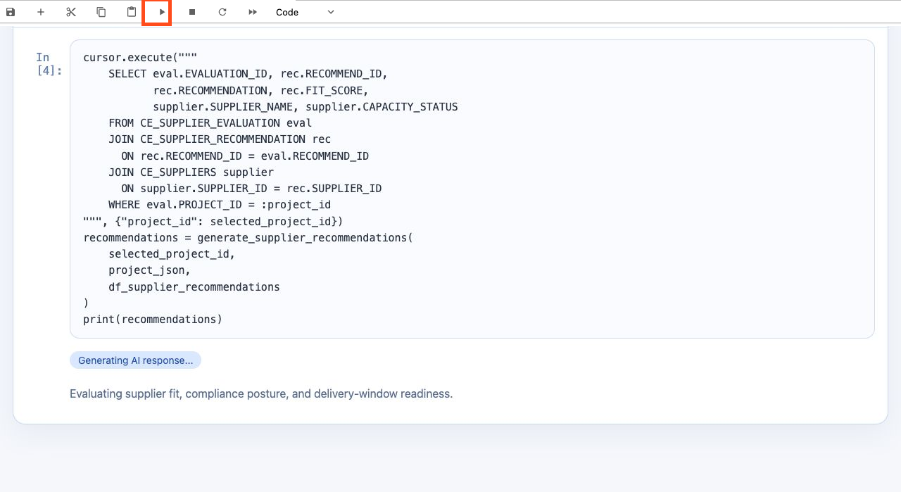

3. Review the generated supplier evaluation. The output should
    include sections such as `Project Summary`,
    `Key Sourcing Requirements`, `Top 3 Supplier Recommendations`,
    `Risks and Missing Information`, and `Actionable Steps`.
    In Lab 1: Run the Demo, this corresponds to the point where the
    construction procurement manager selected
    **Navigate To Project Decisions** after reviewing the
    AI-generated recommendation.

    >*Note:* Your exact wording may be different because generative
    >AI responses can vary, even when the same project data is used.

    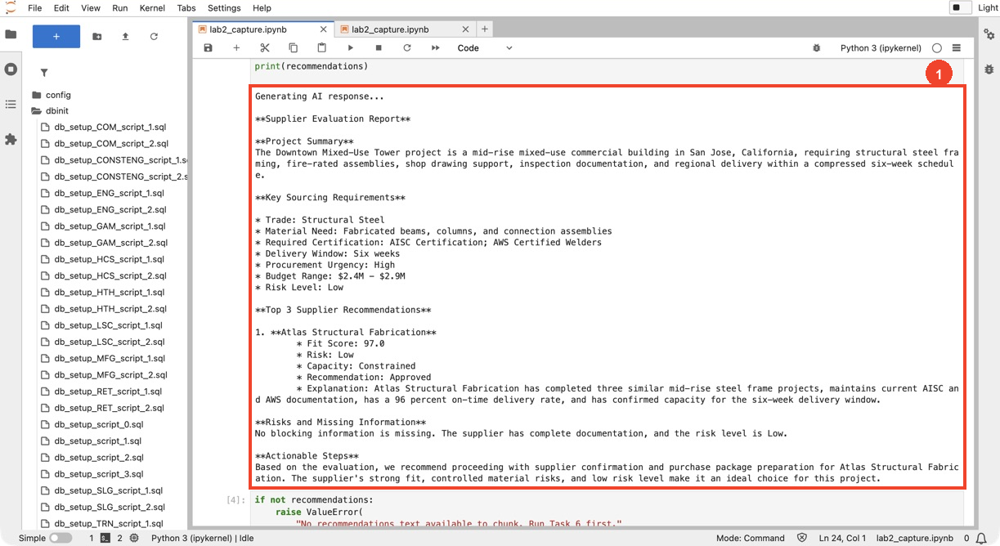

## Task 7: Chunk & Store the Recommendations

In this task, you will prepare the AI-generated supplier
recommendation for RAG by splitting it into smaller text chunks and
storing those chunks in the `CE_PROJECT_CHUNKS` database table.

RAG works best when the system can retrieve focused pieces of relevant
text instead of searching one long response. To support that, this
code uses Oracle AI Database’s `VECTOR_CHUNKS` function to split the
generated recommendation into smaller sentence-based chunks.

Here’s what the code does:

* **Check for Generated Recommendations**: Confirm that the
  recommendations text from Task 6 exists before trying to chunk it.
* **Remove Prior AI Recommendation Chunks**: Delete only the previous
  `AI Recommendation` chunks for this project from the
  `CE_PROJECT_CHUNKS` table. Seeded project and supplier context rows
  remain in the table.
* **Create New Text Chunks**: Use `VECTOR_CHUNKS` to split the
  generated recommendation text into smaller sentence-based chunks.
* **Store the Chunks**: Insert the new chunks into the
  `CE_PROJECT_CHUNKS` table with new `CHUNK_ID` values to avoid
  duplicate IDs.
* **Review the Results**: Display a DataFrame showing each
  `CHUNK_ID`, character count, word count, and preview text so you
  can confirm what will be used in the RAG flow.

In the next task, you will create vector embeddings for these stored
chunks.

1. Copy the following code and run it in a new cell:

    ```python
    <copy>
    if not recommendations:
        raise ValueError(
            "No recommendations text available to chunk. Run Task 6 first."
        )

    cursor.execute(
        """
        DELETE FROM CE_PROJECT_CHUNKS
        WHERE PROJECT_ID = :project_id
          AND SOURCE_TYPE = 'AI Recommendation'
        """,
        {"project_id": selected_project_id}
    )
    connection.commit()

    cursor.execute("SELECT NVL(MAX(CHUNK_ID), 0) FROM CE_PROJECT_CHUNKS")
    base_chunk_id = (cursor.fetchone()[0] or 0) + 1

    chunk_sizes = [50]

    for size in chunk_sizes:
        insert_sql = f"""
            INSERT INTO CE_PROJECT_CHUNKS (
                CHUNK_ID,
                PROJECT_ID,
                SUPPLIER_ID,
                SOURCE_TYPE,
                CHUNK_TEXT
            )
            SELECT
                :base_chunk_id + vc.chunk_offset,
                :project_id,
                NULL,
                'AI Recommendation',
                vc.chunk_text
            FROM (SELECT :rec_text AS txt FROM dual) s,
                VECTOR_CHUNKS(
                    dbms_vector_chain.utl_to_text(s.txt)
                    BY words
                    MAX {size}
                    OVERLAP 0
                    SPLIT BY sentence
                    LANGUAGE american
                    NORMALIZE all
                ) vc
        """
        cursor.execute(
            insert_sql,
            {
                "base_chunk_id": base_chunk_id,
                "project_id": selected_project_id,
                "rec_text": recommendations
            }
        )

    cursor.execute(
        """
        SELECT CHUNK_ID, CHUNK_TEXT
        FROM CE_PROJECT_CHUNKS
        WHERE PROJECT_ID = :project_id
          AND SOURCE_TYPE = 'AI Recommendation'
        ORDER BY CHUNK_ID
        """,
        {"project_id": selected_project_id}
    )
    rows = cursor.fetchall()


    def _lob_to_str(v):
        return v.read() if isinstance(v, oracledb.LOB) else v


    items = []
    for cid, ctext in rows:
        txt = _lob_to_str(ctext) or ""
        items.append(
            {
                "CHUNK_ID": cid,
                "Chars": len(txt),
                "Words": len(txt.split()),
                "Preview": (txt[:160] + "…") if len(txt) > 160 else txt
            }
        )

    df_chunks = pd.DataFrame(items).sort_values("CHUNK_ID")
    connection.commit()
    print(
        "✅ Task 7 complete: recommendation chunked for project "
        f"{selected_project_id} (sizes: {chunk_sizes})."
    )
    display(df_chunks)
    </copy>
    ```

2. Run the cell to split the generated supplier recommendation into
    text chunks and store them in the `CE_PROJECT_CHUNKS` table. This
    step may take a few moments. When the cell finishes, review the
    output to confirm the recommendation was chunked successfully.

    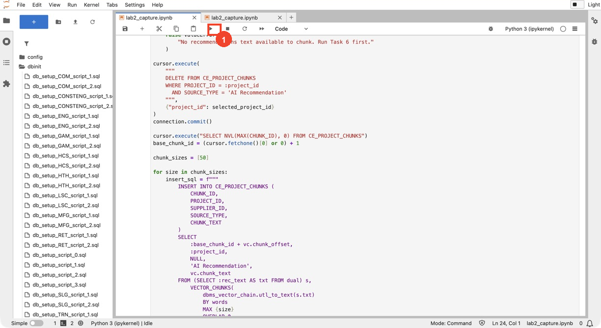

3. Review the output to confirm that the AI-generated supplier
    recommendation was split into multiple chunks. The table shows
    each `CHUNK_ID`, the number of words in the chunk, and a preview
    of the chunk text. These stored chunks will be used later as
    retrievable context in the RAG flow.

    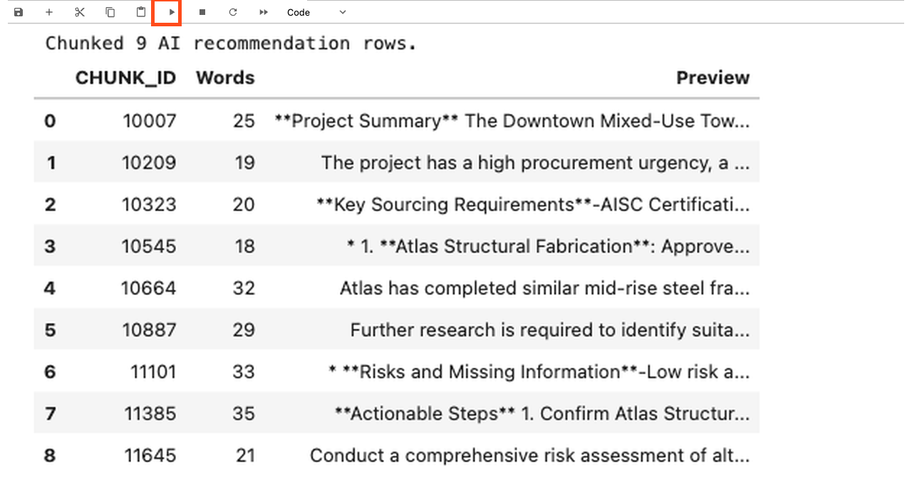

## Task 8: Create embeddings - Use Oracle AI Database to create vector data

In Task 7, you stored the AI-generated supplier recommendation as
smaller text chunks in the `CE_PROJECT_CHUNKS` database table. In
this task, you will convert those text chunks into vector embeddings
so Oracle AI Database can search them by meaning, not just by exact
keyword matches.

A vector embedding is a numerical representation of text. When a user
asks a follow-up question, the system can create an embedding for the
question and compare it to the stored chunk embeddings. This allows
Oracle AI Database to retrieve the recommendation chunks that are most
relevant to the question and use them as context in the RAG response.

This code uses `dbms_vector_chain.utl_to_embedding` to generate the
embeddings directly inside Oracle AI Database. The code passes
`DEMO_MODEL` as the embedding model identifier. In this lab
environment, `DEMO_MODEL` is already configured, so you do not need
to choose or deploy an embedding model during the workshop. The
`dimensions: 384` value matches the vector size stored in the
`CHUNK_VECTOR` column of the `CE_PROJECT_CHUNKS` table.

This step:

* **Uses the Recommendation Chunks**: Works with the
  `AI Recommendation` rows that were inserted into the
  `CE_PROJECT_CHUNKS` table in Task 7.
* **Generates Embeddings in the Database**: Uses
  `dbms_vector_chain.utl_to_embedding` with the lab’s configured
  `DEMO_MODEL` to convert each chunk’s text into a vector embedding.
* **Stores the Embeddings**: Updates the `CHUNK_VECTOR` column in the
  `CE_PROJECT_CHUNKS` table so the chunks can be searched by semantic
  similarity in the next task.

1. Run and review the code in a new cell:

    ```python
    <copy>
    vp = json.dumps(
        {
            "provider": "database",
            "model": "DEMO_MODEL",
            "dimensions": 384
        }
    )

    cursor.execute(
        """
        UPDATE CE_PROJECT_CHUNKS
        SET CHUNK_VECTOR = dbms_vector_chain.utl_to_embedding(
            CHUNK_TEXT,
            JSON(:vp)
        )
        WHERE PROJECT_ID = :project_id
          AND SOURCE_TYPE = 'AI Recommendation'
        """,
        {"vp": vp, "project_id": selected_project_id}
    )
    updated = cursor.rowcount or 0
    connection.commit()
    print(
        "✅ Task 8 complete: embedded vectors for "
        f"{updated} CE_PROJECT_CHUNKS row(s)."
    )
    </copy>
    ```

2. Click the **Run** button to execute the cell. The code creates
    vector embeddings for the `AI Recommendation` chunks and stores
    them in the `CHUNK_VECTOR` column of the `CE_PROJECT_CHUNKS`
    table.
    When the cell finishes, review the output message to confirm how
    many recommendation rows were embedded. This confirms the chunks
    are ready for vector search in the next task.

    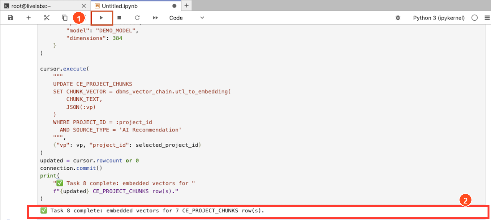

## Task 9: Implement RAG with Oracle AI Database's Vector Search

Now that the recommendation chunks have vector embeddings, you can use
them to answer a natural-language follow-up question:

```text
Which supplier is the best fit for Downtown Mixed-Use Tower if we
prioritize complete documentation and delivery reliability?
```

This step shows the full RAG flow. The user’s question is converted
into a vector, Oracle AI Database searches for the most relevant
recommendation chunks, and OCI Generative AI uses those retrieved
chunks as context to generate a grounded answer.

This step:

* **Vectorizes the Question**: Uses
  `dbms_vector_chain.utl_to_embedding` with the lab’s configured
  `DEMO_MODEL` to convert the user’s question into a vector
  embedding.
* **Performs AI Vector Search**: Compares the question vector to the
  stored chunk vectors in the `CE_PROJECT_CHUNKS` table and retrieves
  the most relevant chunks using cosine distance.
* **Uses RAG**: Combines the selected project profile, supplier
  recommendation records, and retrieved chunk context into a prompt
  for OCI Generative AI.
* **Helps Reduce Hallucinations**: Instructs the model to use only
  the supplied project data, supplier records, and retrieved context.
  The prompt also tells the model not to invent supplier names and to
  use only supplier names that appear in the provided records or
  context.

1. Copy the code block below to implement RAG:

    ```python
    <copy>
    question = (
        "Which supplier is the best fit for Downtown Mixed-Use Tower "
        "if we prioritize complete documentation and delivery reliability?"
    )


    def vectorize_question(q):
        cursor.execute(
            """
            SELECT dbms_vector_chain.utl_to_embedding(
                :q,
                JSON('{"provider":"database","model":"DEMO_MODEL","dimensions":384}')
            )
            FROM DUAL
            """,
            {"q": q}
        )
        return cursor.fetchone()[0]


    print("Processing your question using AI Vector Search...")

    try:
        q_vec = vectorize_question(question)

        cursor.execute(
            """
            SELECT CHUNK_ID, CHUNK_TEXT
            FROM CE_PROJECT_CHUNKS
            WHERE PROJECT_ID = :project_id
              AND CHUNK_VECTOR IS NOT NULL
            ORDER BY VECTOR_DISTANCE(CHUNK_VECTOR, :qv, COSINE)
            FETCH FIRST 4 ROWS ONLY
            """,
            {"project_id": selected_project_id, "qv": q_vec}
        )
        retrieved = [
            (
                row[0],
                row[1].read() if isinstance(row[1], oracledb.LOB) else row[1]
            )
            for row in cursor.fetchall()
        ]

        if not retrieved:
            retrieved = [(0, recommendations)]

        requirement = (project_json.get("requirements") or [{}])[0]
        available_data_text = "\n".join([
            (
                f"Supplier Evaluation {row['EVALUATION_ID']}: "
                f"{row['SUPPLIER_NAME']} | Decision: {row['RECOMMENDATION']} | "
                f"Fit Score: {row['FIT_SCORE']} | Risk: {row['RISK_LEVEL']} | "
                f"Capacity: {row['CAPACITY_STATUS']} | "
                f"Explanation: {row['EXPLANATION']} | "
                f"Missing Information: {row['MISSING_INFORMATION']}"
            )
            for row in df_supplier_recommendations.to_dict(orient="records")
        ])
        project_profile_text = "\n".join([
            f"- Project Name: {project_json.get('projectName', '')}",
            f"- Location: {project_json.get('location', '')}",
            f"- Project Phase: {project_json.get('projectPhase', '')}",
            f"- Required Trade: {requirement.get('tradeCategory', '')}",
            f"- Delivery Window: {requirement.get('deliveryWindow', '')}",
            f"- Budget Range: {requirement.get('budgetRange', '')}",
            f"- Risk Level: {requirement.get('riskLevel', '')}"
        ])
        context_text = "\n========\n".join(text for _, text in retrieved)

        rag_prompt = f"""<s>[INST] <<SYS>>
You are the AI Procurement Guru for construction engineering.
Use only the supplied project profile, supplier recommendation
records, and retrieved context.
Do not invent supplier names.
Only use supplier names that appear verbatim in the supplier
recommendation records or retrieved context.
If the evidence is insufficient, say so plainly.
Keep the answer under 220 words and make it decision-ready.
<</SYS>> [/INST]
[INST]
Question: "{question}"

Selected Project Profile:
{project_profile_text}

Available Supplier Recommendation Records:
{available_data_text}

Retrieved Context:
{context_text}

Tasks:
1. Answer the question directly.
2. Justify the answer using fit, risk, delivery, and documentation signals.
3. If there is a reasonable backup supplier, name it briefly.
        [/INST]"""

        print("Generating AI response...")

        genai_client = oci.generative_ai_inference.GenerativeAiInferenceClient(
            config=oci.config.from_file(os.getenv("OCI_CONFIG_PATH", "~/.oci/config")),
            service_endpoint=os.getenv("ENDPOINT")
        )
        chat_detail = oci.generative_ai_inference.models.ChatDetails(
            compartment_id=os.getenv("COMPARTMENT_OCID"),
            chat_request=oci.generative_ai_inference.models.GenericChatRequest(
                messages=[oci.generative_ai_inference.models.UserMessage(
                    content=[oci.generative_ai_inference.models.TextContent(text=rag_prompt)]
                )],
                temperature=0.0,
                top_p=0.90
            ),
            serving_mode=oci.generative_ai_inference.models.OnDemandServingMode(
                model_id="meta.llama-3.2-90b-vision-instruct"
            )
        )
        chat_response = genai_client.chat(chat_detail)
        ai_response = (
            chat_response.data.chat_response.choices[0]
            .message.content[0].text
        )

        print("\\n🤖 AI Procurement Guru Response:")
        print(ai_response)

        print("\\n📑 Retrieved Chunks Used in Response:")
        for cid, text in retrieved:
            preview = text[:140].replace("\\n", " ")
            if len(text) > 140:
                preview += "..."
            print(f"[Chunk {cid}] : {preview}")

    except Exception as e:
        print(f"RAG flow error: {e}")
    </copy>
    ```

2. Click the **Run** button to execute the cell. The notebook will
    process the question using AI Vector Search, retrieve the most
    relevant chunks from the `CE_PROJECT_CHUNKS` table, and send the
    retrieved context to OCI Generative AI.

    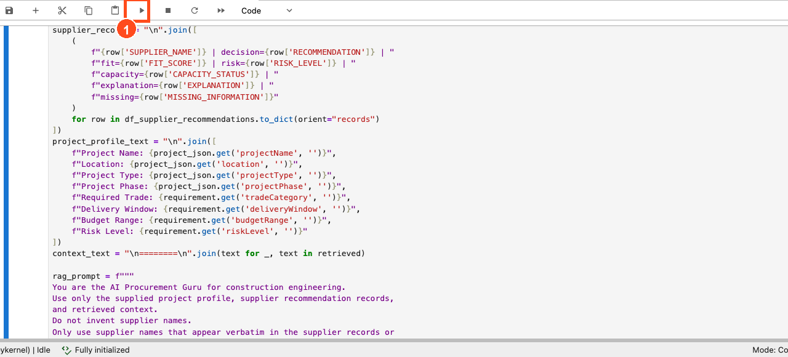

3. Review the AI Procurement Guru Response. The answer should
    identify the best-fit supplier and explain the reasoning using
    retrieved evidence, such as fit score, documentation, delivery
    reliability, risk level, and missing information.
    Also review the `Retrieved Chunks Used in Response` section.
    These are the specific text chunks retrieved by vector search and
    used as grounding context for the AI response.

    >*Note:* Your exact wording may be different because generative
    >AI responses can vary, even when the same project data and
    >retrieved context are used.

    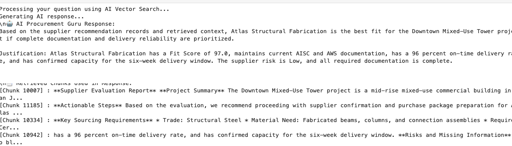

## Summary

Congratulations! You implemented a RAG process in Oracle AI Database
using Python.

To summarize, you:

* Connected from a Jupyter notebook to Oracle AI Database using the
  Oracle Python driver, `oracledb`.
* Retrieved construction project data from the
  `construction_projects_dv` JSON relational duality view.
* Used OCI Generative AI to generate a construction-specific
  supplier evaluation.
* Split the generated recommendation into smaller text chunks and
  stored them in the `CE_PROJECT_CHUNKS` database table.
* Created vector embeddings for the recommendation chunks directly in
  Oracle AI Database.
* Used Oracle AI Database Vector Search and RAG to answer a
  natural-language follow-up question with retrieved project and
  supplier context.

Congratulations, you completed the lab.

## Learn More

* [Code with Python](https://www.oracle.com/developer/python-developers/)
* [Oracle AI Database Documentation](https://docs.oracle.com/en/database/oracle/oracle-database/23/)

## Acknowledgements
* **Authors** - Francis Regalado
* **Last Updated By/Date** - Taylor Zheng, Uma Kumar, Deion Locklear, Daniet Hart, July 2026
