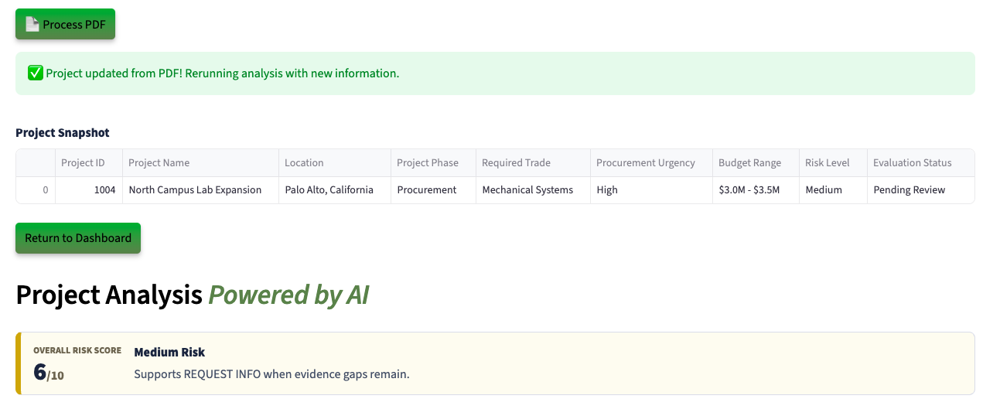

# Run the Demo

## Introduction

In this lab, you will step into the role of a **construction procurement officer** using a next-generation construction procurement application powered by Oracle AI Database. You will work with real construction procurements and see how Generative AI, Vector Search, and Graph analytics replace manual review with faster, AI-driven decision-making.

**Disclaimer**: Please note that your results may vary. The information provided is generated by OCI Generative AI services, and your outcomes may differ from those presented.

Estimated Time: 30 minutes

### Objectives

In this lab, you will:

* Review how the Seer Construction **Construction Procurement app** incorporates the use of  JSON Duality Views, Graph analytics, and other converged database features, all without requiring complex data movement or separate systems.

### Prerequisites

This lab assumes you have:

* An Oracle account to submit your a LiveLabs Sandbox reservation.

## Task 1: Launch the application

1. To access the demo environment, click **Open Link** next to **Start the Demo.**

    

2. Welcome to Seer Construction! Select **Construction Engineering** as Industry and **Construction Procurement Manager** as role. Enter in a username and click **Login.**

    

3. Welcome to the SeerConstruction Procurement Management application! Congratulations, you are now connected to the demo environment. You can now execute the different tasks for this Lab.

    

## Task 2: Demo - Project with Low Risk Level

In this first example, you will use the application to approve a project with low risk level. The first project on your to-do list is P1001 Downtown Mixed-Use Tower.

1. On the Dashboard page, from the pending review list, select the Project ID for **1001** Downtown Mixed User Tower.

    

2. Opening Downtown Mixed-Use Tower reveals the procurement details - the project ID, project name, location, project phase, required trade, procurement urgency, budget rage, and risk level. 

    

3. At the bottom of Downtown Mixed-Use Tower’s evaluation, you will find the **AI Procurement Guru**—a chatbot built on Oracle AI Database and Vector search. When prompted, the system uses **RAG** to generate a response. It converts the question and procurement data into embeddings, performs a similarity search, and then uses the **GenAI service** to turn the enriched context into a clear, natural language answer. If the customer calls with a question, you can quickly enter it into the AI Procurement Guru to generate a relevant response. 
 

    **Copy** the question below into the AI chatbot and press **Enter**. What does the AI Procurement Guru recommend?

    ```text
    <copy>
    Which project packages are the best fit when the sponsor wants to minimize site-prep work?
    </copy>
    ```

    

    >💡 In Oracle AI Database, **AI Vector Search** allows you to combine your business data with the Large Language Model (LLM) to reduce hallucinations and get accurate answers from your data.

4. Select the **Navigate To Project Decisions** button.

    

    After navigating to the decisions page, the AI evaluation runs in the background. It analyzes Downtown Mixed-Use Tower’s evaluation and matches it against top supplier  options in the database. A custom AI prompt ensures the system uses only internal data—never the internet. In this case, the AI returns three supplier evaluations, each with a clear explanation. All options are displayed alongside the AI’s final recommendation: approval.

5. 1) In the **Select Supplier Option** section, the available supplier options are displayed. The construction procurement manager can choose to request more information to refine the offer, but for this scenario, we will proceed by selecting one of the suggested suppliers.

   

   2) Select the AI-recommended supplier option 7001: Atlas Structural Fabrication due to strong mid-rise steel frame project experience, current AISC and AWS documentation, high on-time delivery rate, and confirmed capacity for the six-week delivery window.

    >Please note that your results may vary. The information provided is generated by OCI Generative AI services, and your outcomes may differ from those presented.

     

   3) Set the final project status to **Approved**, then click **Confirm Decision** to complete the process.

    The status has been updated to 'Approved' and saved to the customer profile.

    

8. Click the **Download Decision PDF** button.

    

9. Click **Download PDF**

    


10. Display the message the supplier would see by opening the downloaded PDF.

    

11. Click the **Return to Dashboard** button to navigate back to the Dashboard.

    

12. Expand **View Approved Projects**. We can see that P1001 Downtown Mixed-Use Tower has been removed from the Pending Projects list and has been added to the Approved Projects list.

    

**Conclusion**

Once you select and save one of the 3 supplier recommended by the AI: 

✅ The project's risk level status is updated.

✅ A finalized PDF decision document is generated.  

✅ The dashboard reflects the change in real-time — marking P1001 as Approved.

Congratulations, you have just approved your first project! Proceed to the next task.

## Task 3: Demo - Project with High risk level
In this example, you will navigate the projects to review a project and deny them as part of the exercise. The second project on your list is P1003 Harbor Seismic Retrofit.

1. On the Dashboard page, from the pending review list, select the Project ID **1003**.

    

2. Opening Harbor Seismic Retrofit's project profile displays the project snapshot details. Within a few seconds, the AI automatically generates recommendations. In this case, the system evaluates a less favorable profile and identifies risk score.

    This project has overall risk score 9/10 High Risk

    Despite the risk factors, the AI evaluates the profile and suggests next steps. In this case, it recommends a denial—but also provides clear, actionable guidance to help the customer improve their chances of approval in the future.

    

3. Select the **Navigate to Project Decisions** button.

    

    >⁉️ **What is the reason that the AI decided to deny this applicant?** ⁉️


4. Expand **Interactive Graph: Project, Supplier Recommendation & Risk** to view the graph.

    

    On the decision page, the construction procurement manager can use **Operational Property Graph** to explore near-approval projects and suppliers. 

    

    This graph reveals that while the recommended supplier, Coastal Retrofit Metals, was denied for the Harbor Seismic Retrofit project, the decision is not yet final. Instead of presenting a simple “Denied” outcome, the graph shows the complete decision context by connecting the project to its requirements, the matched supplier, the denial recommendation, the associated high-risk assessment, and the current Pending Review evaluation. This provides decision-makers with a clear view of why the recommendation was denied and where the project stands in the approval process, enabling a more informed final decision rather than a hard stop.

    >💡 In Oracle AI Database, **Property Graph** allows you to treat your data like a network of connected points, where each point (called a node) and each link (called an edge) has its own details or properties. This setup helps you run graph analytics, like finding important connections or patterns, directly within the database.

5. The project status is set to **Denied**. Click the **Confirm decision** button.

    The project status has been updated to 'Denied' and saved to the project profile.

    

6. Press the **Download Decision PDF** button to save the AI responses and proceed to the final disposition.

    

7. Click the **Download PDF** button.

    

8. Display the message the supplier would see by opening the downloaded PDF.

    

9. Click the **Return to Dashboard** button to navigate back to the Dashboard.

    

10. Expand **View Denied Projects**. You will see that P1003 Harbor Seismic Retrofit has been moved from the **Pending Projects** list to the **Denied Projects** section.

    

**Conclusion**

Congratulations, you have finished reviewing a customer with high financial risk! Proceed to the next task.

## Task 4: Demo - Update Customer Details

Lastly, let’s explore how the system uses JSON Duality Views to handle profile updates. In this task, you will edit a project's details. In this example, the project was asked to submit an updated Construction Supplier Evaluation.

1. On the Dashboard page, from the **Pending Projects** list, select the project ID for **1004**.

    

2. We will upload a document to update North Campus Lab Expansion's project budget. Before uploading the document, note that the project's budget is currently listed as $1.1-1.6M. On the Project Details page, click the **Upload Document** button.

    

3. The PDF file has been loaded. Click the **Process PDF** button.

    

    >💡 **JSON Duality Views** let's you update unstructured data in an easy, high-level format while automatically handling the technical details behind the scenes. This makes it faster and simpler to work with messy data and connect it to structured systems.

4. The project profile has been updated. Refresh the page and note that the budget has been updated to $3.0-3.5M. Thanks to JSON Transform and JSON Duality Views, only the relevant field is modified — leaving the rest of the profile UNTOUCHED.

    


**Conclusion**

Once the document is uploaded:

✅ The system automatically detects the new budget data.

✅ Then their project will be updated from $1.1-1.6M to $3.0-3.5M.

✅ And thanks to JSON Transform and JSON Duality Views, only the relevant field is modified — leaving the rest of the profile UNTOUCHED.

## Summary

In conclusion our Construction Procurement App was able to leverage Oracle AI Database technologies such as **AI Vector Search, Property Graph, and JSON Duality Views** to:

✅ Automate profile evaluations

✅ Provide AI-driven procurement recommendations by using an RAG model powered by a Oracle AI Database's AI Vector Search and OCI Generative AI service

✅ Enable seamless profile updates with JSON Duality Views

✅ Empower construction procurement officers with actionable insights through Operational Property Graphs 

By combining these advanced tools, the application enables faster, smarter decisions and delivers clear guidance on how customers can improve their eligibility.
 
**Next:** How about learning how the application was implemented in Python? Continue with the next labs and start developing!

## Learn More

* [Oracle AI Database Documentation](https://docs.oracle.com/en/database/oracle/oracle-database/23/)

## Acknowledgements
* **Authors** - Linda Foinding, Francis Regalado
* **Contributors** - Eddie Ambler, Ramona Magadan, Mark Nelson, Andy Tael, Anders Swanson, Rahul Tasker
* **Last Updated By/Date** - Taylor Zheng, Uma Kumar, Deion Locklear, Daniet Hart, July 2026