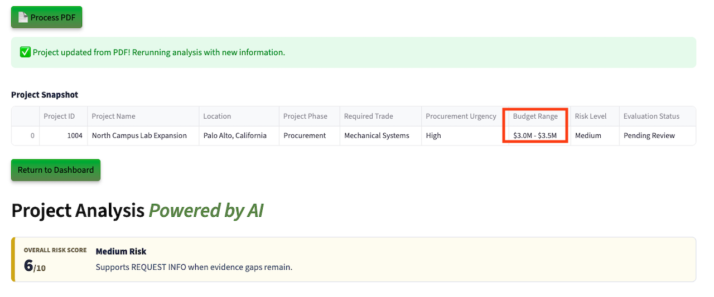

# Run the Demo

## Introduction

In this lab, you will step into the role of a **construction procurement officer** using a **next-generation procurement application powered by Oracle AI Database**. You will work through sample construction procurement scenarios and see how OCI Generative AI, AI Vector Search, Property Graph, and JSON Duality Views can help streamline manual review with faster, AI-driven decision-making.

**Disclaimer**: Your results may vary. Some recommendations and responses are generated by OCI Generative AI services, so your output may differ from the examples shown in this lab.

Estimated Time: 30 minutes

### Objectives

In this lab, you will:

* Review how the **Seer Construction Procurement app** uses Oracle AI Database capabilities, including AI Vector Search, JSON Duality Views, Property Graph, and other converged database features, to support procurement review without requiring complex data movement or separate systems.

### Prerequisites

This lab assumes you have:

* An Oracle account to submit your a LiveLabs Sandbox reservation.

## Task 1: Launch the application

1. In the LiveLabs reservation page, open the **Reservation Information** panel and scroll to the **Terraform Outputs** section. Click **Open Link** next to **Start the Demo** to launch the Seer Construction application in a new browser tab.

    

2. On the Seer Construction login page, select **Construction Engineering** from the **Choose an Industry** menu and **Construction Procurement Manager** from the **Choose Your Role** menu. Enter any username, then click **Login**.

    

3. Welcome to the **Seer Construction Procurement Management** application. You are now connected to the demo environment.
On the **Supplier Evaluation Dashboard**, you should see the **Pending Projects** list. These are the construction procurement projects you will review during the lab. You are now ready to begin the demo tasks.

    

## Task 2: Demo - Project with Low Risk Level

In this first example, you will review and approve a low-risk project. The first project on your to-do list is project `1001`, **Downtown Mixed-Use Tower**.

1. On the **Supplier Evaluation Dashboard**, go to the **Pending Projects** list. In the row for project `1001`, **Downtown Mixed-Use Tower**, click **Review** to open the project details.

    

2. The **Downtown Mixed-Use Tower** project page opens with a project snapshot showing key procurement details, including project ID, project name, location, project phase, required trade, procurement urgency, budget range, and risk level.
    Below the snapshot, review the **Project Analysis Powered by AI** section. For this project, the overall risk score is low, and the analysis summarizes the project requirements, sourcing needs, and documentation signals used to support an approval recommendation.

    

3. At the bottom of the **Downtown Mixed-Use Tower** evaluation, you will find the **AI Procurement Guru**, a chatbot powered by **Oracle AI Database AI Vector Search and OCI Generative AI**.
    When you ask a question, the system uses Retrieval-Augmented Generation, or **RAG**, to generate a grounded response. It converts the question into a vector embedding, searches the stored project and procurement context for the most relevant information, and then uses OCI Generative AI to generate a clear, natural-language answer.

    **Copy** the question below into the AI chatbot and press **Enter**:

    ```text
    <copy>
    Which project packages are the best fit when the sponsor wants to minimize site-prep work?
    </copy>
    ```

    

    Review the response from the **AI Procurement Guru**. The answer should use the project and supplier context to recommend the best-fit supplier option and explain why.

    >💡 In Oracle AI Database, **AI Vector Search** helps combine your business data with a Large Language Model, or LLM, so the response can be grounded in your data and help reduce hallucinations.


4. Click **Navigate to Project Decisions**.

    

    This opens the decision page for **Downtown Mixed-Use Tower**. The application uses the project evaluation and supplier data stored in the database to generate decision-ready supplier options.
    The AI evaluation compares the project requirements against available supplier recommendations and returns supplier options with supporting explanations. The prompt is designed to ground the response in the supplied project and supplier data, rather than relying on external information.
    For this low-risk project, the AI recommendation supports approval and presents supplier options for the construction procurement manager to review.

5. In the **Select Supplier Option** section, review the supplier options generated by the AI evaluation. Each option includes a recommendation and supporting rationale based on the project requirements and supplier data. For this low-risk scenario, you will proceed with the AI-recommended supplier instead of requesting more information.

6. Select **Supplier Evaluation 7001: Atlas Structural Fabrication**. This is the AI-recommended option for this scenario because Atlas has strong mid-rise steel frame project experience, current AISC and AWS documentation, a high on-time delivery rate, and confirmed capacity for the six-week delivery window.

    >**Note**: Your generated recommendation text may vary because the supplier evaluation is produced by OCI Generative AI. If the wording differs from the screenshot, select the option that recommends Atlas Structural Fabrication for approval.

     

7. Set the final project status to **Approved**, then click **Confirm Decision**. A confirmation message appears indicating that the status was updated to **Approved** and saved to the **Downtown Mixed-Use Tower** project profile.

    

8. Click **Download Decision PDF** to generate and download a PDF summary of the approved supplier decision.

    

9. After the decision PDF is generated, click **Download PDF** to save the file locally.

    

10. Open the downloaded PDF to review the **Final Decision Notice**. This document summarizes the approved decision for **Downtown Mixed-Use Tower**, including the selected supplier, risk score, approval rationale, and next steps.

    

11. Click **Return to Dashboard** to go back to the **Supplier Evaluation Dashboard**.

    

12. Expand **View Approved Projects**. Confirm that project `1001`, **Downtown Mixed-Use Tower**, no longer appears in the **Pending Projects** list and now appears in the **Approved Projects** list with the status **Approved**.

    


**Conclusion**

Once you select and save one of the AI-recommended supplier options:

✅ The project evaluation status is updated to **Approved**.

✅ A finalized PDF decision document is generated.

✅ The dashboard reflects the change, moving project `1001`, **Downtown Mixed-Use Tower**, from **Pending Projects** to **Approved Projects**.

Congratulations, you have just approved your first project. Proceed to the next task.

## Task 3: Demo - Project with High risk level
In this example, you will review a high-risk project and deny it as part of the exercise. The second project on your list is project `1003`, **Harbor Seismic Retrofit**.

1. On the **Supplier Evaluation Dashboard**, go to the **Pending Projects** list. In the row for project `1003`, **Harbor Seismic Retrofit**, click **Review** to open the project details.

    

2. The **Harbor Seismic Retrofit** project profile opens with a project snapshot showing key procurement details, including project ID, location, project phase, required trade, procurement urgency, budget range, risk level, and evaluation status.
    Below the snapshot, review the **Project Analysis Powered by AI** section. For this scenario, the project has an overall risk score of **9/10**, marked as **High Risk**. The AI analysis evaluates the project requirements and supplier evidence, then recommends a denial or new RFP if core requirements are not met. It also provides guidance on the risk factors that would need to be addressed before the project could move forward.

    

3. Click **Navigate to Project Decisions**. Before reviewing the decision page, consider the AI analysis shown above: why is the system recommending denial or a new RFP for **Harbor Seismic Retrofit**?

    

    >⁉️ **Why is the AI recommending denial or a new RFP for this project?** ⁉️

4. Expand **Interactive Graph: Project, Supplier Recommendation & Risk** to view the graph.

    

    On the decision page, the application uses Property Graph to show how the project, requirements, supplier recommendation, risk assessment, and evaluation status are connected.

    Review the graph for Harbor Seismic Retrofit. The graph helps explain why the AI recommends denial or a new RFP by showing the relationship between the project, its seismic steel bracing requirement, the denied recommendation, the high-risk assessment, and the current pending review status.

    

    This connected view gives the construction procurement manager more context than a simple “Denied” label. It shows where the risk is coming from and helps the manager make a more informed final decision.

    >💡 In Oracle AI Database, **Property Graph** represents data as a network of connected points. Each point is a **node**, such as a project, requirement, supplier, recommendation, or risk. Each connection is an **edge**, such as a project having a requirement or a recommendation being associated with a risk. This helps users explore relationships and patterns directly in the database.

5. Set the project status to **Denied**, then click **Confirm Decision**. A confirmation message appears indicating that the status was updated to **Denied** and saved to the **Harbor Seismic Retrofit** project profile.

    

6. Click **Download Decision PDF** to generate the final decision document for the denied project decision.

    

7. After the decision PDF is generated, click **Download PDF** to save the denied decision document locally.

    

8. Open the downloaded PDF and review the **Final Decision Notice** for **Harbor Seismic Retrofit**. The document summarizes the denied decision and provides next steps, such as submitting a new RFP for qualified seismic steel suppliers that meet the project’s compliance requirements.

    

9. Click **Return to Dashboard** to go back to the **Supplier Evaluation Dashboard**.

    

10. Expand **View Denied Projects**. Confirm that project `1003`, **Harbor Seismic Retrofit**, no longer appears in the **Pending Projects** list and now appears in the **Denied Projects** section with the status **Denied**.

    


**Conclusion**

Once you review and save the high-risk project decision:

✅ The project evaluation status is updated to **Denied**.

✅ A finalized PDF decision document is generated.

✅ The dashboard reflects the change, moving project `1003`, **Harbor Seismic Retrofit**, from **Pending Projects** to **Denied Projects**.

Congratulations, you have finished reviewing and denying the high-risk project. Proceed to the next task.

## Task 4: Demo - Update Customer Details

In this task, you will see how the application uses **JSON Duality Views** to update project information. You will open the **North Campus Lab Expansion** project, upload an updated Construction Supplier Evaluation document, and review how the project details are updated in the application.

This demonstrates how the app can apply updates to the project profile while keeping the underlying relational database structure in sync.

1. On the **Supplier Evaluation Dashboard**, go to the **Pending Projects** list. In the row for project `1004`, **North Campus Lab Expansion**, click **Review** to open the project details.

    

2. On the **North Campus Lab Expansion** project page, review the **Project Snapshot** and note that the current budget range is **$1.1M–$1.6M**. You will upload a document that contains updated project information, including a revised budget. In the **Document Intake** section, click **Upload Document**.

    

3. The PDF file is now loaded. Click **Process PDF** to extract the updated project information from the document. The application processes the PDF, identifies the relevant budget update, and applies the change to the project profile.

    

    >💡 **JSON Duality Views** let the application update project data through a JSON-based structure while keeping the underlying relational tables in sync. In this demo, the app uses the uploaded document to update only the relevant project field instead of requiring a manual database update.

4. After the PDF is processed, the project profile is updated and the analysis reruns with the new information. If the page does not refresh automatically, refresh the page. In the **Project Snapshot**, confirm that the **Budget Range** has changed from **$1.1M–$1.6M** to **$3.0M–$3.5M**. The application uses **JSON Transform** and **JSON Duality Views** to update only the relevant project field while leaving the rest of the project profile unchanged.

    


**Conclusion**:

Once the document is uploaded and processed:

✅ The system automatically detects the updated budget information from the PDF.

✅ The **North Campus Lab Expansion** project profile is updated from **$1.1M–$1.6M** to **$3.0M–$3.5M**.

✅ The project analysis reruns using the updated project information.

✅ Thanks to **JSON Transform** and **JSON Duality Views**, only the relevant project field is modified while the rest of the project profile remains unchanged.

Congratulations, you have updated a project profile using information extracted from a document. Proceed to the lab summary.

## Summary

In this lab, you explored how the **Seer Construction Procurement app** uses Oracle AI Database capabilities to support construction procurement review.

You saw how the application can:

✅ Use **AI Vector Search** and OCI Generative AI to provide grounded, AI-driven supplier recommendations.

✅ Use **RAG** to answer project and supplier questions with retrieved business context.

✅ Use **Property Graph** to show relationships between projects, requirements, supplier recommendations, risk, and evaluation status.

✅ Use **JSON Duality Views and JSON Transform** to update project profile information while keeping the underlying relational data in sync.

✅ Help construction procurement managers make faster, better-informed approval, denial, and request-for-information decisions.

By combining these Oracle AI Database capabilities, the application helps streamline procurement review, explain recommendations, and keep project data updated from a single application experience.

**Next**: In the next lab, you will learn how this application flow was implemented in Python.

## Learn More

* [Oracle AI Database Documentation](https://docs.oracle.com/en/database/oracle/oracle-database/23/)

## Acknowledgements
* **Authors** - Linda Foinding, Francis Regalado
* **Contributors** - Eddie Ambler, Ramona Magadan, Mark Nelson, Andy Tael, Anders Swanson, Rahul Tasker
* **Last Updated By/Date** - Taylor Zheng, Uma Kumar, Deion Locklear, Daniet Hart, July 2026
