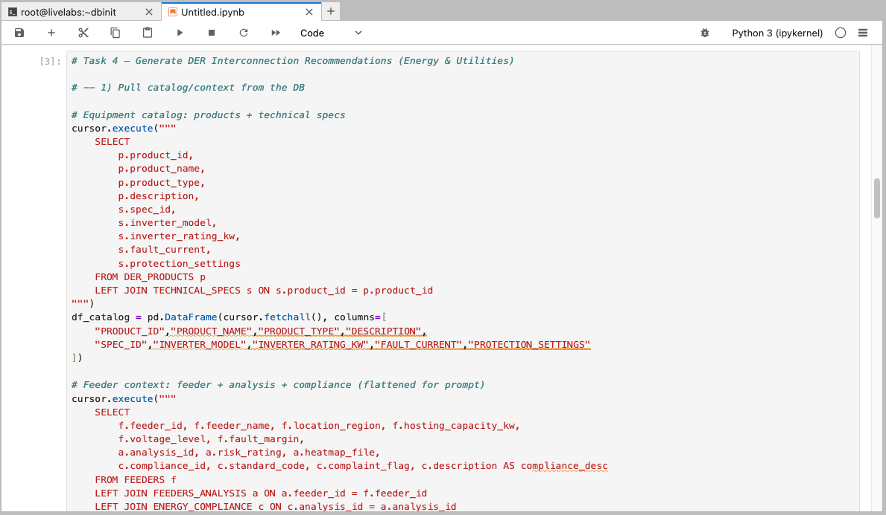
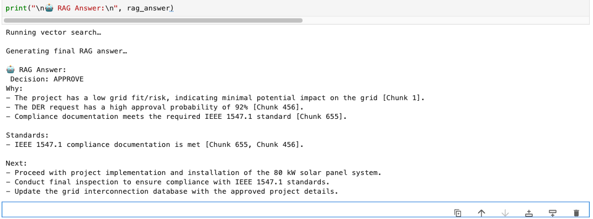

# Step by step: Implement RAG with Oracle Database 23ai 

## Introduction

Here you’ll construct a DER interconnection assessment tool powered by Oracle Database 23ai and OCI Generative AI. Connect to technical specs and feeder telemetry, analyze hosting capacity, and use an LLM to draft approval recommendations with standards references. Leveraging Python from prior labs, you’ll deploy a fully integrated AI app that accelerates grid connection decisions.

This lab uses some of the basic coding samples you created in lab 3, such as `cursor.execute` and more.

Estimated Time: 30 minutes

### Objectives

* Build the complete grid interconnection approval application as seen in lab 1
* Use OCI Generative AI to generate personalized product recommendations
* Use Python to connect to an Oracle Database 23ai instance and run queries
* Explore supplier data and extract relevant information

### Prerequisites

This lab assumes you have:

* An Oracle Cloud account
* Completed lab 1: Run the demo
* Completed lab 2: Connect to the Development Environment

## Task 1: Build the application in Jupyter Notebook
>💡**Note**: Review Lab 2: Connect to the Development Environment for instructions on accessing JupyterLab.

1. You should see a terminal pop up once you are logged in. 

    


2. Navigate to the `dbinit` directory by running the following command.

    ```bash
    <copy>
    cd dbinit
    </copy>
    ```

    

3. Copy and run the following command to create tables in the database. There will be a lot of output. You should see the following output once complete.

    ```bash
    <copy>
    ./shell_script.sh
    </copy>
    ```

    

    

## Task 2: Connect to Database

2. Click the **+** sign on the top left to open the Launcher.

    

3. Open a new notebook.

    

1. Copy the following code block into an empty cell in your notebook. This code block imports the `oracledb` Python driver and other libraries.

    ```python
    <copy>
    import os
    import json
    import oracledb
    import pandas as pd
    import oci
    import numpy as np
    import re
    from dotenv import load_dotenv
    from PyPDF2 import PdfReader

    load_dotenv()

    username = os.getenv("USERNAME")
    password = os.getenv("DBPASSWORD")
    dsn = os.getenv("DBCONNECTION")

    try:
        connection = oracledb.connect(user=username, password=password, dsn=dsn)
        print("Connection successful!")
    except Exception as e:
        print(f"Connection failed: {e}")

    cursor = connection.cursor()
    </copy>
    ```

2. Run the code block to connect to the database. 

    

## Task 3: Pull supplier data from the database

You will query customer data from the `energy_dv` JSON duality view, which combines data from CUSTOMERS and related tables. This task will:

- **Define a Function**: Create a reusable function a to query the database by customer ID, extracting the JSON data for a specific supplier/customer.

- **Use an Example**: Fetch data for customer `1003` (Aisha Morgan) to demonstrate the process.

- **Display the Results**: Format the retrieved data into a pandas DataFrame for a clear, tabular presentation, showing key details like name, company, capacity(kW), and GridFit(Risk).

1. Copy and paste the code below into the new notebook:

    ```python
    <copy>
    # Task 3 — User Profile" (Energy & Utilities)

    def fetch_customer_data(customer_id: int):
        """
        Fetch a single JSON document from ENERGY_DV for the given customer_id.
        Returns a Python dict (or None if not found).
        """
        cursor.execute("""
            SELECT data
            FROM ENERGY_DV 
            WHERE JSON_VALUE(data, '$._id') = :customer_id
        """, {'customer_id': customer_id})
        row = cursor.fetchone()
        return json.loads(row[0]) if isinstance(row[0], str) else row[0]

    # Example customer
    selected_customer_id = 1003
    customer_json = fetch_customer_data(selected_customer_id)

    if customer_json:
        # Pull the first request and first product 
        req  = (customer_json.get("requests") or [{}])[0]
        prod = (req.get("products") or [{}])[0]
        rec  = prod.get("recommendation") or {}
        dec  = rec.get("decision") or {}
        feeder   = prod.get("feeder") or {}
        analysis = feeder.get("analysis") or {}

        print(f"Customer: {customer_json.get('firstName','')} {customer_json.get('lastName','')} ({customer_json.get('company','')})")
        print(f"Request Status: {rec.get('recommendation','Pending Review')} | Grid Fit: {analysis.get('riskRating','Unknown')}")

        desired_fields = [
            ("Customer ID", selected_customer_id),
            ("First Name", customer_json.get("firstName", "")),
            ("Last Name", customer_json.get("lastName", "")),
            ("Company", customer_json.get("company", "")),

            ("Request ID", req.get("requestId", "")),
            ("Capacity (kW)", req.get("capacityKw", "")),
            ("Location (GPS)", req.get("locationGps", "")),
            ("Request Date", req.get("requestDate", "")),

            ("Request Product ID", prod.get("requestProductId", "")),
            ("Product Capacity (kW)", prod.get("capacityKw", "")),

            ("Feeder Name", feeder.get("feederName", "")),
            ("Voltage Level", feeder.get("voltageLevel", "")),
            ("Hosting Capacity (kW)", feeder.get("hostingCapacity", "")),
            ("Fault Margin", feeder.get("faultMargin", "")),
            ("Grid Fit (Risk)", analysis.get("riskRating", "")),

            ("Recommendation", rec.get("recommendation", "Pending Review")),
            ("Risk Level", rec.get("riskLevel", "")),
            ("Generated Date", rec.get("generatedDate", "")),

            ("Decision Letter (preview)", (dec.get("letterText") or "")[:200]),
            ("Decision Generated On", dec.get("generatedOn", ""))
        ]

        df_customer_details = pd.DataFrame({k: [v] for k, v in desired_fields})
        display(df_customer_details)
    else:
        print("No data found for customer ID:", selected_customer_id)

    </copy>
    ```

2. Click the "Run" button to execute the code.

    

3. The output will display a DataFrame containing the customer details for the selected customer ID.

    

## Task 4: Generate Recommendations for the Customers/Supplier

In a new cell, we will build a prompt from customer DER products, technical specs, and feeder data with analysis/compliance. We will get a decision from the recommendation : **Approve, Deny, Request Study**. Calling OCI Generative AI as our provider, using model meta.llama-3.2-90b-vision-instruct to recommend a DER decision, update the tables, and display the results. 

With customer profiles in place, you will use OCI Generative AI to generate personalized grid interconnection recommendations. 

Here’s what we’ll do:

1. Copy and paste the code in a new cell:

    ```python
    <copy>
    # Task 4 — Generate DER Interconnection Recommendations (Energy & Utilities)

    # -- 1) Pull catalog/context from the DB

    # Equipment catalog: products + technical specs
    cursor.execute("""
        SELECT
            p.product_id,
            p.product_name,
            p.product_type,
            p.description,
            s.spec_id,
            s.inverter_model,
            s.inverter_rating_kw,
            s.fault_current,
            s.protection_settings
        FROM DER_PRODUCTS p
        LEFT JOIN TECHNICAL_SPECS s ON s.product_id = p.product_id
    """)
    df_catalog = pd.DataFrame(cursor.fetchall(), columns=[
        "PRODUCT_ID","PRODUCT_NAME","PRODUCT_TYPE","DESCRIPTION",
        "SPEC_ID","INVERTER_MODEL","INVERTER_RATING_KW","FAULT_CURRENT","PROTECTION_SETTINGS"
    ])

    # Feeder context: feeder + analysis + compliance (flattened for prompt)
    cursor.execute("""
        SELECT
            f.feeder_id, f.feeder_name, f.location_region, f.hosting_capacity_kw,
            f.voltage_level, f.fault_margin,
            a.analysis_id, a.risk_rating, a.heatmap_file,
            c.compliance_id, c.standard_code, c.complaint_flag, c.description AS compliance_desc
        FROM FEEDERS f
        LEFT JOIN FEEDERS_ANALYSIS a ON a.feeder_id = f.feeder_id
        LEFT JOIN ENERGY_COMPLIANCE c ON c.analysis_id = a.analysis_id
    """)
    df_feeders = pd.DataFrame(cursor.fetchall(), columns=[
        "FEEDER_ID","FEEDER_NAME","LOCATION_REGION","HOSTING_CAPACITY_KW","VOLTAGE_LEVEL","FAULT_MARGIN",
        "ANALYSIS_ID","RISK_RATING","HEATMAP_FILE",
        "COMPLIANCE_ID","STANDARD_CODE","COMPLAINT_FLAG","COMPLIANCE_DESC"
    ])

    # -- 2) Build a clean prompt from selected customer's JSON doc created in Task 3

    def _kv_lines(d: dict, skip_keys=()):
        return "\n".join([f"- {k}: {v}" for k, v in d.items() if k not in skip_keys])

    def _first_request_bundle(customer_json: dict):
        req  = (customer_json.get("requests") or [{}])[0]
        prod = (req.get("products") or [{}])[0]
        rec  = prod.get("recommendation") or {}
        feeder   = prod.get("feeder") or {}
        analysis = feeder.get("analysis") or {}
        return req, prod, rec, feeder, analysis

    def _catalog_text(df: pd.DataFrame) -> str:
        rows = df.fillna("").to_dict(orient="records")
        out = []
        for r in rows:
            out.append(
                f"{r['PRODUCT_ID']}: {r['PRODUCT_NAME']} ({r['PRODUCT_TYPE']}) | "
                f"Model: {r.get('INVERTER_MODEL','')} | Rating: {r.get('INVERTER_RATING_KW','')} kW | "
                f"Fault Current: {r.get('FAULT_CURRENT','')} kA | Notes: {str(r.get('PROTECTION_SETTINGS',''))[:120]}"
            )
        return "\n".join(out)

    def _feeder_context_text(df: pd.DataFrame) -> str:
        # group by feeder for concise blocks
        txts = []
        for feeder_id, g in df.groupby("FEEDER_ID"):
            g = g.fillna("")
            head = g.iloc[0]
            comps = []
            for _, r in g.iterrows():
                if r["COMPLIANCE_ID"]:
                    comps.append(f"• {r['STANDARD_CODE']} (flag: {r['COMPLAINT_FLAG']}): {r['COMPLIANCE_DESC']}")
            comp_str = "\n".join(comps) if comps else "• None reported"
            txts.append(
                f"Feeder {head['FEEDER_NAME']} ({head['LOCATION_REGION']}) — "
                f"Voltage: {head['VOLTAGE_LEVEL']}, Hosting: {head['HOSTING_CAPACITY_KW']} kW, FaultMargin: {head['FAULT_MARGIN']}\n"
                f"  Risk: {head['RISK_RATING']} | Heatmap: {head['HEATMAP_FILE']}\n"
                f"  Compliance:\n{comp_str}"
            )
        return "\n\n".join(txts)

    def generate_der_recommendation(customer_id: int, customer_json: dict, df_catalog: pd.DataFrame, df_feeders: pd.DataFrame) -> str:
        # Flatten selected request context
        req, prod, rec, feeder, analysis = _first_request_bundle(customer_json)

        # Build context strings
        applicant_text = _kv_lines({
            "CustomerId": customer_id,
            "FirstName": customer_json.get("firstName",""),
            "LastName": customer_json.get("lastName",""),
            "Company": customer_json.get("company",""),
            "Email": customer_json.get("email",""),
            "Phone": customer_json.get("phone","")
        })

        project_text = _kv_lines({
            "RequestId": req.get("requestId",""),
            "CapacityKw": req.get("capacityKw",""),
            "LocationGps": req.get("locationGps",""),
            "RequestDate": req.get("requestDate",""),
            "RequestProductId": prod.get("requestProductId",""),
            "ProductCapacityKw": prod.get("capacityKw","")
        })

        feeder_text = _kv_lines({
            "FeederName": feeder.get("feederName",""),
            "Region": feeder.get("region",""),
            "VoltageLevel": feeder.get("voltageLevel",""),
            "HostingCapacityKw": feeder.get("hostingCapacity",""),
            "FaultMargin": feeder.get("faultMargin",""),
            "GridRisk": analysis.get("riskRating",""),
            "HeatmapFile": analysis.get("heatmapFile","")
        })

        available_equipment = _catalog_text(df_catalog)
        available_feeders   = _feeder_context_text(df_feeders)

        prompt = f"""<s>[INST] <<SYS>>
    You are a **Grid Interconnection Engineer Advisor**.  
    Use only the provided context. Recommend a decision: **APPROVE / DENY / REQUEST STUDY**.  

    Rules:
    - Be precise, clean, and parseable.  
    - Format numbers/dates cleanly (e.g., 06/12/2024, 78%).  
    - Avoid garbled citations (e.g., “IEEE 1511.9 explained”).  
    - Output must contain exactly the four sections below, with their headings and content.  
    - Do not restate instructions or criteria in the visible output.  
    - Keep under 500 words, ~90% concise.  
    <</SYS>> [/INST]

    Available Data:
    {available_equipment}

    Supplier Profile:
    {applicant_text}

    Project Details:
    {project_text}

    Feeder Context:
    {feeder_text}

    Compliance/Analysis Library:
    {available_feeders}

    Question (if applicable):
    What is your decision?

    Return ONLY these four sections (in order):

    Suggested Action
    Suggested Action: APPROVE / DENY / REQUEST STUDY

    Comprehensive Evaluation
    - Feeder Details: Hosting Capacity: [HostingCapacityKw], Voltage Level: [VoltageLevel], Fault Margin: [FaultMargin]  
    - DER Request: Requested Capacity: [CapacityKw], GPS Location: [LocationGps], Region: [Region]  
    - Compliance Documentation: [standard_code or description]  
    - GridFit Risk: [1–10] ([High|Medium|Low])

    Top 3 Requests
    DER Request [RequestId]: [ProductName] ([ProductType]) Approval Probability: <0–100>%. Compliance Documentation: [standard_code]. SUGGESTED ACTION: <APPROVE|DENY|REQUEST STUDY>.  
    DER Request [RequestId]: [ProductName] ([ProductType]) Approval Probability: <0–100>%. Compliance Documentation: [standard_code]. SUGGESTED ACTION: <APPROVE|DENY|REQUEST STUDY>.  
    DER Request [RequestId]: [ProductName] ([ProductType]) Approval Probability: <0–100>%. Compliance Documentation: [standard_code]. SUGGESTED ACTION: <APPROVE|DENY|REQUEST STUDY>.  

    Recommendations Explanations
    - Short justification linking GridFit rating, compliance description, and feeder fault margin.  
    - If evidence is missing, name exactly what’s missing.  
    - Add any relevant risk considerations.  
    [/INST]"""

        print("Generating AI response...\n")
        genai_client = oci.generative_ai_inference.GenerativeAiInferenceClient(
            config=oci.config.from_file(os.getenv("OCI_CONFIG_PATH", "~/.oci/config")),
            service_endpoint=os.getenv("ENDPOINT")
        )
        chat_detail = oci.generative_ai_inference.models.ChatDetails(
            compartment_id=os.getenv("COMPARTMENT_OCID"),
            chat_request=oci.generative_ai_inference.models.GenericChatRequest(
                messages=[oci.generative_ai_inference.models.UserMessage(
                    content=[oci.generative_ai_inference.models.TextContent(text=prompt)]
                )],
                temperature=0.0,
                top_p=1.0
            ),
            serving_mode=oci.generative_ai_inference.models.OnDemandServingMode(
                model_id="meta.llama-3.2-90b-vision-instruct"
            )
        )
        chat_response = genai_client.chat(chat_detail)
        return chat_response.data.chat_response.choices[0].message.content[0].text

    # ---- Call it using the JSON from Task 3 (customer_json) ----
    recommendations = generate_der_recommendation(selected_customer_id, customer_json, df_catalog, df_feeders)
    print(recommendations)

     </copy>
    ```

2. Click the "Run" button to execute the code. Note that this will take time to run.

    

3. Review the output. In the demo, this is where you selected the "Navigate to Decisions" button as the Grid Interconnection Engineer. You just used AI to get recommendations for the interconnection engineer which would have taken her hours to do, congratulations!

    

>Note: Your result may be different. This is because of generative AI and the model's ability to generate new content based on your input. The output may contain different recommendations or suggestions.

## Task 5: Chunk & Store Recommendations

To handle follow-up questions, you will enhance the system with an AI Guru powered by Oracle 23ai’s Vector Search and Retrieval-Augmented Generation (RAG). The AI Guru will be able to answer questions about the grid interconnection application and provide recommendations based on the data.

Before answering questions, we need to prepare the data by vectoring the claims recommendations. This step:

   - Stores Recommendations: Inserts the full recommendation text (from previous cell) as a single chunk if not already present.
   - We delete prior chunks for this authorization.
   - We use `VECTOR_CHUNKS` to split the recommendation text.
   - The chunks will be inserted into `ENERGY_CHUNK`
   - We display a data frame summary to show the chunks.


1. Copy the following code and run:

    ```python
        <copy>
        # Task 5 — Chunk & store AI recommendation, then SHOW the chunks (Energy & Utilities)
        # --- Inputs expected from prior tasks ---
        # - `recommendations`: AI text from Task 4
        # - `customer_json`: JSON doc from Task 3

        def _first_request_id(p_json: dict):
            """
            Return the first requestId from the ENERGY_DV customer JSON.
            If no requests exist, return None.
            """
            reqs = p_json.get("requests") or []
            return (reqs[0] or {}).get("requestId") if reqs else None

        def _ensure_doc_for_request(request_id: int) -> int:
            """
            Ensure there's a DOCUMENTS row for the given request_id.
            If one exists, return its DOC_ID.
            If none exists, create a placeholder 'AI_RECOMMENDATION' doc and return the new DOC_ID.
            """
            cursor.execute(
                "SELECT DOC_ID FROM DOCUMENTS WHERE REQUEST_ID = :rid ORDER BY DOC_ID FETCH FIRST 1 ROW ONLY",
                {"rid": request_id}
            )
            row = cursor.fetchone()
            if row:
                return row[0]

            # Create a placeholder doc if none exists (choose next DOC_ID after the current max)
            cursor.execute("SELECT NVL(MAX(DOC_ID), 5000) + 1 FROM DOCUMENTS")
            new_doc_id = cursor.fetchone()[0]
            cursor.execute("""
                INSERT INTO DOCUMENTS (DOC_ID, REQUEST_ID, DOC_TYPE, FILE_NAME)
                VALUES (:doc_id, :rid, 'AI_RECOMMENDATION', :fname)
            """, {"doc_id": new_doc_id, "rid": request_id, "fname": f"recommendation_{request_id}.txt"})
            connection.commit()
            return new_doc_id

        # --- 0) Prepare inputs ---
        # Extract the target request from the JSON; fail early if not present.
        request_id = _first_request_id(customer_json)
        if not request_id:
            raise ValueError("No request found in the selected customer JSON.")

        # Ensure a DOCUMENTS row exists for this request; this DOC_ID will own the chunks.
        doc_id = _ensure_doc_for_request(request_id)

        # Normalize the AI text to chunk; provide a minimal fallback string if empty.
        text_to_chunk = (recommendations or "").strip()
        if not text_to_chunk:
            text_to_chunk = "Recommendation: (empty model output)."

        # --- 1) Clear old chunks (deterministic demo) ---
        # Delete any previous chunks for this DOC_ID so reruns don't duplicate rows.
        cursor.execute("DELETE FROM ENERGY_CHUNKS WHERE DOC_ID = :doc_id", {"doc_id": doc_id})
        connection.commit()

        # --- 2) Chunk via VECTOR_CHUNKS (word-based) ---
        # Configure chunking granularity and overlap for the database chunker.
        chunk_size = 25  # words per chunk
        overlap    = 0   # no overlap between chunks

        # Build one INSERT…SELECT that:
        #  - feeds the text to VECTOR_CHUNKS
        #  - emits chunk_offset (ID) + chunk_text
        #  - writes rows into ENERGY_CHUNKS for this DOC_ID
        insert_chunks_sql = f"""
            INSERT INTO ENERGY_CHUNKS (CHUNK_ID, DOC_ID, CHUNK_TEXT)
            SELECT c.chunk_offset, :doc_id, c.chunk_text
            FROM (SELECT :txt AS c FROM dual) s,
                VECTOR_CHUNKS(
                    dbms_vector_chain.utl_to_text(s.c)
                    BY words
                    MAX {int(chunk_size)}
                    OVERLAP {int(overlap)}
                    SPLIT BY sentence
                    LANGUAGE american
                    NORMALIZE all
                ) c
        """

        inserted = 0
        try:
            # Preferred path: database-native chunking for consistent, language-aware splits.
            cursor.execute(insert_chunks_sql, {"doc_id": doc_id, "txt": text_to_chunk})
            inserted = cursor.rowcount or 0
            connection.commit()
        except oracledb.DatabaseError as e:
            # Fallback path: simple Python word-splitting if VECTOR_CHUNKS isn't available.
            # This preserves the flow of the lab even on instances lacking that feature.
            print(f"VECTOR_CHUNKS error, falling back to Python chunking. Details: {e}")
            words = re.findall(r"\S+", text_to_chunk)
            # Slice into fixed-size word windows; last chunk may be shorter.
            chunk_texts = [" ".join(words[i:i+chunk_size]) for i in range(0, len(words), chunk_size)] or [text_to_chunk]
            # Create (CHUNK_ID, DOC_ID, CHUNK_TEXT) tuples for bulk insert.
            rows = [(i, doc_id, t) for i, t in enumerate(chunk_texts)]
            cursor.executemany("INSERT INTO ENERGY_CHUNKS (CHUNK_ID, DOC_ID, CHUNK_TEXT) VALUES (:1, :2, :3)", rows)
            inserted = len(rows)
            connection.commit()

        print(f"Stored {inserted} chunk(s) for DOC_ID={doc_id}.")

        # --- 3) Fetch & SHOW the chunks ---
        # Read back the chunks for this document in order, so learners can see the retrieval corpus they'll embed/search next.
        cursor.execute("""
            SELECT CHUNK_ID, CHUNK_TEXT
            FROM ENERGY_CHUNKS
            WHERE DOC_ID = :doc_id
        ORDER BY CHUNK_ID
        """, {"doc_id": doc_id})
        rows = cursor.fetchall()

        def _lob_to_str(v):
            """Handle both plain strings and Oracle LOBs uniformly."""
            return v.read() if isinstance(v, oracledb.LOB) else v

        # Build a small, readable summary (ID, size, preview) for display in the notebook.
        items = []
        for cid, ctext in rows:
            txt = _lob_to_str(ctext) or ""
            items.append({
                "CHUNK_ID": cid,
                "Chars": len(txt),
                "Words": len(txt.split()),
                "Preview": (txt[:160] + "…") if len(txt) > 160 else txt
            })

        # Show a neat table so the class can confirm chunk boundaries/content.
        df_chunks = pd.DataFrame(items).sort_values("CHUNK_ID")
        display(df_chunks)  # Jupyter display

        print(f"\nStored {inserted} chunk(s) for DOC_ID={doc_id}.")
        </copy>
    ```

2. Click the "Run" button to execute the code.

    

3. Review the output.

    

## Task 6: Create Embeddings

Now we must generate and store vector embeddings. This allows us to use Vector Search and RAG to enhance AI Guru's answers. 

In this step:

   - **Generates Embeddings**: This is a new feature in Oracle Database 23ai that allows you to create embeddings directly within the database, eliminating the need for external tools or APIs. The `dbms_vector_chain.utl_to_embedding` function takes the recommendation text as input and returns an embedding vector.

   - **Stores Embeddings**: We update `ENERGY_CHUNK.CHUNK_VECTOR` by embedding each `CHUNK_TEXT` using `dbms_vector_chain.utl_to_embedding` with `DEMO_MODEL`. A short verification output is printed.

1. Copy the following code into a new cell block:

    ```python
        <copy>
        # Task 6 — Create embeddings for ENERGY_CHUNKS rows (Energy & Utilities)

        # Expecting ai_doc_id from Task 5 (the AI_RECOMMENDATION document you created/ensured)
        doc_id = doc_id # <-- ensure this exists from Task 5
        vp = json.dumps({"provider": "database", "model": "DEMO_MODEL", "dimensions": 384})

        # 1) Embed all chunks for this document

        #for each chunk row create an embedding and store it into CHUNK_VECTOR
        try:
            cursor.execute(
                """
                UPDATE ENERGY_CHUNKS
                SET CHUNK_VECTOR = dbms_vector_chain.utl_to_embedding(CHUNK_TEXT, JSON(:vp))
                WHERE DOC_ID = :doc_id
                """,
                {"vp": vp, "doc_id": doc_id}
            )
            updated = cursor.rowcount or 0
            connection.commit()
            print(f"Embedded vectors for {updated} chunk(s) (DOC_ID={doc_id}).")
        except oracledb.DatabaseError as e:
            connection.rollback()
            print("Embedding failed. Make sure DEMO_MODEL was loaded in Task 2 (ONNX model).")
            raise

        # 2) Check how many chunks exists vs how many have vectors
        cursor.execute("""
            SELECT COUNT(*)
            FROM ENERGY_CHUNKS
            WHERE DOC_ID = :doc_id
        """, {"doc_id": doc_id})
        total_rows = cursor.fetchone()[0] or 0

        cursor.execute("""
            SELECT COUNT(*)
            FROM ENERGY_CHUNKS
            WHERE DOC_ID = :doc_id
            AND CHUNK_VECTOR IS NOT NULL
        """, {"doc_id": doc_id})
        have_vec = cursor.fetchone()[0] or 0

        # Display
        print(f"Vectors present: {have_vec}/{total_rows}")
        </copy>
    ```

2. Click the "Run" button to execute the code.

    

3. Review the output.

    

## Task 7: Implement RAG with Oracle Database 23ai's Vector Search

Now that the recommendations are vectorized, we can process a user’s question:

 ```Why was this project approved?``` 

   - **Vectorizes the question**: Embeds the question using `DEMO_MODEL` via `dbms_vector_chain.utl_to_embedding`.
   - **Performs AI Vector Search**: Finds the most relevant using similarity search over the stored chunks.
   - **Use RAG**: Combines the customer profile and relevant chunk information into a prompt for OCI Generative AI, producing a concise answer. Here you implement the RAG process.
   - **Prints**: An answer is returned with citations from the LLM

1. Copy the code and run:

    ```python
        <copy>
        # Task 7 — RAG for Energy & Utilities: retrieve relevant chunk(s) and answer a question

        # --- 0) Question (edit as desired) ---
        question = "Why was this project approved?"
        print("Running vector search…")

        # --- Ensure we have a DOC_ID from Task 5 ---
        try:
            doc_id
        except NameError:
            # Recover from the selected customer's first request if not
            if not customer_json:
                raise ValueError("customer_json is missing. Re-run Task 3.")
            reqs = customer_json.get("requests") or []
            if not reqs:
                raise ValueError("No requests in customer_json. Re-run Task 2/3.")
            request_id = (reqs[0] or {}).get("requestId")
            if not request_id:
                raise ValueError("requestId missing in first request.")

            cursor.execute(
                "SELECT DOC_ID FROM DOCUMENTS WHERE REQUEST_ID = :rid ORDER BY DOC_ID FETCH FIRST 1 ROW ONLY",
                {"rid": request_id}
            )
            row = cursor.fetchone()
            if not row:
                raise ValueError("No DOCUMENTS found for this request. Re-run Task 5 to create the AI_RECOMMENDATION doc.")
            doc_id = row[0]

        # --- 1) Embed the question with the same model used in Task 6 ---
        vp = json.dumps({"provider": "database", "model": "DEMO_MODEL", "dimensions": 384})
        cursor.execute(
            "SELECT dbms_vector_chain.utl_to_embedding(:q, JSON(:vp)) FROM dual",
            {"q": question, "vp": vp}
        )
        qvec = cursor.fetchone()[0]

        # --- 2) Retrieve the most relevant chunk(s) for this DOC_ID ---
        cursor.execute("""
            SELECT CHUNK_ID,
                CHUNK_TEXT,
                VECTOR_DISTANCE(CHUNK_VECTOR, :qv, COSINE) AS dist
            FROM ENERGY_CHUNKS
            WHERE DOC_ID = :doc_id
            AND CHUNK_VECTOR IS NOT NULL
        ORDER BY dist
            FETCH FIRST 3 ROWS ONLY
        """, {"doc_id": doc_id, "qv": qvec})
        rows = cursor.fetchall()

        # Convert LOBs to string for prompt assembly
        def _lob_to_str(v):
            return v.read() if isinstance(v, oracledb.LOB) else v

        retrieved = []
        for cid, ctext, dist in rows or []:
            txt = _lob_to_str(ctext) or ""
            retrieved.append((cid, txt, float(dist)))

        if not retrieved:
            raise ValueError("No vectorized chunks found for this document. Re-run Task 5 then Task 6.")

        # --- 3) Build a compact RAG prompt tailored to DER interconnections ---
        def _normalize_ws(s: str) -> str:
            return re.sub(r"\s+", " ", s or "").strip()

        context_lines = [f"[Chunk {cid}] {_normalize_ws(txt)}" for cid, txt, _ in retrieved]
        context_block = "\n\n".join(context_lines)

        # Pull a few fields for the header
        cust_name = f"{customer_json.get('firstName','')} {customer_json.get('lastName','')}".strip()
        company   = customer_json.get("company","")
        req       = (customer_json.get("requests") or [{}])[0]
        capacity  = req.get("capacityKw","")
        gps       = req.get("locationGps","")
        prod      = (req.get("products") or [{}])[0]
        rec       = prod.get("recommendation") or {}
        feeder    = prod.get("feeder") or {}
        analysis  = feeder.get("analysis") or {}
        risk      = analysis.get("riskRating","")

        prompt = f"""<s>[INST] <<SYS>>You are a Grid Interconnection AI for distributed energy resources (DER).
        Use ONLY the provided context to answer precisely and cite chunk ids inline like [Chunk 2] for facts.
        Decision options: APPROVE | REQUIRE STUDY | DENY.
        Keep it under 350 words. Do not add disclaimers. If user requests another language, respond accordingly.
        <</SYS>> [/INST]

        Project:
        - Customer: {cust_name} ({company})
        - Capacity (kW): {capacity}
        - Location (GPS): {gps}
        - Grid Fit/Risk: {risk}

        Question: {question}

        Context:
        {context_block}

        Return this exact plain-text format:
        Decision: APPROVE|REQUIRE STUDY|DENY
        Why:
        - reason 1 (cite [Chunk N])
        - reason 2 (cite [Chunk N])
        - reason 3 (cite [Chunk N])
        Standards:
        - cite relevant IEEE 1547/utility tariff references present in context (cite [Chunk N])
        Next:
        - actionable step 1
        - actionable step 2
        - actionable step 3
        """.strip()

        # --- 4) Generate the final RAG answer with OCI GenAI ---
        print("\nGenerating final RAG answer…")
        rag_answer = "(no output)"
        try:
            genai_client = oci.generative_ai_inference.GenerativeAiInferenceClient(
                config=oci.config.from_file(os.path.expanduser(os.getenv("OCI_CONFIG_PATH","~/.oci/config")), "DEFAULT"),
                service_endpoint=os.getenv("ENDPOINT")
            )
            chat_detail = oci.generative_ai_inference.models.ChatDetails(
                compartment_id=os.getenv("COMPARTMENT_OCID"),
                chat_request=oci.generative_ai_inference.models.GenericChatRequest(
                    messages=[oci.generative_ai_inference.models.UserMessage(
                        content=[oci.generative_ai_inference.models.TextContent(text=prompt)]
                    )],
                    temperature=0.0,
                    top_p=1.0
                ),
                serving_mode=oci.generative_ai_inference.models.OnDemandServingMode(
                    model_id="meta.llama-3.2-90b-vision-instruct"
                )
            )
            chat_resp = genai_client.chat(chat_detail)
            rag_answer = chat_resp.data.chat_response.choices[0].message.content[0].text
        except Exception as e:
            print(f"GenAI error: {e}")
            rag_answer = "Decision: REQUIRE STUDY\nWhy:\n- Placeholder: model unavailable.\n- Please retry after verifying OCI config.\n- Ensure ENDPOINT & COMPARTMENT_OCID are set.\nStandards:\n- (none)\nNext:\n- Retry generation\n- Verify model access\n- Re-run Task 6"

        print("\n🤖 RAG Answer:\n", rag_answer)

        </copy>
    ```

2. Click the "Run" button to execute the code.

    

3. Review the result.

    >*Note:* Your result may be different due to non-deterministic character of generative AI.

    

## Conclusion
Congratulations! You implemented a RAG process in Oracle Database 23ai using Python.

to summarize:

* Connected with oracledb
* Retrieved a customer profile via a JSON duality view
* Generated a grid interconnection recommendation using OCI GenAI
* Chunked and embedded both recommendations and document text
* Performed vector search and produced a RAG answer grounded in retrieved chunks (with chunk IDs printed for traceability)

Congratulations, you completed the lab!

You may now proceed to the next lab.

## Learn More

* [Code with Python](https://www.oracle.com/developer/python-developers/)
* [Oracle Database 23ai Documentation](https://docs.oracle.com/en/database/oracle/oracle-database/23/)

## Acknowledgements
* **Authors** - Francis Regalado Database Product Manager
* **Contributors** - Kevin Lazarz, Hanna Rakhsha, Ley Sylvester
* **Last Updated By/Date** - Uma Kumar, August 2025