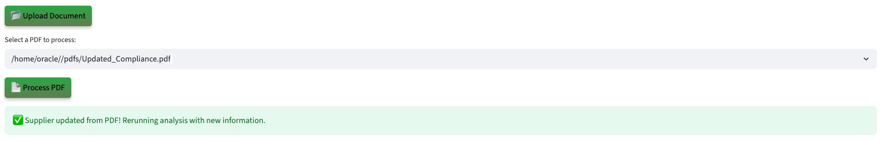

# Run the Demo

## Introduction

Act as a Grid Interconnection Engineer using an AI powered DER approval platform running on Oracle Database 23ai. Discover how Generative AI, Vector Search, Graph Analytics, and JSON Duality Views instantly analyze inverter specs, feeder capacity, and compliance rules, replacing monthlong manual studies with automated, data in place insights.

**Disclaimer**: Please note that your results may vary. The information provided is generated by OCI Generative AI services, and your outcomes may differ from those presented.

Estimated Lab Time: 30 minutes

### Objectives

In this lab, you will:

* Review how the Seer Energy Grid Interconnection app incorporates the use of JSON Duality Views, Graph analytics, and other converged database features, all without requiring complex data movement or separate systems.

### Prerequisites

This lab assumes you have:

* An Oracle account to submit your a LiveLabs Sandbox reservation.

## Task 1: Launch the application

1. To access the demo environment, click **View Login Info** in the top left corner of the page. Click the **Start the Demo** link.

    

2. Select **Energy & Utilities** under Industry and **Approval Officer** under Role. Enter in a username and click **Login**.

    

3. Welcome to the Seer Energy Grid Interconnection application! Congratulations, you are now connected to the demo environment. You can now execute the different tasks for this Lab.

    

## Task 2: Demo - Approving a supplier with a low risk GridFit Rating score

In this first example, you will use the application to approve a supplier with a low GridFit Rating risk score. The second user on your to-do list is Aisha Morgan from Volt Engineers.

1. On the Dashboard page, from the pending review list, select the review button for **Aisha Morgan**.

    

2. Opening Aisha Morgan’s profile reveals her grid interconnection request details—name, email, request ID, host capacity, gridfit rating, and energy status. You will also be able to see detailed AI analysis on the supplier consisting of a comprehensive evaluation, and top 3 requests with approval probability. 

    

3. At the bottom of Aisha Morgan’s profile, you will find the **AI Guru**—a chatbot built on Oracle Database 23ai and Vector search. When prompted, the system uses **RAG** to generate a response. It converts the question and energy data into embeddings, performs a similarity search, and then uses the **GenAI service** to turn the enriched context into a clear, natural language answer. If the supplier calls with a question, you can quickly enter it into the AI Guru to generate a relevant response. 
 

    **Copy** the question below into the AI chatbot and press **Enter**. What does the AI Guru respond?

    ```text
    <copy>
    Why was this request approved?
    </copy>
    ```

    

>💡 In Oracle Database 23ai, **AI Vector Search** allows you to combine your business data with a Large Language Model (LLM) to reduce hallucinations and get accurate answers from your data.

4. Select the **Navigate To Supplier Decisions** button.

    

    After navigating to the decisions page, the AI evaluation runs in the background. Energy documents containing feeder information such as host capacity, voltage impacts, and fault margins are stored in Oracle Database 23ai and modeled with JSON Duality Views. These documents are vectorized and searched using AI Vector Search to identify semantically relevant prior requests and compliance criteria. The results are passed to OCI Generative AI, which uses retrieval-augmented generation (RAG) to generate a natural-language explanation, formatted for both internal review and external communication. 

5. In the **Select Your Desired Option** section, the available options are displayed. If more data is needed, the reviewer can upload documents, add missing information, and trigger a re-evaluation. The system dynamically adjusts the recommendation, and generates a decision letter sent directly to the supplier.

    

6. Select the AI-recommended authorization decision. In this example, that is **Approved**. 

    >Please note that your results may vary. The information provided is generated by OCI Generative AI services, and your outcomes may differ from those presented.

    

7. Set the final authorization status to **Approved**, then click **Confirm Decision** to complete the process.

    The authorization status has been updated to 'Approved' and saved to the patient profile.

    

8.  Click the **Download Decision as PDF** button.

    

9.  Click **Download PDF**

    

10. Display the message the patient would see by opening the downloaded PDF.

    

11. Click the **Return to Dashboard** button to navigate back to the Dashboard.

    

12. Expand **View Approved Patients**. We can see that Aisha Morgan has been removed from the Pending Suppliers list and has been added to the Approved Suppliers list.

    

**Task Summary**

Once you select and save one of the 3 desired options recommended by the AI: 

✅ The supplier's interconnection request is updated.

✅ A finalized PDF decision document is generated.  

✅ The dashboard reflects the change in real-time — marking Aisha as Approved.

Congratulations, you have just approved your first supplier interconnection! Proceed to the next task.

## Task 3: Demo - Deny a supplier request
In this example, you will navigate the application to review a customer and deny them as part of the exercise. The next user on your to-do list is Nina Wright.

1. On the Dashboard page, from the pending review list, select the review button for **Nina Wright**.

    

2. Opening Nina Wright’s profile displays her patient history details. Within a few seconds, the AI automatically generates a suggested action. In this case, the system evaluates the profile and assigns it to “high risk” with explanations outlining key risk factors.

    This supplier has: 

    * A feeder with a **hosting capacity of 300, Voltage level of 12kV, and high fault margin**
    * A requested distributed energy resource with a **requested capacity of 350**
    * And is a GridFit Rating of  **8 (high risk)**

    The AI evaluates the profile and suggests next steps. In this case, it recommends denying the request and also provides clear explanations on why the recommendation is to deny the request.

    

3. Select the **Navigate to Supplier Decisions** button.

    

>⁉️ **What are two reasons that the AI denied this request?** ⁉️

4. Expand **Interactive Graph: DER Request, Risk & Decision** to view the graph.

    

    On the decision page, the return specialist can use **Interactive Graph: DER Request, Risk & Decision** to explore relationships in return authorization scenarios. Built with **Oracle Graph**, this feature visually maps decisions and highlights important features of the request like the feeder analysis and compliance rules.

    

    This graph shows how Nina Wright’s request connects to Feeder-A, flagged as High Risk and out of compliance with IEEE 1547. Instead of hidden studies, the Operational Property Graph makes the reasoning visual by linking customer, feeder, risk, and compliance in one view. Engineers and regulators can see instantly why the request was denied and build trust in the decision.

>💡 In Oracle Database 23ai, **Property Graph** allows you to treat your data like a network of connected points, where each point (called a node) and each link (called an edge) has its own details or properties. This setup helps you run graph analytics, to find important connections or patterns, directly within the database.


5. On the decisions page you can view the AI recommendation for Nina Wright. It shows the suggested action, comprehensive evaluation, and recommendations explanations. 

    

6. The authorization status is set to **Deny**. Click the **Confirm Decision** button.

    The authorization status has been updated to 'Deny' and saved to the patient profile.

    

7. Press the **Download Decision PDF** button to save the AI responses and proceed to the final authorization disposition.

    

8. Click the **Download PDF** button.

    

9. Display the message the patient would see by opening the downloaded PDF.

    

10. Click the **Return to Dashboard** button to navigate back to the Dashboard.

    

11. Expand **View In Progress Supplier**. You will see that Nina Wright has been moved from the **Pending Suppliers** list to the **Denied Suppliers** list.

    

**Task Summary**

Congratulations, you have finished reviewing a supplier that requires study! Proceed to the next task.

## Task 4: Demo - Update supplier details

Lastly, let’s explore how the system uses JSON Duality Views to handle profile updates. In this task, you will edit a supplier's details. In this example, the supplier was asked to submit updated lab results.

1. On the Dashboard page, from the **Pending Suppliers** list, select the review button for **Isabelle Carson**.

    

2. We will upload a document to update 's physician's note. On the Patient Details page, click the **Upload Document** button. The PDF file has been loaded. Then click the **Process PDF** button

    

>💡 **JSON Duality Views** in 23ai let's you update unstructured data in an easy, high-level format while automatically handling the technical details behind the scenes. This makes it faster and simpler to work with messy data and connect it to structured systems.

4. The patient profile has been updated.

    

**Task Summary**

Once the document is uploaded:

✅ The system automatically detects the new compliance data.

✅ The profile will be updated with compliance documentation.

✅ Thanks to JSON Transform and JSON Duality Views, only the relevant field is modified — leaving the rest of the profile UNTOUCHED.

## Conclusion

In conclusion our Grid Interconnection Approval App was able to leverage Oracle database 23ai technologies such as **AI Vector Search, Property Graph and JSON Duality Views** to:

✅ Automate profile evaluations

✅ Provide AI-driven energy recommendations by using a RAG model powered by a Oracle Database 23ai's AI Vector Search and OCI Generative AI service

✅ Enable seamless profile updates with JSON Duality Views

✅ And empower grid interconnection engineers with actionable insights through Operational Property Graphs 

By combining these advanced tools, the application enables faster, smarter decisions and delivers clear guidance on how suppliers can improve their eligibility.

**Next:** How about learning how the application was implemented in Python? Continue with the next labs and start developing!

## Learn More

* [Oracle Database 23ai Documentation](https://docs.oracle.com/en/database/oracle/oracle-database/23/)

## Acknowledgements
* **Authors** - Uma Kumar
* **Contributors** - Kevin Lazarz, Francis Regalado, Hanna Rakhsha, Ley Sylvester
* **Last Updated By/Date** - Uma Kumar, September 2025