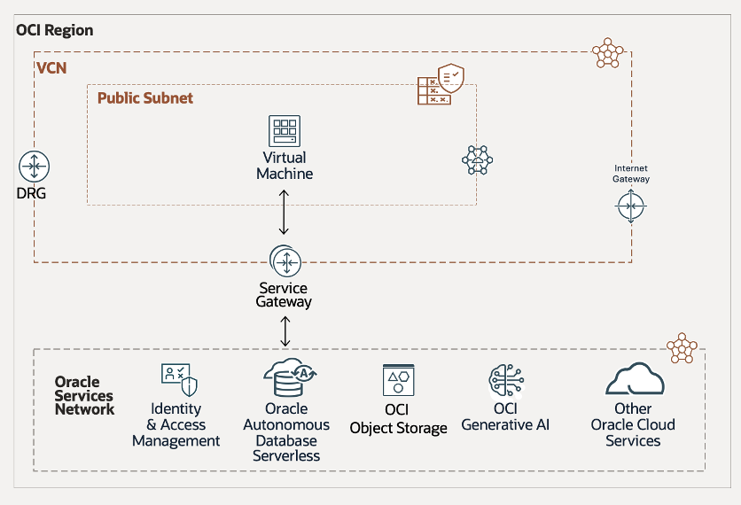

# Architecture & Workshop Features

## Introduction

In this lab, you will explore the architecture behind the workshop and the construction procurement application it supports. You will also look more closely at the Oracle AI Database features used to build both the workshop labs and the demo app.

Estimated Lab Time: 15 minutes

## Physical Architecture

The Seer Construction procurement application runs in an **Oracle Cloud Infrastructure (OCI)** region, with its application layer in a public subnet inside a **Virtual Cloud Network (VCN)**.

### Architecture Breakdown

- The application-tier VCN includes:
  - An Internet Gateway for outbound traffic
  - A Service Gateway for access to Oracle Cloud services
  - A Dynamic Routing Gateway (DRG) to connect to the Oracle Services Network
  - A VM in the public subnet that runs two containers:
    - The open-source Python stack for the construction procurement demo
    - JupyterLab as a browser-based development environment

- The application subnet connects to the Oracle Services Network through the Service Gateway, enabling access to:
  - Autonomous AI Database Serverless
  - OCI Generative AI services

This architecture provides strong connectivity, scalability, and integration with Oracle cloud-native services to support efficient construction procurement review, supplier recommendation, and decision workflows.

## Oracle AI Database Features Used in the Demo App and in this Workshop

### **JSON Duality View**

JSON Relational Duality in Oracle AI Database bridges the gap between relational and document data models. It gives developers the flexibility of JSON with the efficiency and power of relational storage, eliminating the trade-offs of choosing one model over the other.

At the core of this capability is the JSON Relational Duality View, which lets applications read and write JSON while the data remains stored in relational tables.

A key feature worth highlighting is the ability to connect to the database using MongoDB-style syntax. This allows developers to interact with collections and documents using a familiar API style.

**Where is it used**: We implement JSON Duality Views in both the demo app and this workshop. Procurement dashboard data shown in the application is queried from JSON Duality Views. In Lab 3, you learn how to interact with JSON Duality Views using Oracle’s Python driver and Oracle’s Mongo API.

### **AI Vector Search**

Oracle AI Vector Search, a feature of Oracle AI Database, enables fast, efficient searches over AI-generated vectors stored in the database. It supports multiple indexing strategies and scales to large datasets. With it, Large Language Models (LLMs) can query private business data using natural language while returning more accurate, context-aware results.

**Where is it used**: AI Vector Search is a key feature of the demo app and is also covered in Lab 4 and Lab 5. In Lab 4, you use AI Vector Search to implement a RAG process. In Lab 5, you focus on similarity search.

### **Property Graph**

Oracle AI Database supports property graphs, which model relationships using vertices and edges mapped to existing tables, external tables, materialized views, or synonyms. These graphs store metadata rather than duplicating the underlying data. You use SQL/PGQ to query and interact with them.

Property graphs simplify connected-data analysis, such as tracing supplier recommendations, risk outcomes, project requirements, and pending procurement decisions through a graph representation.

**Where is it used**: We implement property graphs in the workshop demo. Construction procurement officers can use them to identify near-approval suppliers, explain denial outcomes, and understand the decision context around project procurement risk.

## Acknowledgements
* **Authors** - Linda Foinding, Francis Regalado
* **Contributors** - Eddie Ambler
* **Last Updated By/Date** - Taylor Zheng, Uma Kumar, Deion Locklear, Daniet Hart, July 2026
