# Step by step: Implement RAG with Oracle AI Database

## Introduction

In this lab, you build a construction procurement engine with Oracle AI Database and OCI Generative AI. Connect to the database, explore the sample procurement data, and invoke a large language model to generate supplier recommendations and risk explanations. Building on earlier exercises, you’ll apply Python to deliver a fully integrated, AI-powered construction procurement application.

This lab uses some of the basic coding samples you created in lab 3, such as `cursor.execute` and more.

Estimated Time: 30 minutes

### Objectives

* Build the complete construction procurement application as seen in lab 1
* Use OCI Generative AI to generate contextual procurement recommendations
* Use Python to connect to an Oracle AI Database instance and run queries
* Explore procurement data and extract relevant information

### Prerequisites

This lab assumes you have:

* An Oracle Cloud account
* Completed lab 1: Run the demo

## Task 1: Login to JupyterLab

1. To navigate to the development environment, click **View Login Info**. Copy the Development IDE Login Password. Click the Start Development IDE link.

    

2. Paste in the Development IDE Login Password that you copied in the previous step. Click **Login**.

    

3. Click the blue `+`. This will open the Launcher.

    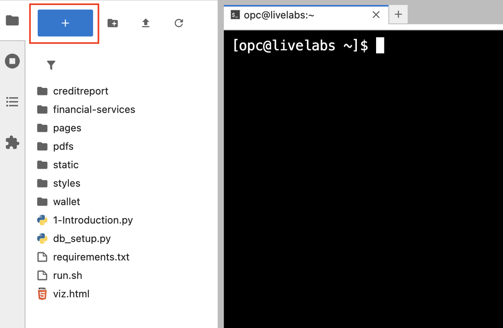

## Task 2: Get familiar with the development environment

1. Review the different elements in JupyterLab:

    **File browser (1):** The file browser organizes and manages files within the JupyterLab workspace. It supports drag-and-drop file uploads, file creation, renaming, and deletion. Users can open notebooks, terminals, and text editors directly from the browser.

    **Launcher (2 and 3):** The launcher offers a streamlined entry point for starting new activities. Users can create Jupyter Notebooks for interactive coding with live code execution, visualizations, and rich markdown. The terminal provides direct shell access for command-line work in the same environment.

    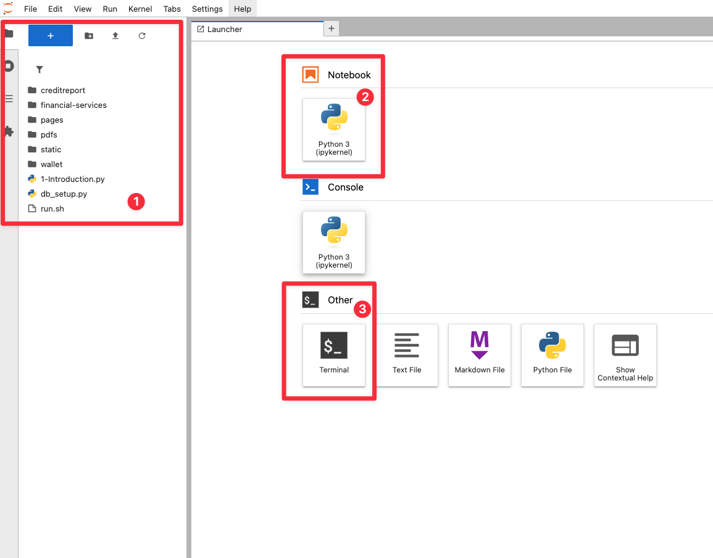

## Task 3: View created tables in Jupyter Lab

1. Navigate back to your terminal window.

    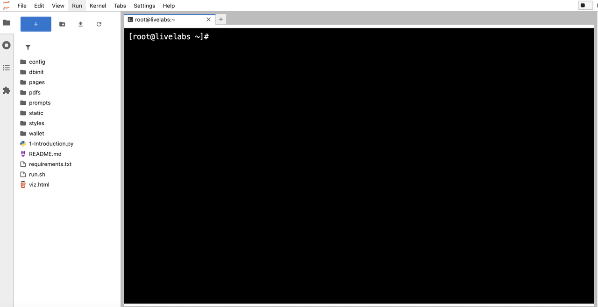

2. Navigate to `db_setup_script_2.sql` under the `dbinit` folder. Here is where you can see all the tables that support this construction procurement scenario.

    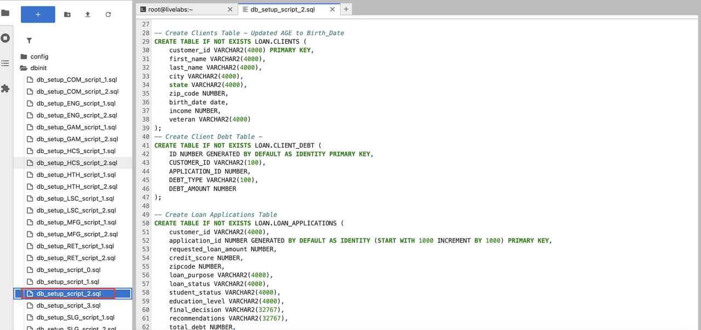

## Task 4: Connect to Database

1. Click the **+** sign on the top left to open the Launcher.

    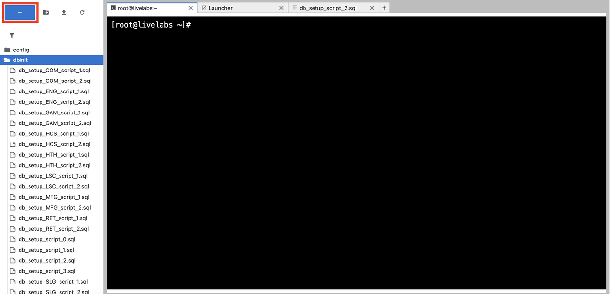

2. Open a new notebook.

    

3. Copy the following code block into an empty cell in your notebook. This code block imports the `oracledb` Python driver and other libraries.

    ```python
    <copy>
    import os
    import json
    import oracledb
    import pandas as pd
    import oci
    import numpy as np
    import re
    from dotenv import load_dotenv
    from PyPDF2 import PdfReader

    load_dotenv()

    username = os.getenv("USERNAME")
    password = os.getenv("DBPASSWORD")
    dsn = os.getenv("DBCONNECTION")

    try:
        connection = oracledb.connect(user=username, password=password, dsn=dsn)
        print("Connection successful!")
    except Exception as e:
        print(f"Connection failed: {e}")

    cursor = connection.cursor()
    </copy>
    ```

4. Run the code block to connect to the database.

    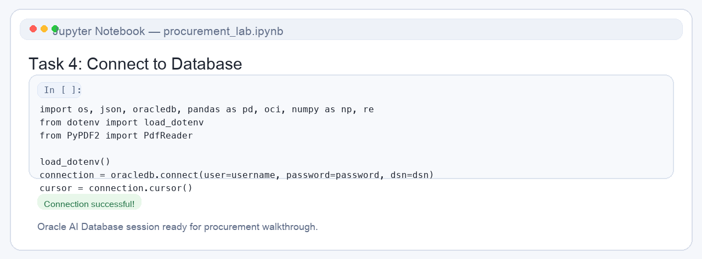

## Task 5: Create a function to retrieve procurement data from the database

You will query project procurement data from the `procurement_profiles_dv` JSON duality view, which combines `CONSTRUCTION_PROCUREMENTS` and related procurement fields into one JSON document. This task will:

- **Define a Function**: Create a reusable function `fetch_procurement_data` to query the database by project ID, extracting the JSON data for a specific procurement.
- **Use an Example**: Fetch data for project `1001` (`P1001 Downtown Mixed-Use Tower`) to demonstrate the process.
- **Display the Results**: Format the retrieved data into a pandas DataFrame for a clear, tabular presentation, showing key details like project name, location, project phase, required trade, procurement urgency, budget range, and risk level.

1. Copy and paste the code below into the new notebook.

    ```python
    <copy>
def fetch_procurement_data(project_id):
        cursor.execute(
            "SELECT data FROM procurement_profiles_dv WHERE JSON_VALUE(data, '$._id') = :project_id",
            {'project_id': project_id}
        )
        result = cursor.fetchone()
        return json.loads(result[0]) if result and isinstance(result[0], str) else result[0] if result else None

selected_project_id = "1001"
procurement_json = fetch_procurement_data(selected_project_id)

if procurement_json:
        print(f"Project: {procurement_json['projectName']}")
        print(f"Status: {procurement_json['projectStatus']}")

        desired_fields = [
            ("Project ID", selected_project_id),
            ("Project Code", procurement_json.get("projectCode", "")),
            ("Project Name", procurement_json.get("projectName", "")),
            ("Location", procurement_json.get("location", "")),
            ("Project Phase", procurement_json.get("projectPhase", "")),
            ("Required Trade", procurement_json.get("requiredTrade", "")),
            ("Procurement Urgency", procurement_json.get("procurementUrgency", "")),
            ("Budget Range", procurement_json.get("budgetRange", "")),
            ("Risk Level", procurement_json.get("riskLevel", "")),
            ("Project Status", procurement_json.get("projectStatus", "Pending Review"))
        ]

        df_procurement_details = pd.DataFrame(
            {field_name: [field_value] for field_name, field_value in desired_fields}
        )
        display(df_procurement_details)

else:
        print("No data found for project ID:", selected_project_id)
    </copy>
    ```

2. Click the **Run** button to see `P1001 Downtown Mixed-Use Tower`. The output will include a brief summary followed by a detailed table. If no data is found for the specified ID, a message will indicate this, helping you debug potential issues like an incorrect ID or empty database.

    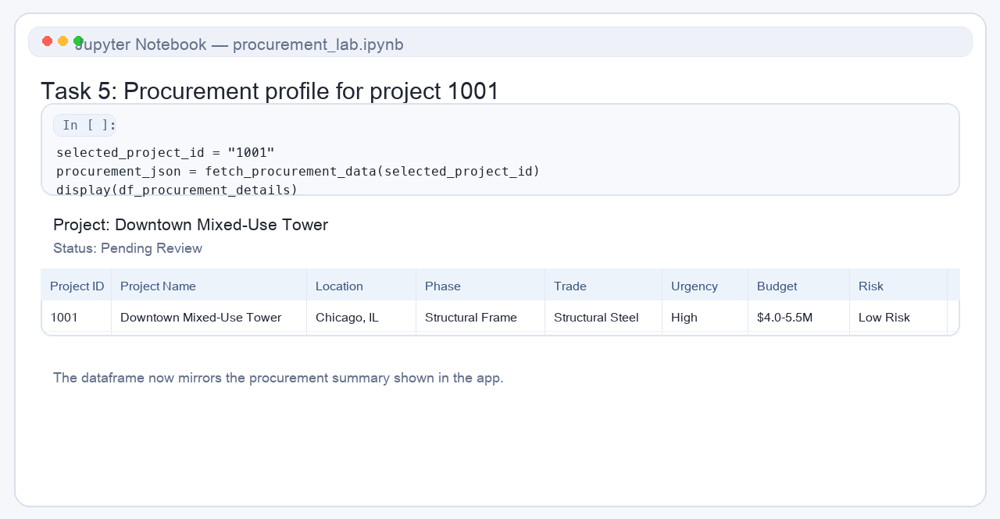

If you completed Lab 1: Run the Demo earlier, this is what gets printed out when the construction procurement officer opens project `1001`.

## Task 6: Create a function to generate procurement recommendations

In a new cell, define a function `generate_procurement_recommendations` to generate supplier recommendations.

With procurement profiles in place, you will use OCI Generative AI to generate personalized procurement recommendations.

Here’s what we’ll do:

- **Fetch Supplier Data**: Retrieve the available supplier options and combine them with the selected procurement data.
- **Build a Prompt**: Construct a structured prompt that combines the project’s procurement profile with supplier options, instructing the LLM to evaluate and recommend suppliers (`APPROVE`, `REQUEST INFO`, `DENY`) based solely on this data.
- **Use OCI Generative AI**: Send the prompt to the `meta.llama-3.2-90b-vision-instruct` model via OCI’s inference client.
- **Format the Output**: Display the recommendations with structured sections covering evaluation, top supplier options, and explanations.

1. Copy and paste the code in a new cell:

    ```python
    <copy>
    # Fetch supplier options
cursor.execute("SELECT supplier_option_id, supplier_name, trade_specialty, experience_summary, compliance_status, on_time_delivery_rate, delivery_window_weeks, capacity_status, project_fit, recommendation_status FROM supplier_option_catalog")
df_supplier_options = pd.DataFrame(cursor.fetchall(), columns=["SUPPLIER_OPTION_ID", "SUPPLIER_NAME", "TRADE_SPECIALTY", "EXPERIENCE_SUMMARY", "COMPLIANCE_STATUS", "ON_TIME_DELIVERY_RATE", "DELIVERY_WINDOW_WEEKS", "CAPACITY_STATUS", "PROJECT_FIT", "RECOMMENDATION_STATUS"])

# Generate Recommendations
def generate_procurement_recommendations(project_id, procurement_json, df_supplier_options):
        available_suppliers_text = "\n".join([
            f"{supplier['SUPPLIER_OPTION_ID']}: {supplier['SUPPLIER_NAME']} | {supplier['TRADE_SPECIALTY']} | "
            f"Compliance: {supplier['COMPLIANCE_STATUS']} | On-Time Delivery: {supplier['ON_TIME_DELIVERY_RATE']} | "
            f"Delivery Window: {supplier['DELIVERY_WINDOW_WEEKS']} weeks | Capacity: {supplier['CAPACITY_STATUS']}"
            for supplier in df_supplier_options.to_dict(orient='records')
        ])
        procurement_profile_text = "\n".join([
            f"- {key.replace('_', ' ').title()}: {value}"
            for key, value in procurement_json.items()
            if key not in ["embedding_vector", "ai_response_vector", "chunk_vector", "supplierRecommendations"]
        ])

        prompt = f"""<s>[INST] <<SYS>>You are a Construction Procurement AI. Use only the provided context to evaluate the procurement and recommend the best supplier next steps. Choose only from APPROVE, REQUEST INFO, or DENY. Format results as plain text with numbered sections (1. Comprehensive Procurement Evaluation, 2. Top 3 Supplier Recommendations, 3. Recommendation Explanations, 4. Final Suggestion). Use newlines between sections.</SYS>> [/INST]
        [INST]Available Supplier Options:\n{available_suppliers_text}\nProcurement Profile:\n{procurement_profile_text}\nTasks:\n1. Comprehensive Procurement Evaluation\n2. Top 3 Supplier Recommendations\n3. Recommendation Explanations\n4. Final Suggestion</INST>"""

        print("Generating AI response...")
        print(" ")

        genai_client = oci.generative_ai_inference.GenerativeAiInferenceClient(
            config=oci.config.from_file(os.getenv("OCI_CONFIG_PATH", "~/.oci/config")),
            service_endpoint=os.getenv("ENDPOINT")
        )

        chat_detail = oci.generative_ai_inference.models.ChatDetails(
            compartment_id=os.getenv("COMPARTMENT_OCID"),
            chat_request=oci.generative_ai_inference.models.GenericChatRequest(
                messages=[oci.generative_ai_inference.models.UserMessage(
                    content=[oci.generative_ai_inference.models.TextContent(text=prompt)]
                )],
                temperature=0.0,
                top_p=1.00
            ),
            serving_mode=oci.generative_ai_inference.models.OnDemandServingMode(
                model_id="meta.llama-3.2-90b-vision-instruct"
            )
        )
        chat_response = genai_client.chat(chat_detail)
        recommendations = chat_response.data.chat_response.choices[0].message.content[0].text

        return recommendations

recommendations = generate_procurement_recommendations(selected_project_id, procurement_json, df_supplier_options)
print(recommendations)
    </copy>
    ```

2. Click the **Run** button to execute the code. Note that this will take time to run. Be patient while the LLM evaluates the procurement and returns its recommendations.

    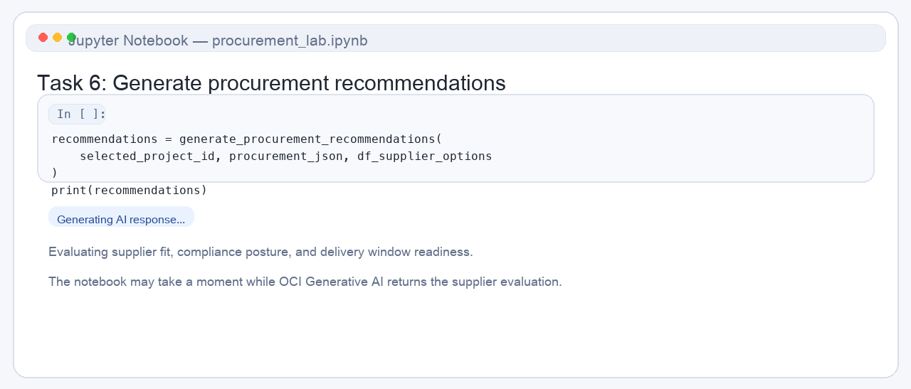

3. Review the output. In the demo, this is where you selected the **Navigate To Project Decisions** button as the construction procurement officer.

    >*Note:* Your result may be different due to the non-deterministic nature of generative AI.

    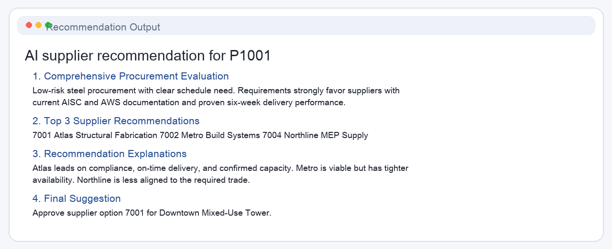

## Task 7: Chunk & Store the Recommendations

In this section we will chunk and store the recommendations.

- We delete prior chunks for this project.
- We use `VECTOR_CHUNKS` to insert the chunks.
- The chunks are inserted into `PROCUREMENT_RECOMMENDATION_CHUNK` with unique `CHUNK_ID` = (`size + chunk_offset`).
- We display a data frame summary to show the chunks.

1. Copy the following code and run it in a new cell:

    ```python
    <copy>
    # Clean any prior chunks for this project
cursor.execute("DELETE FROM PROCUREMENT_RECOMMENDATION_CHUNK WHERE PROJECT_ID = :project_id", {'project_id': selected_project_id})
connection.commit()

chunk_sizes = [50]

for size in chunk_sizes:
        insert_sql = f"""
            INSERT INTO PROCUREMENT_RECOMMENDATION_CHUNK (PROJECT_ID, CHUNK_ID, CHUNK_TEXT)
            SELECT :project_id,
                :chunk_size + vc.chunk_offset,
                vc.chunk_text
            FROM (SELECT :rec_text AS txt FROM dual) s,
                VECTOR_CHUNKS(
                dbms_vector_chain.utl_to_text(s.txt)
                BY words
                MAX {size}
                OVERLAP 0
                SPLIT BY sentence
                LANGUAGE american
                NORMALIZE all
                ) vc
        """
        cursor.execute(
            insert_sql,
            {'project_id': selected_project_id, 'chunk_size': size, 'rec_text': recommendations}
        )

cursor.execute("""
    SELECT CHUNK_ID, CHUNK_TEXT
      FROM PROCUREMENT_RECOMMENDATION_CHUNK
     WHERE PROJECT_ID = :project_id
  ORDER BY CHUNK_ID
""", {'project_id': selected_project_id})
rows = cursor.fetchall()

def _lob_to_str(v): return v.read() if isinstance(v, oracledb.LOB) else v

items = []
for cid, ctext in rows:
        txt = _lob_to_str(ctext) or ""
        items.append({
            "CHUNK_ID": cid,
            "Chars": len(txt),
            "Words": len(txt.split()),
            "Preview": (txt[:160] + "…") if len(txt) > 160 else txt
        })

df_chunks = pd.DataFrame(items).sort_values("CHUNK_ID")
connection.commit()
print(f"✅ Task 7 complete: recommendation chunked for project {selected_project_id} (sizes: {chunk_sizes}).")
display(df_chunks)
    </copy>
    ```

2. Execute the code in a new cell.

    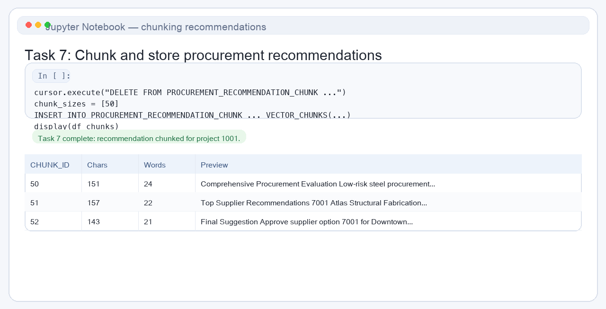

3. Review the output to see the chunked procurement recommendations.

    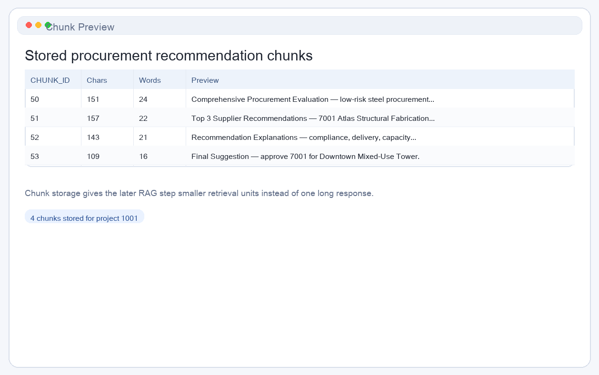

## Task 8: Create embeddings - Use Oracle AI Database to create vector data

To handle follow-up questions, you will enhance the system with an AI Guru powered by Oracle AI Database’s Vector Search and Retrieval-Augmented Generation (RAG). The AI Guru will be able to answer questions about the procurement and provide recommendations based on the data.

Before answering questions, we need to prepare the data by vectorizing the recommendations. This step:

- **Stores Recommendations**: Uses the recommendation text from the previous cell.
- **Generates Embeddings**: Uses `dbms_vector_chain.utl_to_embedding` to create vectors directly in the database.
- **Stores Embeddings**: Inserts the generated embedding vector into `PROCUREMENT_RECOMMENDATION_CHUNK`.

1. Run and review the code in a new cell:

    ```python
    <copy>
    # Create embeddings for procurement recommendation chunks
cursor.execute("""
    UPDATE PROCUREMENT_RECOMMENDATION_CHUNK
       SET CHUNK_VECTOR = dbms_vector_chain.utl_to_embedding(
           CHUNK_TEXT,
           JSON('{"provider":"database","model":"DEMO_MODEL","dimensions":384}')
       )
     WHERE PROJECT_ID = :project_id
""", {'project_id': selected_project_id})
connection.commit()
print("✅ Task 8 complete: embedded vectors for PROCUREMENT_RECOMMENDATION_CHUNK rows.")
    </copy>
    ```

2. Click the **Run** button to execute the code and review the output.

    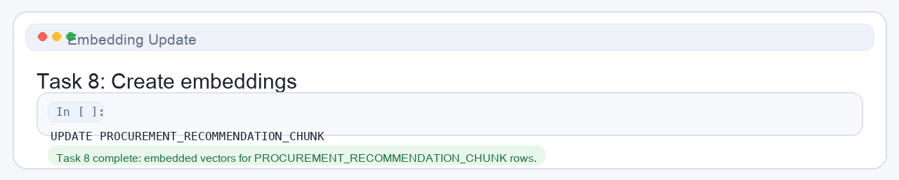

## Task 9: Implement RAG with Oracle AI Database's Vector Search

Now that the recommendations are vectorized, we can process a user’s question:

```Which supplier option best fits the Downtown Mixed-Use Tower procurement if we prioritize strong compliance and delivery reliability?```

This step:

- **Vectorizes the question**: Embeds the question using `DEMO_MODEL` via `dbms_vector_chain.utl_to_embedding`.
- **Performs AI Vector Search**: Retrieves the most relevant recommendation text from `PROCUREMENT_RECOMMENDATION_CHUNK`.
- **Uses RAG**: Combines the procurement profile, supplier options, and retrieved recommendation context.

1. Copy the code block below to implement RAG:

    ```python
    <copy>
question = "Which supplier option best fits the Downtown Mixed-Use Tower procurement if we prioritize strong compliance and delivery reliability?"

def vectorize_question(q):
        cursor.execute("""
            SELECT dbms_vector_chain.utl_to_embedding(
                :q,
                JSON('{"provider":"database","model":"DEMO_MODEL","dimensions":384}')
            ) FROM DUAL
        """, {'q': q})
        return cursor.fetchone()[0]

print("Processing your question using AI Vector Search across chunked recommendations...")

try:
        q_vec = vectorize_question(question)

        cursor.execute("""
            SELECT CHUNK_ID, CHUNK_TEXT
            FROM PROCUREMENT_RECOMMENDATION_CHUNK
            WHERE PROJECT_ID = :project_id
            AND CHUNK_VECTOR IS NOT NULL
            ORDER BY VECTOR_DISTANCE(CHUNK_VECTOR, :qv, COSINE)
            FETCH FIRST 4 ROWS ONLY
        """, {'project_id': selected_project_id, 'qv': q_vec})
        retrieved = [
            (r[0], r[1].read() if isinstance(r[1], oracledb.LOB) else r[1])
            for r in cursor.fetchall()
        ]

        if not retrieved:
            retrieved = [(0, recommendations)]

        cleaned = [re.sub(r"[^\\w\\s\\d.,\\-'\"]", " ", t).strip() for _, t in retrieved]
        docs_as_one_string = "\n=========\n".join(cleaned) + "\n=========\n"

        available_suppliers_text = "\n".join([
            f"{supplier['SUPPLIER_OPTION_ID']}: {supplier['SUPPLIER_NAME']} | {supplier['TRADE_SPECIALTY']} | "
            f"Compliance: {supplier['COMPLIANCE_STATUS']} | On-Time Delivery: {supplier['ON_TIME_DELIVERY_RATE']} | "
            f"Delivery Window: {supplier['DELIVERY_WINDOW_WEEKS']} weeks | Capacity: {supplier['CAPACITY_STATUS']}"
            for supplier in df_supplier_options.to_dict(orient='records')
        ])
        procurement_profile_text = "\n".join([
            f"- {k.replace('_',' ').title()}: {v}"
            for k, v in procurement_json.items()
            if k not in ["embedding_vector","ai_response_vector","chunk_vector","supplierRecommendations"]
        ])

        rag_prompt = f"""\
<s>[INST] <<SYS>>
You are AI Procurement Guru. Use only the provided context to answer. Do not mention sources outside of the provided context.
Do NOT provide warnings, disclaimers, or exceed the specified response length.
Keep under 300 words. Be specific and actionable.
<</SYS>> [/INST]
[INST]
Question: "{question}"

# Context (top chunks from prior AI recommendations):
{docs_as_one_string}

# Available Supplier Options:
{available_suppliers_text}

# Procurement Profile:
{procurement_profile_text}

Tasks:
1) Provide a direct answer to the question.
2) Briefly justify based on the procurement profile and available supplier options.
[/INST]"""

        print("Generating AI response...")

        genai_client = oci.generative_ai_inference.GenerativeAiInferenceClient(
            config=oci.config.from_file(os.getenv("OCI_CONFIG_PATH","~/.oci/config")),
            service_endpoint=os.getenv("ENDPOINT")
        )
        chat_detail = oci.generative_ai_inference.models.ChatDetails(
            compartment_id=os.getenv("COMPARTMENT_OCID"),
            chat_request=oci.generative_ai_inference.models.GenericChatRequest(
                messages=[oci.generative_ai_inference.models.UserMessage(
                    content=[oci.generative_ai_inference.models.TextContent(text=rag_prompt)]
                )],
                temperature=0.0,
                top_p=0.90
            ),
            serving_mode=oci.generative_ai_inference.models.OnDemandServingMode(
                model_id="meta.llama-3.2-90b-vision-instruct"
            )
        )
        chat_response = genai_client.chat(chat_detail)
        ai_response = chat_response.data.chat_response.choices[0].message.content[0].text
        ai_response = re.sub(r"[^\\w\\s\\d.,\\-'\"]", " ", ai_response)

        print("\n🤖 AI Procurement Guru Response:")
        print(ai_response)

        print("\n📑 Retrieved Chunks Used in Response:")
        for cid, text in retrieved:
            preview = text[:140].replace("\n", " ") + ("..." if len(text) > 140 else "")
            print(f"[Chunk {cid}] : {preview}")

except Exception as e:
        print(f"RAG flow error: {e}")
    </copy>
    ```

2. Click the **Run** button to execute the code.

    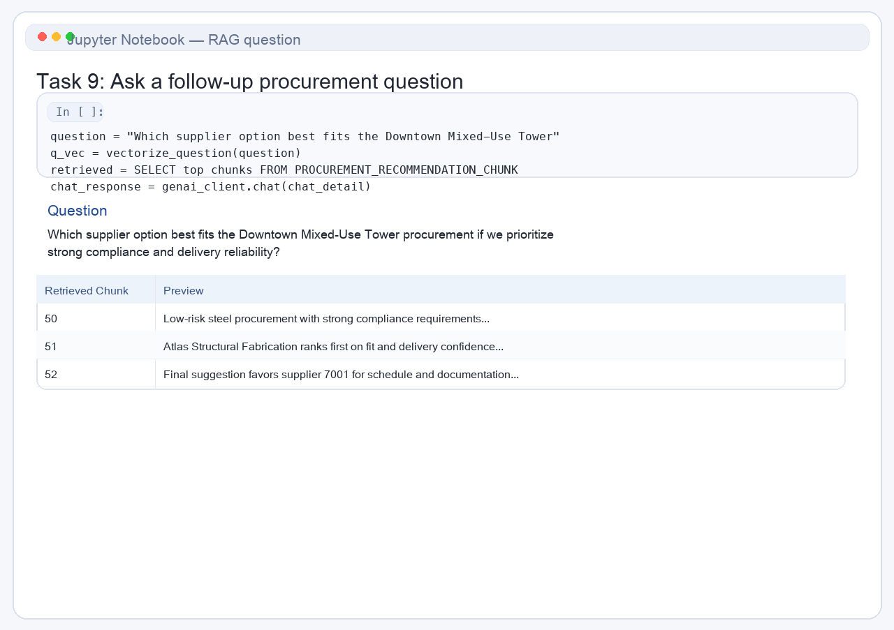

3. Review the result.

    >*Note:* Your result may be different due to the non-deterministic nature of generative AI.

    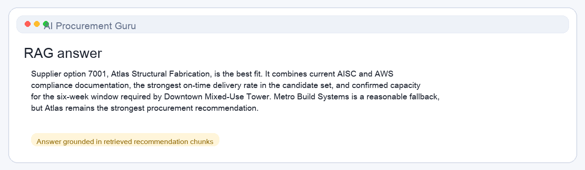

## Summary

Congratulations! You implemented a RAG process in Oracle AI Database using Python.

To summarize:

* You created a function to connect to Oracle AI Database using the Oracle Python driver `oracledb`.
* You created a function to retrieve procurement data.
* You created a function to connect to OCI Generative AI and create procurement recommendations.
* You created embeddings of procurement recommendation data using Oracle AI Database.
* And finally, you implemented a RAG process in Oracle AI Database using Python.

Congratulations, you completed the lab.

You may now proceed to the next lab.

## Learn More

* [Code with Python](https://www.oracle.com/developer/python-developers/)
* [Oracle AI Database Documentation](https://docs.oracle.com/en/database/oracle/oracle-database/23/)

## Acknowledgements
* **Authors** - Francis Regalado
* **Last Updated By/Date** - Taylor Zheng, Uma Kumar, Deion Locklear, Daniet Hart, July 2026
