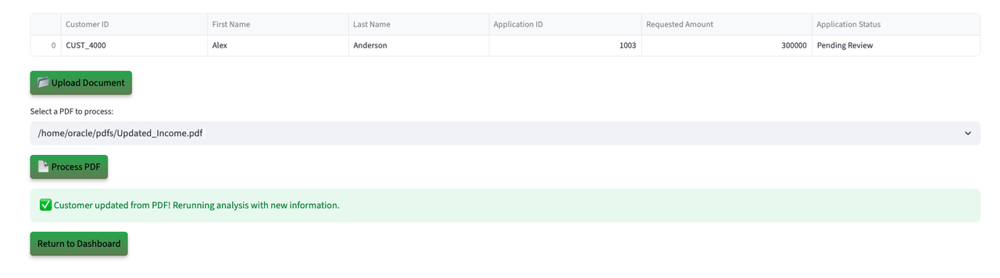
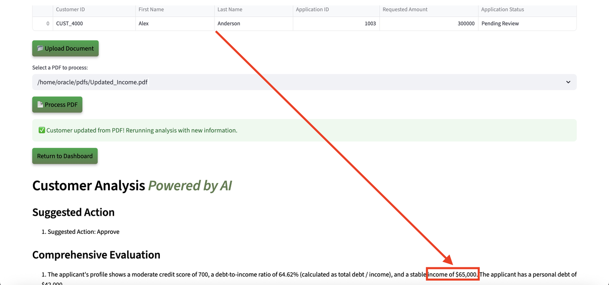

# Run the Demo

## Introduction

In this lab, you will step into the role of a **construction project reviewer** using a next-generation construction engineering review application powered by Oracle AI Database. You will work with project submissions and see how Generative AI, Vector Search, and Graph analytics replace manual review with faster, AI-driven decision-making.

**Disclaimer**: Your results may vary. The information provided is generated by OCI Generative AI services, and your outcomes may differ from those presented.

Estimated Time: 30 minutes

### Objectives

In this lab, you will:

* Review how the SeerStructures construction project review application incorporates JSON Duality Views, Graph analytics, and other converged database features without requiring complex data movement or separate systems

### Prerequisites

This lab assumes you have:

* An Oracle account to submit your LiveLabs Sandbox reservation

## Task 1: Launch the application

1. To access the demo environment, click **Open Link** next to **Start the Demo.**

    

2. Welcome to SeerStructures. Select **Construction Engineering** as Industry and **Project Reviewer** as role. Enter a username and click **Login**.

    

3. Welcome to the SeerStructures Project Review application. You are now connected to the demo environment and ready to work through the tasks in this lab.

    

## Task 2: Demo - Review a strong project submission

In this first example, you will review a project submission with a strong sponsor profile. The first submission on your to-do list is James Smith.

1. On the Dashboard page, from the pending review list, select the project record for **James Smith**.

    

2. Opening James Smith’s profile reveals the project submission details, including sponsor information, location, requested budget, current commitments, and site risk score.

    

3. At the bottom of James Smith’s profile, you will find the **AI Project Guru**, a chatbot built on Oracle AI Database and Vector Search. When prompted, the system uses **RAG** to generate a response. It converts the question and project data into embeddings, performs a similarity search, and then uses OCI Generative AI to turn the enriched context into a clear, natural-language answer.

    **Copy** the question below into the AI chatbot and press **Enter**. What does the AI Project Guru recommend?

    ```text
    <copy>
    Which project packages are the best fit when the sponsor wants to minimize site-prep work?
    </copy>
    ```

    

    >💡 In Oracle AI Database, **AI Vector Search** allows you to combine project data with the Large Language Model (LLM) to reduce hallucinations and get accurate answers grounded in your own data.

4. Select the **Navigate To Project Decisions** button.

    

    After navigating to the decisions page, the AI evaluation runs in the background. It analyzes James’s project submission and matches it against available project packages in the database. A custom AI prompt ensures the system uses only internal data. In this case, the AI returns three project options, each with a clear explanation, plus a final recommendation to approve the request.

5. In the **Select Final Project Package** section, the available project options are displayed. The project reviewer can choose to request more information to refine the recommendation, but for this scenario, proceed by selecting one of the suggested project packages.

    

6. Select the AI-recommended package with the shortest time to start and the strongest overall fit for the submission. In this example, that is Package 26.

    >Please note that your results may vary. The information provided is generated by OCI Generative AI services, and your outcomes may differ from those presented.

    

7. Set the final project status to **Approved**, then click **Confirm Decision** to complete the process.

    The project status is updated to `Approved` and saved to the submission profile.

    

8. Click the **Download Decision PDF** button.

    

9. Click **Download PDF**.

    

10. Display the message the sponsor would see by opening the downloaded PDF.

    

11. Click the **Return to Dashboard** button to navigate back to the dashboard.

    

12. Expand **View Approved Projects**. James Smith has been removed from the pending review list and added to the approved project list.

    

**Conclusion**

Once you select and save one of the three AI-recommended project packages:

✅ The project status is updated

✅ A finalized PDF decision document is generated

✅ The dashboard reflects the change in real time

Congratulations, you have just approved your first construction project submission. Proceed to the next task.

## Task 3: Demo - Deny a higher-risk project submission

In this example, you will review a project submission and deny it as part of the exercise. The second submission on your to-do list is James Woods.

1. On the Dashboard page, from the pending review list, select the project record for **James Woods**.

    

2. Opening James Woods’s profile displays the project submission details. Within a few seconds, the AI automatically generates recommendations. In this case, the system evaluates a weaker submission and identifies key risk factors.

    This submission has:

    * **Low annual revenue**
    * A **low site risk score**
    * A **high requested project budget**

    Despite these risk factors, the AI still explains the next steps clearly. In this case, it recommends a denial, while also showing what would need to change for the project to become viable.

    

3. Select the **Navigate to Project Decisions** button.

    

    >⁉️ **What is the main reason the AI decided to deny this project submission?** ⁉️

4. Expand **Interactive Graph: Project-Package Relationships** to view the graph.

    

    On the decision page, the project reviewer can use **Operational Property Graph** to explore near-fit project package scenarios.

    

    This graph reveals that while James Woods was denied for the requested project package, the submission is close to qualifying for a different package. Instead of a hard stop, the graph highlights a practical path forward.

    >💡 In Oracle AI Database, **Property Graph** allows you to treat your data as a network of connected nodes and edges, making it easier to identify patterns, relationships, and alternative paths directly in the database.

5. Set the final project status to **Denied**. Click the **Confirm Decision** button.

    The project status is updated to `Denied` and saved to the submission profile.

    

6. Press the **Download Decision PDF** button to save the AI responses and proceed to the final project disposition.

    

7. Click the **Download PDF** button.

    

8. Display the message the sponsor would see by opening the downloaded PDF.

    

9. Click the **Return to Dashboard** button to navigate back to the dashboard.

    

10. Expand **View Denied Projects**. James Woods has been moved from the pending review list to the denied projects section.

    

**Conclusion**

Congratulations, you have finished reviewing a higher-risk construction project submission. Proceed to the next task.

## Task 4: Demo - Update project details

Lastly, let’s explore how the system uses JSON Duality Views to handle project profile updates. In this task, you will edit a project’s details. In this example, the sponsor was asked to submit updated revenue documentation.

1. On the Dashboard page, from the **Pending Review Projects** list, select the project record for **Alex Anderson**.

    

2. We will upload a document to update Alex’s revenue. Before uploading the document, note that the sponsor’s annual revenue is currently listed as $25,000. On the Project Details page, click the **Upload Document** button.

    

3. The PDF file has been loaded. Click the **Process PDF** button.

    

    >💡 **JSON Duality Views** let you update data in a high-level document format while Oracle AI Database automatically keeps the underlying relational structures in sync.

4. The project profile has been updated.

    

5. Refresh the page and note that the sponsor revenue has been updated to $65,000. Thanks to JSON Transform and JSON Duality Views, only the relevant field is modified while the rest of the project profile remains untouched.

    

**Conclusion**

Once the document is uploaded:

✅ The system automatically detects the new revenue data

✅ The project profile is updated from $25,000 to $65,000

✅ JSON Transform and JSON Duality Views preserve the rest of the profile unchanged

## Summary

In conclusion, our project review application was able to leverage Oracle AI Database technologies such as **AI Vector Search, Property Graph, and JSON Duality Views** to:

✅ Automate project evaluations

✅ Provide AI-driven project recommendations with Oracle AI Database Vector Search and OCI Generative AI

✅ Enable seamless project profile updates with JSON Duality Views

✅ Empower project reviewers with actionable insights through Operational Property Graphs

By combining these tools, the application enables faster, smarter decisions and delivers clear guidance on how project sponsors can improve project readiness.

**Next:** Continue with the next labs to see how this application was implemented in Python.

## Learn More

* [Oracle AI Database Documentation](https://docs.oracle.com/en/database/oracle/oracle-database/23/)

## Acknowledgements
* **Authors** - Linda Foinding, Francis Regalado
* **Contributors** - Eddie Ambler, Ramona Magadan, Mark Nelson, Andy Tael, Anders Swanson, Rahul Tasker
* **Last Updated By/Date** - Linda Foinding, September 2025
