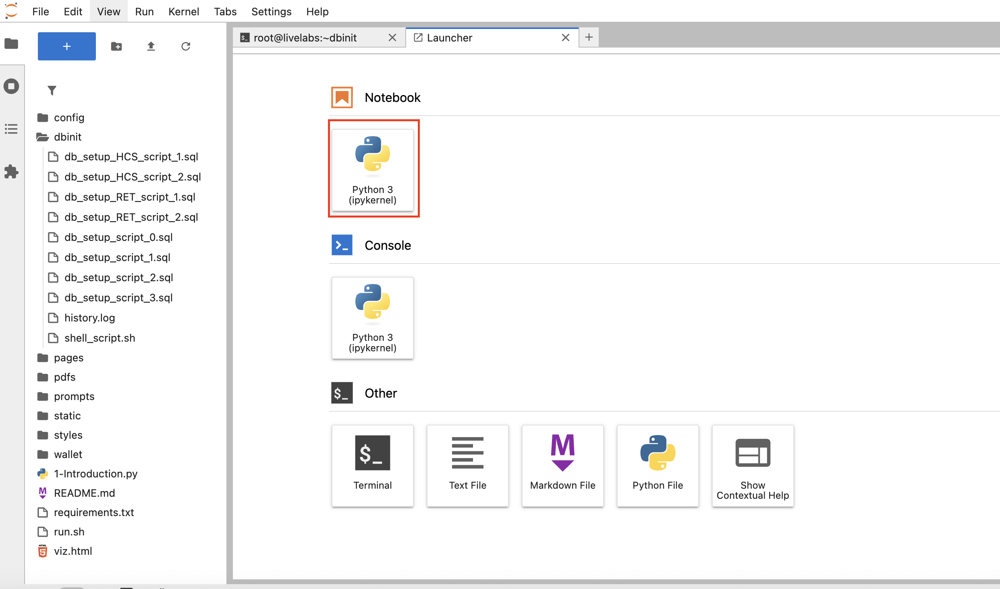
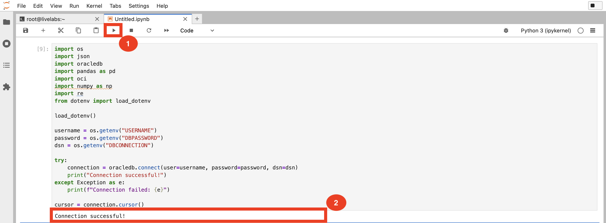
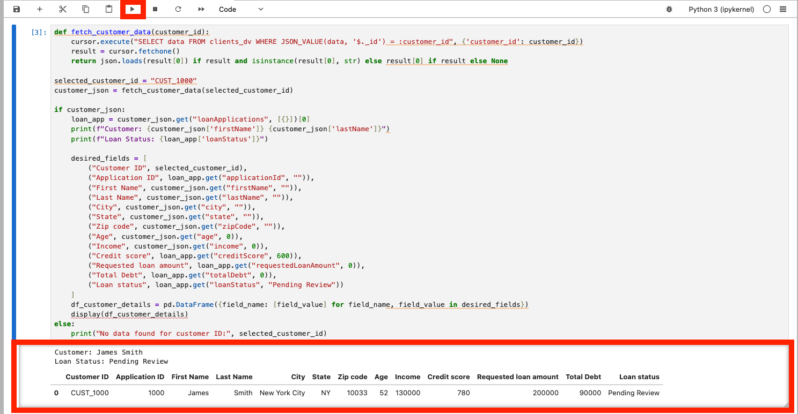
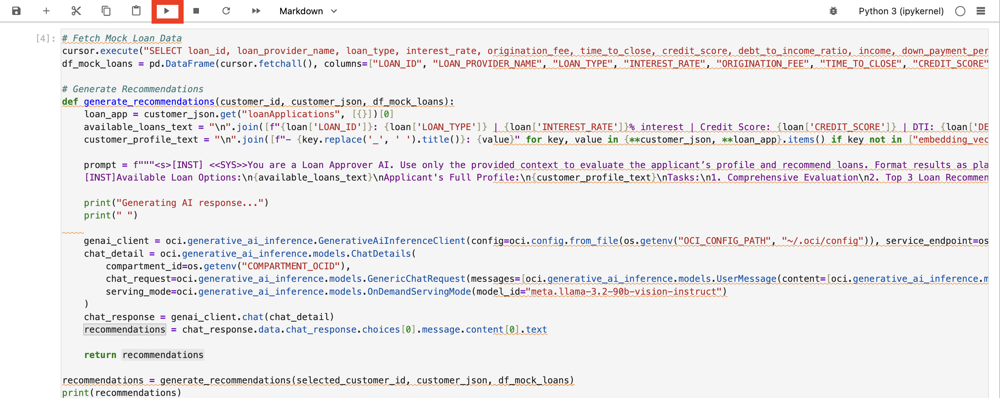
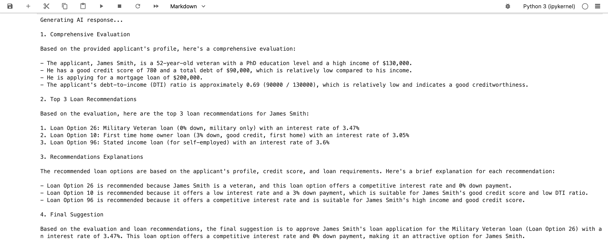
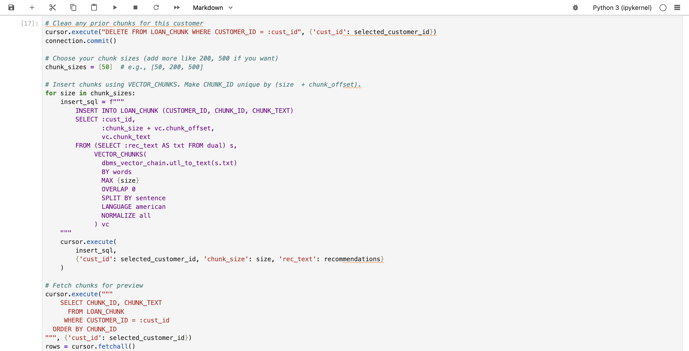
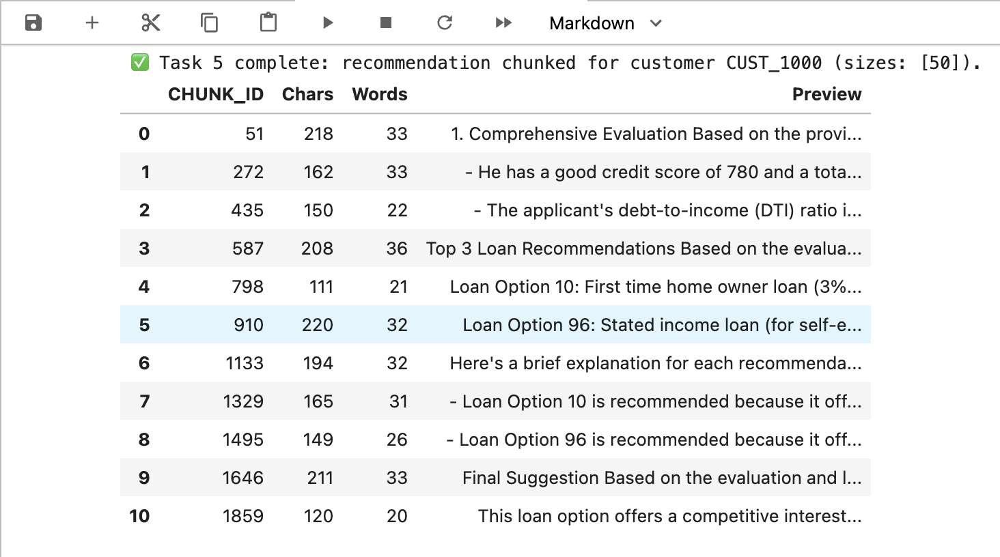
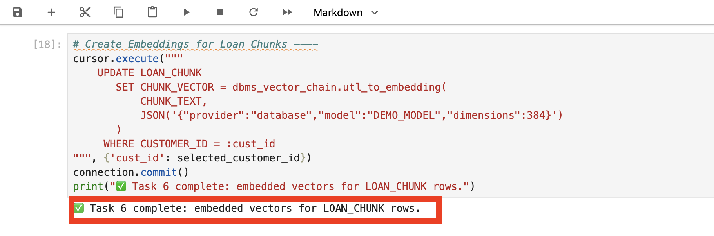
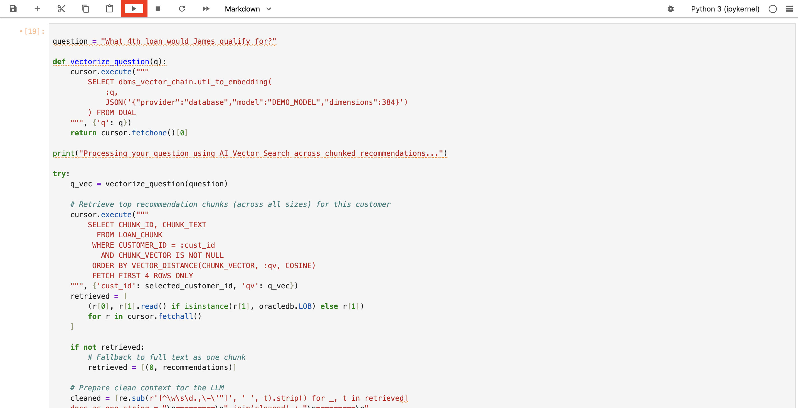
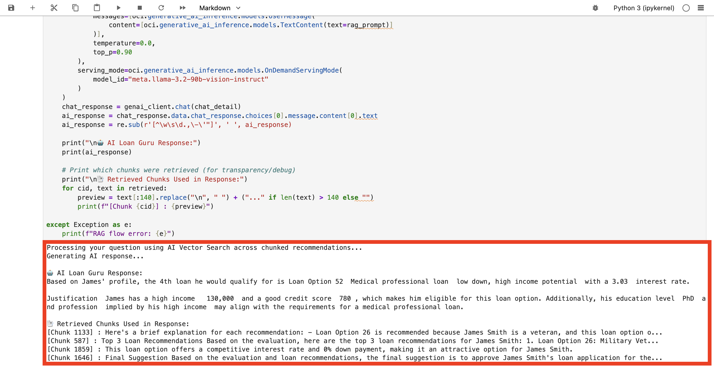

# Step by step: Implement RAG with Oracle Database 23ai 

## Introduction

In this lab, you build a complete loan approval engine with Oracle Database 23ai and OCI Generative AI. Connect to the database, explore order and image data, and invoke a large language model to generate personalized loan decisions and policy explanations. Building on earlier exercises, you’ll apply Python to deliver a fully integrated, AI-powered finance loan application.

This lab uses some of the basic coding samples you created in lab 3, such as cursor.execute and more.

Estimated Time: 30 minutes

### Objectives

* Build the complete loan approval application as seen in lab 1
* Use OCI Generative AI to generate contextual loan recommendations
* Use Python to connect to an Oracle Database 23ai instance and run queries
* Explore customer data and extract relevant information

### Prerequisites

This lab assumes you have:

* An Oracle Cloud account
* Completed lab 1: Run the demo
* Completed lab 2: Connect to the Development Environment


## Task 1: Build the application in Jupyter Notebook

>💡**Note**: Review Lab 2: Connect to the Development Environment for instructions on accessing JupyterLab.

1. You should see a terminal pop up once you are logged in. 

    


2. Navigate to the `dbinit` directory by running the following command.

    ```bash
    <copy>
    cd dbinit
    </copy>
    ```

    

3. Copy and run the following command to create tables in the database. There will be a lot of output. You should see the following output once complete.

    ```bash
    <copy>
    ./shell_script.sh
    </copy>
    ```

    

    

## Task 2: Connect to Database

1. Click the **+** sign on the top left to open the Launcher.

    

2. Open a new notebook.

    

3. Copy the following code block into an empty cell in your notebook. This code block imports the `oracledb` Python driver and other libraries.

    ```python
    <copy>
    import os
    import json
    import oracledb
    import pandas as pd
    import oci
    import numpy as np
    import re
    from dotenv import load_dotenv
    from PyPDF2 import PdfReader

    load_dotenv()

    username = os.getenv("USERNAME")
    password = os.getenv("DBPASSWORD")
    dsn = os.getenv("DBCONNECTION")

    try:
        connection = oracledb.connect(user=username, password=password, dsn=dsn)
        print("Connection successful!")
    except Exception as e:
        print(f"Connection failed: {e}")

    cursor = connection.cursor()
    </copy>
    ```

4. Run the code block to connect to the database. 

    


## Task 3: Create a Function to retrieve data from the database.

You will query customer data from the `clients_dv` JSON duality view, which combines data from CUSTOMERS, LOAN_APPLICATIONS, and related tables. This task will:

- **Define a Function**: Create a reusable function `fetch_customer_data` to query the database by customer ID, extracting the JSON data for a specific customer.

- **Use an Example**: Fetch data for customer `1000` (James Smith) to demonstrate the process.

- **Display the Results**: Format the retrieved data into a pandas DataFrame for a clear, tabular presentation, showing key details like name, income, credit score, and total debt.

1. Copy and paste the code below into the new notebook.

    ```python
    <copy>
def fetch_customer_data(customer_id):
        cursor.execute(
            "SELECT data FROM clients_dv WHERE JSON_VALUE(data, '$._id') = :customer_id",
            {'customer_id': customer_id}
        )
        result = cursor.fetchone()
        return json.loads(result[0]) if result and isinstance(result[0], str) else result[0] if result else None

selected_customer_id = "CUST_1000"
customer_json = fetch_customer_data(selected_customer_id)

if customer_json:
        loan_app = customer_json.get("loanApplications", [{}])[0]
        print(f"Customer: {customer_json['firstName']} {customer_json['lastName']}")
        print(f"Loan Status: {loan_app['loanStatus']}")

        desired_fields = [
            ("Customer ID", selected_customer_id),
            ("Application ID", loan_app.get("applicationId", "")),
            ("First Name", customer_json.get("firstName", "")),
            ("Last Name", customer_json.get("lastName", "")),
            ("City", customer_json.get("city", "")),
            ("State", customer_json.get("state", "")),
            ("Zip code", customer_json.get("zipCode", "")),
            ("Age", customer_json.get("age", 0)),
            ("Income", customer_json.get("income", 0)),
            ("Credit score", loan_app.get("creditScore", 600)),
            ("Requested loan amount", loan_app.get("requestedLoanAmount", 0)),
            ("Total Debt", loan_app.get("totalDebt", 0)),
            ("Loan status", loan_app.get("loanStatus", "Pending Review"))
        ]

        df_customer_details = pd.DataFrame(
            {field_name: [field_value] for field_name, field_value in desired_fields}
        )
        display(df_customer_details)

else:
        print("No data found for customer ID:", selected_customer_id)
    </copy>
    ``` 

2. Click the "Run" button to see James Smith’s profile. The output will include a brief summary (name and loan status) followed by a detailed table. If no data is found for the specified ID, a message will indicate this, helping you debug potential issues like an incorrect ID or empty database. The output will display a DataFrame containing the customer details for the selected customer ID.  

    


If you completed Lab 1: Run the Demo earlier, this is what gets printed out when the loan officer clicks on the customer 1000. You just built it, well done!

## Task 4: Create a function to generate recommendations for the customer

In a new cell, define a function `generate_recommendations` to generate loan recommendations. 

With customer profiles in place, you will use OCI Generative AI to generate personalized loan recommendations. 

Here’s what we’ll do:
- **Fetch Mock Loan Data**: Retrieve all mock loan data and combine them with customer data.
- **Build a Prompt**: Construct a structured prompt that combines the customer’s profile with loan requests instructing the LLM to evaluate and recommend a loan (APPROVE, REQUEST INFO, DENY) based solely on this data.
- **Use OCI Generative AI**: Send the prompt to the `meta.llama-3.2-90b-vision-instruct` model via OCI’s inference client, which will process the input and generate a response.
- **Format the Output**: Display the recommendations with styled headers and lists, covering evaluation, top picks, and explanations—making it easy to read and understand.

1. Copy and paste the code in a new cell:

    ```python
    <copy>
    # Fetch Mock Loan Data
cursor.execute("SELECT loan_id, loan_provider_name, loan_type, interest_rate, origination_fee, time_to_close, credit_score, debt_to_income_ratio, income, down_payment_percent, is_first_time_home_buyer FROM MOCK_LOAN_DATA")
df_mock_loans = pd.DataFrame(cursor.fetchall(), columns=["LOAN_ID", "LOAN_PROVIDER_NAME", "LOAN_TYPE", "INTEREST_RATE", "ORIGINATION_FEE", "TIME_TO_CLOSE", "CREDIT_SCORE", "DEBT_TO_INCOME_RATIO", "INCOME", "DOWN_PAYMENT_PERCENT", "IS_FIRST_TIME_HOME_BUYER"])

# Generate Recommendations
def generate_recommendations(customer_id, customer_json, df_mock_loans):
        loan_app = customer_json.get("loanApplications", [{}])[0]
        available_loans_text = "\n".join([f"{loan['LOAN_ID']}: {loan['LOAN_TYPE']} | {loan['INTEREST_RATE']}% interest | Credit Score: {loan['CREDIT_SCORE']} | DTI: {loan['DEBT_TO_INCOME_RATIO']}" for loan in df_mock_loans.to_dict(orient='records')])
        customer_profile_text = "\n".join([f"- {key.replace('_', ' ').title()}: {value}" for key, value in {**customer_json, **loan_app}.items() if key not in ["embedding_vector", "ai_response_vector", "chunk_vector"]])

        prompt = f"""<s>[INST] <<SYS>>You are a Loan Approver AI. Use only the provided context to evaluate the applicant’s profile and recommend loans. Format results as plain text with numbered sections (1. Comprehensive Evaluation, 2. Top 3 Loan Recommendations, 3. Recommendations Explanations, 4. Final Suggestion). Use newlines between sections.</SYS>> [/INST]
        [INST]Available Loan Options:\n{available_loans_text}\nApplicant's Full Profile:\n{customer_profile_text}\nTasks:\n1. Comprehensive Evaluation\n2. Top 3 Loan Recommendations\n3. Recommendations Explanations\n4. Final Suggestion</INST>"""

        print("Generating AI response...")
        print(" ")
        
        genai_client = oci.generative_ai_inference.GenerativeAiInferenceClient(config=oci.config.from_file(os.getenv("OCI_CONFIG_PATH", "~/.oci/config")), service_endpoint=os.getenv("ENDPOINT"))
        chat_detail = oci.generative_ai_inference.models.ChatDetails(
            compartment_id=os.getenv("COMPARTMENT_OCID"),
            chat_request=oci.generative_ai_inference.models.GenericChatRequest(messages=[oci.generative_ai_inference.models.UserMessage(content=[oci.generative_ai_inference.models.TextContent(text=prompt)])], temperature=0.0, top_p=1.00),
            serving_mode=oci.generative_ai_inference.models.OnDemandServingMode(model_id="meta.llama-3.2-90b-vision-instruct")
        )
        chat_response = genai_client.chat(chat_detail)
        recommendations = chat_response.data.chat_response.choices[0].message.content[0].text

        return recommendations

    recommendations = generate_recommendations(selected_customer_id, customer_json, df_mock_loans)
    print(recommendations)
    </copy>
    ```

2. Click the "Run" button to execute the code. Note that this will take time to run. Be patient, you will get the recommendations from the LLM shortly.

    

3. Review the output. In the demo, this is where you selected the "Navigate to Decisions" button as the Approval Officer. You just used AI to get recommendations for the approval officer which would have taken them hours to do, congratulations!

    >*Note:* Your result may be different due to non-deterministic character of generative AI.

    

## Task 5: Chunk & Store the Recommendations 

In this section we will be chunking and storing the recommendations.

- We delete prior chunks for this customer.
- We use `VECTOR_CHUNKS` to insert the chunks.
- The chunks will be inserted into `LOAN_CHUNK` with unique `CHUNK_ID` = (`size + chunk_offset`).
- We display a data frame summary to show the chunks.

1. Copy the following code and run it in a new cell:

    ```python
    <copy>
    # Clean any prior chunks for this customer
cursor.execute("DELETE FROM LOAN_CHUNK WHERE CUSTOMER_ID = :cust_id", {'cust_id': selected_customer_id})
connection.commit()

# Choose your chunk sizes (add more like 200, 500 if you want)
chunk_sizes = [50]  # e.g., [50, 200, 500]

# Insert chunks using VECTOR_CHUNKS. Make CHUNK_ID unique by (size  + chunk_offset).
for size in chunk_sizes:
        insert_sql = f"""
            INSERT INTO LOAN_CHUNK (CUSTOMER_ID, CHUNK_ID, CHUNK_TEXT)
            SELECT :cust_id,
                :chunk_size + vc.chunk_offset,
                vc.chunk_text
            FROM (SELECT :rec_text AS txt FROM dual) s,
                VECTOR_CHUNKS(
                dbms_vector_chain.utl_to_text(s.txt)
                BY words
                MAX {size}
                OVERLAP 0
                SPLIT BY sentence
                LANGUAGE american
                NORMALIZE all
                ) vc
        """
        cursor.execute(
            insert_sql,
            {'cust_id': selected_customer_id, 'chunk_size': size, 'rec_text': recommendations}
        )

# Fetch chunks for preview
cursor.execute("""
    SELECT CHUNK_ID, CHUNK_TEXT
      FROM LOAN_CHUNK
     WHERE CUSTOMER_ID = :cust_id
  ORDER BY CHUNK_ID
""", {'cust_id': selected_customer_id})
rows = cursor.fetchall()

# Build a compact dataframe
def _lob_to_str(v): return v.read() if isinstance(v, oracledb.LOB) else v

items = []
for cid, ctext in rows:
        txt = _lob_to_str(ctext) or ""
        items.append({
            "CHUNK_ID": cid,
            "Chars": len(txt),
            "Words": len(txt.split()),
            "Preview": (txt[:160] + "…") if len(txt) > 160 else txt
        })

    df_chunks = pd.DataFrame(items).sort_values("CHUNK_ID")
    connection.commit()
print(f"✅ Task 5 complete: recommendation chunked for customer {selected_customer_id} (sizes: {chunk_sizes}).")
display(df_chunks)
    </copy>
    ```

2. Execute the code in a new cell.

    

3. Review the output to see the top recommendations.

    

## Task 6: Create a function to create embeddings - Use Oracle Database 23ai to create vector data 

To handle follow-up questions, you will enhance the system with an AI Guru powered by Oracle 23ai’s Vector Search and Retrieval-Augmented Generation (RAG). The AI Guru will be able to answer questions about the loan application and provide recommendations based on the data.

Before answering questions, we need to prepare the data by vectoring the recommendations. This step:

   - **Stores Recommendations**: Inserts the full recommendation text (from previous cell) as a single chunk if not already present.

   - **Generates Embeddings**: This is a new feature in Oracle Database 23ai that allows you to create embeddings directly within the database, eliminating the need for external tools or APIs. The `dbms_vector_chain.utl_to_embedding` function takes the recommendation text as input and returns an embedding vector.

   - **Stores Embeddings**: Inserts the generated embedding vector into a table called `LOAN_CHUNKS`.

1. Run and review the code in a new cell:

    ```python
    <copy>
    # Create Embeddings for Loan Chunks ----
cursor.execute("""
    UPDATE LOAN_CHUNK
       SET CHUNK_VECTOR = dbms_vector_chain.utl_to_embedding(
           CHUNK_TEXT,
           JSON('{"provider":"database","model":"DEMO_MODEL","dimensions":384}')
       )
     WHERE CUSTOMER_ID = :cust_id
""", {'cust_id': selected_customer_id})
connection.commit()
print("✅ Task 6 complete: embedded vectors for LOAN_CHUNK rows.")
    </copy>
    ```

2. Click the "Run" button to execute the code and review the output.

    

## Task 7: Implement RAG with Oracle Database 23ai's Vector Search

Now that the recommendations are vectorized, we can process a user’s question:

``` What 4th loan would James qualify for?```

This step:

   - **Vectorizes the question**: Embeds the question using `DEMO_MODEL` via `dbms_vector_chain.utl_to_embedding`.
   - **Performs AI Vector Search**: Retrieve the relevant recommendation text from `LOAN_CHUNKS` table. Then find the most relevant recommendations using similarity search.
   - **Use RAG**: Combines the customer profile, policy rules using the retrieved recommendation context.

1. Copy the code block below to implement RAG:

    ```python
    <copy>
question = "What 4th loan would James qualify for?"

def vectorize_question(q):
        cursor.execute("""
            SELECT dbms_vector_chain.utl_to_embedding(
                :q,
                JSON('{"provider":"database","model":"DEMO_MODEL","dimensions":384}')
            ) FROM DUAL
        """, {'q': q})
        return cursor.fetchone()[0]

print("Processing your question using AI Vector Search across chunked recommendations...")

try:
        q_vec = vectorize_question(question)

        # Retrieve top recommendation chunks (across all sizes) for this customer
        cursor.execute("""
            SELECT CHUNK_ID, CHUNK_TEXT
            FROM LOAN_CHUNK
            WHERE CUSTOMER_ID = :cust_id
            AND CHUNK_VECTOR IS NOT NULL
            ORDER BY VECTOR_DISTANCE(CHUNK_VECTOR, :qv, COSINE)
            FETCH FIRST 4 ROWS ONLY
        """, {'cust_id': selected_customer_id, 'qv': q_vec})
        retrieved = [
            (r[0], r[1].read() if isinstance(r[1], oracledb.LOB) else r[1])
            for r in cursor.fetchall()
        ]

        if not retrieved:
            # Fallback to full text as one chunk
            retrieved = [(0, recommendations)]

        # Prepare clean context for the LLM
        cleaned = [re.sub(r'[^\w\s\d.,\-\'"]', ' ', t).strip() for _, t in retrieved]
        docs_as_one_string = "\n=========\n".join(cleaned) + "\n=========\n"

        # Rebuild available loans + customer profile
        available_loans_text = "\n".join(
            [f"{loan['LOAN_ID']}: {loan['LOAN_TYPE']} | {loan['INTEREST_RATE']}% interest | "
            f"Credit Score: {loan['CREDIT_SCORE']} | DTI: {loan['DEBT_TO_INCOME_RATIO']} | "
            f"Origination Fee: ${loan['ORIGINATION_FEE']} | Time to Close: {loan['TIME_TO_CLOSE']} days"
            for loan in df_mock_loans.to_dict(orient='records')]
        )
        loan_app = customer_json.get("loanApplications", [{}])[0]
        customer_profile_text = "\n".join(
            [f"- {k.replace('_',' ').title()}: {v}"
            for k, v in {**customer_json, **loan_app}.items()
            if k not in ["embedding_vector","ai_response_vector","chunk_vector"]]
        )

        rag_prompt = f"""\
<s>[INST] <<SYS>>
You are AI Loan Guru. Use only the provided context to answer. Do not mention sources outside of the provided context. 
Do NOT provide warnings, disclaimers, or exceed the specified response length.
Keep under 300 words. Be specific and actionable. Have the ability to respond in Spanish, French, Italian, German, and Portuguese if asked.
<</SYS>> [/INST]
[INST]
Question: "{question}"

# Context (top chunks from prior AI recommendations):
{docs_as_one_string}

# Available Loan Options:
{available_loans_text}

# Applicant Profile:
{customer_profile_text}

Tasks:
1) Provide a direct answer to the question.
2) Briefly justify based on profile + loan options.
[/INST]"""

        print("Generating AI response...")

        genai_client = oci.generative_ai_inference.GenerativeAiInferenceClient(
            config=oci.config.from_file(os.getenv("OCI_CONFIG_PATH","~/.oci/config")),
            service_endpoint=os.getenv("ENDPOINT")
        )
        chat_detail = oci.generative_ai_inference.models.ChatDetails(
            compartment_id=os.getenv("COMPARTMENT_OCID"),
            chat_request=oci.generative_ai_inference.models.GenericChatRequest(
                messages=[oci.generative_ai_inference.models.UserMessage(
                    content=[oci.generative_ai_inference.models.TextContent(text=rag_prompt)]
                )],
                temperature=0.0,
                top_p=0.90
            ),
            serving_mode=oci.generative_ai_inference.models.OnDemandServingMode(
                model_id="meta.llama-3.2-90b-vision-instruct"
            )
        )
        chat_response = genai_client.chat(chat_detail)
        ai_response = chat_response.data.chat_response.choices[0].message.content[0].text
        ai_response = re.sub(r'[^\w\s\d.,\-\'"]', ' ', ai_response)

        print("\n🤖 AI Loan Guru Response:")
        print(ai_response)

        # Print which chunks were retrieved (for transparency/debug)
        print("\n📑 Retrieved Chunks Used in Response:")
        for cid, text in retrieved:
            preview = text[:140].replace("\n", " ") + ("..." if len(text) > 140 else "")
            print(f"[Chunk {cid}] : {preview}")

except Exception as e:
        print(f"RAG flow error: {e}")
    </copy>
    ```

2. Click the "Run" button to execute the code.

    

3. Review the result.

    >*Note:* Your result may be different due to non-deterministic character of generative AI.

    

## Summary

Congratulations! You implemented a RAG process in Oracle Database 23ai using Python.

To summarize:

* You created a function to connect to Oracle Database 23ai using the Oracle Python driver `oracledb`.
* You created a function to retrieve customer data.
* You created a function to connect to OCI Generative AI and create a first recommendation.
* You created a function to create embeddings of the customer data using Oracle Database 23ai.
* And finally, you implemented a RAG process in Oracle Database 23ai using Python.

Congratulations, you completed the lab!

You may now proceed to the next lab.

## Learn More

* [Code with Python](https://www.oracle.com/developer/python-developers/)
* [Oracle Database 23ai Documentation](https://docs.oracle.com/en/database/oracle/oracle-database/23/)

## Acknowledgements
* **Authors** - Francis Regalado
* **Contributors** - Kevin Lazarz, Linda Foinding
* **Last Updated By/Date** - Linda Foinding, September 2025