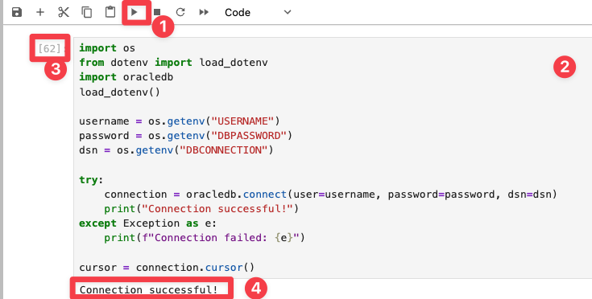

# Connect to the Development Environment

## Introduction

In this short lab, you’ll launch the JupyterLab-based development environment used throughout the workshop. JupyterLab runs entirely in your browser and allows you to write and test Python code that interacts directly with Oracle Database 23ai.

This is the same environment used by the SeerEquities data team to build the AI loan assistant.

> 💡 You only need to complete this once. In the next labs, you'll jump straight into hands-on coding. Remember to come back to this lab in case you need you closed the browser window and need to access JupyterLab again.

Estimated Time: 5 minutes

To get things started we invite you to watch this video and see the lab in action:

  

### Objective

- Access the JupyterLab environment
- Log in using provided credentials
- Get familiar with basic Jupyter features

## Task 1: Login to JupyterLab

1. In the top left of your lab page, click **View Login Info**.  
2. Copy the **Development IDE Login Password**.
3. Click the **Start Development IDE** link.
   
    

4. Paste in the password and click **Login**.

    

You’re now in the development environment.

## Task 2: Explore JupyterLab

JupyterLab is where you’ll write, run, and test Python code that connects to Oracle Database 23ai. Here are the key parts:

**File browser (1):** Use this panel to open notebooks, scripts, and other files. Right-click for actions like rename or delete.

**Launcher:** From here, you can start:
- **Python notebooks (2)** for running code
- **Terminals (3)** ** for command-line tasks

## Task 3: Working with Jupyter Notebooks

You’ll use notebooks for every lab in this workshop. Each notebook is made up of **cells**:

- **Markdown cells** hold instructions and explanations
- **Code cells** contain executable Python

To run a code cell:
- Press **Shift + Enter**
- Or click the **Run** button in the toolbar

While a cell is running, you’ll see `[*]`. When it finishes, it changes to a number like `[3]`.

> 🛠 If a cell throws an error, double-check the code or rerun the previous steps.

## Conclusion

You’ve now logged into the cloud-based development environment where all coding will take place.

✅ You can access JupyterLab in your browser  
✅ You understand how to open and run notebooks  
✅ You’re ready to start interacting with Oracle Database 23ai  

## Acknowledgements
* **Author** - Kamryn Vinson
* **Contributors** -  Linda Foinding, Francis Regalado, Kevin Lazarz
* **Last Updated By/Date** - Kamryn Vinson, April 2025
