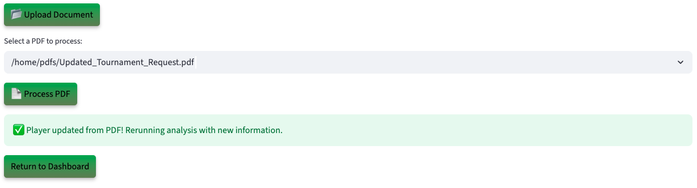

# Run the Demo

## Introduction

In this lab, you’ll step into the shoes of a **Tournament Organizer** using an AI powered bracket management app built on Oracle Database 23ai. See how Generative AI, Vector Search, and Graph Analytics reduce review times by automating bracket seeding, rule adherence, and player skill checks - all inside one converged database, with zero data shuffling.

**Disclaimer**: Please note that your results may vary. The information provided is generated by OCI Generative AI services, and your outcomes may differ from those presented.

Estimated Lab Time: 30 minutes

### Objectives

In this lab, you will:

* Review how the Seer Gaming bracket management app incorporates the use of AI Vector Search, Graph analytics, and other converged database features, all without requiring complex data movement or separate systems.

### Prerequisites

This lab assumes you have:

* An Oracle account to submit your a LiveLabs Sandbox reservation.

## Task 1: Launch the application

1. To access the demo environment, click **View Login Info** in the top left corner of the page. Click the **Start the Demo** link.

    

2. Welcome to Seer Holdings! Select **Gaming** as Industry and **Approval Officer** as role. Enter in a username and click **Login**.

    

3. Welcome to the Seer Gaming bracket management application! Congratulations, you are now connected to the demo environment. You can now execute the different tasks for this Lab.

    

## Task 2: Demo - Player with medium risk level

In this first example, you will use the application to authorize a sign-up for a player with a medium risk score. Select the first user on your to-do list Cathy Lee.

1. On the Dashboard page, from the pending review list, select the review button for **Cathy Lee**.

    

2. Opening Cathy Lee’s profile shows her tournament request details — including name, email, request status, team role, and risk level.

    

3. At the bottom of Cathy Lee’s profile, you’ll find **AI Guru** — a virtual Tournament Officer who guides players and staff through each step of the AI-powered approval portal. AI Guru demonstrates how to upload rank proofs and player data, explains how AI Vector Search compares requests to past tournament cases, and translates risk scores into clear language. Its friendly tips humanize concepts like graph-based team eligibility analysis and RAG-generated rule explanations, helping users of any technical level confidently approve, pend, or deny a tournament request..

    **Copy** the question below into the AI chatbot and press **Enter**. What does AI Guru say?

    ```text
    <copy>
    Has this player submitted similar tournament requests before?
    </copy>
    ```

    

>💡 In Oracle Database 23ai, **AI Vector Search** allows you to combine your business data with a Large Language Model (LLM) to reduce hallucinations and get accurate answers from your data.

4. Select the **Navigate To Decisions** button.

    

    After navigating to the decisions page, the AI evaluation runs in the background. Using AI Vector Search, it semantically compares the content against thousands of historical tournament records—identifying patterns that suggest either legitimate claims or potential abuse. At the same time, Graph Analytics examines the player’s prior behavior, highlighting unusual tournament frequency or links to high-risk product categories. For each case, the system assigns a risk score ranging from Low to Very High and generates a clear recommendation—such as “Approved – consistent with player profile” or “Request More Info – insufficient documentation.”

5. In the **Select Your Desired Option Option** section, the approval probability and decision are displayed. Once a decision is made, the analyst finalizes the tournament. A professionally formatted PDF letter is automatically generated, summarizing the outcome and rationale. The player receives an email moments later, clearly stating whether their tournament was approved, denied, or needs more information—along with an explanation grounded in policy and precedent.

    

6. Select the AI-recommended decision. In this example, that is **Request Info**. 

    >Please note that your results may vary. The information provided is generated by OCI Generative AI services, and your outcomes may differ from those presented.

    

7. Set the final tournament status to **Request Info**, then click **Confirm Decision** to complete the process.

    The tournament status has been updated to 'Request Info' and saved to the player profile.

    

8.  Click the **Download Decision as PDF** button.

    

9.  Click **Download PDF**

    

10. Display the message the player would see by opening the downloaded PDF.

    

11. Click the **Return to Dashboard** button to navigate back to the Dashboard. Expand **View In Progress Players**. We can see that Cathy Lee has been removed from the **Pending Players** list and has been added to the **In Progress Players**.

    

**Task Summary**

Once you select and save one of the 3 tournament options recommended by the AI: 

✅ The player's tournament status is updated.

✅ A finalized PDF decision document is generated.  

✅ The dashboard reflects the change in real-time — marking Cathy as In Progress.

Congratulations, you have just processed your first player's request! Proceed to the next task.

## Task 3: Demo - Denying a Player
In this example, you will navigate the application to review a player and deny them as part of the exercise. The first user on your to-do list is Frank Johnson.

1. On the Dashboard page, from the pending review list, select the Review Button for **Frank Johnson**.

    

2. Opening Frank Johnson’s profile displays his tournament request details. Within seconds, the AI generates recommendations. In this case, the system evaluates a less favorable profile and highlights key risk factors.

    This player has:

    * A **Diamond** rank that conflicts with Rookie-bracket rules
    * A tournament request history showing **2 prior denials**
    * Proof submission flagged as **missing or invalid**

    The AI evaluates the profile and suggests requesting more information. However, after reviewing the flagged issues, the tournament officer denies the request, citing the clear explanations for why the player was placed in the pending category.

    

3. Select the **Navigate to Decisions** button.

    

>⁉️ **What are two reasons that the AI decided to pend this request?**

4. Expand **Interactive Graph: Tournament Requests & Decisions** to view the graph.

    

    On the decision page, the tournament approval can use **Interactive Graph: Tournament Requests & Decisions** to explore relationships in tournament authorization scenarios. Built with **Oracle Graph**, this feature visually maps decisions and highlights important features of the request like the player loyalty status and tournament reason.


>💡 In Oracle Database 23ai, **Property Graph** allows you to treat your data like a network of connected points, where each point (called a node) and each link (called an edge) has its own details or properties. This setup helps you run graph analytics, to find important connections or patterns, directly within the database.

5. The tournament status is set to **Request Info**. Click the drop down button and select **Denied**, then click the **Confirm Decision** button.

    The tournament status has been updated to 'Denied' and saved to the player profile.

    

6. Press the **Download Decision as PDF** button to save the AI responses and proceed to the final tournament authorization.

    

7. Click the **Download PDF** button.

    

8. Display the message the player would see by opening the downloaded PDF.

    

9. Click the **Return to Dashboard** button to navigate back to the Dashboard. Expand **View Denied Players**. You will see that Frank Johnson has been moved from the **Pending Player** list to the **Denied Players** list.

    

**Conclusion**

Congratulations, you have finished reviewing a player with risk! Proceed to the next task.

## Task 4: Demo - Update player details

Lastly, let’s explore how the system uses JSON Duality Views to handle profile updates. In this task, you will edit a player’s details. In this example, the player was asked to submit updated proof of carrier tracking.

1. On the Dashboard page, from the **Pending Players** list, select the review button for **Grace O'Brien**.

    

2. We will upload a document to update the item's tournament condition. On the Player Details page, click the **Upload Document** button.

    

3. The PDF file has been loaded. Click the **Process PDF** button.

    

>💡 **JSON Duality Views** in 23ai let's you update unstructured data in an easy, high-level format while automatically handling the technical details behind the scenes. This makes it faster and simpler to work with messy data and connect it to structured systems.

4. The player profile has been updated.

    

5. Navigate to the player decisions page and notice that the information has been updated. Thanks to JSON Transform and JSON Duality Views, only the relevant field is modified — leaving the rest of the profile UNTOUCHED.


**Task Summary**

Once the document is uploaded:

✅ The system automatically detects the new item condition data.

✅ Then their profile will be updated for the tournament description.

✅ And thanks to JSON Transform and JSON Duality Views, only the relevant field is modified — leaving the rest of the profile UNTOUCHED.

## Conclusion

In conclusion our Tournament Authorization App was able to leverage Oracle database 23ai technologies such as **AI Vector Search, Property Graph and JSON Duality Views** to:

✅ Automate profile evaluations

✅ Provide AI-driven tournament recommendations by using an RAG model powered by a Oracle Database 23ai's AI Vector Search and OCI Generative AI service

✅ Enable seamless profile updates with JSON Duality Views

✅ And empower tournament analysts with actionable insights through Operational Property Graphs 

By combining these advanced tools, the application enables faster, smarter decisions and delivers clear guidance on how Players can improve their eligibility.
 
**Next:** How about learning how the application was implemented in Python? Continue with the next labs and start developing!

## Learn More

* [Oracle Database 23ai Documentation](https://docs.oracle.com/en/database/oracle/oracle-database/23/)

## Acknowledgements
* **Authors** - Linda Foinding, Francis Regalado, Ley Sylvester
* **Contributors** - Kevin Lazarz, Hanna Rakhsha, Ley Sylvester, Uma Kumar, Faaris Chaudhry
* **Last Updated By/Date** - Faaris Chaudhry, September 2025