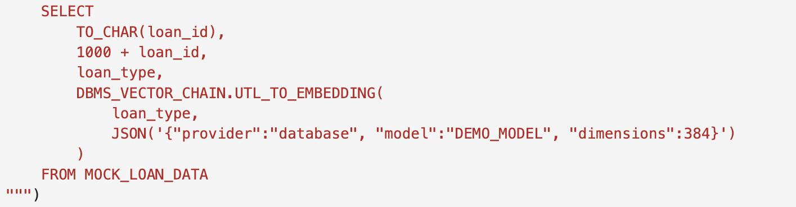
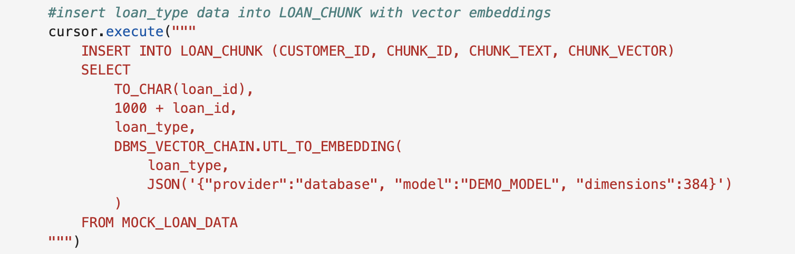
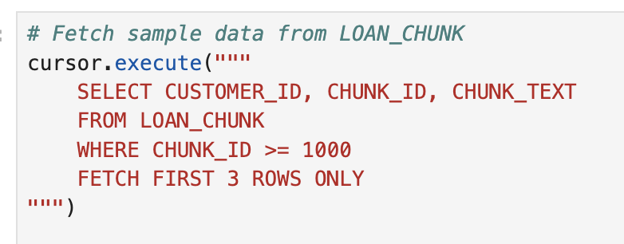
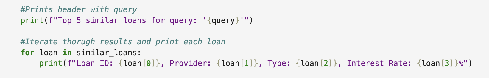
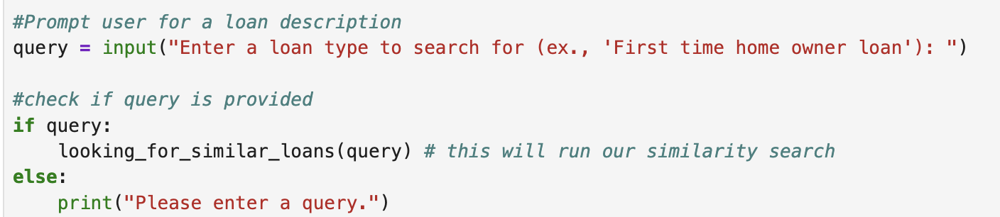
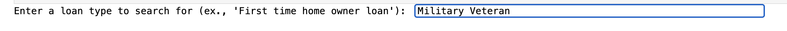

# Coding Challenge - AI Vector Search - Guided

## **Introduction**

**Welcome to the Code with AI Vector Search Challenge!**

Enhance your app with an intent-matching feature using AI Vector Search. Work in a Jupyter Notebook to enable similarity search on patient history, doctor notes, and past approvals. Match cases semantically—not just by keywords—and return relevant prior examples to support real-time decisions.


At Seer Healthcare, the data science team is building a claim recommendation system that goes beyond keyword matching. They are using AI Vector Search to understand meaning in treatment descriptions—for example, linking "Patient History" to "Prior Claims." In this lab, you will complete their Similarity Search feature using Oracle Database 23ai, which converts text into embeddings and uses cosine similarity to find conceptually similar claims.

**Why AI Vector Search?**

Unlike keyword search, AI Vector Search captures meaning. For example, '[placeholder]]' and '[placeholder]' use different words but express similar ideas. Oracle Database 23ai converts claim descriptions into vectors, compares their meanings, and ranks results by similarity for more accurate recommendations.

Good luck, and enjoy the process. Let’s get coding!

Estimated Time: 30 minutes

To get things started we invite you to watch this video and see the lab in action:

  [](videohub:1_iu6875ja:medium)
  
### Objective:

In this lab, you will:

- Connect to Oracle Database 23ai and set up the environment.
- Vectorize loan data from the `MOCK_LOAN_DATA` table into `LOAN_CHUNK`.
- Verify the data was vectorized.
- Run a similarity search to find the top 5 loans matching a user’s query.

### Prerequisites:

This lab assumes you have:

- An Oracle Cloud account.
- Basic knowledge of Python and SQL.
- Completed Lab 1: Run the Demo.
- Completed Lab 2: Connect to Development Environment.
- Completed Lab 3: Coding Basics on Oracle Database 23ai. 
- Completed Lab 4: Step by step: Implement RAG with Oracle Database 23ai.

>💡 **Note:** You can download the code and run this lab on your own time here: [AI Vector Search Code](https://objectstorage.us-ashburn-1.oraclecloud.com/p/yiZgIeQQptaFaDMHUQ_623UuChmv1jf_9dCj10wwgjmsQitUMb5QP7mPv1Z1med8/n/c4u04/b/gen-ai/o/ai_vector_search_code)

## Task 1: Challenge requirements 

The data science team at Seer Healthcare has provided a Jupyter Notebook called `ai_vector_search_challenge.ipynb` with four key code cells. The notebook will:

- **Connect to the database and import the necessary libraries and drivers.**
- **Vectorize the `loan_type` column from the `MOCK_LOAN_DATA` table into the `LOAN_CHUNK` table.**
- **Verify the vectorized data by displaying an output.**
- **Implement a Similarity Search to match a user's query to loans.**

## Task 2: Create a new Jupyter Notebook

All of the coding examples will be executed in a new Jupyter Notebook.

1. Open a new **Jupyter Notebook** by clicking on **Python(ipykernel)** notebook.

    


## Task 3: Connect to the database using Python

1. Run the first cell(Environment Setup and Database Connection) to ensure the database connection, python driver and necessary libraries work.

    ```python
    <copy>
    import os 
    import json 
    import oracledb 
    import oci
    from dotenv import load_dotenv #Load environment variables from .env file

    # load the environment variables from the .env file
    load_dotenv()

    #Retrieve the database credentials from environment variables 
    username = os.getenv("USERNAME") 
    password = os.getenv("DBPASSWORD") 
    dsn = os.getenv("DBCONNECTION")

    # Attempting to connect to our Oracle database
    try:
        connection = oracledb.connect(user=username, password=password, dsn=dsn)
        print("Connection successful!")
    except Exception as e:
        print(f"Connection failed: {e}")

    # Create a cursor object to execute SQL commands
    cursor = connection.cursor()
    </copy>
    ```

    You should see the expected output: 

    ```text
    Connection successful!
    ```


## Task 3: Vectorizing the loan data

The second cell vectorizes loan descriptions from the `MOCK_LOAN_DATA` table, storing them as embeddings in the `LOAN_CHUNK` table. This is the first step in enabling similarity search, as vectors allow the database to compare meanings, not just words.

1. Create a new cell and copy the following code into it:

    ```python
    <copy>
    # function to vectorize the loan data
    def vectorize_loan_data():
        with connection.cursor() as cursor:
            #clear existing loan chunks to avoid duplicates
            cursor.execute("DELETE FROM LOAN_CHUNK WHERE CHUNK_ID >= 1000")

            #insert loan_type data into LOAN_CHUNK with vector embeddings
            cursor.execute("""
                INSERT INTO LOAN_CHUNK (CUSTOMER_ID, CHUNK_ID, CHUNK_TEXT, CHUNK_VECTOR)
                SELECT
                    TO_CHAR(loan_id),
                    1000 + loan_id,
                    loan_type,
                    DBMS_VECTOR_CHAIN.UTL_TO_EMBEDDING(
                        loan_type,
                        JSON('{"provider":"database", "model":"DEMO_MODEL", "dimensions":384}')
                    )
                FROM MOCK_LOAN_DATA
            """)
            connection.commit()
            print("Vectorized 'loan_data' from 'MOCK_LOAN_DATA' and stored in 'LOAN_CHUNK'.")
    vectorize_loan_data()
    </copy>
    ```

2. Let's review the code:

    - Defines a function `vectorize_loan_data()`.

    - Clears existing data in `LOAN_CHUNK` where `CHUNK_ID` >= 1000 to avoid duplicates.

        

    - Uses `DBMS_VECTOR_CHAIN.UTL_TO_EMBEDDING` to convert each `loan_type` into a 384-dimensional vector using the `DEMO_MODEL`.

        

    - Inserts the vectors, along with `CUSTOMER_ID`, `CHUNK_ID`, and `CHUNK_TEXT`, into the `LOAN_CHUNK` table.

        

    - Commits the changes and prints a confirmation.
    
        

    **Highlight**: The `DBMS_VECTOR_CHAIN.UTL_TO_EMBEDDING` function transforms text into numerical vectors. The DBMS  parameter **{"provider":"database", "model":"DEMO_MODEL", "dimensions":384}** instructs the database to use a database-provided model to generate 384-dimensional embeddings—this means you do not have to use external embedding models. Embedding happens at the database level and is therefore more secure than using external embedding models.

3. Run the cell. Your expected output should be:
    ```
    Vectorized 'loan_data' from 'MOCK_LOAN_DATA' and stored in 'LOAN_CHUNK'.
    ```
    - **This means the loan descriptions are now vectors, ready for similarity search.**


## Task 4: Verify the vectorized data

The third code block checks that the vectorization worked by querying the first three entries in LOAN_CHUNK. This lets you see the stored loan data, ensuring it’s ready for the next step.

1. Create a new cell and copy and paste the following code into it:

    ```python
    <copy>
    # Fetch sample data from LOAN_CHUNK
    cursor.execute("""
        SELECT CUSTOMER_ID, CHUNK_ID, CHUNK_TEXT 
        FROM LOAN_CHUNK 
        WHERE CHUNK_ID >= 1000 
        FETCH FIRST 3 ROWS ONLY
    """)

    # Fetch all query results into a list
    results = cursor.fetchall()
    print("Sample data in LOAN_CHUNK:")

    # Iterate though results and print each row
    for row in results:
        print(f"- Loan ID: {row[0]}, Chunk ID: {row[1]}, Text: {row[2]}")
    </copy>
    ```


2. Let's review the code:

    - SQL query is executed to select `CUSTOMER_ID`, `CHUNK_ID`, and `CHUNK_TEXT` from `LOAN_CHUNK` where `CHUNK_ID` >= 1000, limited to 3 rows.
    
        

    - We fetch the results and print them in a readable format.
    
        

    **Key Concept:** This step confirms that `loan_type` values from `MOCK_LOAN_DATA` were successfully stored as `CHUNK_TEXT` in `LOAN_CHUNK`, alongside their identifiers.

3. Let's go ahead and run the cell. should expect to see an output similar to:

    ```text
    Sample data in LOAN_CHUNK:
    - Loan ID: 28, CHUNK ID: 1028, Text: Affordable housing zone loan (1% interest, max income $100k)
    - Loan ID: 29, CHUNK ID: 1029, Text: Construction loan for new builds
    - Loan ID: 30, Chunk ID: 1030, Text: Stated income loan (for self-employed)
    ```


## Task 5: Implement similarity search

The fourth code block ties it all together. It lets users enter a loan description and find the top five similar loans using AI Vector Search. This is where Oracle Database 23ai shows its strength.

1. Create a new cell and copy and paste the following code block into it

    ```python
    <copy>
    def looking_for_similar_loans(query):
        # Generate vector embeddings for users query
        cursor.execute("""
            SElECT DBMS_VECTOR_CHAIN.UTL_TO_EMBEDDING(
                :query,
                JSON('{"provider":"database", "model":"DEMO_MODEL", "dimensions":384}'))
            """, {'query':query})

        # Fetch embedding result
        query_embedding = cursor.fetchone()[0]

        # Perform vector search and join with MOCK_LOAN_DATA
        cursor.execute("""
            SELECT
                m.loan_id,
                m.loan_provider_name,
                m.loan_type,
                m.interest_rate
            FROM LOAN_CHUNK lc
            JOIN MOCK_LOAN_DATA m ON TO_CHAR(m.loan_id) = lc.CUSTOMER_ID
            WHERE lc.CHUNK_VECTOR IS NOT NULL
            AND lc.CHUNK_ID >= 1000
            ORDER BY VECTOR_DISTANCE(lc.CHUNK_VECTOR, :embedding, Cosine)
            FETCH FIRST 5 ROWS ONLY
        """, {'embedding': query_embedding})

        # Fetch the top 5 similar loans
        similar_loans = cursor.fetchall()

        # Prints header with query
        print(f"Top 5 similar loans for query: '{query}'")

        # Iterate thorugh results and print each loan
        for loan in similar_loans:
            print(f"Loan ID: {loan[0]}, Provider: {loan[1]}, Type: {loan[2]}, Interest Rate: {loan[3]}%")

    # Prompt user for a loan description
    query = input("Enter a loan type to search for (ex., 'First time home owner loan'): ")

    # check if query is provided
    if query:
        looking_for_similar_loans(query) # this will run our similarity search
    else:
        print("Please enter a query.")
    </copy>
    ```

2. Let's take a look at what's happening in this cell:

    - The function `looking_for_similar_loans(query)` is defined.

    - We vectorize the user’s query using **`DBMS_VECTOR_CHAIN.UTL_TO_EMBEDDING`**, just like in Task 3.

        

    - We perform a SQL query that:

        - Joins **`LOAN_CHUNK`** and **`MOCK_LOAN_DATA`** to get loan details.
        - Filters for non-null vectors and CHUNK_ID >= 1000.
        - Orders the results by **`VECTOR_DISTANCE`** using cosine similarity to find the closest matches.
        - Limits the results to display the top 5 loans.

            

    - The results are printed to display **Loan IDs**, **Providers**, **Types**, and **Interest Rates**.

        

    - The user is prompted to enter a query and runs the search.

        

    **Key Concept**: The **`VECTOR_DISTANCE`** function computes cosine similarity between the query vector and stored vectors in `LOAN_CHUNK`. Using the Cosine algorithm you can measure how closely two vectors align in direction. Try replacing cosine with Euclidean, dot product, or Manhattan distance to compare results.

3. Run the cell, then enter a sample query when prompted, ex. "First Time Home Owner Loan."

    

    Expected Output:

    ```text
    Enter a loan type to search for (ex., 'First time home owner loan'): 

    Military Veteran

    Top 5 similar loans for query: 'Military Veteran'

    Loan ID: 50, Provider: provider1, Type: Military Veteran loan (0% down, military only), Interest Rate: 4.75%

    Loan ID: 26, Provider: provider5, Type: Military Veteran loan (0% down, military only), Interest Rate: 3.47%

    Loan ID: 55, Provider: provider6, Type: RenoMilitary Veterantion loan, Interest Rate: 5.82%

    Loan ID: 59, Provider: provider3, Type: RenoMilitary Veterantion loan, Interest Rate: 5.98%

    Loan ID: 22, Provider: provider1, Type: Jumbo loan for high-Military Veteranlue properties, Interest Rate: 5.07% 
    ```

    (**Note**: Results may vary.)

    - This shows the top 5 loans that are most similar in meaning to your query, even if the exact words differ.

4. Want to keep exploring? Try:
    - Entering different queries, like "Veteran Loan" or "Low-Income Housing," to see how results change.
    - Change Cosine to Euclidean, Dot, Manhattan or any of the other vector similarities and see how the results vary.

**Congratulations, you have successfully completed the AI Vector Search Challenge!** 

You have successfully:

- Connected to Oracle Database 23ai.
- Vectorized treatment descriptions into embeddings.
- Verified the stored data.
- Built a Similarity Search to match user queries to treatments.

By completing this challenge, you’ve seen how Oracle 23ai AI Vector Search transforms text into vectors and finds meaningful matches.

## Learn More
* [Oracle Database 23ai Documentation](https://docs.oracle.com/en/database/oracle/oracle-database/23/)
* [Oracle Database 23ai Vector Search](https://www.oracle.com/database/ai-vector-search/)
* [Oracle Ai Vector Search User's Guide](https://docs.oracle.com/en/database/oracle/oracle-database/23/vecse/ai-vector-search-users-guide.pdf)


## Acknowledgements
* **Authors** - Francis Regalado, Database Product Manager
* **Contributors** - Kamryn Vinson, Linda Foinding, Kevin Lazarz
* **Last Updated By/Date** - Francis Regalado, April 2025


