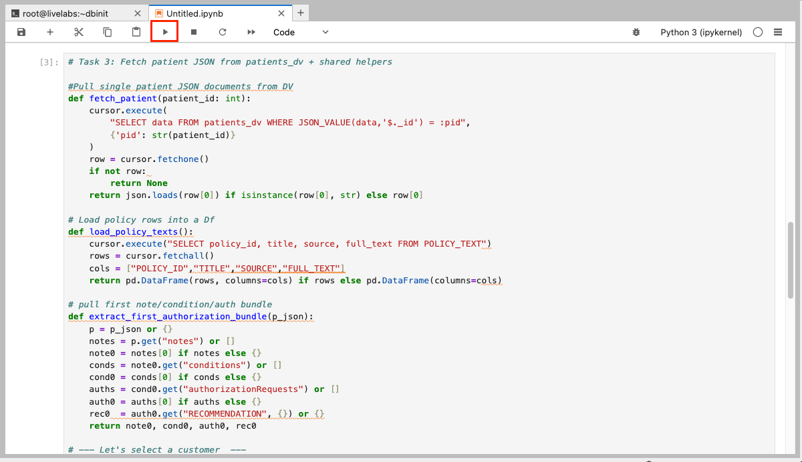
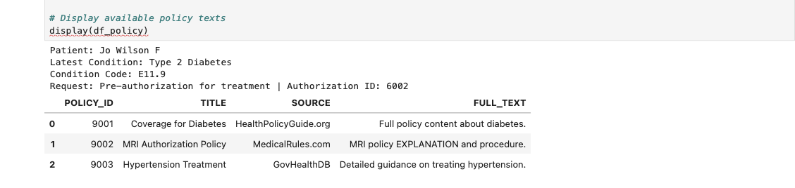
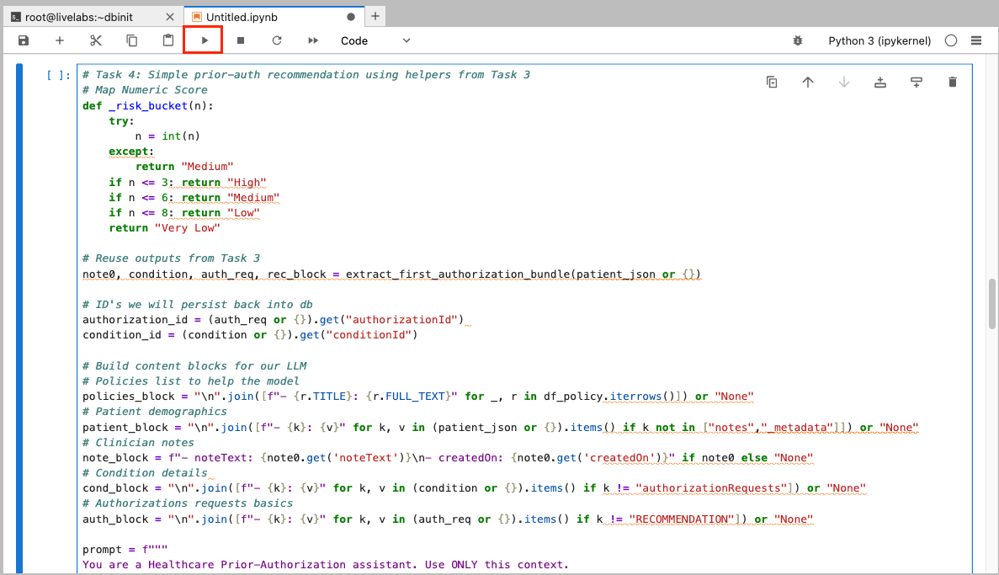
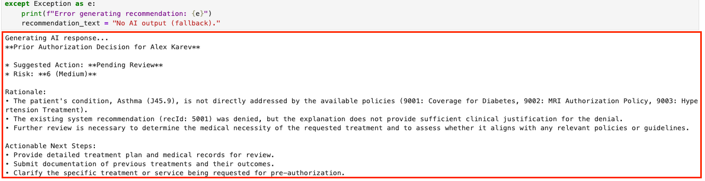
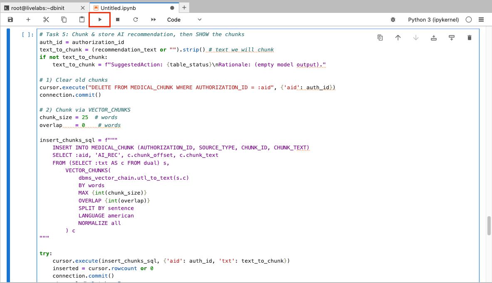
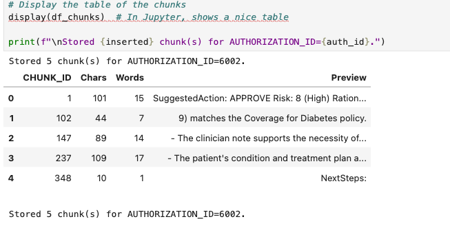
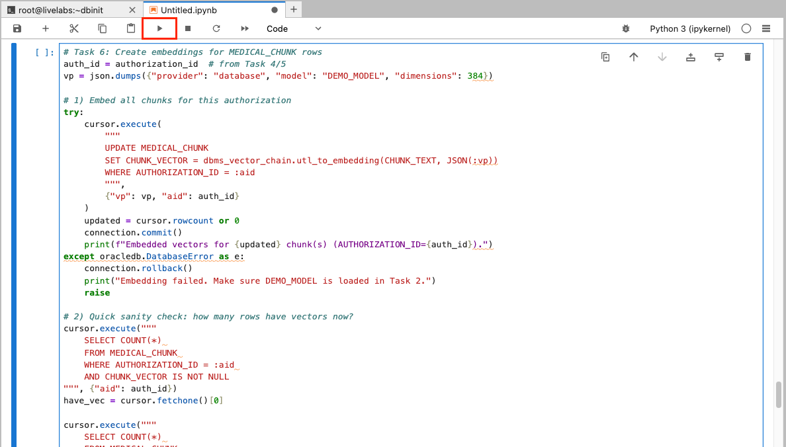
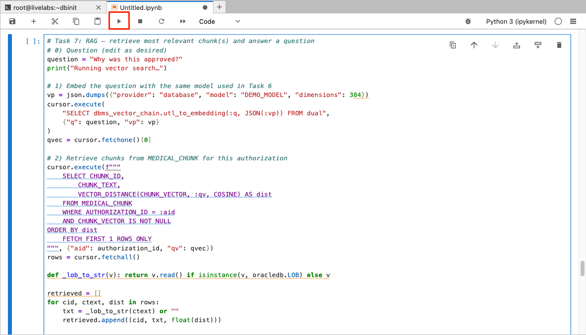

# Step by step: Implement RAG with Oracle Database 23ai 

## Introduction

Here you’ll create an end‑to‑end prior‑authorization system using Oracle Database 23ai and OCI Generative AI. After connecting to clinical datasets, you’ll analyze patient records and leverage an LLM to recommend approval, pend, or denial - complete with evidence citations. By applying Python skills from prior labs, you’ll assemble a fully integrated, AI‑driven healthcare review portal.

This lab uses some of the basic coding samples you created in lab 3, such as `cursor.execute` and more.

Estimated Time: 30 minutes

### Objectives

* Build the complete healthcare claim approval application as seen in lab 1
* Use OCI Generative AI to generate personalized claim recommendations
* Use Python to connect to an Oracle Database 23ai instance and run queries
* Explore patient data and extract relevant information

### Prerequisites

This lab assumes you have:

* An Oracle Cloud account
* Completed lab 1: Run the demo
* Completed lab 2: Connect to the Development Environment

## Task 1: Build the application in Jupyter Notebook
>💡**Note**: Review Lab 2: Connect to the Development Environment for instructions on accessing JupyterLab.

1. You should see a terminal pop up once you are logged in. 

    


2. Navigate to the `dbinit` directory by running the following command.

    ```bash
    <copy>
    cd dbinit
    </copy>
    ```

    

3. Copy and run the following command to create tables in the database. There will be a lot of output. You should see the following output once complete.

    ```bash
    <copy>
    ./shell_script.sh
    </copy>
    ```

    

    

## Task 2: Connect to Database

2. Click the **+** sign on the top left to open the Launcher.

    

3. Open a new notebook.

    

1. Copy the following code block into an empty cell in your notebook. This code block imports the `oracledb` Python driver and other libraries.

    ```python
    <copy>
    import os
    import json
    import oracledb
    import pandas as pd
    import oci
    import numpy as np
    import re
    from dotenv import load_dotenv
    from PyPDF2 import PdfReader

    load_dotenv()

    username = os.getenv("USERNAME")
    password = os.getenv("DBPASSWORD")
    dsn = os.getenv("DBCONNECTION")

    try:
        connection = oracledb.connect(user=username, password=password, dsn=dsn)
        print("Connection successful!")
    except Exception as e:
        print(f"Connection failed: {e}")

    cursor = connection.cursor()
    </copy>
    ```

2. Run the code block to connect to the database. 

    

## Task 3: Pull patient data from the database

You will query customer data from the `patient_dv` JSON duality view, which combines data from PATIENTS and related tables. This task will:

- **Define a Function**: Create a reusable function `a` to query the database by customer ID, extracting the JSON data for a specific customer.

- **Use an Example**: Fetch data for patient `6002` (Jo Wilson) to demonstrate the process.

- **Display the Results**: Format the retrieved data into a pandas DataFrame for a clear, tabular presentation, showing key details like name, policy, source, and description.

1. Copy and paste the code below into the new notebook:

    ```python
    <copy>
    # Task 3: Fetch patient JSON from patients_dv + shared helpers
    #Pull single patient JSON documents from DV
    def fetch_patient(patient_id: int):
        cursor.execute(
            "SELECT data FROM patients_dv WHERE JSON_VALUE(data,'$._id') = :pid",
            {'pid': str(patient_id)}
        )
        row = cursor.fetchone()
        if not row: 
            return None
        return json.loads(row[0]) if isinstance(row[0], str) else row[0]

    # Load policy rows into a Df
    def load_policy_texts():
        cursor.execute("SELECT policy_id, title, source, full_text FROM POLICY_TEXT")
        rows = cursor.fetchall()
        cols = ["POLICY_ID","TITLE","SOURCE","FULL_TEXT"]
        return pd.DataFrame(rows, columns=cols) if rows else pd.DataFrame(columns=cols)

    # pull first note/condition/auth bundle
    def extract_first_authorization_bundle(p_json):
        p = p_json or {}
        notes = p.get("notes") or []
        note0 = notes[0] if notes else {}
        conds = note0.get("conditions") or []
        cond0 = conds[0] if conds else {}
        auths = cond0.get("authorizationRequests") or []
        auth0 = auths[0] if auths else {}
        rec0  = auth0.get("RECOMMENDATION", {}) or {}
        return note0, cond0, auth0, rec0

    # --- Let's select a customer  ---
    selected_patient_id = 2002
    patient_json = fetch_patient(selected_patient_id)
    df_policy    = load_policy_texts()

    # Print summary of current case
    if patient_json:
        note0, cond0, auth0, _ = extract_first_authorization_bundle(patient_json)
        print(f"Patient: {patient_json.get('firstName')} {patient_json.get('lastName')} {patient_json.get('GENDER')}")
        print(f"Latest Condition: {cond0.get('conditionName')}")
        print(f"Condition Code: {cond0.get('diagnosisCode')}")
        print(f"Request: {auth0.get('requestType')} | Authorization ID: {auth0.get('authorizationId')}")
    else:
        print("No patient found.")

    # Display available policy texts
    display(df_policy)
    </copy>
    ```

2. Click the "Run" button to execute the code.

    

3. The output will display a DataFrame containing the customer details for the selected customer ID.

    

## Task 4: Generate Recommendations for the Patients

In a new cell, we will build a prompt from patient data, policies, notes, conditions, and authorization context. We will get a decision from the recommendation : **Approve, Deny, Request Info**. Calling OCI Generative AI as our provider, using model meta.llama-3.2-90b-vision-instruct to recommend a claims decision, update the tables, and display the results. 

With patient profiles in place, you will use OCI Generative AI to generate personalized claim decision recommendations. 

Here’s what we’ll do:

1. Copy and paste the code in a new cell:

    ```python
    <copy>
    # Task 4: Simple prior-auth recommendation using helpers from Task 3
    # Map Numeric Score
    def _risk_bucket(n):
        try:
            n = int(n)
        except:
            return "Medium"
        if n <= 3: return "High"
        if n <= 6: return "Medium"
        if n <= 8: return "Low"
        return "Very Low"

    # Reuse outputs from Task 3
    note0, condition, auth_req, rec_block = extract_first_authorization_bundle(patient_json or {})

    # ID's we will persist back into db
    authorization_id = (auth_req or {}).get("authorizationId") 
    condition_id = (condition or {}).get("conditionId")

    # Build content blocks for our LLM
    # Policies list to help the model
    policies_block = "\n".join([f"- {r.TITLE}: {r.FULL_TEXT}" for _, r in df_policy.iterrows()]) or "None"
    # Patient demographics
    patient_block = "\n".join([f"- {k}: {v}" for k, v in (patient_json or {}).items() if k not in ["notes","_metadata"]]) or "None"
    # Clinician notes
    note_block = f"- noteText: {note0.get('noteText')}\n- createdOn: {note0.get('createdOn')}" if note0 else "None"
    # Condition details 
    cond_block = "\n".join([f"- {k}: {v}" for k, v in (condition or {}).items() if k != "authorizationRequests"]) or "None"
    # Authorizations requests basics
    auth_block = "\n".join([f"- {k}: {v}" for k, v in (auth_req or {}).items() if k != "RECOMMENDATION"]) or "None"

    prompt = f"""
    You are a Healthcare Prior-Authorization assistant. Use ONLY this context.
    Decide APPROVE / DENY / REQUEST INFO. Prefer APPROVE or DENY; use REQUEST INFO only if neither can be justified.

    Policies:
    {policies_block}

    Patient:
    {patient_block}

    ClinicianNote:
    {note_block}

    Condition:
    {cond_block}

    Authorization:
    {auth_block}

    Decision rules:
    - APPROVE if: plausible policy match to diagnosis/service AND clinician note supports necessity AND risk ≥ 7.
    - DENY if: no plausible policy match OR evidence contradicts necessity OR clearly non-covered OR risk ≤ 3.
    - REQUEST INFO only if key evidence is missing/ambiguous.
    - If no policy plausibly matches, prefer DENY over REQUEST INFO.

    Return EXACTLY this layout (no extra text):
    SuggestedAction: APPROVE|DENY|REQUEST INFO
    Risk: N (Very Low|Low|Medium|High)
    Rationale:
    - one reason
    - second reason
    - third reason
    NextSteps:
    - step 1 (empty if Approved)
    - step 2
    - step 3
    """

    print("Generating AI recommendations …")
    try:
        # OCI GenAi clients config
        genai_client = oci.generative_ai_inference.GenerativeAiInferenceClient(
            config=oci.config.from_file(os.path.expanduser(os.getenv("OCI_CONFIG_PATH","~/.oci/config")), "DEFAULT"),
            service_endpoint=os.getenv("ENDPOINT")
        )
        chat_detail = oci.generative_ai_inference.models.ChatDetails(
            compartment_id=os.getenv("COMPARTMENT_OCID"),
            chat_request=oci.generative_ai_inference.models.GenericChatRequest(
                messages=[oci.generative_ai_inference.models.UserMessage(
                    content=[oci.generative_ai_inference.models.TextContent(text=prompt)]
                )],
                temperature=0.0, top_p=1.0
            ),
            serving_mode=oci.generative_ai_inference.models.OnDemandServingMode(
                model_id="meta.llama-3.2-90b-vision-instruct" # Our selected Model
            )
        )
        chat_resp = genai_client.chat(chat_detail)
        recommendation_text = chat_resp.data.chat_response.choices[0].message.content[0].text
    except Exception as e:
        print(f"OCI GenAI error: {e}")

    print("\n--- AI Recommendation ---\n", recommendation_text[:1000])

    # Parse the simple block
    act = re.search(r"SuggestedAction:\s*(APPROVE|DENY|REQUEST INFO)\b", recommendation_text, re.I)
    risk_num = re.search(r"Risk:\s*([0-9]+)", recommendation_text, re.I)
    risk_lbl = re.search(r"Risk:\s*[0-9N]+\s*\((Very Low|Low|Medium|High)\)", recommendation_text, re.I)

    action_norm = (act.group(1).upper() if act else "REQUEST INFO")
    risk_n = risk_num.group(1) if risk_num else ("7" if action_norm == "APPROVE" else "5")
    risk_l = (risk_lbl.group(1).title() if risk_lbl else _risk_bucket(risk_n))

    # Map to dashboard vocab
    table_status = "Approved" if action_norm == "APPROVE" else ("Denied" if action_norm == "DENY" else "In Progress")

    # update new values into the DB
    try:
        # Insert / Update Auth_recommendation
        cursor.execute("""
            MERGE INTO AUTH_RECOMMENDATION t
            USING (SELECT :rid AS RECOMMEND_ID FROM dual) s
            ON (t.RECOMMEND_ID = s.RECOMMEND_ID)
            WHEN MATCHED THEN UPDATE SET
                t.CONDITION_ID   = :cond_id,
                t.RECOMMENDATION = :rec,
                t.EXPLANATION    = :exp,
                t.RISK_LEVEL     = :risk,
                t.GENERATED_DATE = SYSDATE
            WHEN NOT MATCHED THEN INSERT
                (RECOMMEND_ID, CONDITION_ID, RECOMMENDATION, EXPLANATION, RISK_LEVEL, GENERATED_DATE)
                VALUES (:rid, :cond_id, :rec, :exp, :risk, SYSDATE)
        """, {
            'rid': 90001, # build stable ID as match key
            'cond_id': condition_id, # from task 3
            'rec': table_status, # Approved / Denied / in progress
            'exp': recommendation_text, # Recommendation text
            'risk': risk_l # Risk level
        })

        # Link the authorization to this recommendation and set FINAL_DECISION for dashboards
        cursor.execute("""
            UPDATE AUTHORIZATION_REQ
            SET RECOMMEND_ID = :rid,
                FINAL_DECISION = :final_dec
            WHERE AUTHORIZATION_ID = :aid
        """, {'rid': 90001, 'final_dec': table_status, 'aid': authorization_id})

        connection.commit()

        
        print(f"Stored recommendation -> {table_status} (risk={risk_l}); linked to AUTHORIZATION_REQ {authorization_id}.")
    except Exception as e:
        connection.rollback()
        print("Failed to store recommendation:", e)
     </copy>
    ```

2. Click the "Run" button to execute the code. Note that this will take time to run.

    

3. Review the output. In the demo, this is where you selected the "Navigate to Decisions" button as the Healthcare Claims Analyst. You just used AI to get recommendations for the claims analyst which would have taken her hours to do, congratulations!

    

>Note: Your result may be different. This is because of generative AI and the model's ability to generate new content based on your input. The output may contain different recommendations or suggestions.

## Task 5: Chunk & Store Recommendations

To handle follow-up questions, you will enhance the system with an AI Guru powered by Oracle 23ai’s Vector Search and Retrieval-Augmented Generation (RAG). The AI Guru will be able to answer questions about the return application and provide recommendations based on the data.

Before answering questions, we need to prepare the data by vectoring the claims recommendations. This step:

   - Stores Recommendations: Inserts the full recommendation text (from previous cell) as a single chunk if not already present.
   - We delete prior chunks for this authorization.
   - We use `VECTOR_CHUNKS` to split the recommendation text.
   - The chunks will be inserted into `MEDICAL_CHUNK` with `CHUNK_ID= chunk_offset`.
   - We display a data frame summary to show the chunks.


1. Copy the following code and run:

    ```python
        <copy>
        # Task 5: Chunk & store AI recommendation, then SHOW the chunks
        auth_id = authorization_id
        text_to_chunk = (recommendation_text or "").strip() # text we will chunk
        if not text_to_chunk:
            text_to_chunk = f"SuggestedAction: {table_status}\nRationale: (empty model output)."

        # 1) Clear old chunks
        cursor.execute("DELETE FROM MEDICAL_CHUNK WHERE AUTHORIZATION_ID = :aid", {'aid': auth_id})
        connection.commit()

        # 2) Chunk via VECTOR_CHUNKS
        chunk_size = 25  # words
        overlap    = 0    # words

        insert_chunks_sql = f"""
            INSERT INTO MEDICAL_CHUNK (AUTHORIZATION_ID, SOURCE_TYPE, CHUNK_ID, CHUNK_TEXT)
            SELECT :aid, 'AI_REC', c.chunk_offset, c.chunk_text
            FROM (SELECT :txt AS c FROM dual) s,
                VECTOR_CHUNKS(
                    dbms_vector_chain.utl_to_text(s.c)
                    BY words
                    MAX {int(chunk_size)}
                    OVERLAP {int(overlap)}
                    SPLIT BY sentence
                    LANGUAGE american
                    NORMALIZE all
                ) c
        """

        try:
            cursor.execute(insert_chunks_sql, {'aid': auth_id, 'txt': text_to_chunk})
            inserted = cursor.rowcount or 0
            connection.commit()
        except oracledb.DatabaseError as e:
            # Small Python fallback if VECTOR_CHUNKS isn't available
            print(f"VECTOR_CHUNKS error, {e}")
            
        print(f"Stored {inserted} chunk(s) for AUTHORIZATION_ID={auth_id}.")

        # 3) Fetch & SHOW the chunks
        cursor.execute("""
            SELECT CHUNK_ID, CHUNK_TEXT
            FROM MEDICAL_CHUNK
            WHERE AUTHORIZATION_ID = :aid
        ORDER BY CHUNK_ID
        """, {'aid': auth_id})
        rows = cursor.fetchall()

        # Build a summary DataFrame with preview
        def _lob_to_str(v):
            return v.read() if isinstance(v, oracledb.LOB) else v

        # Summarize chunks in a compact table
        items = []
        for cid, ctext in rows:
            txt = _lob_to_str(ctext) or ""
            items.append({
                "CHUNK_ID": cid,
                "Chars": len(txt),
                "Words": len(txt.split()),
                "Preview": (txt[:160] + "…") if len(txt) > 160 else txt
            })

        df_chunks = pd.DataFrame(items).sort_values("CHUNK_ID")

        # Display the table of the chunks
        display(df_chunks)  # In Jupyter, shows a nice table

        print(f"\nStored {inserted} chunk(s) for AUTHORIZATION_ID={auth_id}.")
        </copy>
    ```

2. Click the "Run" button to execute the code.

    

3. Review the output.

    

## Task 6: Create Embeddings

Now we must generate and store vector embeddings. This allows us to use Vector Search and RAG to enhance AI Guru's answers. 

In this step:

   - **Generates Embeddings**: This is a new feature in Oracle Database 23ai that allows you to create embeddings directly within the database, eliminating the need for external tools or APIs. The `dbms_vector_chain.utl_to_embedding` function takes the recommendation text as input and returns an embedding vector.

   - **Stores Embeddings**: We update `MEDICAL_CHUNK.CHUNK_VECTOR` by embedding each `CHUNK_TEXT` using `dbms_vector_chain.utl_to_embedding` with `DEMO_MODEL`. A short verification output is printed.

1. We embed the recommendation chunks and our policy text for retrieval. Copy the following code into a new cell block:

    ```python
        <copy>
        # Task 6: Create embeddings for MEDICAL_CHUNK rows
        auth_id = authorization_id  # from Task 4/5
        vp = json.dumps({"provider": "database", "model": "DEMO_MODEL", "dimensions": 384})

        # 1) Embed all chunks for this authorization
        try:
            cursor.execute(
                """
                UPDATE MEDICAL_CHUNK
                SET CHUNK_VECTOR = dbms_vector_chain.utl_to_embedding(CHUNK_TEXT, JSON(:vp))
                WHERE AUTHORIZATION_ID = :aid
                """,
                {"vp": vp, "aid": auth_id}
            )
            updated = cursor.rowcount or 0
            connection.commit()
            print(f"Embedded vectors for {updated} chunk(s) (AUTHORIZATION_ID={auth_id}).")
        except oracledb.DatabaseError as e:
            connection.rollback()
            print("Embedding failed. Make sure DEMO_MODEL is loaded in Task 2.")
            raise

        # 2) Quick sanity check: how many rows have vectors now?
        cursor.execute("""
            SELECT COUNT(*) 
            FROM MEDICAL_CHUNK 
            WHERE AUTHORIZATION_ID = :aid 
            AND CHUNK_VECTOR IS NOT NULL
        """, {"aid": auth_id})
        have_vec = cursor.fetchone()[0]

        cursor.execute("""
            SELECT COUNT(*) 
            FROM MEDICAL_CHUNK 
            WHERE AUTHORIZATION_ID = :aid
        """, {"aid": auth_id})
        total_rows = cursor.fetchone()[0]

        print(f"Vectors present: {have_vec}/{total_rows}")
        </copy>
    ```

2. Click the "Run" button to execute the code.

    

3. Review the output.

    

## Task 7: Implement RAG with Oracle Database 23ai's Vector Search

Now that the recommendations are vectorized, we can process a user’s question:

 ```Why was this approved?``` 
 
 This step:

   - **Vectorizes the question**: Embeds the question using `DEMO_MODEL` via `dbms_vector_chain.utl_to_embedding`.
   - **Performs AI Vector Search**: Finds the most relevant using similarity search.
   - **Retrieves**: The top policy chunks and top recommendation chunks
   - **Builds a prompt**: To ask the LLM to answer using only the retrieved context
   - **Use RAG**: Combines the customer profile, loan options, and relevant chunk into a prompt for OCI Generative AI, producing a concise answer. Here you implement the RAG process.
   - **Prints**: The chunk IDs to be used for traceability

1. Copy the code and run:

    ```python
        <copy>
        # Task 7: RAG — retrieve most relevant chunk(s) and answer a question
        # 0) Question (edit as desired)
        question = "Why was this approved?"
        print("Running vector search…")

        # 1) Embed the question with the same model used in Task 6
        vp = json.dumps({"provider": "database", "model": "DEMO_MODEL", "dimensions": 384})
        cursor.execute(
            "SELECT dbms_vector_chain.utl_to_embedding(:q, JSON(:vp)) FROM dual",
            {"q": question, "vp": vp}
        )
        qvec = cursor.fetchone()[0]

        # 2) Retrieve chunks from MEDICAL_CHUNK for this authorization
        cursor.execute(f"""
            SELECT CHUNK_ID,
                CHUNK_TEXT,
                VECTOR_DISTANCE(CHUNK_VECTOR, :qv, COSINE) AS dist
            FROM MEDICAL_CHUNK
            WHERE AUTHORIZATION_ID = :aid
            AND CHUNK_VECTOR IS NOT NULL
        ORDER BY dist
            FETCH FIRST 1 ROWS ONLY
        """, {"aid": authorization_id, "qv": qvec})
        rows = cursor.fetchall()

        def _lob_to_str(v): return v.read() if isinstance(v, oracledb.LOB) else v

        retrieved = []
        for cid, ctext, dist in rows:
            txt = _lob_to_str(ctext) or ""
            retrieved.append((cid, txt, float(dist)))


        # 3) Build a compact RAG prompt
        def _normalize_ws(s: str) -> str:
            return re.sub(r"\s+", " ", s or "").strip()

        context_lines = [f"[Chunk {cid}] {_normalize_ws(txt)}" for cid, txt, _ in retrieved]
        context_block = "\n\n".join(context_lines)

        patient_name  = f"{patient_json.get('firstName','')} {patient_json.get('lastName','')}".strip()
        cond_name     = (condition or {}).get("conditionName", "")
        cond_code     = (condition or {}).get("diagnosisCode", "")
        req_type      = (auth_req or {}).get("requestType", "")

        prompt = f"""<s>[INST] <<SYS>>You are a Healthcare Prior Authorization AI. Be precise, cite the chunk ids inline like [Chunk 2] when referring to specific facts.
        Do not mention sources outside of the provided context. Respond in under 400 words.
        ALWAYS respond as if you have the knowledge yourself.
        Do NOT provide warnings, disclaimers, or exceed the specified response length.
        and offer insights while considering the firm's overall risk and best interests. Have the ability to respond in Spanish, French, Italian, German, Arabic, Mandarin and Portuguese if asked.
        <</SYS>> [/INST]

        Patient: {patient_name}
        Condition: {cond_name} ({cond_code})
        Request: {req_type}

        Question: {question}

        Context:
        {context_block}

        Return this format (plain text, no extra lines):
        Decision: APPROVE|DENY|REQUEST INFO
        Why:
        - reason 1 (cite [Chunk N])
        - reason 2 (cite [Chunk N])
        - reason 3 (cite [Chunk N])
        Next:
        - actionable step 1
        - actionable step 2
        - actionable step 3
        """.strip()

        # 4) Generate the final answer with OCI GenAI 
        print("\nGenerating final RAG answer…")
        try:
            genai_client = oci.generative_ai_inference.GenerativeAiInferenceClient(
                config=oci.config.from_file(os.path.expanduser(os.getenv("OCI_CONFIG_PATH","~/.oci/config")), "DEFAULT"),
                service_endpoint=os.getenv("ENDPOINT")
            )
            chat_detail = oci.generative_ai_inference.models.ChatDetails(
                compartment_id=os.getenv("COMPARTMENT_OCID"),
                chat_request=oci.generative_ai_inference.models.GenericChatRequest(
                    messages=[oci.generative_ai_inference.models.UserMessage(
                        content=[oci.generative_ai_inference.models.TextContent(text=prompt)]
                    )],
                    temperature=0.0, 
                    top_p=1.0
                ),
                serving_mode=oci.generative_ai_inference.models.OnDemandServingMode(
                    model_id="meta.llama-3.2-90b-vision-instruct"
                )
            )
            chat_resp = genai_client.chat(chat_detail)
            rag_answer = chat_resp.data.chat_response.choices[0].message.content[0].text
        except Exception as e:
            # Simple fallback guided by earlier outcome
            print("Something is off...")   

        print("\n🤖 RAG Answer:\n", rag_answer)
        </copy>
    ```

2. Click the "Run" button to execute the code.

    

3. Review the result.

    >*Note:* Your result may be different due to non-deterministic character of generative AI.

    

## Conclusion
Congratulations! You implemented a RAG process in Oracle Database 23ai using Python.

to summarize:

* Connected with oracledb
* Retrieved a patient profile via a JSON duality view
* Generated a prior-authorization recommendation using OCI GenAI
* Chunked and embedded both recommendations and policy text
* Performed vector search and produced a RAG answer grounded in retrieved chunks (with chunk IDs printed for traceability)

You can now experiment with:

* Different chunk sizes (chunk_sizes = [200, 500, 800])
* Changing the question or switching to other conditions/patients

Congratulations, you completed the lab!

You may now proceed to the next lab.

## Learn More

* [Code with Python](https://www.oracle.com/developer/python-developers/)
* [Oracle Database 23ai Documentation](https://docs.oracle.com/en/database/oracle/oracle-database/23/)

## Acknowledgements
* **Authors** - Francis Regalado Database Product Manager
* **Contributors** - Kevin Lazarz, Linda Foinding, Kamryn Vinson
* **Last Updated By/Date** - Uma Kumar, August 2025