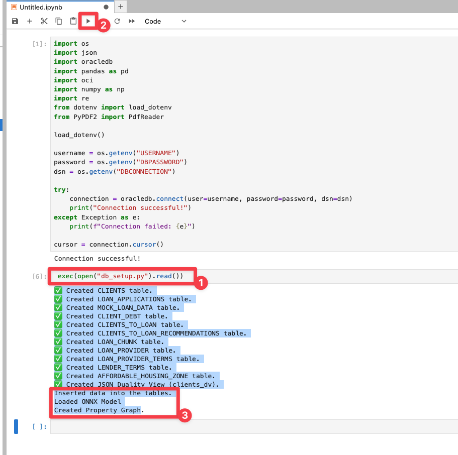
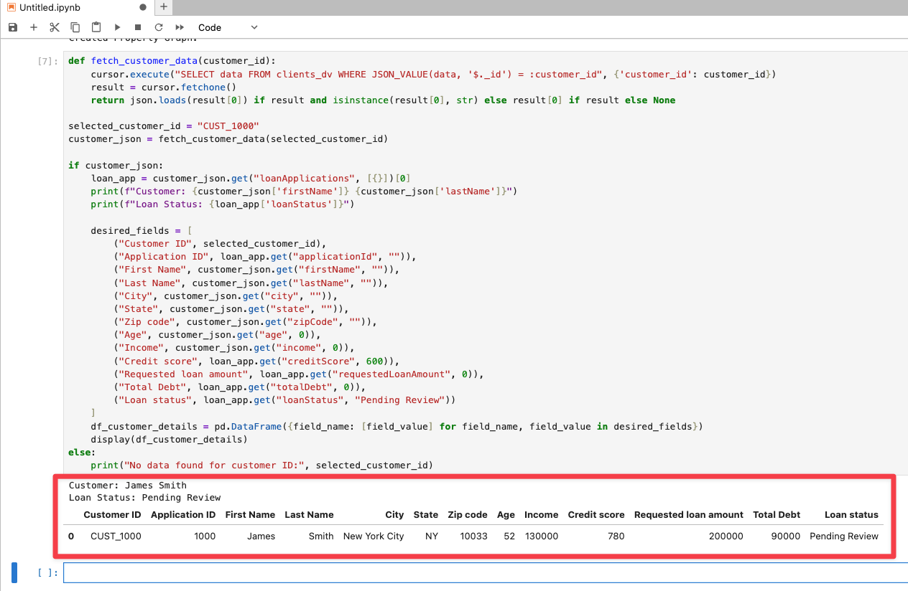
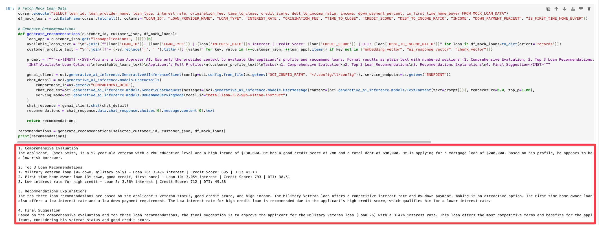
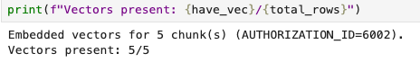
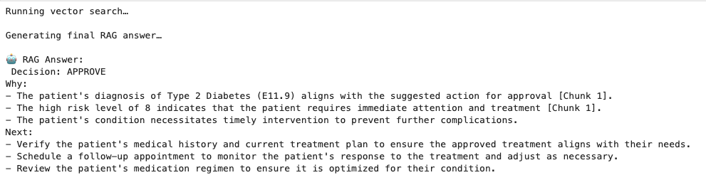

# Step by step: Implement RAG with Oracle Database 23ai 

## Introduction

Here you’ll create an end‑to‑end prior‑authorization system using Oracle Database 23ai and OCI Generative AI. After connecting to clinical datasets, you’ll analyze patient records and leverage an LLM to recommend approval, pend, or denial - complete with evidence citations. By applying Python skills from prior labs, you’ll assemble a fully integrated, AI‑driven healthcare review portal.

This lab uses some of the basic coding samples you created in lab 3, such as cursor.execute and more.

Estimated Time: 30 minutes

### Objectives

* Build the complete healthcare claim approval application as seen in lab 1
* Use OCI Generative AI to generate personalized claim recommendations
* Use Python to connect to an Oracle Database 23ai instance and run queries
* Explore patient data and extract relevant information

### Prerequisites

This lab assumes you have:

* An Oracle Cloud account
* Completed lab 1: Run the demo
* Completed lab 2: Connect to the Development Environment

## Task 1: Build the application in Jupyter Notebook
>💡**Note**: Review Lab 2: Connect to the Development Environment for instructions on accessing JupyterLab.

1. Open Launcher by clicking **+** button.

    

2. Open a new **Jupyter Notebook** by clicking on **Pyhton(ipykernel)** notebook.

    


## Task 2: Connect to the database using oracledb Python driver

1. Copy the following code block into an empty cell in your notebook. This code block imports the `oracledb` Python driver and other libraries. 

    ```python
    <copy>
    import os
    import json
    import oracledb
    import pandas as pd
    import oci
    import numpy as np
    import re
    from dotenv import load_dotenv
    from PyPDF2 import PdfReader

    load_dotenv()

    username = os.getenv("USERNAME")
    password = os.getenv("DBPASSWORD")
    dsn = os.getenv("DBCONNECTION")

    try:
        connection = oracledb.connect(user=username, password=password, dsn=dsn)
        print("Connection successful!")
    except Exception as e:
        print(f"Connection failed: {e}")

    cursor = connection.cursor()
    </copy>
    ```

2. Run the code block to connect to the database. 

    


## Task 3: Create tables in the database

1. Copy the following code block into the next empty cell in your notebook. This will create all tables in the database. 

    ```python
    <copy>
    exec(open("db_setup.py").read())
    </copy>
    ```
2. Run the code block to create all tables in the database. 

     


## Task 4: Create a function to retrieve data from the database

With the database ready, you will query customer data from the clients_dv JSON duality view. This view merges data from `CLIENTS`, `LOAN_APPLICATIONS`, and `CLIENT_DEBT` into a single JSON object, streamlining access to related records for AI-driven analysis.

- **Define a Function**: Create a reusable function `fetch_customer_data` to query the database by customer ID, extracting the JSON data for a specific customer.
- **Use an Example**: Fetch data for customer `CUST_1000` (James Smith) to demonstrate the process.
- **Display the Results**: Format the retrieved data into a pandas DataFrame for a clear, tabular presentation, showing key details like name, income, credit score, and total debt.

1. Run the code below to see James Smith’s profile. The output will include a brief summary (name and loan status) followed by a detailed table. If no data is found for the specified ID, a message will indicate this, helping you debug potential issues like an incorrect ID or empty database.

    ```python
    <copy>
    def fetch_customer_data(customer_id):
        cursor.execute("SELECT data FROM clients_dv WHERE JSON_VALUE(data, '$._id') = :customer_id", {'customer_id': customer_id})
        result = cursor.fetchone()
        return json.loads(result[0]) if result and isinstance(result[0], str) else result[0] if result else None

    selected_customer_id = "CUST_1000"
    customer_json = fetch_customer_data(selected_customer_id)

    if customer_json:
        loan_app = customer_json.get("loanApplications", [{}])[0]
        print(f"Customer: {customer_json['firstName']} {customer_json['lastName']}")
        print(f"Loan Status: {loan_app['loanStatus']}")

        desired_fields = [
            ("Customer ID", selected_customer_id),
            ("Application ID", loan_app.get("applicationId", "")),
            ("First Name", customer_json.get("firstName", "")),
            ("Last Name", customer_json.get("lastName", "")),
            ("City", customer_json.get("city", "")),
            ("State", customer_json.get("state", "")),
            ("Zip code", customer_json.get("zipCode", "")),
            ("Age", customer_json.get("age", 0)),
            ("Income", customer_json.get("income", 0)),
            ("Credit score", loan_app.get("creditScore", 600)),
            ("Requested loan amount", loan_app.get("requestedLoanAmount", 0)),
            ("Total Debt", loan_app.get("totalDebt", 0)),
            ("Loan status", loan_app.get("loanStatus", "Pending Review"))
        ]
        df_customer_details = pd.DataFrame({field_name: [field_value] for field_name, field_value in desired_fields})
        display(df_customer_details)
    else:
        print("No data found for customer ID:", selected_customer_id)
    </copy>
    ```
2. Click the "Run" button to execute the code.

3. The output will display a DataFrame containing the customer details for the selected customer ID.

    

If you completed Lab 1: Run the Demo earlier, this is what gets printed out when the Loan Officer clicks on CUST 1000. You just built it, well done!


## Task 5: Create a function to generate recommendations for the customer

With customer profiles in place, you will use OCI Generative AI to generate personalized loan recommendations. This step combines customer data with available loan options, allowing the LLM to suggest loans that match the customer’s credit score, income, and debt profile.

Here’s what we’ll do:
- **Fetch Loan Options**: Retrieve all loans from `MOCK_LOAN_DATA`, including details like interest rates, credit score requirements, and loan types.
- **Build a Prompt**: Construct a structured prompt that combines the customer’s profile with available loans, instructing the LLM to evaluate and recommend based solely on this data.
- **Use OCI Generative AI**: Send the prompt to the `meta.llama-3.2-90b-vision-instruct` model via OCI’s inference client, which will process the input and generate a response.
- **Format the Output**: Display the recommendations in HTML with styled headers and lists, covering evaluation, top picks, and explanations—making it easy to read and understand.


1. Review and review the code in a new cell:

    ```python
    <copy>
    # Fetch Mock Loan Data
    cursor.execute("SELECT loan_id, loan_provider_name, loan_type, interest_rate, origination_fee, time_to_close, credit_score, debt_to_income_ratio, income, down_payment_percent, is_first_time_home_buyer FROM MOCK_LOAN_DATA")
    df_mock_loans = pd.DataFrame(cursor.fetchall(), columns=["LOAN_ID", "LOAN_PROVIDER_NAME", "LOAN_TYPE", "INTEREST_RATE", "ORIGINATION_FEE", "TIME_TO_CLOSE", "CREDIT_SCORE", "DEBT_TO_INCOME_RATIO", "INCOME", "DOWN_PAYMENT_PERCENT", "IS_FIRST_TIME_HOME_BUYER"])

    # Generate Recommendations
    def generate_recommendations(customer_id, customer_json, df_mock_loans):
        loan_app = customer_json.get("loanApplications", [{}])[0]
        available_loans_text = "\n".join([f"{loan['LOAN_ID']}: {loan['LOAN_TYPE']} | {loan['INTEREST_RATE']}% interest | Credit Score: {loan['CREDIT_SCORE']} | DTI: {loan['DEBT_TO_INCOME_RATIO']}" for loan in df_mock_loans.to_dict(orient='records')])
        customer_profile_text = "\n".join([f"- {key.replace('_', ' ').title()}: {value}" for key, value in {**customer_json, **loan_app}.items() if key not in ["embedding_vector", "ai_response_vector", "chunk_vector"]])

        prompt = f"""<s>[INST] <<SYS>>You are a Loan Approver AI. Use only the provided context to evaluate the applicant’s profile and recommend loans. Format results as plain text with numbered sections (1. Comprehensive Evaluation, 2. Top 3 Loan Recommendations, 3. Recommendations Explanations, 4. Final Suggestion). Use newlines between sections.</SYS>> [/INST]
        [INST]Available Loan Options:\n{available_loans_text}\nApplicant's Full Profile:\n{customer_profile_text}\nTasks:\n1. Comprehensive Evaluation\n2. Top 3 Loan Recommendations\n3. Recommendations Explanations\n4. Final Suggestion</INST>"""

        genai_client = oci.generative_ai_inference.GenerativeAiInferenceClient(config=oci.config.from_file(os.getenv("OCI_CONFIG_PATH", "~/.oci/config")), service_endpoint=os.getenv("ENDPOINT"))
        chat_detail = oci.generative_ai_inference.models.ChatDetails(
            compartment_id=os.getenv("COMPARTMENT_OCID"),
            chat_request=oci.generative_ai_inference.models.GenericChatRequest(messages=[oci.generative_ai_inference.models.UserMessage(content=[oci.generative_ai_inference.models.TextContent(text=prompt)])], temperature=0.0, top_p=1.00),
            serving_mode=oci.generative_ai_inference.models.OnDemandServingMode(model_id="meta.llama-3.2-90b-vision-instruct")
        )
        chat_response = genai_client.chat(chat_detail)
        recommendations = chat_response.data.chat_response.choices[0].message.content[0].text

        return recommendations

    recommendations = generate_recommendations(selected_customer_id, customer_json, df_mock_loans)
    print(recommendations)
    </copy>
    ```
2. Click the "Run" button to execute the code. Note that this will take time to run. Be patient, you will get loan recommendations from the LLM shortly.

3. Review the output. In the demo, this is where you selected the "Navigate to Decisions" button as the Loan Officer. You just used AI to get recommendations for the loan officer which would have taken her hours to do, congratulations!

>Note: Your result may be different. This is because of generative AI and the model's ability to generate new content based on your input. The output may contain different recommendations or suggestions.




## Task 6: Create a function to create embeddings - Use Oracle Database 23ai's to create vector data 

To handle follow-up questions, you will enhance the system with an AI Healthcare Guru powered by Oracle 23ai’s Vector Search and Retrieval-Augmented Generation (RAG). The AI Healthcare Guru will be able to answer questions about the return application and provide recommendations based on the data.

Before answering questions, we need to prepare the data by vectoring the loan recommendations. This step:

   - **Stores Recommendations**: Inserts the full recommendation text (from previous cell) as a single chunk if not already present.

   - **Generates Embeddings**: This is a new feature in Oracle Database 23ai that allows you to create embeddings directly within the database, eliminating the need for external tools or APIs. The `dbms_vector_chain.utl_to_embedding` function takes the recommendation text as input and returns an embedding vector.

   - **Stores Embeddings**: Inserts the generated embedding vector into a table called `LOAN_CHUNK`.

1. Run and review the code in a new cell:

    ```python
    <copy>
    # Vectorize the full AI recommendations
    try:
        with connection.cursor() as cursor:
            # Clear existing entries for this customer
            cursor.execute("DELETE FROM LOAN_CHUNK WHERE CUSTOMER_ID = :customer_id", {'customer_id': selected_customer_id})
            # Store full AI recommendations from Cell 10
            cursor.execute("""
                INSERT INTO LOAN_CHUNK (CUSTOMER_ID, CHUNK_ID, CHUNK_TEXT) 
                VALUES (:customer_id, 0, :chunk_text)
            """, {
                'customer_id': selected_customer_id,
                'chunk_text': recommendations  # Using 'recommendations' from Cell 10
            })
            # Vectorize using dbms_vector_chain
            cursor.execute("""
                UPDATE LOAN_CHUNK
                SET CHUNK_VECTOR = dbms_vector_chain.utl_to_embedding(
                    :chunk_text,
                    JSON('{"provider": "database", "model": "DEMO_MODEL", "dimensions": 384}')
                )
                WHERE CUSTOMER_ID = :customer_id AND CHUNK_ID = 0
            """, {'customer_id': selected_customer_id, 'chunk_text': recommendations})
            connection.commit()
            print("Vector embeddings generated for AI recommendations.")
    except oracledb.DatabaseError as e:
        print(f"Failed to generate vector embeddings for AI recommendations: {e}")
    </copy>
    ```
2. Click the "Run" button to execute the code.

3. Review the output.

    

## Task 7: Implement RAG with Oracle Database 23ai's Vector Search

Now that the recommendations are vectorized, we can process a user’s question:

 ```What’s the best loan for a first-time home buyer?``` 
 
 This step:

   - **Vectorizes the question**: Embeds the question using `DEMO_MODEL` via `dbms_vector_chain.utl_to_embedding`.
   - **Performs AI Vector Search**: Finds the most relevant using similarity search.
   - **Use RAG**: Combines the customer profile, loan options, and relevant chunk into a prompt for OCI Generative AI, producing a concise answer. Here you implement the RAG process.

1. Review and run the following code in a new cell.

    ```python
    <copy>
    question = "What 4th loan would James qualify for?"

    if question:
        print("Processing your question using AI Vector Search across all available data...")

        relevant_chunks = []

        try:
            # Generate embedding for user question using dbms_vector_chain
            with connection.cursor() as cursor:
                cursor.execute("""
                    SELECT dbms_vector_chain.utl_to_embedding(
                        :question,
                        JSON('{"provider": "database", "model": "DEMO_MODEL", "dimensions": 384}')
                    ) FROM DUAL
                """, {'question': question})
                question_embedding = cursor.fetchone()[0]

                # Perform AI Vector Search for the most relevant chunk
                cursor.execute("""
                    SELECT CHUNK_TEXT
                    FROM LOAN_CHUNK
                    WHERE CUSTOMER_ID = :customer_id AND CHUNK_ID = 0 
                    AND CHUNK_VECTOR IS NOT NULL
                    ORDER BY VECTOR_DISTANCE(CHUNK_VECTOR, :embedding, COSINE)
                    FETCH FIRST 1 ROW ONLY
                """, {'customer_id': selected_customer_id, 'embedding': question_embedding})
                results = cursor.fetchall()
                # Convert LOB to string using read()
                relevant_chunks = [row[0].read() if isinstance(row[0], oracledb.LOB) else row[0] for row in results]

                if not relevant_chunks:
                    print("No relevant chunks found via vector search. Using existing recommendations instead.")
                    relevant_chunks = [recommendations]  # Fallback to full recommendations

        except oracledb.DatabaseError as e:
            print(f"Vector search failed: {e}")
            relevant_chunks = [recommendations]  # Fallback

        # Combine available chunks with AI recommendations
        all_relevant_chunks = relevant_chunks

        if not all_relevant_chunks:
            print("No relevant information found for the provided question.")
        else:
            # Clean and format text for readability
            cleaned_chunks = []
            for chunk in all_relevant_chunks:
                cleaned_chunk = re.sub(r'[^\w\s\d.,\-\'"]', ' ', chunk)  # Remove special characters
                cleaned_chunk = re.sub(r'\s+', ' ', cleaned_chunk).strip()  # Normalize whitespace
                cleaned_chunks.append(cleaned_chunk)
            docs_as_one_string = "\n=========\n".join(cleaned_chunks)

            # Retrieve available loan options from Mock Loan Data
            available_loans_text = "\n".join(
                [f"{loan['LOAN_ID']}: {loan['LOAN_TYPE']} | {loan['INTEREST_RATE']}% interest | "
                f"Credit Score: {loan['CREDIT_SCORE']} | DTI: {loan['DEBT_TO_INCOME_RATIO']} | "
                f"Origination Fee: ${loan['ORIGINATION_FEE']} | Time to Close: {loan['TIME_TO_CLOSE']} days"
                for loan in df_mock_loans.to_dict(orient="records")]
            )

            # Fetch fresh customer profile from customer_json
            loan_app = customer_json.get("loanApplications", [{}])[0]
            customer_profile_text = "\n".join(
                [f"- {key.replace('_', ' ').title()}: {value}" for key, value in {**customer_json, **loan_app}.items() 
                if key not in ["embedding_vector", "ai_response_vector", "chunk_vector"]]
            )

            prompt = f"""\
            <s>[INST] <<SYS>>
            You are AI Loan Guru, a specialized AI assistant at a brokerage firm. Use only the provided context to answer the question. 
            Your role is to evaluate an applicant’s full financial and personal profile, provide precise answers, 
            and offer insights while considering the firm's overall risk and best interests.
            ALWAYS respond as if you have the knowledge yourself. Ensure all numerical values (e.g., income, interest rates) are formatted clearly with commas and proper spacing (e.g., 85,393, not 85,393whichisbelow).
            Keep the response under 300 words and format as plain text.
            <</SYS>> [/INST]

            [INST]
            Loan Officer's Question: "{question}"

            ====

            # Provided Context:
            {docs_as_one_string}

            # Available Loan Options:
            {available_loans_text}

            # Applicant's Full Profile:
            {customer_profile_text}

            ====

            # Your Tasks:
            1. Provide a direct answer to the question asked, using the context and data.
            2. Maintain business rules: Avoid First Time Home Owner loans if debt type is 'Mortgage'; prioritize Opportunity Zone loans (1% interest, max income $100k) if eligible (income < $100k, zip_code 48201); only recommend Military Veteran loans if veteran = 'Yes'.
            3. Explain how the answer aligns with the applicant’s profile and eligibility.

            Answer (Maximum 300 words, concise and professional):
            [/INST]
            """

            print("Generating AI response...")

            genai_client = oci.generative_ai_inference.GenerativeAiInferenceClient(config=oci.config.from_file(os.getenv("OCI_CONFIG_PATH", "~/.oci/config")), service_endpoint=os.getenv("ENDPOINT"))
            chat_detail = oci.generative_ai_inference.models.ChatDetails(
                compartment_id=os.getenv("COMPARTMENT_OCID"),
                chat_request=oci.generative_ai_inference.models.GenericChatRequest(
                    messages=[oci.generative_ai_inference.models.UserMessage(content=[oci.generative_ai_inference.models.TextContent(text=prompt)])],
                    temperature=0.0,
                    top_p=0.90
                ),
                serving_mode=oci.generative_ai_inference.models.OnDemandServingMode(model_id="meta.llama-3.2-90b-vision-instruct")
            )

            try:
                chat_response = genai_client.chat(chat_detail)
                ai_response = chat_response.data.chat_response.choices[0].message.content[0].text

                # Post-process AI response to ensure no garbled text
                ai_response = re.sub(r'[^\w\s\d.,\-\'"]', ' ', ai_response)  # Remove special characters
                ai_response = re.sub(r'(\d+)([a-zA-Z])', r'\1 \2', ai_response)  # Separate numbers from letters
                ai_response = re.sub(r'\b(\d{3,})\b(?!\s*[,.\-])', r'\1,', ai_response)  # Ensure large numbers have commas
                ai_response = re.sub(r',(?=\d{3}\b)', '', ai_response)  # Remove extra commas

                print("\n🤖 AI Loan Guru Response:")
                print(ai_response)
            except Exception as e:
                print(f"Error connecting to OCI Gen AI: {e}")
    </copy>
    ```

2. Click the "Run" button to execute the code.

3. Review the result.

    >*Note:* Your result may be different due to non-deterministic character of generative AI.

    

## Conclusion

Congratulations! You implemented a RAG process in Oracle Database 23ai using Python.

To summarize:

* You created a function to connect to Oracle Database 23ai using the Oracle Python driver `oracledb`.
* You created a function to retrieve customer data.
* You created a function to connect to OCI Generative AI and create a first recommendation.
* You created a function to create embeddings of the patient data using Oracle Database 23ai.
* And finally, you implemented a RAG process in Oracle Database 23ai using Python.

Congratulations, you completed the lab!

You may now proceed to the next lab.

## Learn More

* [Code with Python](https://www.oracle.com/developer/python-developers/)
* [Oracle Database 23ai Documentation](https://docs.oracle.com/en/database/oracle/oracle-database/23/)

## Acknowledgements
* **Authors** - Francis Regalado Database Product Manager
* **Contributors** - Kevin Lazarz, Linda Foinding, Kamryn Vinson
* **Last Updated By/Date** - Uma Kumar, August 2025