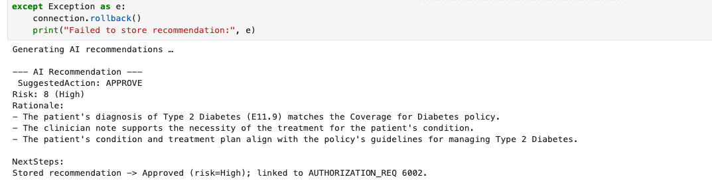

# Step by step: Implement RAG with Oracle Database 23ai 

## Introduction

Here you’ll create an end‑to‑end prior‑authorization system using Oracle Database 23ai and OCI Generative AI. After connecting to clinical datasets, you’ll analyze patient records and leverage an LLM to recommend approval, pend, or denial - complete with evidence citations. By applying Python skills from prior labs, you’ll assemble a fully integrated, AI‑driven healthcare review portal.

This lab uses some of the basic coding samples you created in lab 3, such as `cursor.execute` and more.

Estimated Time: 30 minutes

### Objectives

* Build the complete healthcare claim approval application as seen in lab 1
* Use OCI Generative AI to generate personalized claim recommendations
* Use Python to connect to an Oracle Database 23ai instance and run queries
* Explore patient data and extract relevant information

### Prerequisites

This lab assumes you have:

* An Oracle Cloud account
* Completed lab 1: Run the demo
* Completed lab 2: Connect to the Development Environment

## Task 1: Build the application in Jupyter Notebook
>💡**Note**: Review Lab 2: Connect to the Development Environment for instructions on accessing JupyterLab.

1. You should see a terminal pop up once you are logged in. 

    


2. Navigate to the `dbinit` directory by running the following command.

    ```bash
    <copy>
    cd dbinit
    </copy>
    ```

    

3. Copy and run the following command to create tables in the database. There will be a lot of output. You should see the following output once complete.

    ```bash
    <copy>
    ./shell_script.sh
    </copy>
    ```

    

    

## Task 2: Connect to Database

2. Click the **+** sign on the top left to open the Launcher.

    

3. Open a new notebook.

    

1. Copy the following code block into an empty cell in your notebook. This code block imports the `oracledb` Python driver and other libraries.

    ```python
    <copy>
    import os
    import json
    import oracledb
    import pandas as pd
    import oci
    import numpy as np
    import re
    from dotenv import load_dotenv
    from PyPDF2 import PdfReader

    load_dotenv()

    username = os.getenv("USERNAME")
    password = os.getenv("DBPASSWORD")
    dsn = os.getenv("DBCONNECTION")

    try:
        connection = oracledb.connect(user=username, password=password, dsn=dsn)
        print("Connection successful!")
    except Exception as e:
        print(f"Connection failed: {e}")

    cursor = connection.cursor()
    </copy>
    ```

2. Run the code block to connect to the database. 

    

## Task 3: Create a function to retrieve data from the database

You will query customer data from the `patient_dv` JSON duality view, which combines data from PATIENTS and related tables. This task will:

- **Define a Function**: Create a reusable function `a` to query the database by customer ID, extracting the JSON data for a specific customer.

- **Use an Example**: Fetch data for customer `2001` (Alex Karev) to demonstrate the process.

- **Display the Results**: Format the retrieved data into a pandas DataFrame for a clear, tabular presentation, showing key details like name, physician, Latest Condition, and Diagnosis Code.

1. Copy and paste the code below into the new notebook:

    ```python
    <copy>
    def fetch_patient_data(patient_id):
        print(f"Executing query for patient_id: {patient_id}")
        cursor.execute(
            "SELECT data FROM patients_dv WHERE JSON_VALUE(data, '$._id') = :pid",
            {'pid': str(patient_id)}
        )
        row = cursor.fetchone()
        if not row:
            print(f"No data found for patient {patient_id}")
            return None

        data = row[0]
        if isinstance(data, (bytes, bytearray)):
            data = data.decode('utf-8')
        if isinstance(data, str):
            data = json.loads(data)
        elif not isinstance(data, dict):
            print(f"Unexpected type: {type(data)}")
            return None
        return data

    # Example: pick a known patient from the sample data
    selected_patient_id = 2001  # Alex Karev
    patient_json = fetch_patient_data(selected_patient_id)

    if patient_json:
        # Flatten selected summary fields for display
        physician = patient_json.get("physician", {}) or {}
        first_note = (patient_json.get("notes") or [{}])[0]
        first_conditions = first_note.get("conditions") or []
        first_cond = first_conditions[0] if first_conditions else {}

        summary = {
            "Patient ID": selected_patient_id,
            "First Name": patient_json.get("firstName", ""),
            "Last Name":  patient_json.get("lastName", ""),
            "Gender":     patient_json.get("GENDER", ""),
            "DOB":        patient_json.get("DOB", ""),
            "Physician":  f"{physician.get('firstName','')} {physician.get('lastName','')}",
            "Latest Condition": first_cond.get("conditionName", ""),
            "Diagnosis Code":   first_cond.get("diagnosisCode", "")
        }
        display(pd.DataFrame([summary]))
    </copy>
    ```

2. Click the "Run" button to execute the code.

    

3. The output will display a DataFrame containing the customer details for the selected customer ID.

    

## Task 4: Create a function to generate recommendations for the customer

In a new cell, define a function `generate_recommendations` to fetch policy rules from `POLICY_TEXT` and combine them with patient data. Construct a prompt the OCI Generative AI model(meta.llama-3.2-90b-vision-instruct) to recommend a claims decision(APPROVE, REQUEST INFO, DENY) based on patient profile, medical necessity, and policy alignment.

With patient profiles in place, you will use OCI Generative AI to generate personalized claim decision recommendations. 

Here’s what we’ll do:

1. Copy and paste the code in a new cell:

    ```python
        <copy>
        def load_policy_texts():
            cursor.execute("SELECT policy_id, title, source, full_text FROM POLICY_TEXT")
            cols = ["POLICY_ID","TITLE","SOURCE","FULL_TEXT"]
            return pd.DataFrame(cursor.fetchall(), columns=cols)

        def extract_first_auth_context(p_json):
            """Pull one condition and its first authorization request bundle for prompting."""
            notes = p_json.get("notes") or []
            if not notes: return {}, {}, {}
            conditions = notes[0].get("conditions") or []
            if not conditions: return {}, {}, {}
            cond = conditions[0]
            auths = cond.get("authorizationRequests") or []
            auth = auths[0] if auths else {}
            rec  = auth.get("RECOMMENDATION", {}) or {}
            return cond, auth, rec

        df_policy = load_policy_texts()

        # Build prompt
        condition, auth_req, rec_block = extract_first_auth_context(patient_json)

        available_policies_text = "\n".join([
            f"{row.POLICY_ID}: {row.TITLE} | Source: {row.SOURCE}\n{row.FULL_TEXT}"
            for _, row in df_policy.iterrows()
        ])

        patient_profile_text = "\n".join([
            f"- {k}: {v}" for k, v in patient_json.items()
            if k not in ["notes","_metadata"]
        ])

        # Flatten (one condition/auth for clarity)
        cond_text = "\n".join([f"- {k}: {v}" for k, v in condition.items() if k != "authorizationRequests"])
        auth_text = "\n".join([f"- {k}: {v}" for k, v in auth_req.items() if k != "RECOMMENDATION"])
        rec_text  = "\n".join([f"- {k}: {v}" for k, v in rec_block.items()])

        prompt = f"""<s>[INST] <<SYS>>You are a Healthcare Prior Authorization AI.
        Use ONLY the provided context to recommend a prior-authorization decision:
        (Approved, In Progress, Pending Review, Denied).
        Do not mention sources outside of the provided context.
        Base it on medical necessity, diagnosis, and policy alignment.
        Keep total output under 600 words; be concise and structured.</SYS>>

        Available Policies:
        {available_policies_text}

        Patient Profile:
        {patient_profile_text}

        Condition:
        {cond_text}

        Authorization Request:
        {auth_text}

        Existing System Recommendation (if any):
        {rec_text}

        Tasks:
        1) Suggested Action: "Suggested Action: Approved/In Progress/Pending Review/Denied"
        2) Risk (1-10) + label (Very Low/Low/Medium/High).
        3) 2-4 bullet rationale referencing policy titles and relevant clinical details.
        4) If action is not Approved, list up to 3 actionable next steps (e.g., provide imaging, labs, or prior therapy documentation).

        Response format: short header + bullets. Numerical values clearly formatted.</INST>"""

        print("Generating AI response...")

        try:
            genai_client = oci.generative_ai_inference.GenerativeAiInferenceClient(
                config=oci.config.from_file(os.getenv("OCI_CONFIG_PATH","~/.oci/config")),
                service_endpoint=os.getenv("ENDPOINT")
            )

            chat_detail = oci.generative_ai_inference.models.ChatDetails(
                compartment_id=os.getenv("COMPARTMENT_OCID"),
                chat_request=oci.generative_ai_inference.models.GenericChatRequest(
                    messages=[oci.generative_ai_inference.models.UserMessage(
                        content=[oci.generative_ai_inference.models.TextContent(text=prompt)]
                    )],
                    temperature=0.0,
                    top_p=1.0
                ),
                serving_mode=oci.generative_ai_inference.models.OnDemandServingMode(
                    model_id="meta.llama-3.2-90b-vision-instruct"
                )
            )

            chat_response = genai_client.chat(chat_detail)
            recommendation_text = chat_response.data.chat_response.choices[0].message.content[0].text
            print(recommendation_text)
        except Exception as e:
            print(f"Error generating recommendation: {e}")
            recommendation_text = "No AI output (fallback)."
        </copy>
    ```

2. Click the "Run" button to execute the code. Note that this will take time to run.

    

3. Review the output. In the demo, this is where you selected the "Navigate to Decisions" button as the Healthcare Claims Analyst. You just used AI to get recommendations for the claims analyst which would have taken her hours to do, congratulations!

    

>Note: Your result may be different. This is because of generative AI and the model's ability to generate new content based on your input. The output may contain different recommendations or suggestions.

## Task 5: Chunk & Store Recommendations

To handle follow-up questions, you will enhance the system with an AI Guru powered by Oracle 23ai’s Vector Search and Retrieval-Augmented Generation (RAG). The AI Guru will be able to answer questions about the return application and provide recommendations based on the data.

Before answering questions, we need to prepare the data by vectoring the claims recommendations. This step:

   - **Stores Recommendations**: Inserts the full recommendation text (from previous cell) as a single chunk if not already present.

Now we'll chunk the AI recommendations by words and store in the MEDICAL_CHUNK table.

The parameters we'll use:
* By words(vs characters)
* MAX 50 words per chunk (adjust as needed)
* OVERLAP 0 (independent chunks)
* SPLIT BY sentence (avoid mid-setence cuts)
* LANGUAGE american, NORMALIZE all

1. Copy the following code and run:

    ```python
        <copy>
        authorization_id = auth_req.get("authorizationId")
        if authorization_id is None:
            raise ValueError("No authorization_id found from the selected patient context.")

        # Upsert the raw recommendation text as the source for chunking
        cursor.execute("DELETE FROM RECOMMENDATION_SRC WHERE AUTHORIZATION_ID = :aid", {'aid': authorization_id})
        cursor.execute("""
            INSERT INTO RECOMMENDATION_SRC (AUTHORIZATION_ID, TEXT_CLOB)
            VALUES (:aid, :txt)
        """, {'aid': authorization_id, 'txt': recommendation_text})
        connection.commit()

        # Remove any prior chunks for this authorization_id (only our multi-size ones)
        cursor.execute("""
            DELETE FROM MEDICAL_CHUNK
            WHERE AUTHORIZATION_ID = :aid
            AND (SOURCE_TYPE LIKE 'REC_CHUNK_W%' OR SOURCE_TYPE = 'AI_RECOMMENDATION')
        """, {'aid': authorization_id})
        connection.commit()

        # Chunk at multiple sizes — adjust as you like
        chunk_sizes = [50]

        for size in chunk_sizes:
            insert_sql = f"""
                INSERT INTO MEDICAL_CHUNK (AUTHORIZATION_ID, SOURCE_TYPE, CHUNK_ID, CHUNK_TEXT)
                SELECT :aid,
                    :src_type,
                    c.chunk_offset,
                    c.chunk_text
                FROM RECOMMENDATION_SRC s,
                    VECTOR_CHUNKS(
                        dbms_vector_chain.utl_to_text(s.text_clob)
                        BY words
                        MAX {size}
                        OVERLAP 0
                        SPLIT BY sentence
                        LANGUAGE american
                        NORMALIZE all
                    ) c
                WHERE s.authorization_id = :aid
            """
            cursor.execute(insert_sql, {'aid': authorization_id, 'src_type': f'REC_CHUNK_W{size}'})

        connection.commit()
        print("✅ Task 5 complete: recommendation chunked and stored (W50).")
        </copy>
    ```

2. Click the "Run" button to execute the code.

    

3. Review the output.

    

## Task 6: Create Embeddings

Now we must generate and store vector embeddings. This allows us to use Vector Search and RAG to enhance AI Guru's answers. 

In this step:

   - **Generates Embeddings**: This is a new feature in Oracle Database 23ai that allows you to create embeddings directly within the database, eliminating the need for external tools or APIs. The `dbms_vector_chain.utl_to_embedding` function takes the recommendation text as input and returns an embedding vector.

   - **Stores Embeddings**: Inserts the generated embedding vector into a table called `MEDICAL_CHUNK`.

1. We embed the recommendation chunks and our policy text for retrieval. Copy the following code into a new cell block:

    ```python
        <copy>
        # 6a) Embed the newly inserted recommendation chunks
        cursor.execute("""
            UPDATE MEDICAL_CHUNK
            SET CHUNK_VECTOR = dbms_vector_chain.utl_to_embedding(
                CHUNK_TEXT,
                JSON('{"provider":"database","model":"DEMO_MODEL","dimensions":384}')
            )
            WHERE AUTHORIZATION_ID = :aid
            AND SOURCE_TYPE LIKE 'REC_CHUNK_W%'
        """, {'aid': authorization_id})
        connection.commit()
        print("✅ Embedded vectors for recommendation chunks.")

        # 6b) (Re)chunk + embed policy text corpus (simple fixed-size char chunking)
        def simple_chunk(text, max_chars=1200):
            text = str(text or "")
            return [text[i:i+max_chars] for i in range(0, len(text), max_chars)] or [""]

        # Clean slate for POLICY_VECTOR_CHUNK
        cursor.execute("DELETE FROM POLICY_VECTOR_CHUNK")
        connection.commit()

        for _, row in df_policy.iterrows():
            chunks = simple_chunk(row.FULL_TEXT, max_chars=1200)
            for idx, ch in enumerate(chunks):
                cursor.execute("""
                    INSERT INTO POLICY_VECTOR_CHUNK (POLICY_ID, CHUNK_ID, CHUNK_TEXT)
                    VALUES (:pid, :cid, :ctxt)
                """, {'pid': int(row.POLICY_ID), 'cid': idx, 'ctxt': ch})

                cursor.execute("""
                    UPDATE POLICY_VECTOR_CHUNK
                    SET CHUNK_VECTOR = dbms_vector_chain.utl_to_embedding(
                        :text,
                        JSON('{"provider":"database","model":"DEMO_MODEL","dimensions":384}')
                    )
                    WHERE POLICY_ID = :pid AND CHUNK_ID = :cid
                """, {'text': ch, 'pid': int(row.POLICY_ID), 'cid': idx})

        connection.commit()
        print("✅ Policy text chunked and embedded.")
        </copy>
    ```

2. Click the "Run" button to execute the code.

    

3. Review the output.

    

## Task 7: Implement RAG with Oracle Database 23ai's Vector Search

Now that the recommendations are vectorized, we can process a user’s question:

 ```What documentation is needed to approve an MRI prior authorization?``` 
 
 This step:

   - **Vectorizes the question**: Embeds the question using `DEMO_MODEL` via `dbms_vector_chain.utl_to_embedding`.
   - **Performs AI Vector Search**: Finds the most relevant using similarity search.
   - **Use RAG**: Combines the customer profile, loan options, and relevant chunk into a prompt for OCI Generative AI, producing a concise answer. Here you implement the RAG process.
   - **Retrieves**: The top policy chunks and top recommendation chunks
   - **Builds a prompt**: To ask the LLM to answer using only the retrieved context
   - **Prints**: The chunk IDs to be used for traceability

1. Copy the code and run:

    ```python
        <copy>
        question = "What documentation is needed to approve an MRI prior authorization?"

        def vectorize_question(q):
            cursor.execute("""
                SELECT dbms_vector_chain.utl_to_embedding(
                    :q,
                    JSON('{"provider":"database","model":"DEMO_MODEL","dimensions":384}')
                ) FROM DUAL
            """, {'q': q})
            return cursor.fetchone()[0]

        print("Processing question using AI Vector Search...")

        try:
            q_vec = vectorize_question(question)

            # Top policy chunks (broad domain guidance)
            cursor.execute("""
                SELECT CHUNK_ID, CHUNK_TEXT
                FROM POLICY_VECTOR_CHUNK
                WHERE CHUNK_VECTOR IS NOT NULL
                ORDER BY VECTOR_DISTANCE(CHUNK_VECTOR, :qv, COSINE)
                FETCH FIRST 3 ROWS ONLY
            """, {'qv': q_vec})
            policy_hits = [
                (r[0], r[1].read() if isinstance(r[1], oracledb.LOB) else r[1])
                for r in cursor.fetchall()
            ]

            # Top recommendation chunks (case specifics, across sizes)
            cursor.execute("""
                SELECT CHUNK_ID, CHUNK_TEXT
                FROM MEDICAL_CHUNK
                WHERE AUTHORIZATION_ID = :aid
                AND SOURCE_TYPE LIKE 'REC_CHUNK_W%'
                AND CHUNK_VECTOR IS NOT NULL
                ORDER BY VECTOR_DISTANCE(CHUNK_VECTOR, :qv, COSINE)
                FETCH FIRST 3 ROWS ONLY
            """, {'aid': authorization_id, 'qv': q_vec})
            rec_hits = [
                (r[0], r[1].read() if isinstance(r[1], oracledb.LOB) else r[1])
                for r in cursor.fetchall()
            ]

            # Combine and format with Chunk IDs
            retrieved = policy_hits + rec_hits
            if not retrieved:
                retrieved = [(0, recommendation_text)]  # fallback to full rec text

            # Clean text for prompting
            cleaned = [re.sub(r'[^\w\s\d.,\-\'"]', ' ', t).strip() for _, t in retrieved]
            docs_as_one_string = "\n=========\n".join(cleaned) + "\n=========\n"

            # Compact RAG prompt
            available_policies_titles = ", ".join(df_policy["TITLE"].tolist())
            patient_header = f"{patient_json.get('firstName','')} {patient_json.get('lastName','')} | Condition: {condition.get('conditionName','')} ({condition.get('diagnosisCode','')})"

            rag_prompt = f"""<s>[INST] <<SYS>>You are a Healthcare RAG Assistant. 
            Answer using only the provided context. Do not mention sources outside of the provided context. 
            Do NOT provide warnings, disclaimers, or exceed the specified response length.
            Keep under 300 words. Be specific and actionable. Have the ability to respond in Spanish, French, Italian, German, and Portuguese if asked. </SYS>> [/INST]
            [INST]
            Question: "{question}"
            Patient: {patient_header}
            Available Policies: {available_policies_titles}

            Context:
            {docs_as_one_string}

            Tasks:
            1) Provide a direct answer listing the typical documentation required.
            2) Tie each item to policy rationale where possible (title-level reference is fine).
            3) If requirements may vary, note what additional info determines the path (e.g., prior therapy, imaging results).
            [/INST]"""

            print("Generating AI response...")

            genai_client = oci.generative_ai_inference.GenerativeAiInferenceClient(
                config=oci.config.from_file(os.getenv("OCI_CONFIG_PATH","~/.oci/config")),
                service_endpoint=os.getenv("ENDPOINT")
            )
            chat_detail = oci.generative_ai_inference.models.ChatDetails(
                compartment_id=os.getenv("COMPARTMENT_OCID"),
                chat_request=oci.generative_ai_inference.models.GenericChatRequest(
                    messages=[oci.generative_ai_inference.models.UserMessage(
                        content=[oci.generative_ai_inference.models.TextContent(text=rag_prompt)]
                    )],
                    temperature=0.0,
                    top_p=0.9
                ),
                serving_mode=oci.generative_ai_inference.models.OnDemandServingMode(
                    model_id="meta.llama-3.2-90b-vision-instruct"
                )
            )

            chat_response = genai_client.chat(chat_detail)
            rag_answer = chat_response.data.chat_response.choices[0].message.content[0].text
            rag_answer = re.sub(r'[^\w\s\d.,\-\'"]', ' ', rag_answer)
            print("\n🤖 AI Healthcare RAG Response:")
            print(rag_answer)

            print("\n📑 Retrieved Chunks Used in Response:")
            for cid, text in retrieved:
                preview = text[:120].replace("\n", " ") + ("..." if len(text) > 120 else "")
                print(f"[Chunk {cid}] : {preview}")

        except Exception as e:
            print(f"RAG flow error: {e}")
        </copy>
    ```

2. Click the "Run" button to execute the code.

    

3. Review the result.

    >*Note:* Your result may be different due to non-deterministic character of generative AI.

    

## Conclusion
Congratulations! You implemented a RAG process in Oracle Database 23ai using Python.

to summarize:

* Connected with oracledb
* Retrieved a patient profile via a JSON duality view
* Generated a prior-authorization recommendation using OCI GenAI
* Chunked and embedded both recommendations and policy text
* Performed vector search and produced a RAG answer grounded in retrieved chunks (with chunk IDs printed for traceability)

You can now experiment with:

* Different chunk sizes (chunk_sizes = [200, 500, 800])
* Changing the question or switching to other conditions/patients

Congratulations, you completed the lab!

You may now proceed to the next lab.

## Learn More

* [Code with Python](https://www.oracle.com/developer/python-developers/)
* [Oracle Database 23ai Documentation](https://docs.oracle.com/en/database/oracle/oracle-database/23/)

## Acknowledgements
* **Authors** - Francis Regalado Database Product Manager
* **Contributors** - Kevin Lazarz, Linda Foinding, Kamryn Vinson
* **Last Updated By/Date** - Uma Kumar, August 2025