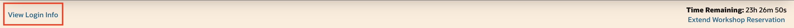

# Get started

## Introduction

In this lab, we will show you where you can find the login information and how to log in to the **SeerHoldings Healthcare Management application**.

Estimated Time: 5 minutes

### Objectives

- Log-in to the application
- Locate your LiveLabs Sandbox reservations

## Task 1: View Login Information

Right above the workshop instructions you can find two information:

a. **View Login Info:** You can find credentials and other information to access the LiveLabs Sandbox

b. **Time Remaining:** This shows you the remaining time before your access to the LiveLabs Sandbox expires. Please note: You may be able to extend the reservation time.

## Task 2: Login to the Demo

1. To access the demo environment, click **View Login Info** in the top left corner of the page. Click the **Start the Demo** link.

    

2. Enter in a username, select the **Claims Officer** role, and click **Login**.

    

3. Welcome to the SeerHoldings Healthcare Management application! Congratulations, you are now connected to the demo environment. You can now execute the different tasks and steps for the LiveLabs workshop.

    

## Task 3: Find your LiveLabs Sandbox reservations

If you close your browser, and you want to launch your workshop again, open [livelabs.oracle.com](https://livelabs.oracle.com), login using your Oracle account, and click on **My Reservations**. You can find here a complete history of all LiveLabs workshops you signed up for. Click on **Launch Workshop** to start a workshop with an existing LiveLabs Sandbox environment.

You may now **proceed to the next lab**.

## Acknowledgements

- **Created By/Date** - Kamryn Vinson
- **Contributor** - Linda Foinding
- **Last Updated By/Date** - Linda Foinding, April 2025