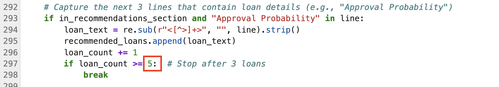
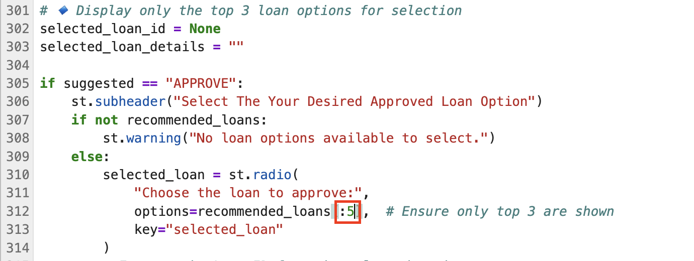
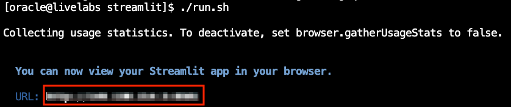
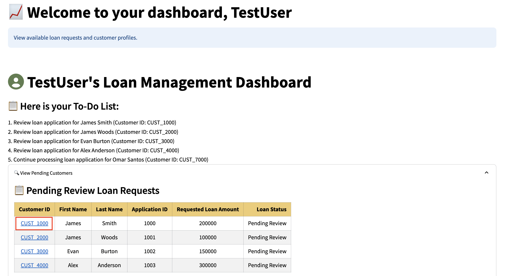

# Code with AI Vector Search step-by-step

## Introduction

In this lab, we’ll provide a step-by-step guide to help you successfully complete the coding challenge from the previous lab. This step-by-step guide will walk you through the necessary updates, providing solutions and insights to help you fully understand how to utilize AI Vector Search in a practical scenario. 

Let’s dive in and unlock the full potential of AI Vector Search in your application!

Estimated Time: 30 minutes

### Objectives

In this lab, you will:
* Enhance your understanding of AI Vector Search by applying it to a real-world developer coding challenge.
* Gain hands-on experience with integrating AI Vector Search and refining application features to meet specific development requirements.

### Prerequisites

This lab assumes you have:
* An Oracle Cloud account
* Successfully completed Lab 1: Run the Demo
* Successfully completed Lab 3: Connect to Development Environment

## Task 1: Challenge Requirements 
The company has requested an enhancement to the current loan recommendation system. The loan officer has indicated that the existing 3 loan options are insufficient, and they'd like to see the top 5 loan options instead.

1. Update the Customers.py and Decision.py files to make the necessary changes in the code so that the AI prompt returns the top 5 loans instead of the current 3.

2. Ensure the output displays the top 5 loans like the image below:

    

## Task 2: Modify the Cutomers.py File

1. Click **Pages**.

    

2. Select the **Customers.py** file.

    

3. On lines 477 and 478, change the value 3 to **5**, as we need to display the top 5 loan recommendations instead of 3.

    

4. Save the Customers.py file.

    

## Task 3: Modify the Decision.py File

1. Select the **Decision.py** file.

    

2. On line 283, change the value 3 to **5**.

    

3. On line 297, change the value 3 to **5**.

    

4. On line 312, change the value 3 to **5**.

    

5. Save the Decision.py file.

    

## Task 4: Launch the Application

1. Select the **Launcher** tab and open the **terminal**

    

2. Copy the ./run.sh command and paste it into the terminal.

    ````bash
        $<copy>
        ./run.sh
        </copy>
    ````

3. Click the URL displayed in the terminal to launch the SeerEquities Loan Management application.

    

4. Enter in a username and click **Login**.

    

## Task 5: View the Results

1. On the Dashboard page, from the pending review list, select the Customer ID for **James Smith**.

    

2. This will display the customers loan application details. In approximately 15 seconds, the 5 AI generated loan recommendations will be displayed.

    

**Congratulations, you have successfully completed the Generative AI Challenge!** You have updated the files to make the necessary changes in the code so that the AI prompt returns the top 5 loans instead of the current 3. The company can now see more loans options and provide better service to their customer.


## Learn More

* [Oracle Database 23ai Documentation](https://docs.oracle.com/en/database/oracle/oracle-database/23/)

## Acknowledgements
* **Authors** - Linda Foinding, Francis Regalado
* **Contributors** - Kamryn Vinson, Eddie Ambler, Kevin Lazarz
* **Last Updated By/Date** - Kamryn Vinson, April 2025
